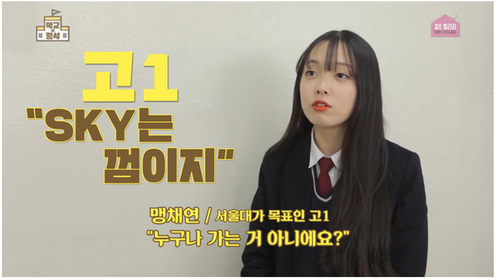
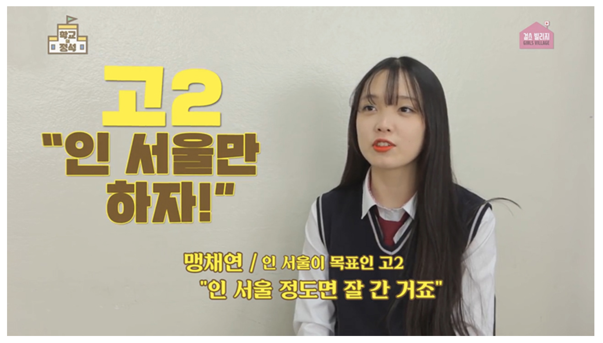
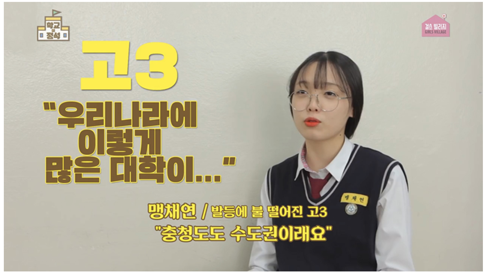
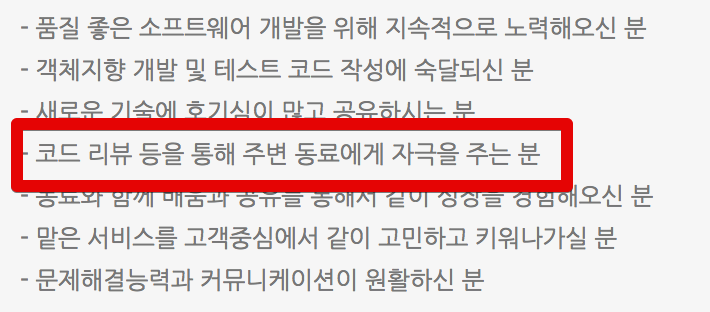

# 2. 취업준비

[국비교육](http://jojoldu.tistory.com/277)을 마치고 본격적으로 취업생 생활을 시작하게 됩니다.  
  
4학년 2학기 ~ 5학년 2학기(졸업연기 ㅠㅠ)까지 도합 **1년 6개월을 준비**해서 겨우 취업이 되었습니다.  
그 과정을 천천히 이야기하겠습니다.

## 2-1. 4학년 2학기



(누구나 처음엔..)  
  
  
6개월정도 서울에서 더 머문뒤, 학교로 복귀하였습니다.  
이때 제 스펙은

* 국비교육 수료
* 정보처리기사

이 2가지가 전부였습니다.  
(흔하디 흔한 비전공자의 스펙이죠?)  
  

교육을 배우면서 기본기가 진짜 중요하다는걸 깨달았기 때문에 4학년 2학기를 맞이하며 2가지 목표를 세웠습니다.

* SW 전공 과목들을 최대한 많이 듣기
* 원하는 기업만 이력서 내기

4학년 2학기는 내년 **취업준비를 위한 발판**으로 삼되, 그렇다고 **너무 취업에 등한시는 하지말자**는 계산이였습니다.  
모든건 **다음해 취업시즌을 위한 준비**라고 생각했습니다.  
  
어찌 됐든 첫번째 목표대로 데이터베이스, 자료구조 등등 **소프트웨어공학과 전공과목을  채우니** 21학점이 꽉찼습니다.  
여기다 졸업작품과 졸업논문, 아르바이트까지 겹치니 스케줄이 진짜 빡빡했습니다.  
막판인 12월엔 **이틀에 4시간씩** 자야할정도로 과제가 쌓여있어서 정말 후회했습니다.  
(하루는 안자고 하루는 오후 8시부터 12시까지만 자고 밤새서 과제를 했습니다.)  
  
스트레스를 많이 받았음에도 이때의 선택을 정말 잘한 결정이라고 생각합니다.  
지금 이 글을 보고 계신 분들이 대학교를 재학중이시라면 **기반이 되는 소프트웨어 전공과목**들은 무리해서라도 꼭 들으시길 추천드립니다.  
  
* 자료구조
* 데이터베이스
* 운영체제
* 네트워크

까지는 꼭 들으세요.  
  
알고리즘은 솔직히 학교 보다는 [코드 플러스](https://code.plus/)에서 동강 듣는게 훨씬 낫습니다.  
(웬만한 학교에선 알고리즘을 자격증 시험처럼 가르쳐줍니다.)  
  
위 4과목은 학교에서 정식으로 배우시는것 외에는 좋은 방법이 없습니다.  
그러니 정식으로 꼭 배우세요.  
그리고 **그 과정을 자소서에 남기세요**  
비전공자라 **부족한점을 채우기 위해 국비교육과 SW 전공과목들을 따로 신청해서 수강**했다는건 좋은 자소서 소재입니다.  
기술 면접 대비와 자소서 소재까지 얻을 수 있는 기회이니 꼭 수강하시길 바랍니다.  
  
다만 저 과목을 수강하시면서 "**난 비전공이라 이해 못해**"라고 체념하지 마세요.  
전공자도 저 과목들은 다 고생합니다.  
**비전공자라는 방패뒤에 자꾸 숨어봤자 좋을게 없습니다**.  
어차피 좋은 소프트웨어 회사로 가실려면 전공자와 경쟁해야합니다.  
회사에서 "그래 넌 비전공자니깐 60점 맞아도 통과시켜줄게" 이러지 않습니다.  
  
그리고 전공자라고 다 잘하는것도 아닙니다.  
막말로 **여러분은 본인의 전공 잘하시나요**?  
전 제가 전기전자를 전공했지만, 누가 와서 통신공학/전자공학 질문 하면 하나도 대답하지 못합니다.  
마찬가지로 **소프트웨어 전공을 했다고 해서 다 잘하는건 아니니** 마음 잘 잡으셔서 시작하시면 됩니다.  
  
4학년 2학기 생활을 하면서 이력서도 종종 제출했습니다.  
갖고 있는 스펙에 비해 놀라운 자신감으로 **자체 서비스를 하는 기업만 지원**하겠다는 아주 거만한 생각을 했습니다.  
  
2012년 기준으로 자체 서비스하는 기업은 몇 군데 없었습니다.  

* 포털
  * 네이버, 다음, 줌인터넷, 네이트
  * 이 당시에 라인은 신입 공채가 없었고, 카카오는 다음과 합병전이였습니다.
* 커머스
  * 이베이 코리아, 쿠팡, 티몬, 11번가
* 게임
  * NC소프트, Nexon, 넷마블, 네오플
* 기타
  * SK플래닛, 티맥스, 안랩, 멜론, 한글과 컴퓨터

여기서 **PHP, ASP가 아닌 Java가 주력**인 회사로 제한하니 낼 만한 곳이 정말 몇군데 없었습니다.  
그럼에도 한 군데는 되겠지라는 근거 없는 희망을 가지고 서류를 지원했습니다.  
  
총 11곳을 지원했습니다.  
그리고 **한 군데도 통과되지 못했습니다**.  
  
아직 본격적으로 시작하지 않았다는 마음으로 제 자신을 위로하면서 4학년 2학기를 마감합니다.

## 2-2. 5학년 1학기

신입 공채 뿐만 아니라 **인턴도 지원하기 위해** 졸업연기를 합니다.  
(당시에 인턴 지원 자격이 **재학생**이였습니다.)  



앞서 자체 서비스 기업에 지원했다가 모두 탈락되었기에 이제는 대기업 SI, 인턴도 같이 지원하게 됩니다.
(아직 정신 못차렸죠?)  
  
대기업 SI라고 하면 흔히들 SDS, CNS, CNC만 생각하시는데요.  
한화 S&C, 롯데정보통신, CJ시스템즈 등 여러 그룹사에도 각각 SI 계열사가 존재합니다.  
당시에 이런 대기업들은 인적성시험이 있었습니다.  
그러다보니 서비스 기업과 대기업 계열의 SI회사는 채용과정이 조금 다릅니다.

* 대기업 SI
  * 서류 심사 -> 인적성 검사 -> 기술면접 -> 임원면접
  * 자소서 항목이 일반 대기업의 질문과 유사
  * **회사의 인재상에 맞춰** 항목 작성
  * 인적성 시험은 언어/수리/추리/공간도형/상식 등을 수능시험과 비슷한 형태로 빠른 시간내에 정확히 풀어내는것을 측정
* 자체 서비스 기업
  * 서류 심사 -> 코딩 테스트 & 전공 시험 -> 기술면접 -> 임원면접
  * 본인이 만든 소프트웨어, 진행한 프로젝트 등 위주의 자소서항목
  * Github/포트폴리오 등 항목 존재

특히 대기업의 경우 자소서가 정말 빡빡합니다.  
SK로 예를 들면 당시 자소서 질문이 6개나 됐는데요.  
제가 갖고 있는 소재 2~3개로 6개 질문에 답하려니 도서관에서 뇌를 쥐어짜는 기분으로 자소서를 작성했었습니다.  
**둘의 취업 준비 방식이 너무나 달라서** 차라리 서비스기업만 계속 꾸준히 준비했으면 어땠을까 싶습니다.  
이 글을 보시는 분들은 잘 선택하셔서 좀 더 **명확한 방향으로 취업준비**하시길 추천드립니다.

> 요즘은 몇몇 대기업에서 개발직군은 인적성 시험 대신 코딩테스트를 진행한다고 들었습니다.  
여러 대기업의 채용 프로세스를 한번 보시고 선택하시면 될것 같습니다.

이때부터 2가지 이유로 **강의형 오프라인 스터디**를 시작하게 됩니다.  

* 자소서/코딩테스트/인적성 시험만 준비하다보니 1년간 서울에서 배운 기술들이 계속 잊혀지게됨
* 꾸준히 역량을 키우고 있다는 자소서 소재가 필요
  * 이때는 Github의 존재를 전혀 몰랐기 때문에 이것외에는 생각나는게 없었습니다.

그래서 평일에는 자소서/코딩테스트/인적성 시험을 준비하고, 주말에는 Java/JSP/Servlet/Javascript 등의 기술을 공부했습니다.  
  
2월, 3월, 4월이 되면서 본격적으로 서류 결과가 발표되기 시작합니다.  
발표날이 되면 아래와 같이 메일함에 결과 메일이 도착해있습니다.


두근두근 하는 마음에 열어 보면... 


탈락 메일만 가득했습니다.  
  
5학년 1학기에는 대략 30개의 서류를 지원 했고, **단 2군데만 서류 통과**되었습니다.  
하지만 재수없는 사람은 뒤로 넘어져도 코가 깨진다고,  
딱 2군데가 서류 통과됐는데 **그 2군데의 면접 시기가 겹쳤습니다**.  
피눈물을 머금고 ㅠㅠㅠ.. 둘 중 더 큰 기업의 면접을 보러 갔지만, 여기서도 좋은 결과를 얻지 못해 저의 상반기 구직 활동은 끝이납니다.  
  
본격적으로 **거절당하는 것에 익숙해져야하는 시기**가 왔음을 깨닫게 됩니다.

## 2-3. 5학년 2학기



대망의 5학년 2학기가 되었습니다.  
이번에도 안되면 6학년이라며 친구들이 저를 **초등학생**이라고 부르기 시작합니다.  
(부들부들)  
  
더 늦어지면 안된다는 생각에 아르바이트도 그만두고 본가에 들어와 오직 취업준비에 올인하게 됩니다.  
이제는 중견 SI도 지원했습니다.  
기준은 **매출액 500억 이상이며 근무지가 서울**인 SI회사입니다.  
  

> 서울은 필수입니다.  
혹시나 지방에서 첫직장을 시작하시려는 분들이 계신다면 개발자로서의 첫 직장은 무조건 서울을 선택하세요.  
접하는 정보가 완전히 다릅니다.  
모든 개발 커뮤니티가 서울에 집중되어 있고, 스터디도 서울이 가장 활발합니다.  
어떻게든 서울에서 활동하세요.  
그래야 다음을 노릴수 있습니다.

취업이 계속 안됨에도 아무곳이나 쓰지않고, 이렇게 기준을 높게 잡은 이유는 결국 **서비스 기업에서 일하고 싶기 때문**입니다.  
제가 꿈꿔왔던 개발자의 모습이 되려면 결국 **서비스기업에 가야만 한다**고 생각했습니다.  
첫 직장으로 달성 못한다면, 이 **다음에라도 가능하도록** 첫 발판을 잘 잡아야 한다고 생각했습니다.
그래서 [꿀위키](https://namu.wiki/w/%EA%BF%80%EC%9C%84%ED%82%A4)에서 항상 검색해보고 지원했습니다.  
(요즘은 [잡플래닛](https://www.jobplanet.co.kr/companies/cover)에서 검색하시면 됩니다.)  
  
서비스기업/대기업/중견SI의 신입/인턴을 모두 내면서 당시에 서류를 50개정도 제출했던걸로 기억합니다.  
정성이 부족한것처럼 보일까봐 **자소서는 회사마다 다시 작성**해서 냈습니다.  
자소서도 자주 쓰다보니 2~3일에 1개씩 쓰던게 하루에 하나씩 쓸 정도로 익숙해지기 시작했습니다.  
  
코딩을 배우고 싶어 한번도 가본적 없던 서울에 혼자 교육을 받으러 갔던 점,  
기본기를 쌓고자 SW 전공과목을 별도로 신청해 전공자들과 경쟁했던 점,  
매주 토요일마다 Java, JSP, JS등을 강의하고 있는점,  
JCO, ACC등에서 진행하는 컨퍼런스를 보러 구미에서 서울까지 갔었던 점,  
대학교에서 했던 여러 활동 등등을 아낌없이 자소서에 녹여내려고 했습니다.  
  
그럼에도 **서류 합격 되는 곳이 하나도 없었습니다**.  
뭔가 세상이 절 거부하는 느낌이랄까요?  
이정도면 하나 정도는 되야 하지 않나 싶은데도 절대 통과가 안됐습니다.  
특히 당일 오전, 오후에 탈락을 연달아 겪게 되면 실망감이 장난 아니였습니다.  
  
남아 있는 기업 수는 계속 줄어드는데, 어디하나 **서류 통과**되지 않으니 굉장히 초조했습니다.  
내년에도 이 생활을 반복해야한다고 생각하니 막막한 기분이였습니다.  
제일 힘들었던 것은 "**끝이 안보이는것**"이였습니다.  
  
내년에는 합격할 수 있나?  
그 다음해에는??  
계속 안되면 어떡하지??  
  
등등의 생각이 계속 저를 짓누르던 때였습니다.  
그렇게 시간이 흘러 11월이 지날때쯤 **딱 한군데서 서류 합격 메일**을 받게 됩니다.  
(즉, 나머지 49개가 **모두 서류 탈락**했습니다.)


올해 남은 회사가 여기뿐이라 어떻게든 합격해야 한다고 생각했습니다.  
인터넷에서 위 회사의 정보를 찾기 시작했습니다.  
직무 테스트는 정보처리기사와 비슷한 형태로 나온다는 이야기가 있어 정보처리기사 문제집을 다시 봤습니다.  
기본적인 Java 질문이 면접에서 나온다는 이야기를 보게 되어 Java의 정석도 함께 보면서 1차 면접을 준비했습니다.  
  
직무 테스트와 기술면접이 함께 있기 때문에 컨디션 관리를 위해, **전날에 서울로 올라가** 시험장 근처 모텔에서 하룻밤 자고 시험장으로 갔습니다.  
  
적성 테스트는 진짜 정보처리기사와 유사한 형태로 나와서 안심하고 풀수 있었습니다.  
(반전은 쉽다 생각했는데 제 성적은 동기중 중간이였다고 합니다.)  
  
전공 테스트가 끝나고 곧바로 기술면접이 진행되었습니다.  
4:3면접으로, 면접자 4명/면접관 3분으로 면접이 진행되었습니다.
기억나는 면접 질문은 대략 아래와 같습니다.

* DB의 인덱스란?
* DDL, DML, DCL 이란?
* Java의 추상클래스와 인터페이스 차이는?
* OCP 원칙이란?
* SI와 외주의 차이는?
* 우리 회사에 와서 어떻게 역량 개발을 할것인지?
* 말을 잘하는데, 영업직무는 어떤지?
* 비전공인데 왜 개발을 하고 싶은지?

등등의 질문이 오고 갔었고 나름 준비했던 질문이라 편안하게 대답할 수 있었습니다.  
  
기술면접을 다대다로 진행하면 무조건 발생하는 상황이 있습니다.  
**옆 사람이 대답 못한 질문이 릴레이로 이어집니다.**  
OCP원칙을 물었는데, 면접자가 대답을 못하면 그 옆 면접자에게 다시 같은 질문을 합니다.  
그러니 본인이 아닌 다른 사람이 질문을 받았다고 해서 방심하시지마시고, 모든 질문에 대해 답변할 준비가 되어있는게 좋습니다.  
  
면접이 끝나고 돌아오는 기차에서 **될것 같다**란 생각이 들었습니다.  
그리고 며칠 후, 진짜로 최종면접 안내 메일을 받게 됩니다.  


대부분의 임원 면접은 **기술이 아닌 사람을 보는** 과정입니다.  
회사마다 다르겠지만, 당시 제가 지원했던 회사 역시 기술적인 내용은 이미 1차에서 검증했다고 보고 임원면접에선 **회사에 어울리는 사람**인지만 검증하는 단계였습니다.  
  
임원 면접 역시 다대다 면접이였기에 여러 면접자 중 돋보이려면 처음하는 자기소개가 굉장히 중요하다고 생각했습니다.  
다만, 미리 자기소개를 다 준비하면 너무 외운티가 많이 날것 같아서 제 **장점만 정리하고 상세 내용은 면접장 가서 분위기 보고 준비**하기로 했습니다.  
  
기억나는 최종 면접 질문은 대략 아래와 같습니다.

* 자신을 물건에 비유하면?
* 옆자리 지원자보다 본인이 더 뛰어난 점은?
* 우리 회사에서 하고 싶은 일은?

특히 "자신을 물건에 비유하면" 질문이 너무 생각지도 못했던 질문이라 당황했었습니다.  
(뭐라고 답변했는지 지금은 기억이 안나네요.)  
  
최종 면접이 끝나고 집에 돌아와서 딱히 더 쉬거나 하진 않았습니다.  
느낌은 좋았지만, 안되면 다시 내년 상반기를 준비해야했기에 다시 평소와 똑같은 생활을 했습니다.  
  
코딩 테스트 공부를 하던중 최종 면접 결과 메일을 받았습니다.


그리고 매출액 1000억이 넘는 중견 SI회사에 결국 합격하게 되었습니다.  
(으앙 ㅠㅠ)  
  
엉엉 울거나 그러진 않았습니다.  
네이버/다음/쿠팡과 같은 서비스 기업으로 꼭 이직한다는 마음이였기에 축배를 들거나 호들갑 떨지 않고 첫 **취업과 동시에 본격적으로 이직 준비를 시작**하게 되었습니다.  
  
첫 회사 이야기와 첫번째 이직 준비에 대한 내용은 다음 시간에 이야기하겠습니다.  
아래는 첫 취업준비를 하시는 분들을 위한 Tip들입니다.

## 2-4. 서비스 기업 면접 팁

최근의 많은 서비스 기업들이 코딩 테스트를 채용 과정에 포함시켜 **코딩 테스트만** 준비하는 경우를 자주 봅니다.  
코딩테스트만 준비하시면 **기술면접에서 떨어질 확률이 높습니다**.  
(코딩 테스트 점수가 높아 면접에 갔더니 웹을 하나도 모르는 경우가 종종 있습니다.)  
  
**웹 백엔드 Java 개발** 기준으로 아래 면접 질문에 답변하실수 있을 정도로 공부하시면 좋을것 같습니다.

### 간단한 면접 예시

흔한 면접 질문이 **세션과 쿠키의 차이점은?** 입니다.  
여기서 보통 취업준비생 분들은 "세션은 서버에 저장되는 값이며, 쿠키는 클라이언트에 저장되는 값입니다." 라고 대답합니다.  
  
좋은 서비스 회사는 여기서부터 본격적으로 질문이 시작됩니다.  
  
질문1) 

```java

String user = httpSession.getAttribute("user");
```

> 여기서 session의 값을 가져오는 key는 ```"user"```입니다.  
사용자 A가 접속해도 ```"user"```로 값을 가져오고, 사용자 B가 접속해도 ```"user"```로 가져오는데 **어떻게 A와 B가 접속했을때 서로 다른 결과값**을 받을수 있나요?  

질문2)

> 본인이 만든 프로젝트는 톰캣을 내렸다가 올리면 로그인이 풀리지 않나요?  
톰캣을 내렸다가 올려도 로그인이 풀리지 않으려면 어떻게 해야할까요?  

질문3)
> 세션은 서버에 저장되고, 쿠키는 클라이언트에 저장된다고 하셨는데, 그럼 쿠키가 안되는 상황에서도 세션은 사용할 수 있나요?

이 질문들을 면접장에서 받으시면 어떻게 대답하실껀가요?  
경력분들에겐 너무 쉬운 질문들입니디만, 취업준비중이신 분들에게 물어보면 **이 질문에 대답하시는 분들이 거의 없었습니다**.  
코딩 테스트만 공부하시면 이런 기술면접에서 완전 털립니다.  
다음의 내용 정도는 꼭 알아놓으시길 추천합니다.

* Java 기본
  * [JAVA 프로그래밍 면접 이렇게 준비한다](http://book.naver.com/bookdb/book_detail.nhn?bid=8655189)
  
* 사용자가 브라우저에서 URL을 입력하면 어떤 과정을 거쳐 결과가 반환되는지
  * 도메인 주소를 입력하면 어떤 과정을 거쳐 IP를 찾고, IP를 찾은뒤 서버에선 어떤 과정을 거쳐서 결과가 반환되는지
* 웹의 전반적인 지식
  * [웹을 지탱하는 기술](http://book.naver.com/bookdb/book_detail.nhn?bid=6646793)
  * 절판되서 중고로 구할수밖에 없습니다 (중고가격이 5만원이나 합니다만 값어치는 합니다.)
* DBMS의 인덱스 작동 방식
  * [MySQL 인덱스 정리](http://jojoldu.tistory.com/243)
  * [SQL 첫걸음](http://book.naver.com/bookdb/book_detail.nhn?bid=9738902)
  * [SQL 레벨업](http://book.naver.com/bookdb/book_detail.nhn?bid=10160776)

> [이전 포스트](http://jojoldu.tistory.com/118)에 위 면접 질문에 관한 힌트를 정리했으니 한번 참고해보세요!  

## 2-5. 첫 직장으로 초기 스타트업은 어떨까?

> 여기에서 말하는 초기 스타트업이란 **기존 개발자가 0~1명, 설립된지 1년 미만**의 스타트업을 얘기합니다.  

사람마다 다를 수 있다는 점을 먼저 말씀드리며, 개인적으로는 **반대**합니다.  
저는 개발자로서 첫 직장의 가장 중요한 조건으로 **코드 리뷰 문화**를 꼽습니다.  
두번째 조건으로 **트래픽**을 얘기합니다.  
이 2개 조건이 첫 직장의 조건으로는 **회사의 명성/복지/연봉/기술스택**보다 훨씬 더 중요하다고 생각합니다.  
(기술스택보다 훨씬 중요합니다.)  
  
초기 스타트업은 **이 2개를 만족하지 못합니다**.  
초기 스타트업은 **시니어 개발자분들이 본인의 역량을 뽐내는 곳**이지, **신입이 배울 수 있는 곳이 아닙니다**.  
물론 예외적으로 초기 스타트업에 **엄청난 고수 시니어분이 계시고 그분 옆에서 지속적으로 가르침을 받을 수 있다면** 얘기가 다르지만, 그럴 확률이 굉장히 낮습니다.  
(만약 확실하게 고수 시니어분 옆에서 배울수 있는 기회가 있다면 바로 입사하시면 됩니다. [예시](https://okky.kr/article/407034))  
  
그래서 모든 조건들 중에 최우선적으로 보셔야할 것은 **코드 리뷰 문화**입니다.  
**이 외에는 솔직히 신입때는 무시하셔도 됩니다**.  
코드리뷰가 잘되있는 곳에서 2~3년간 일하시면 이후에 충분히 좋은 연봉과 대우로 이직하실수 있습니다.  
(경력직은 조건의 우선순위가 좀 다를 수 있습니다. 이건 다음 이야기에서..)  
  
여기서 주의하실 점은, **코드리뷰는 팀마다 다를수 있다**는 것입니다.  
"A회사는 코드리뷰를 한다" 가 사실은 "**A회사의 a팀은 코드리뷰를 한다**" 일 수도 있습니다.  
**코드리뷰를 하지 않는 팀에 입사**하게 될 수도 있습니다.  
예를 들어 카카오 스토리의 경우 [좋은 코드리뷰 문화](http://tech.kakao.com/2016/02/04/code-review/)로 유명합니다.  
하지만 카카오의 모든 팀이 코드리뷰가 잘되는지는 확인해봐야겠죠?
  
요즘은 많은 회사가 팀 단위로 채용을 하고 있기 때문에, **팀의 채용 공고에 코드리뷰가 포함**되어 있는지 꼭꼭 확인해보시길 추천드립니다.



요렇게 채용 공고에 포함되어있는지 꼭꼭! 확인해보세요.  
(근데 이렇게 되있어도 안하는 팀이 있을수 있습니다...)  

## 2-6. 중소/중견 SI 취업팁

여기서 중견 SI란, **매출액 500억 이상인 SI 회사**를 얘기합니다.  
물론 다들 좋은 서비스 기업으로 가고 싶으시겠지만, 그럴 경우 경우의 수가 너무 적기 때문에 중소/중견 SI 지원 역시 한가지 방법입니다.  
  
주변의 중소/중견 SI에서 서류 심사를 하셨던 분들의 이야기를 들어보면 **Spring Framework 사용 여부와 정보처리기사**로 많이 거른다고 합니다.  
이게 말도 안되는 조건이지만, 회사 입장에선 **프레임워크를 가르칠만한 여력이 없기 때문**입니다.  
그래서 기본기 보다는, 당장 프로젝트에서 쓸 기술을 배웠느냐 여부가 굉장히 큰 요소로 작용한다고 합니다.  
다만, 서비스 기업 혹은 유망한 스타트업으로 지원하실경우 반대로 기본기가 얼마나 탄탄한지로 판단하니 무조건 스프링을 배워야 하는 것은 아닙니다.  
  
본인이 지원하고자 하는 회사 성격에 따라 준비하시면 될것 같습니다.

## 2-7. 추천 스타트업

우아한형제들, 쿠팡등은 스타트업이지만 너무 유명합니다.  
그 외에 추천 스타트업이 있다면 토스, 야놀자, 푸드테크, 드라마앤컴퍼니(리멤버), 빙글, VCNC(비트윈), 8퍼센트 등이 좋은 개발문화를 가진 스타트업으로 유명합니다.  
이외에 커리어 쌓기 좋은 회사의 채용 정보는 [Github](https://github.com/jojoldu/junior-recruit-scheduler)에서 꾸준히 업데이트 하고 있으니 참고하세요!

> 좀 더 자세한 컨설팅을 받고 싶으시다면 [OKKY](https://okky.kr/)의 공동 대표님이시자, [eBrain](http://ebrain.kr/)의 대표님이신 [노상범](https://www.facebook.com/sbroh)님께 메세지를 보내시길 추천드립니다.  
굉장히 상세하게 취업과 커리어에 대해 상담해주십니다.