# 블로그 누적 1,000만 조회수 후기

2024.02.12에 블로그의 누적 조회수가 1,000만이 되었다.  

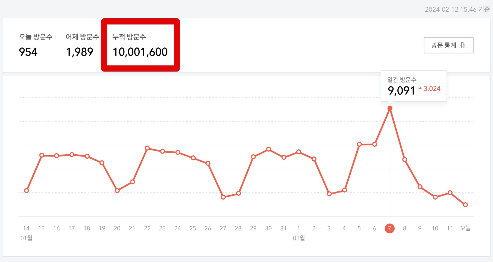

전체글은 585개가 되었다.

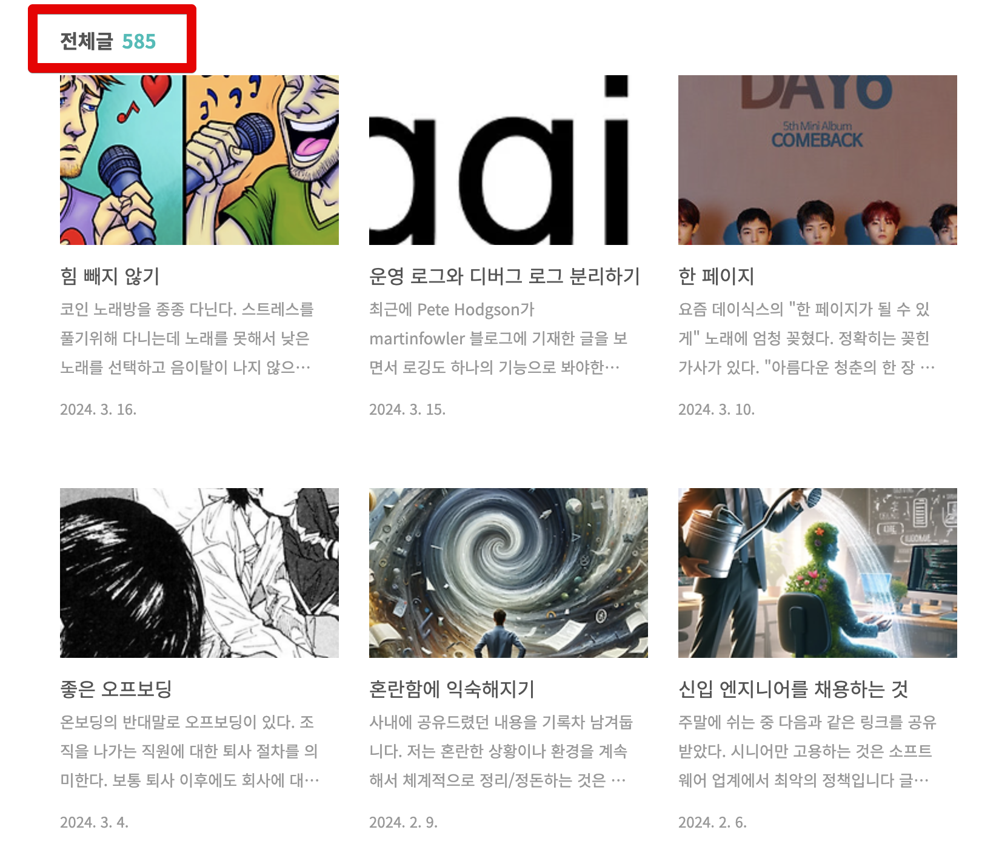

2015.1.31에 첫 글을 작성했으니, 약 **9년만에 1,000만**이 되었다.  
  
예전에는 6개월에 100만씩 증가했다면, 요즘은 7개월에 100만씩 증가하고 있다.  
아무래도 기술 문제를 해결한 사례보다는 현재의 내 생각을 계속 정리하다보니 구글 검색을 통해 유입되는 비율이 낮아진 것 같다.  
  
1,000만이 오면서까지 있었던 일들을 연도별로 정리해보았다.

## 2015년

[2015년 1월 31일](https://jojoldu.tistory.com/1)에 첫 글을 작성했다.  

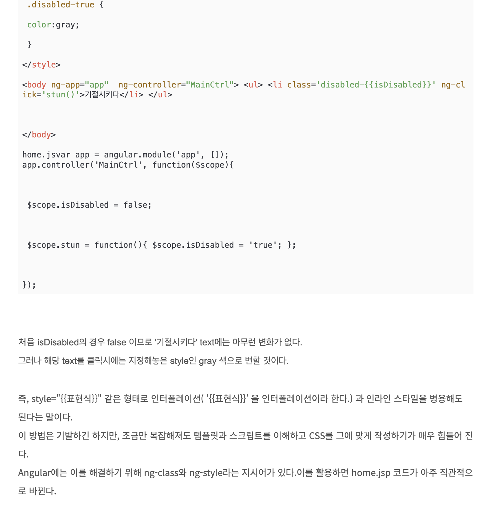

누가봐도 성의없는 글이다.  

처음 시작은 [아웃사이더님](https://blog.outsider.ne.kr/),  [권남님](https://kwonnam.pe.kr/wiki/) 의 블로그/위키를 보고 나도 이렇게 되고 싶다는 마음에 시작했다.  
당시에도 여러 블로그 플랫폼이 있었고, 특히 개발자는 이글루스를 많이들 사용하고 있었다.  
근데 이글루스는 하필 현재 내가 속해있는 회사가 관리중인 서비스였고, 다른 서비스를 이용하는게 좋겠다는 생각에 다음에서 운영 중인 티스토리를 선택했다.  
  
내가 직접 만들어도 되겠지만, 그러면 **정작 글은 안쓰고 블로그 만드는것에만 집중하게되고, 내가 업데이트 안하면 개선이 안되는 상황**이 싫었다.  
  
무슨 내용으로 채울까 고민하던 중에 회사에서 가장 지적을 많이 받고 있던 **JavaScript** 를 공부하면서 필요한 내용들을 작성했다.  
  
2~3월까지 글을 쓰다가 4~6월에는 글을 더 쓰지 않았다.  
글을 쓴다고 당장의 뭔가 큰 변화가 있는 것이 아니라서 동기부여도 딱히 안되고, 회사 일 하기 바빠서 잊혀졌다.  
  
회사의 기술을 빠르게 내 것으로 만들기 위해서 **강의식 스터디**를 진행했다.  
"내가 잘 모르지만 지금 꼭 익혀야할 기술들을 골라서 해당 주제를 가르쳐줄테니 들을 사람들은 와라" 의 강의식 스터디였다.  
  
AngularJS (MEAN Stack), Git/Github, Backbone.js & MVC, Bower/Grunt 등 회사에서 중요하게 사용중이던 기술들 하나하나를 타인을 가르치기위해 공부하기 시작했다.  
  
그러던 중 회사에 신입 개발자분들이 합류하면서 물어보는 질문들이 내가 스터디에서 가르치던 내용과 중복되는 부분들이 생기기 시작했다.  
강의를 위해 PPT를 매주마다 만들었는데, PPT로 되어있던 내용들은 문맥과 내용을 제대로 담고 있지 못해서 신입 팀원들에게 전달할 수 없었다.  
강의자료는 강의자료대로, 신입 팀원들에게 전달할 내용은 그것대로 2중으로 준비가 필요하기 시작했다.  
  
스터디원들 관리하는것 부터 시작해서, 스터디비용, PPT 만들기 등 여러가지로 품이 많이 들어서 강의형 스터디는 그만하고 신입 팀원들에게 전달할 내용으로 블로그에 글 쓰는 것을 새로운 학습 방법으로 선택했다.

## 2016년

아무도 보지 않는 블로그를 운영하는 것이 동기부여가 잘 안된다는 것을 느꼈다.  
  
사람들이 내 글을 보고 댓글을 남겨주고, SNS 공유도 되고 이럴때 블로그 글을 쓰는 큰 동기부여가 된다는 것을 알게 되었다.  
  
그래서 어떻게 사람들을 오게 만들까 생각하다가 **사람들이 좋아할만한 주제의 글도 같이 쓰자**로 정했다.  
그러면 그 글을 보고나서 내가 쓴 다른 글들도 보고 점점 관심을 가질테니깐.  
  
그래서 2016년부터는 [세미나 후기](https://jojoldu.tistory.com/category/%EC%84%B8%EB%AF%B8%EB%82%98?page=6)를 작성하기 시작했다.  
  
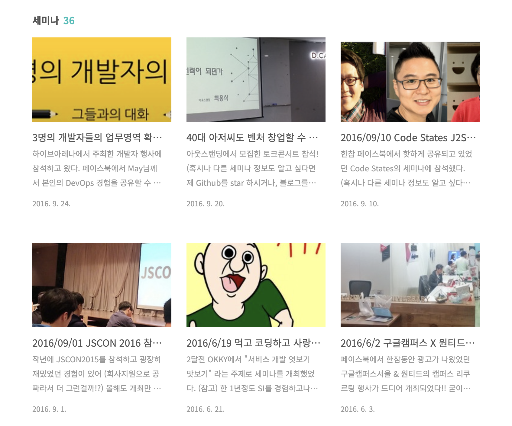

세미나 참석하지 않은 사람들도 대리만족할 수 있도록 상세하게 정리하기 시작했다.  

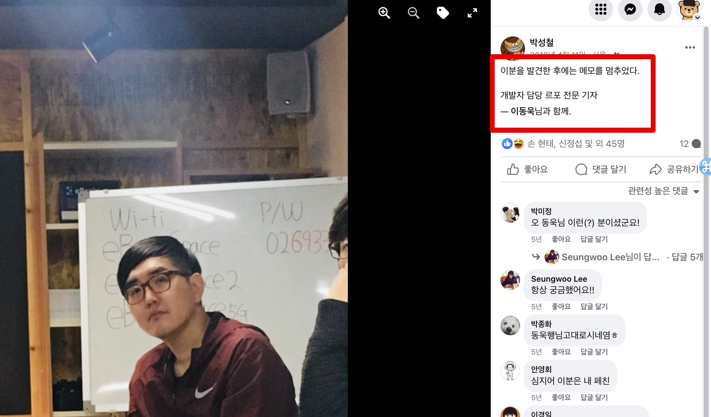

(이런 이야기가 나올정도로)  
  
기술 블로그를 운영하면서 세미나 후기만 가득한 블로그로 유명해서는 안된다고 생각했다.  
그리고 사수가 없던 현 직장 생활에서 온라인에서라도 사수를 구해야겠다는 생각에 페이스북에도 기술 글을 계속 공유하기 시작했다.

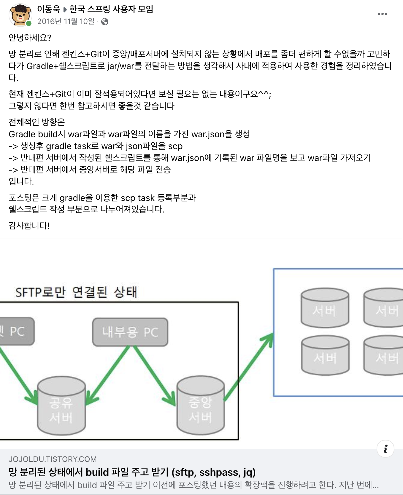

SNS에 블로그 글을 공유하면 틀린 내용에 대한 피드백도 자주 주기 때문에 내가 알고 있는 지식을 점검 받을 수 있는 좋은 기회였다.  
  
내가 공부한 내용과 세미나 후기를 계속 블로그에 정리하고, 이를 SNS에도 공유하면서 피드백을 받는 것을 2016년 내내 했다.  
  
갑자기 영한님의 DM을 받았다.

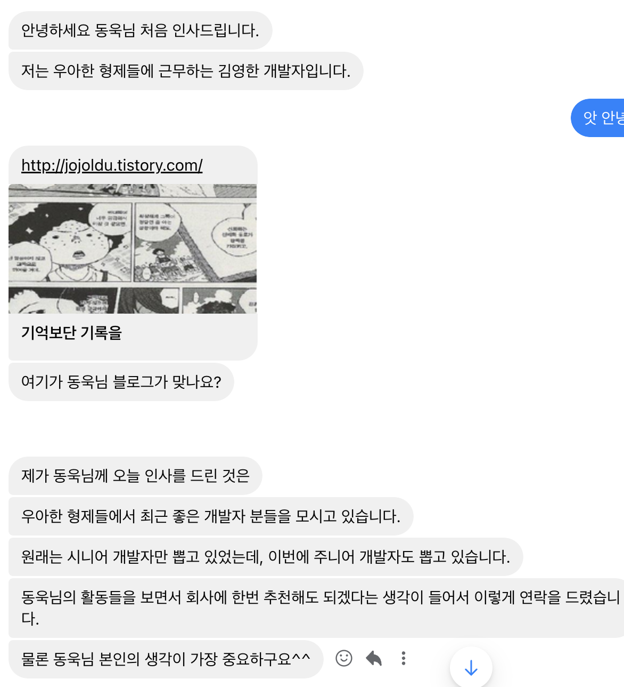

영한님과 처음으로 대화를 해봤고,  
기술 블로그를 계속 보시다가 배민 추천서를 작성해주셨다.  
  
코딩테스트, 1차면접, 2차면접을 마치고 배민으로 입사를 하게 되었다.

## 2017년

배민을 다니면서 자바 & 스프링 개발 주니어분들이 웹 애플리케이션 배포부터 인프라 설정까지의 과정을 모르는 분들이 많다는 것을 느꼈다.  
  
시니어가 많은 회사일수록 이런 작업들은 대부분 시니어가 하시고, 주니어들은 로컬 호스트에서 자바 & 스프링 코드만 작성하는게 대부분이라서 그렇다는 것을 알게 되었다.  
  
그래서 자바 & 스프링 코드 작성밖에 모르는 분들을 위해 한 편의 시리즈를 작성하기 시작했다.

- [스프링부트로 웹 서비스 출시하기](https://jojoldu.tistory.com/250)

위 시리즈가 **2017년부터 2018년까지 누적 조회 20만**이 넘어서 블로그 최고 히트작이 되었다.  
결국 [책으로까지 출판](https://jojoldu.tistory.com/463)되어 생각한 것 이상으로 많이 판매되었다.  
  
Spring Batch 관련 글을 집중적으로 쓰기 시작했다.  
  
결제/정산이라는 도메인 특성상 대량의 데이터 일괄 처리가 자주 필요하다.  
한글로 된 책도 없고, 한글 자료도 더더욱 없는 상태에서 구현과 장애 해결을 해야하니 애를 많이 먹었다.  
  
자료가 너무 없다보니 한국에서는 Spring Batch가 그렇게 인기 있는 주제는 아닌가라는 생각과 함께 "이걸 잘 공유하는 사람이 없으니 내가 독점할 수도 있겠는데?" 라는 생각이 같이 들었다.  
  
어차피 팀원분들에게도 Spring Batch에 관해서 매번 같은 내용을 언급하는 것의 피로감과 온보딩의 막막함이 있던 때라서 일석이조라고 생각했다.  
  
내가 "**한국의 Spring Batch In Action 시리즈가 되어야지**" 라는 생각으로 Spring Batch 관련해서 문제 해결 사례, 기본적인 가이드 등을 열심히 작성하기 시작했다.

- [스프링 배치 글 모음](https://jojoldu.tistory.com/category/Spring%20Batch?page=6)

마크다운을 알게 되고 너무 편한 글쓰기 방식에 감탄해서 티스토리에서도 마크다운을 쓸 수 있는 방법을 고민하기 시작했다.  
  
티스토리 Open API를 알게 되어서 Sublime Text 로 편하게 글 쓰고 이미지까지 한꺼번에 업로드할 수 있도록 [자동 업로드 스크립트](https://www.npmjs.com/package/markdown-tistory) 를 만들었다.  
Node.js 공부도 할 겸 Node.js로 만들었다.  
  
너무 멋모르게 코드를 만들었어서, 코드 퀄리티가 너무 안좋은데, 이후 계속 기능을 추가해서 2024년 1월까지 계속 이 스크립트를 통해 글을 작성했다.  
(2024년 2월에 티스토리 Open API가 종료되어서...)

## 2018년

2018년 8월 누적 조회수 50만이 되었다.  
2015년 1월을 기준으로 **3년 7개월**이 걸린셈이다.  
  
[마소콘 2018](https://www.imaso.co.kr/masocon2018/) 에서 개발자와 블로그라는 주제로 발표를 했다.  

- [발표자료](https://speakerdeck.com/microsoftware/masokon2018-gaebaljawa-beulrogeu-idongug)

글 쓰는 개발자라는 주제로 짧게 발표하고 대담을 하는 시간을 가졌다.  
  
내가 블로그를 좀 더 편하게 다루기 위해 구축한 댓글, 스크립트, 자동화 등에 대한 이야기를 나눴다.  
  
다음 포털의 메인 Home - 직장인 탭에 내 글이 실렸다.

  
2번째 히트작 시리즈인 [3번째 직장에 오기까지](https://jojoldu.tistory.com/277) 를 포털 MD분들이 선택해주셨다는 것에 기뻤다.  
메인에 실리자마자 평균 하루 조회수가 2천이 안되는데, 1만을 넘겼다.  
  
자바 챔피언인 [Vlad Mihalcea 의 정기 뉴스레터](https://in.relation.to/2018/05/25/hibernate-community-newsletter-2018-10/)에 내 글이 언급되었다.

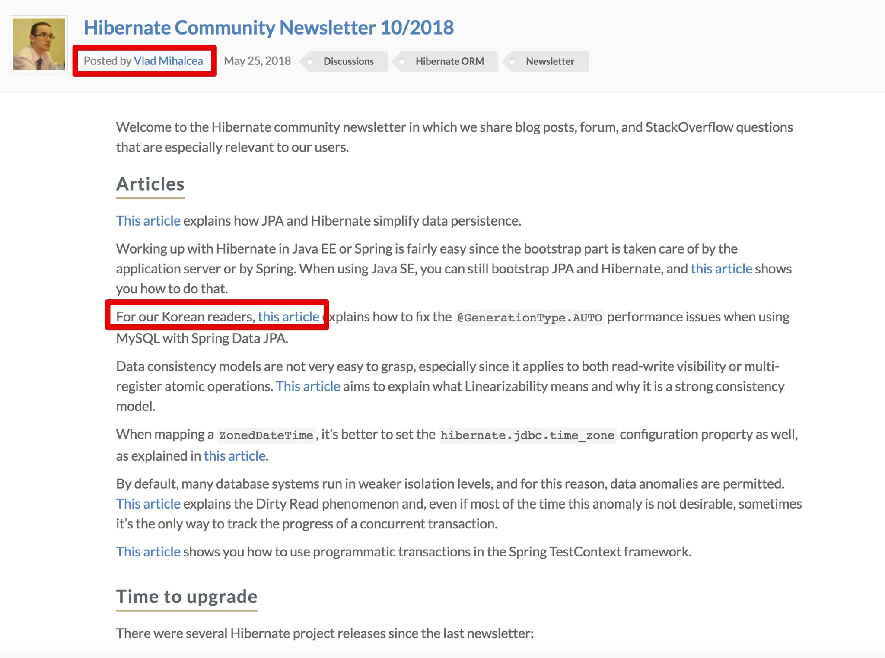

다른 어떤 곳에 내 글이 공유되어도 이보다 더 기쁘진 않았을것 같다.  
  
**하이버네이트, MySQL 등을 공부하다보면 매번 만나게 되는** 롤 모델인 Vlad Mihalcea 가 내 글을 좋게 봐줬다는 것이 너무 기뻐 주변의 많은 사람들에게 자랑했다.

## 2019년

2019년 3월 누적 조회수 100만,  
2019년 11월 누적 조회수 200만이 되었다.  
2015년 1월로부터 **4년 10개월**만이다.  
  
Dropwizard 에서 [Redis Client로 Jedis가 아닌 Lettuce를 써야한다는 Issue](https://github.com/dropwizard/dropwizard-redis/issues/2)가 올라왔고 이에 대한 근거 자료로 내 블로그가 언급되었다.  

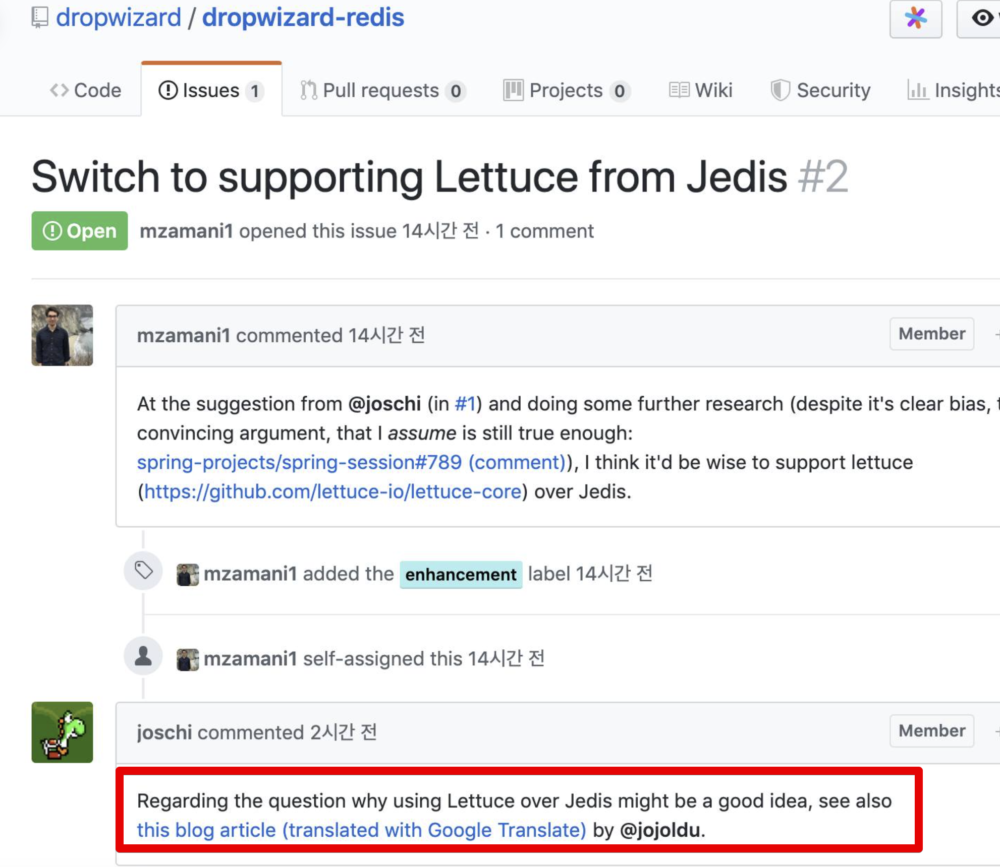  

해외에서 어떻게 이걸 검색하고 보셨는지 너무 신기했다.  
이 외에도 조금씩 트위터, Github 등에서 조금씩 내 블로그가 언급되기 시작했다.  
  
티스토리 앱이 완전히 개편되었다.  
- [티스토리 블로거를 위한 앱 업데이트
](https://notice.tistory.com/2523)

## 2020년

2020년 5월 누적 조회수 300만,  
2020년 11월 누적 조회수 400만이 되었다.  
2015년 1월로부터 **5년 10개월**만이다.  
  
내 블로그에 있는 대부분의 글이 이미지까지 포함해서 그대로 복사된 블로그를 제보로 알게 되었다.

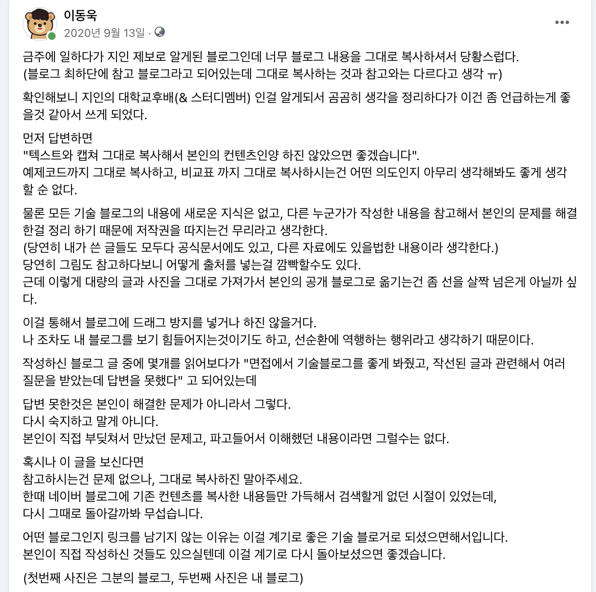
    
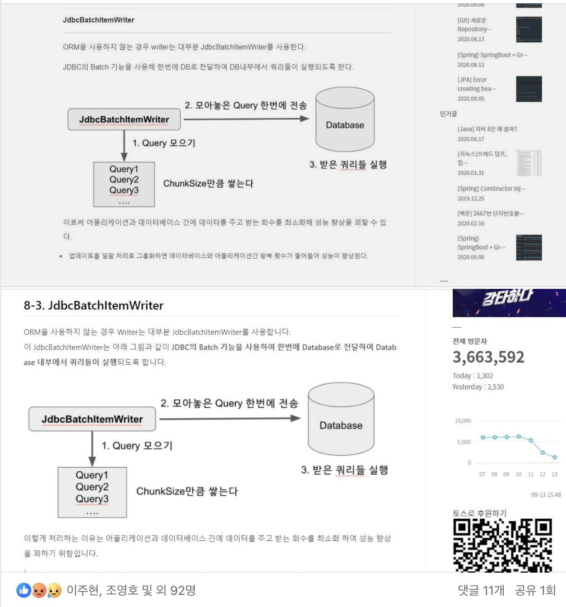

(카피블로그 / 내 블로그)      

그림을 다시 그린 것도 아니고, 아예 통으로 그대로 가져가서 개인 블로그에 올려진것을 보고 깜짝 놀랬다.  
타 직업군보다 개발자라는 직업군이 가장 좋은 이유가 개인의 노하우를 아낌없이 공개하고 공유하는 문화에 있다고 생각한다.  
  
그래서 블로그에 중복된 내용이 있거나 레퍼런스 삼는 것은 당연하다고 생각한다.  
다만, 아예 그대로 복사하고 이렇게 쌓인 블로그를 이력서에 포함시키는 것은 전혀 다른 문제라고 봤다.  
기존 개발자들의 문화를 훼손한다는 생각이 강하게 들어서 SNS에 강한 어조로 이야기했다.  
  
물론 이 분의 모든 글이 복제 글은 아니겠지만, 많은 내 글이 복사되어있어서 전체 글에 대해 의심하게 되었다.  
당사자에게도 좋은 일은 아닌 것 같아서 해당 블로그의 주인분을 알고 있는 내 지인에게 전달을 요청드렸다.  

블로그 분께서 사죄도 하시고, 취준생이시기도 하셔서 원만하게 이야기가 마무리 되었다.   
  
팀에서 관리중인 데이터가 매년 폭발적으로 늘어나서 [수십억건이 쌓인 여러 테이블 환경에서 JPA & Querydsl 를 잘 다루기 위한 글](https://jojoldu.tistory.com/category/Database?page=3)들을 쓰기 시작했다.  
  
팀에 장애가 발생하면 어찌됐든 개발 리드 역할을 하고 있던 내가 가장 빠르게 해결하게 된다.  
근데 해결한 사람이 계속 해결하면 팀 전체의 성장을 할 수가 없으니 이에 대해 팀 Wiki에도 작성하고, 개인 블로그에도 정리하게 되었다.  
  
이렇게 정리된 내용으로 **사내 첫 기술 컨퍼런스의 연사자로 참여**할 수 있게 되었다.

- [우아콘2020 - 수십억건에서 Querydsl 사용하기](https://www.youtube.com/watch?v=zMAX7g6rO_Y)

우아콘 2020에서 두번째로 많은 조회수를 달성했다.  
(1등은 [영한님의 마이크로서비스 여행기](https://www.youtube.com/watch?v=BnS6343GTkY)라서....)

## 2021년

2021년 5월 누적 조회수 500만,  
2021년 11월 누적 조회수 600만이 되었다.  
2015년 1월로부터 **6년 4개월**만이다.  
  
**배민에서 인프랩으로 이직하면서 더이상 자바/스프링/MySQL 관련된 글은 쓰지 않게 되었다**.  
Node.js / TypeScript / Nest.js & TypeORM / PostgreSQL 등 현재 인프랩에서 사용중인 기술들 위주로 공부하고 정리하기 시작했다.  

- [JavaScript & TypeScript 글 모음](https://jojoldu.tistory.com/category/JavaScript%20%26%20TypeScript?page=3)

자바에서 많이 쓰던 문제 해결 방식과 기본적인 아키텍처, 패턴등이 Node.js 에서는 어떻게 풀었는지 등을 위주로 찾아보고 정리하기 시작했다.  
  
**팀의 기술 환경에 빨리 적응하기 위해서** 좋은 코드, 테스트 코드, 아키텍처, 패턴 등 특정 언어에 종속되지 않는 제너럴한 주제들은 모두 **TypeScript 기반으로 예제 코드**를 작성하기 시작했다.  
  
개인 회고 외에도 CTO 회고도 쓰기 시작했다.  
다음에 또 CTO를 하게 된다면, 혹은 이제 막 CTO를 하실려는 다른 분들에게 조금이나마 도움이 될 수 있기를 바라는 마음이였다.  
  
[첫 CTO 회고](https://jojoldu.tistory.com/626)를 많은 분들이 좋아해주시고, 특히 비슷한 위치의 기술리더분들께서 많이들 공감해주셨다.

## 2022년

2022년 5월 누적 조회수 700만,  
2022년 12월 누적 조회수 800만이 되었다.  
2015년 1월로부터 **7년 11개월**만이다.  
  
2022년 1월 회사의 대형 장애가 발생했다.  

- [2022년 1월 100% 할인 이벤트 장애 부검](https://tech.inflab.com/202201-event-postmortem/)

1월 한달 동안 총 6번의 서비스 다운이 발생하는 대형 장애였다.  
  
레거시 Node.js 환경에서의 성능 개선과 장애 방지가 필요했기 때문에 Nest.js, TypeScript 등에 대한 정리 보다는 당장의 문제를 해결할 수 있는 것들 위주로 정리하기 시작했다.

- [NodeJS 와 PostgreSQL Connection Pool](https://jojoldu.tistory.com/634)
- [Promise.all 과 Transactions](https://jojoldu.tistory.com/639)
- [NodeJS 와 PostgreSQL Query Timeout](https://jojoldu.tistory.com/631)
- [PostgreSQL (Aurora) 10 vs 11 버전 성능 비교](https://jojoldu.tistory.com/630)
- [PostgreSQL NOT IN 쿼리 성능 개선하기](https://jojoldu.tistory.com/632)

이 대형 장애로 인해 **레거시 시스템에서 Nest.js 기반의 신규 시스템 이관으로의 드라이브**를 걸 수 있게 되었다.  
  
하반기부터는 신규 시스템을 잘 구성할 수 있도록 더 좋은 테스트 코드를 작성할 수 있는 Tip들을 TypeScript 버전으로 작성하기 시작했다.

- [테스트 코드 Tip 모음](https://jojoldu.tistory.com/category/%ED%85%8C%EC%8A%A4%ED%8A%B8%EC%BD%94%EB%93%9C%20%26%20%EC%A0%95%EC%A0%81%EB%B6%84%EC%84%9D?page=3)

## 2023년

2023년 7월 누적 조회수 900만이 되었다.  
2015년 1월로부터 **8년 6개월**만이다.  

100만을 달성하는데 걸리는 시간이 점점 더 느려지기 시작했다.  
평균 6개월 걸리던 것이 이젠 7개월정도 걸린다.

블로그의 댓글을 [Utterances 에서 Giscus로 이전](https://jojoldu.tistory.com/704)했다.  

- 대댓글
- 댓글 수, 댓글 정렬, 게시물에 대한 반응
- 다양한 테마
- 지연 로딩 댓글
- 다국어 (한국어 포함)

등 다양한 장점이 존재해서 이관했다.  
대댓글이 가능하다보니 댓글 창이 굉장히 깔끔해졌다.  

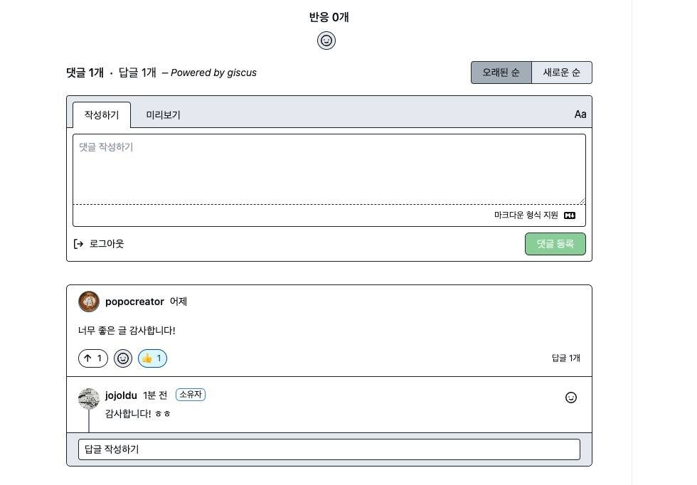

"그간 쌓아둔 리더십/매니지먼트 역량이 다 소진되었나" 하는 고민이 커지기 시작하면서 기술적인 내용보다 [내 생각을 정리한 글](https://jojoldu.tistory.com/category/%EC%83%9D%EA%B0%81%EC%A0%95%EB%A6%AC)을 발행하는 빈도가 늘어나기 시작했다.  
  
블로그 글을 쓰고 커밋을 하는 출근 전 오전 2시간을 점점 리더십/매니지먼트 책을 읽는 시간으로 활용하기 시작했다.  

엔지니어링에 대한 감을 절대 잃으면 안된다는 생각에 한달에 1~2개는 기술 관련된 글을 쓰기로 하고, 아침에 30분이라도 꼭 코드를 작성하는 시간으로 가지기 시작했다.  
  
생각에 대한 글 2~3편을 올리면 기술 글 1편 정도 올라가는 빈도가 되었다.  
"엔지니어링 리더가 이래도 되나?" 하는 고민을 하기 시작했다.  
  
12월, [티스토리의 오픈 API 종료 공지](https://notice.tistory.com/2664)가 올라왔다.  
**티스토리 대신 다른 블로그 플랫폼을 찾아야하는 위기**가 발생했다.  
다만 2월까지는 OpenAPI가 운영될 계획이라 고민을 미뤘다.

## 2024년

2024년 2월 누적 조회수가 1,000만이 되었다.  
2015년 1월로부터 **9년 1개월**만이다.  
현재 이 글을 작성하고 있다.  
  
1월에 [종립님](https://johngrib.github.io/)을 만나서 근황토크를 하던 중 "**동욱님의 블로그는 작성자를 위한 것이 아닌 보는 사람들을 위해서 작성되어 있어서 좋다**.", "**유산으로 보관 되어야한다**." 라는 이야기를 해주셨다.  
종립님과 농담하면서 나눈 이야기였지만, 그간의 여정을 보상받는 기분이 들었다.  
  
티스토리 Open API가 종료되고 나서 글 쓰는 방식이 변경되었다.  
예전에는 마크다운으로 편하게 글 쓰고 이미지도 로컬 디스크에 둔 채로 자동화 스크립트 실행만 했다면,  
현재는 작성된 마크다운을 VS Code에서 Export HTML로 추출해서 추출된 HTML을 그대로 티스토리에 작성한다.  
이미지는 직접 손으로 업로드 하고 있다.  
  
너무 귀찮아서 `jojoldu.tistory.com` 도메인을 포기해서라도 다른 블로그 플랫폼으로 옮길까, 아니면 Puppeteer 혹은 Selenium 등으로 업로드 자동화 스크립트를 다시 작성할까 고민하고 있다.  
  

## 마무리
  
기술 블로그를 운영하는 사람으로서 [vlad mihalcea](https://vladmihalcea.com/blog/) 를 참 좋아한다.  
기술적 깊이도 뛰어나면서도 이 분이 항상 꾸준히 블로그를 운영하는 것만으로도 얼마나 삶이 바뀌는지 자주 언급해주기 때문이다.  

[vlad mihalcea의 트윗](https://twitter.com/vlad_mihalcea/status/1325372190678802432) 에서도 같은 내용이 언급된다.  

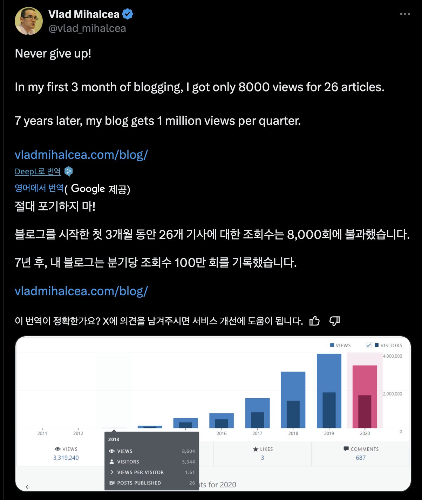

기술 블로그인데도 분기당 100만 조회수라니,    
첫 3개월동안 조회수가 8천밖에 안되었다니,    
너무 멋진 스토리고 내가 하고 있는 것과 비슷하다는 생각을 많이 했다.  
  
요즘 너무 우후죽순으로 블로그를 한다는 이야기를 많이 한다.    
하지만 내가 처음 블로그를 했던 그 당시에도, 그 이전에도 이글루스를 필두로한 개발자들의 기술 블로그는 정말 많았다.  
다만 그 블로그가 더이상 관리가 되지 않아서 검색조차 안되거나 아예 폐쇄되어서 보이지 않을 뿐이다.  
  
2015년부터 2024년 현재까지 매년 블로그를 시작하신 분들은 정말 많았지만 그걸 3년, 5년 유지하는 분들은 정말 극소수이다.  
  
그래서 매번 글을 올려주시는 [아웃사이더님](https://blog.outsider.ne.kr/),  [권남님](https://kwonnam.pe.kr/wiki/) , [종립님](https://johngrib.github.io/) 같은 분들이 참 감사하고 응원하게 된다.  
  
취업을 위해 블로그를 하는 것에 대해 여러 이야기들이 많다.  
분명한 건 **나는 블로그를 시작해서 많은 기회와 경험을 얻었다**.  
내가 갖고 있는 역량보다 훨씬 더 좋은 평가를 받은 것도 이 때문일 것이다.  
  
프로세스 해킹처럼 취업하기 좋은 전략으로서 블로그는 확실히 메리트가 없다.  
다만, 본인이 블로그를 하는 것 자체에 흥미가 있다면 **평생 가져갈 수 있는 좋은 취미**가 하나 생기는 것이다.  
  
나는 개발자가 아니였어도 블로그를 했을 것 같다.  
어느 직업이 되었든 간에 블로그를 통해 내가 공부한 것을 정리하고 내 생각을 정리하는 것이 몇 안되는 스트레스 해소법이고 좋은 학습법이기 때문이다.  
  
블로그가 너무 많다, 취업을 위한 블로그는 다크패턴이다 등 이야기가 많겠지만 그런걸 신경쓰지 않고 하면 된다.  
3년, 5년이 지나면 같이 시작한 거의 대부분의 사람들은 없어지고 그때까지 꾸준히 해온 것 만으로도 충분히 존중 받을 수 있다.  
  
그리고 뭐가 되었든 본인의 업을 위해 한가지를 오랫동안 꾸준히 해온 사람이라면 좋은 경험을 얻었을 것이다.  
  
블로그를 시작하고 9년이 지났다.  
커리어의 거의 시작부터 해온 것이 블로그가 된 셈이다.  
다음엔 2,000만 회고 혹은 20년 회고다. 