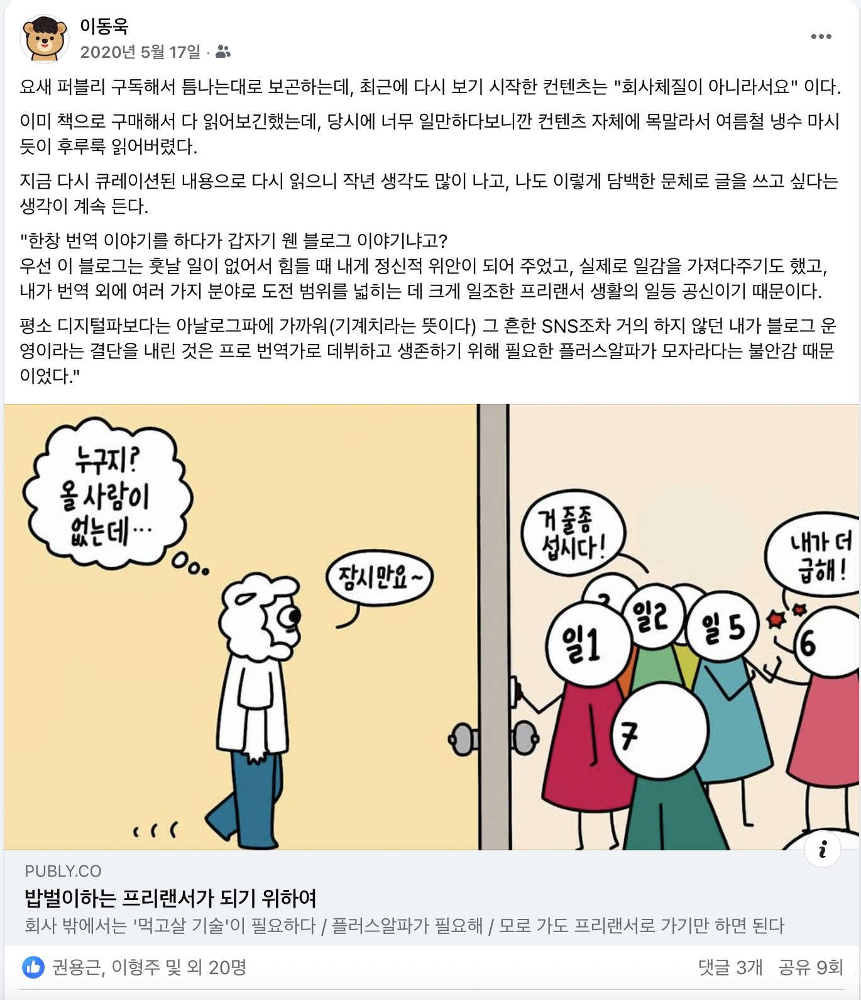

# 실패를 통과하는 일

예전 최정우님이 쓰신 옐로모바일의 흥망성쇠를 담은 [스타트업은 어떻게 유니콘이 되는가](https://ebook-product.kyobobook.co.kr/dig/epd/ebook/E000002951949) 이후 오랫만에 스타트업의 대표님이 직접 쓰신 일기장 같은 책을 봤다.  
  
퍼블리는 인프런과 꽤나 닮은 부분이 많았다.  

- 퍼블리 & 커리어리 & 위하이어
- 인프런 교육 & 인프런 커뮤니티 & 랠릿

꼭 퍼블리만 아니더라도 대부분의 커리어 플랫폼들은 그 방향성은 비슷하게 간다.
- 교육 & 채용 & 커뮤니티

시작은 서로 다를 수 있으나, 큰 그림은 다들 비슷하게 보고 있다.
- 원티드처럼 채용으로 시작해서 커뮤니티와 교육으로 확장하는 경우도 있으며
- 리멤버처럼 (명함) 커뮤니티로 시작해서 채용으로 확장한 경우도 있으며
- 인프런처럼 교육으로 시작해서 커뮤니티, 채용으로 확장한 경우도 있다.

> 다만, 지금의 우리는 교육으로 글로벌 시장을 노리는 것으로 에너지를 집중하고 있다.

3개 꼭지점을 모두 다 달성한 플랫폼은 국내/국외 어디에도 없다.  
아마도 가장 근접한 건 링크드인이다.  
커뮤니티와 채용에 있어서는 세계 최고가 되었고, 린다닷컴을 인수해서 교육쪽으로도 계속해서 시도하고 있으니 말이다.  
  
국내에서는 확실하게 이 영역을 모두 확보한 플랫폼이 없다.  
하지만 많은 커리어 플랫폼이 이 영역들을 확보하기 위해 도전하고 있다.  
  
그러다보니 퍼블리를 비롯해 비슷한 결의 서비스들은 어떻게 시도하는지 자주 지켜봤다.  
마침 퍼블리에는 좋아하는 콘텐츠들도 많았어서 구독제 멤버십도 가입해서 자주 사용했다.  

 
퍼블리를 자주 이용하던 중,  
개발자들을 위한 SNS 서비스 '커리어리'를 시작한다는 소식을 들었다.  
'위하이어' 라는 ATS 서비스를 시작하신다는 것도 들었다.  
  
그리고 어느 순간 퍼블리에 읽고 싶은 콘텐츠가 더이상 추가되지 않았다.  
내 취향의 콘텐츠가 없다보니 얼마되지 않는 그 구독료도 아까웠다.  
그래서 훨씬 더 내 취향인 폴인의 구독을 시작했고, 지금까지도 연간 구독으로 계속해서 콘텐츠를 보고 있다.  
  
2023년엔 대표인 쭈와 함께 박소령 대표님, 이승국 CPO님과 함께 저녁식사를 먹으면서 스타트업에 대한 이야기를 나누기도 했다.  
커리어리와 위하이어로 개발자와 채용에 관해서 집중하신다는 것도 알게 됐다.  
  
그래서 어떤 과정으로 퍼블리와 그 외 서비스들이 시작했는지, 비중은 어떻게 되는지, 시리즈 B 투자로 받은 135억을 어떻게 활용하셨는지 등등 많이 궁금했었다.  
  
한국 콘텐츠 스타트업에서 퍼블리가 남긴 족적은 분명히 크다.  
그래서 퍼블리가 어떻게 10년을 보내왔는지 그 기록이 너무나 중요하다고 생각했는데, 이번에 이렇게 책으로 정리해주셔서 정말 감사했다.  
  
금, 토 이틀만에 다 읽으면서 지금 스타트업 시리즈 A, B 단계의 회사에서는 이 노트가 얼마나 귀한 기록인지 감사한 마음뿐이다.  

VC와의 관계와 투자는 어떻게 진행해야하는지,  
투자 받은 자금을 어떻게 활용해야하는지,  
레이오프는 어떻게 해야 덜 후회하고 앞으로를 위해 도움이 되는지 등등.  

아직 유니콘이 되지 못한 스타트업에 다니시는 분들이라면 무조건 적으로 읽어보시라고 추천하고 싶다.  
책 제목이 "실패를 통과하는 일"이다.  
인프런은 꼭 통과하지 않기로 몇번이고 다짐했다.

## 책 속 문장

> 매월 달성해야하는 재무 목표는 곧 매주, 매일의 목표로도 환산되기에 업무 우선순위에 대한 감각이 더 예민해지면서 긴장감을 가질 수 있었음.
> 팀과 커뮤니케이션을 할 때도 단순히 "BEP를 달성하자"가 아니라 "**2023년 4월에 ㅇㅇ곳의 신규고객사가 ㅇㅇ원을 결제해서 매출이 00원 발생하면 BEP를 덜상할 수 있으니 집중하자**" 라고 말하면, 해야 할 일이 명료해져서 좋았음.

> 사업에서 돈을 벌려면 '남이 하기 싫은 일을 대신 해주고, 그 대가로 돈을 받는다'라는 고전적인 명제가 진리임을 다시 한번 절감함.

> 부와 행복은 두 가지 요소로 이뤄진 등식임을 항상 기억하자.  
> 두 가지란 당신이 '가진 것(현실)'과 '기대하는 것(기대치)'이다.  
> 이 둘은 똑같이 중요하다.  
> 따라서 가진 것을 늘리는 데에는 엄청난 노력을 쏟으면서 기대치를 관리하는 데에는 거의 신경을 쓰지 않는 것은 말이 안된다.  
> 특히 **우리가 훨씬 더 쉽게 통제할 수 있는 것은 현실이 아닌 기대치**이므로 더욱 그렇다.  
> ...
> 정말로 원하는 것은 기대한 것과 실제 결과의 차이를 경험하는 일이다.  
> **우리는 기대한 것보다 더 좋은 결과를 얻었을 때 만족과 성취감을 느낀다**.

> 커리어 소셜미디어를 먼저 만들고 나중에 비즈니스 모델을 붙이는 것, 채용관리 소프트웨어를 먼저 만들고 나중에 신규고객에게 세일즈하는 것은 모두 **돈 버는 것을 뒤로 미룬 결정**이었다.  
> 최저 가치 단계에서 어떻게 돈을 벌어야하는지, 이렇게 돈 버는 방법이 나와 잘 맞는지, 앞으로도 지치지 않고 꾸준히 할 수 있는 일인지 미리 파악하고 고칠 수 있는 기회를 날려버리고 말았던 것이다.  

> 나는 모든 일은 시작보다 끝이 중요하다고 생각하며, 사람과의 관계도 마찬가지라고 생각함.  
> 시작에는 설렘과 충동성, 도파민이 있음.  
> 반면 끝은 책임감, 희생정신, 전우애가 필요함.

> **'어떤 일의 끝에 다다랐을 때 어떻게 행동하는가' 는 그 사람이 고통을 대하는 태도를 보여주는 좋은 리트머스 테스트**다.  
> 가장 끝의 순간에 하는 행동은 그 사람에 대해 정말 많은 것을 보여준다.  
> ...
> 그래서 함께 일할 사람을 채용할 때 반드시 체크해야 할 것은 '전 직장을 퇴사할 때 어떻게 행동했는가'이다.  

> 자신이 사지 않을 것은 팔지 않는다.  
> 존경하지 않고 존중하지 않는 사람 밑에서 일하지 않는다.  
> 같이 있으면 즐거운 사람들하고만 일한다.

> 정기구독 사업은 7일 무료체험을 시작하면서 고객 수가 빠르게 증가했고, 12개월 장기상품 판매로 매출도 올라가기 시작했음.  
> 그 와중에 연말 프로모션 준비까지 더해지며 팀 전체가 매우 바쁘고 정신없었음.  
> 하지만 밤늦게까지 야근을 해도 사무실엔 항상 활력이 돌았음.  
> **사업 지표가 올라가고 매출이 상승하면 누가 시키지 않아도 신나서 일한다는 것을 알게 됨**.  
> ...
> 마지막으로 2019년 4월에 만들기 시작한 '커리어리'가 있었음.  
> 이 서비스는 2년이 되도록 지지부진한 상태였음.  
> 이런 상황에서는 팀 내 갈등 역시 두드러지기 마련이라는 것도, 아무리 HR 차원에서 해결책을 강구해도 사업 성과가 해결되지 않는 한 백약이 무효라는 것도 배웠음.

> 평시 CEO의 특성은 소위 '좋은 사람이자 좋은 리더'의 전형적 모습이다.  
> 반대로 전시 CEO의 특성은 가까이하고 싶지 않은 인물 유형이고, 특히 한국 사회의 기준에서는 비판받기 쉬운 점들도 다수 포함되어 있다.  
> 그렇기에 **전시 CEO로 일하려면 어릴때부터 학습된 '좋은 사회인'에서 벗어날 뻔뻔함이 필요**한데, 나는 그러지 못했다.  
> ...
> 전시 CEO는 어디까지나 긴급 상황에서 일시적으로 유효하다고 생각했고, 내가 읽었던 많은 책에 나오는 것처럼 평시 CEO 모드로 일하는 것이 더 우월한 방향이라고 믿었다.  
> 하지만 지금 돌아보면, 나는 그저 전시 CEO로서 '미움받을 용기'가 없었던 것이다.  
> <하드씽> 에서 **벤 호로위츠는 대부분의 경영서들이 평화로운 시기의 성공적인 기업들을 연구한 컨설턴트가 썼다는 점을 기억해야 한다고 주장**한다.  
> 평시 CEO가 사용하는 방법들에 대해 알려주는 책이 아니라, 전시 CEO가 탁월하게 경영하는 법을 알려주는 책을 읽어야 한다는 것이다.  
> 문제는 그런 책이 거의 없다는 것이라며, 나처럼 책으로 학습하는 것을 좋아하는 독자에게 날카롭게 경고한다.

> 이나모리 가즈오는 전시 상황을 겪은 기업들을 살려낸 생생한 경험이 있었기에, <왜 리더인가> 에서 이렇게 적는다.  
> 
> "나는 느슨하고 헐거운 마음가짐으로 문제의 뒤로 물러나 좋은 사람인 척하는 리더보다 가끔은 미치광이 소리를 듣더라도 무소처럼 일의 정면으로 달려들어 일을 완벽하게 장악하는 리더를 훨씬 신뢰한다.  
> 우리는 일 앞에서 좀 더 난폭해져도 된다.  
> 아니, 리더라면 반드시 그래야만 한다"

> 레이 달리오가 쓴 책 <원칙>을 읽었음.
>
> "**사람을 계획에 맞춰라**.  
> 당신에게 필요한 사람들의 유형은 조직의 설계에 달려 있기 때문에, 조직을 구성할 때는 계획이 사람보다 선행한다.  
> 조직을 설계하면서 일을 잘하기 위해 개인들에게 요구되는 특성에 대한 명확한 심상지도를 만들어라.
> ...
> **사람에 맞추기 위해 업무를 계획해서는 안 된다**.  
> 이것은 시간이 흐르면 대부분 실패로 드러난다.  
> **이런 일은 해고하는 것을 꺼리는 사람이 그 사람이 할 수 있는 다른 일을 찾아보려는 경향이 있을 때 흔히 발생한다**"

> "내가 지금까지 만난 대표 중에 늦게 레이오프해서 후회한 대표는 있어도, 빨리 레이오프해서 후회한 대표는 한 명도 없었다.  
> 대표가 '뭔가 잘못되었는제'라고 느끼고 있다면 그때가 결정해야 할 타이밍이다.  
> 대표가 가진 직감을 믿어라."

> 필요한 일을 할 수 있는 사람이 지금 팀에서 누구인지 매칭하는 작업도 진행함.  
> 변화에 빠르고 유연하게 적응할 수 있는 능력,  
> 계속 학습하며 성장하는 마인드셋을 보인 사람과 그렇지 않은 사람에 대해서도 의견을 듣고 여러 차례 논의를 거침.

> 7월 1일 19명이었던 팀이 8월 20일 무렵 11명으로 줄어 있었음.  
> **레이오프는 한 명이었지만, 연쇄작용으로 7명이 자진 퇴사했기 때문임**.

> 레이오프를 거치면서, 채용에 대한 생가에 변화가 생김
> 첫 번째, 유능한 제너럴리스트를 뽑자.  
> 비가와도 망하는 게 스타트업이라고, 한 치 앞을 알 수 없는 상황에서는 사업이 언제 어떻게 바뀔지 모름.  
> 시장 상황에 맞게 계속 변화하고 또 변화해야만 생존할 수 있음.  
> 스페셜리스트에게 맞지 않는 일을 주는 것은 개인에게도 조직에도 불행임.  
> 따라서 **사업모델에 여전히 불확실성이 높은 상태에서는 유능한 스페셜리스트가 아니라 유능한 제너럴리스트를 뽑아야 함**.  

> 내가 생각한 스타트업의 가장 큰 특징은 '생존의 불확실성'이었음

> 실력과 태도 둘 다 좋은 사람만 채용한다는 것은 현실적으로 매우 어려운 일이었고, 또 다른 어려운 점은 실력과 태도라는 개념이 참으로 추상적이라는 사실이었음.  
> ...
> 여기서 말하는 태도는 **조직에서 선호하는 속성이 기준**임.  
> ...
> 나의 경우, 시간이 갈수록 점점 더 중요하게 본 세 가지 속성이 겸손함, 성실함, 책임감이었음.  
> 반대로 말하자면 겸손하지 않은 사람, 성실하지 않은 사람, 책임감이 없는 사람은 '곱하기'에서 0에 해당한다고 생각했음.

> 첫 번째 대규모 레이오프를 계획하면서 두 가지 선택지를 놓고 고민했음.  
> 동일한 액수의 현금을 절감한다면,
> a. 많은 인원을 레이오프하고, 기존 인력들의 보상을 유지한다.
> b. 적은 인원을 레이오프하는 대신, 기존 인력들의 현금 보상을 절감한다.
> 나는 두 번째를 선택함.
> 커리어리가 이제 막 개발자라는 주요한 타깃 고객을 찾아낸 상황이었고, 이들이 사랑할 수 있는 제품을 만들려면 빠르게 많은 실험을 해야 하므로 제품 조직은 꼭 필요하다는 생각 떄문이었음.
> ...
> 당시 팀 규모는 60명 후반에서 70명 초반 정도였고, 레이오프 대상자는 10% 이내였음.  
> 각자 받는 총보상액에 따라 현금 보상의 삭감 수준이 달랐는데 5~20% 범위였고, 나는 40%를 삭감함
> ...
> 놀랍게도 현금 보상을 줄이자는 제안에 모두가 동의했음.  
> ...
> 하지만 내가 잘못 판단한 것이 있었음.  
> 타운홀을 기점으로 레이오프에 대한 커뮤니케이션을 종료하고 **그 다음 목표를 향해 빠르게 달리자고 치열함을 독려하기보다는, 어수선하고 상처받았을 팀원들을 감정적으로 케어하는 데 조직의 에너지를 쓰게 만든 것**임.  
> 회사의 공식적인 리소스가 게속 포스트 레이오프에 쓰이게 됨.  
> **미래로 나아가는 것이 아니라 과거의 상처를 핥는 데 팀의 중요한 시간을 쓰게 한 것**, 즉 레이오프 이후 냉정하지 못했떤 나 자신에 대한 반성이 있음.  

> 2023년 11월에 진행된 대규모 레이오프의 목적은 첫 번째 대규모 레이오프에서 얻은 크나큰 깨달음에서 비롯되었음.  
> **현금 보상 삭감이라는 선택이 얼마나 인간의 본성에 어긋나는 결정이었는가**에 대한 아하 모멘트가 뒤늦게 찾아왔기 때문임.  
> ...
> 어렵게 채용한 팀원들을 최대한 데리고 가야 원하는 성과를 낼 수 있다는 이유 때문이었음.  
> ...
> 약 반년이 지나 깨달은 것은 **'내가 회사를 위해 보상을 희생했다' 라는 인식으로 여러 부작용이 발생**했다는 것임.  
> 개인으로서는 자연스러운 감정이라고 생각함.  
> 나 자신도 되돌아보니, 급여에 대한 희생을 요구했다는 미안함 때문에 팀과 정확한 커뮤니케이션을 해야 할 때도 심리적 장벽으로 인해 그러지 못했음.

> **레이오프를 많이 했다고 후회하는 대표는 본 적이 없다**.  
> 할 수 있는 한 최대한 해라.  
> 60~70%까지 해도 된다.  
> 이렇게 해도 의외로 회사는 잘 돌아간다.
> **처음 레이오프를 적게 했다가 두 번 레이오프하는 게 최악이다**.

> <파워풀> 에는 수십 명 규모의 작은 스타트업이었던 넷플릭스가 전 세계에 서비스를 제공하는 글로벌 기업으로 확장하던 시기에 겪은 내부 진통의 경험이 나온다.  
> 패티 맥코드에게 초기 멤버였던 팀원이 회사가 변했다며 불만을 토로하자, **당신은 50명 규모의 스타트업 조직에서 가장 행복해할 사람이라며 이제는 회사와 개인의 교집합이 종료되었다는 사실**을 알려준다.  
> 또한 커리어 상담을 하러 찾아온 직원에게는 자신이 좋아하고 잘하는 일을 계속 같은 회사에서 할 필요는 없다고 조언한다.

> 이사진이나 주요 주주를 눈치 봐야 할 상사로 생각하지 말고, 문제를 상담할 수 있는 멘토로 여겨라.  
> 기업가치 극대화라는 관점에서 이들은 그 어떤 이들보다 우군이다.

> 2024년 <이나모리 가즈오의 회계경영> 이라는 책을 선물 받았다.
> ...
> '60년간 수많은 기업을 이끌며 내가 단 한 번도 적자를 기록한 적이 없는 비결은 매출은 최대로, 경비는 최소로 라는 아주 단순한 원칙을 목숨처럼 지켰기 때문이다.
> ...
> 함부로 사람 늘리지마라. 원자재는 딱 필요한 만큼만 사라.
> ...
> 이익이 없다면 당신의 사업은 사업이 아니다.  
> 이익이 없으면 그것은 회사가 아니다.

> 제프 베이조스는 의사결정 전에 '**이 결정은 번복 가능한가, 아닌가**'를 먼저 따져봐야 한다고 말했다.  
> 대부분은 번복 가능한 의사결정에 속하므로 원하는 결과가 아니라면 결정을 빠르게 되돌리면 그만이다.  
> 하지만 주주에 관한 결정 (누구를 주주로 초대하고, 그가 몇 퍼센트의 지분을 갖는가)은 번복하기 어려운 데다 번복하려면 큰 비용을 치러야 한다.

> 회사 매각 과정을 거치면서 내가 절실하게 깨달았던 것은, **창업자와 주주 사이에 중요한 어젠다 중 하나가 회사의 최종 목표와 주주의 엑시트 플랜**에 대한 대화라는 점이다.  
> VC 주주는 우리 회사에 투자한 펀드의 만기일이 있다보니 오랜 시간 기다려줄 수도 없거니와, 애초에 오랜 기간이 필요한 사업이었다면 VC 투자가 적합하지도 않다.  
> '우리의 목표는 매각인가, IPO인가? 매각이라면 언제 얼마의 가치로 어떤 곳을 잠재 인수자로 고려하여 진행해야 하는가? IPO라면 언제 얼마의 가치로 어디에 상장할 것인가?  
> 다음 라운드는 언제, 얼마로 펀드레이징을 할 것인가?  
> 펀드 만기와 수익률을 고려할 때 납득할 만한 계획인가?'

> 회사의 최종 목표와 주주의 엑시트 플랜에 대한 고민은 '중요하지만 급하지는 않은 일'에 해당했고, 이런 카테고리의 일이야말로 **시간을 따로 빼노혹 챙겨야 한다**는 것을 머리로는 알았지만 몸이 따라가지 못했다.  
> '중요하지만 급하지는 않은 일'이 어느새 '중요하고 급한 일'이 되는 순간부터 혼돈이 시작되는 것은 당연지사였다.

><허브 코헨의 협상의 기술 1> 의 내용이 뒤늦게 떠올랐음.  
> ...
> 이 책에서 그는 **협상에서 승리하는 열쇠는 항상 상대방이 시간, 돈, 에너지를 먼저 투자하게 만드는 것**이라고 강조함.  
> 어떤 형태로든 투자한 게 있어야 자신이 쏟아부은 노력을 돌려받고자 하는 심리가 발동한다는 이유 때문이었음.

> 2024년 9월, 드라마 <쇼군>이 미국 에미상 시상식에서 18관왕을 휩쓸었다는 기사를 읽은 후 뒤늦게 몰아보았다.
> ...
> 그리고 <쇼군>이 내게 준 가장 큰 교훈은 '**약자의 협상법**'이었다.  
> ...
> 드라마 후반, 죽음이 코앞에 닥친 상황에서 도쿠가와는 오사카 세력을 상대로 협상하면서 한 가지를 반드시 지킨다.  
> 바로 **'시간의 주도권'만큼은 본인이 절대 놓지 않는 것**.  
> 그는 협상 자리에서 매번 "X라는 상황이 오면, 나는 언제까지 Y를 하겠다"라는 식으로 말한다.  
> 상황 자체는 본인 힘으로 온전히 통제할 수 없지만, 그 상황에 따른 자신의 행동만큼은 먼저 타임라인을 설정하고 상대에게 통보한다.  
> 이렇게 하면 상대도 그가 제시한 타임라인을 기준으로 생각하게 된다.

> 내가 만약 다시 투자받을 일이 있다면, 그때는 투자한 회사 중 잘 안된 곳 대표를 소개해달라고 할 것 같다.  
> 그 대표와 이야기를 하면 이 VC가 어떤 곳인지 가장 잘 알 수 있을 것 같다.

> 왜 이렇게 돈 관리가 느슨했는지 돌이켜보면, '스타트업은 속도가 생명이니, 돈으로 시간을 살 수 있다면 돈을 쓰는게 맞다' 라는 분위기에 나도 별생각 없이 편승했기 때문이라고 생각한다.  
> 문제는 이 명제가 언제나 그리고 모든 사업에 통용되는 건 아니라는 사실이다.  
> 우리 사업은 '지금 돈과 시간 중 무엇에 더 높은 가치를 둘 것인가'에 대해 건강검진하듯 꾸준히 체크했어야 했는데, 그러지 못했다.

> <월마트, 두려움 없는 도전>을 읽고 나서, 제포 베이조스는 분명 샘 월턴으로부터 영향을 받았을 것이라고 생각했다.  
> ...
> '경쟁에서 이기는 것보다 비용 관리에 더 집중하라.  
> 이를 잘하면 반드시 경쟁우위를 선점할 수 있다.  
> 우리는 매출액 대비 비용이 가장 낮다는 점에서 업계 내 1위를 차지했다.  
> **사업을 하다 보면 몇 차례 실수하기 마련이다**.  
> **그대로 전반적인 운영 효율이 높으면 실수를 해도 큰 타격을 입을 우려는 없다**'

> '내가 약간은 손해 보는 것이 좋다' 라는 생각으로 임하자.  
> ...
> 내가 약간은 손해 본다는 생각으로 타협해야만 상대방은 5대5라고 느낀다고 했다.  
> 반대로 내가 5대5라고 생각하고 타협하면 상대는 오히려 손해 봤다고 생각할 거라고.