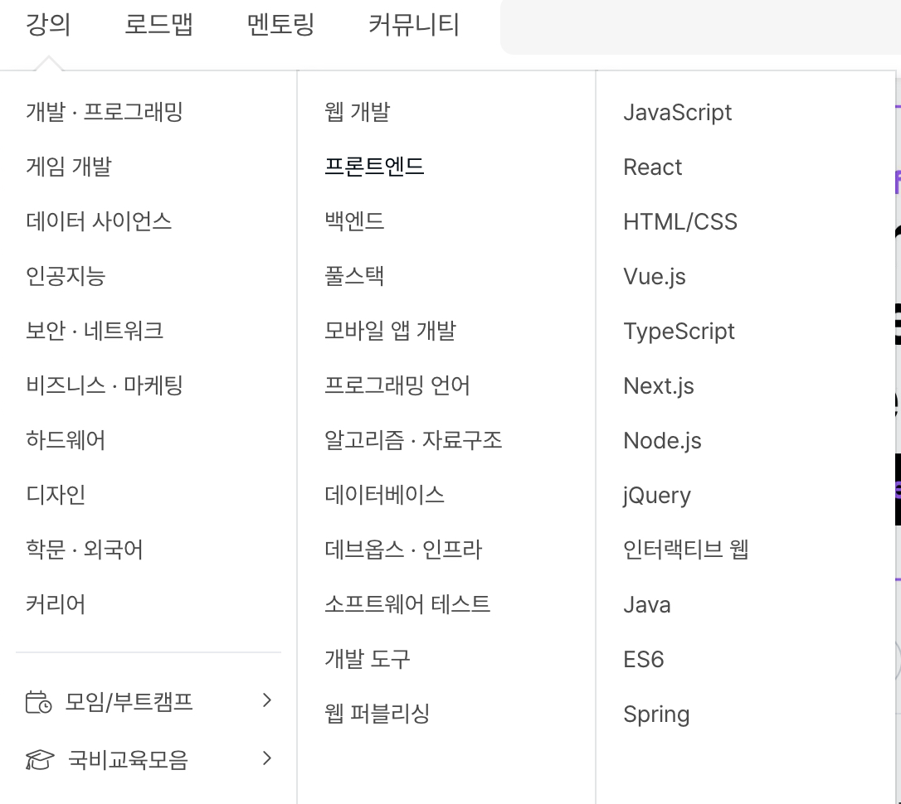
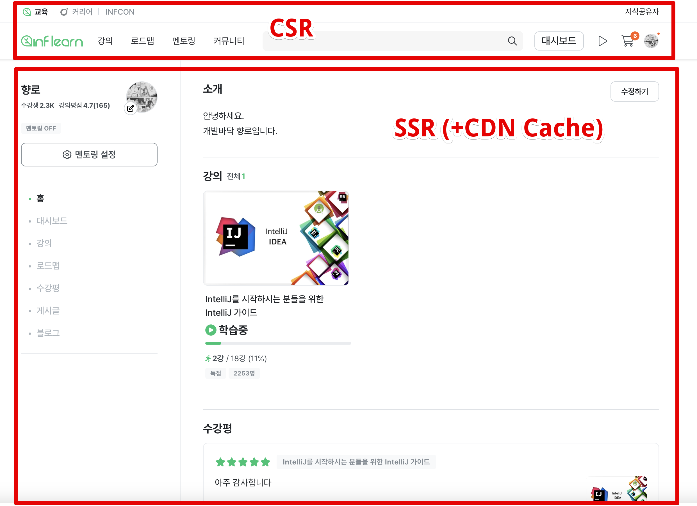
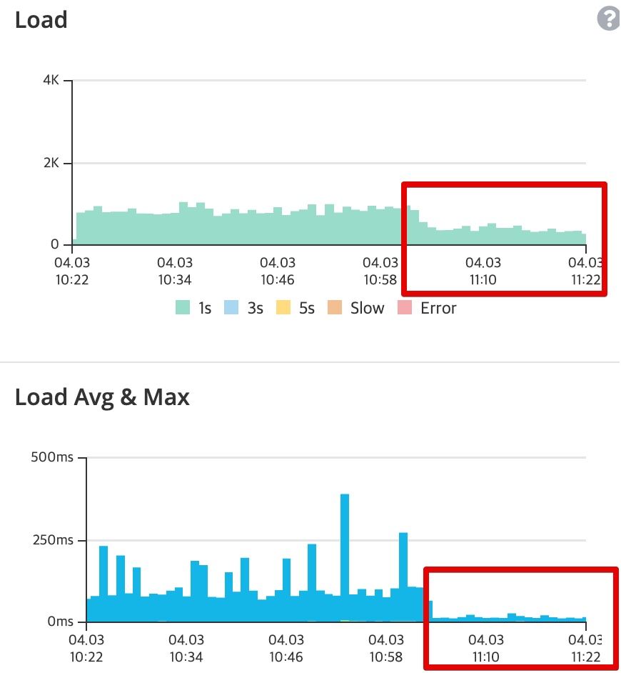

# Public API의 CDN 캐시

API의 캐시 중에는 모든 사용자 (로그인/비로그인 관계없이) 동일한 응답값을 줘야하는 것들이 있다.
로그인/비로그인에 관계없이 항상 일정한 데이터가 사용자 UI에 필요한 경우이다.
이를테면 인프런 서비스의 상단 헤더에 노출되는 강의 카테고리 (1 depth, 2depth, 3depth) 같은 경우.  

이 캐시 데이터는 서비스의 모든 페이지에서 호출하고 있다보니 **페이지 조회수 만큼 캐시 API를 호출**하게 된다.  
  
Redis 캐시 -> 로컬 캐시 등으로 캐싱처리를 해도 결국 **서버로 가는 조회 요쳥수가 개선되는 것은 아니고**, 서비스 전체에서 가장 많이 호출되는 API 영역이 개선된 것이 아니다.  
  
SSR을 CDN으로 캐시 해도,  
SSG로 정적 페이지를 만들어도  
헤더 영역은 사용자별 로그인 구분을 위해 CSR로 구현하여 세션 API 로 동적 구성이 필요하고,
CSR 이다보니 헤더의 카테고리 영역 역시 API를 호출해서 UI를 구성할 수 밖에 없었다.  

**JSON 응답의 크기 역시 꽤나 커서** 이것 때문에 서버 스펙이 생각보다 많이 잡히고 있었다.  
  
AWS 비용 절감을 진행하면서 EC2 의 스펙을 줄일 수 있는 가장 쉬운 방법 중 하나가 이 **캐시 API 요청수를 줄이는 것** 이였다.  
  
그래서 이 영역에 대해 개선을 진행했다.
처음에는 이 카테고리에 쓰이는 **JSON 데이터를 S3에 올려서 그걸 CDN 에서 캐시해서 내려줄까** 생각을 했었다.
그러다 **캐시 API의 JSON 응답을 CDN에서 캐시** 하는 방법을 선택했다.

> JSON도 응답 타입일 뿐이니깐, HTML 캐시 하듯이 CDN 캐시가 가능하다
CDN 캐시가 꼭 HTML, JS 파일에만 적용되어야한다고 생각할 필요가 없다.

- 카테고리 JSON 파일의 변경을 어드민에서 해야하는데, 어드민에서 JSON 파일 변경이라는 새 기능을 구현해야 했고
  - 기존 캐시 API의 응답을 CDN 캐시만 하면 별도의 코드 작업이 필요하지 않을 정도로 간단하게 구축 가능하다 
- 파일 변경은 여러 사람이 변경을 하려고 할 경우 동기화 문제가 발생할 여지가 높다
  - 기존 API는 DB 를 사용하기 때문에 이러한 문제에 대해 훨씬 더 자유롭다

물론 기존 API의 응답을 CDN 캐시하려면 몇가지 주의해야할 점들이 있다. 

- CDN 캐시에서는 헤더 쿠키에 대해 no-cache 설정을 해두어서 혹시나 캐시 JSON을 받아오면서 다른 사람의 세션 쿠키를 캐시해서 전달되는 문제가 발생하지 않도록 해야하며
- 해당 API의 Cache 계층이 어디까지 적용되는지 명확히 하기 위해 URL의 Prefix 규칙을 제대로 정리가 필요했다.

이렇게 개선하여  
Redis 캐시 -> 로컬 캐시 -> CDN 캐시로 점점 캐시 계층을 앞단으로 옮겨갔고, 종국에 해당 **카테고리 영역의 요청은 애플리케이션 서버 계층에서 벗어날 수 있게 되었다**.  
  
인프런은 이번 개선으로 **해당 public API의 요청수와 로드가 절반 이하로 줄었다**.

조회 성능에 대한 해결책으로 자주 언급되는 것이 내부에 캐시를 한다인데,
이게 결국 서버의 요청수를 줄이는 것은 아니고 DB 호출에 대한 요청수를 줄일 뿐이다.

지금의 클라우드 비용이 애플리케이션 서버에서 과도하게 잡히고 있다면 애플리케이션 서버의 수, 혹은 사양을 줄여야 한다.
Redis, 로컬 캐시는 애플리케이션 요청수를 줄이지는 못한다.  
  
그러니 요청이 서버 계층까지 오기 전에 해결할 수 있는 방법을 고려해야하고,(public API 한정) CDN의 응답 캐시가 그럴때 도움이 많이 된다.
