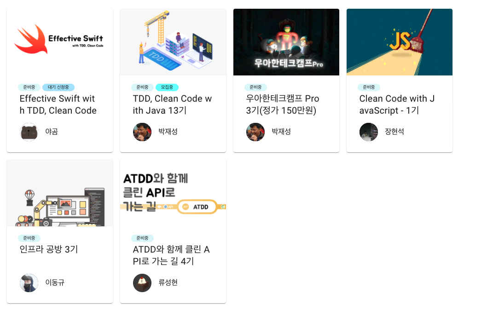

# NodeJS (TypeScript)로 웹 백엔드 개발하면서 느낀 점

## 장점

### 다양한 스펙

유니온 타입, `async`/`await` 

### 강력한 함수형 지원

### CLI 기반의 편리한 개발 환경

JVM 개발자라면 한번쯤 Gradle 멀티 모듈을 구축하기 위해 Gradle 설정을 하느라 고생한경험이 있다.  
NodeJS 개발자라면 NestJS의 CLI를 이용하면 아주 편하게 모노레포 환경을 구성할 수 있다.  

## 단점

### 빈약한 기본 타입들

날짜 (`Date`), 숫자 (`BigInt`), 열거형 (`Enum`) 등  

### 벗어날 수 없는 JSON 스펙

대부분의 라이브러리들이 JSON 기반으로 진행되다보니 **JSON 스펙이 벗어난 것들은 사용할 수가 없다**.  
JS에 `BigInt` 타입이 있지만, JSON에는 `BigInt` 타입은 없다.  
그래서 모든 `BigInt` 타입은 JSON 변환 과정에서 전부 **문자열로 변환** 된다.  

* `auto_increment` 등에서 사용되는 `bigint` 타입
* `count`, `sum` 집계 쿼리의 결과

등이 모두 `string` 으로 받아야만 한다는 것이다.  
  
그리고 이를 연산하기 위해서는 **개별 변환 과정을 무조건 거쳐야만** 한다. 

### 좋은 ORM의 부재

JS와 TS가 이렇게 인기 있는데, 아직까지 

혹자는 이렇게도 얘기한다.  
"**TS/NestJS 쓸거면 차라리 코틀린/스프링을 쓰는게 낫다!  
JS의 장점을 전혀 살리지 못하는 방식을 왜 선택하느냐**"  
라고 말이다.  

### 대용량 데이터 처리를 위한 일괄 처리 (배치) 프레임워크의 부재

* https://medium.com/@willitheowl/how-to-do-big-data-batch-processing-in-nodejs-and-why-you-shouldnt-do-it-2239b430e29c

### 활성화되지 못한 국내 커뮤니티

모 부트캠프에서는 웹 백엔드 과정에서 Node 백엔드 코드 리뷰어를 뽑지 못해, 프론트엔드 리뷰어분들이 백엔드 학생들을 코드리뷰 했다는 웃지못할 사정도 있다.

PlayNode 컨퍼런스가 4년 유지되었으나, 이 역시 2017년 이후로는 더이상 개최되지 못하고 있다.  

Naver의 DeView, Kakao의 ifKakao, 토스의 Slash, 배민의 WoowaCon 등 JVM / Spring 진영에서는 **하루 수백만 ~ 수천만 트랜잭션 트래픽을 처리하는 회사들의 기술이 매년 공유**되고 있다.  
  

### 중급 학습 방법의 부재

위 커뮤니티 문제로 파생된 문제인데, 혼자서 API나 간단한 웹 서비스를 만들 수준이 된 다음에 좋은 디자인 / 아키텍처의 프로젝트를 구성하기 위해 **백엔드 개발자로서의 역량을 쌓을만한 자료가 거의 없다**.  

* 리팩토링2
* 이펙티브 타입스크립트

* 클린 시리즈 (클린 코드 / 클린 아키텍처 / 클린 소프트웨어)
* 테스트 주도 개발
* XUnit Test Pattern
* 레거시코드 활용 전략
* 오브젝트
* 엔터프라이즈 애플리케이션 아키텍처 패턴
* 루비로 배우는 객체지향 디자인

(출처: [NextStep](https://edu.nextstep.camp/))  
(여기서의 Clean Code with JavaScript 역시 프론트엔드 개발자를 대상으로 한다.)

국내의 JS / TS 는 **프론트엔드 개발자분들이 이끌고 있다**.  
단적인 예로, 

팀 내 개개인간의 역량 차이가 극단적으로 벌어지고,  
이를 극복할 방법이 팀 내 교육외에는 전무하다는게 수십 ~ 수백명의 팀으로 확장하는데는 가장 큰 걸림돌이 된다.  
