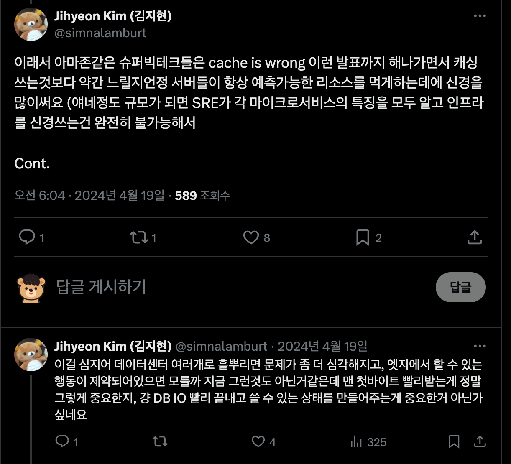
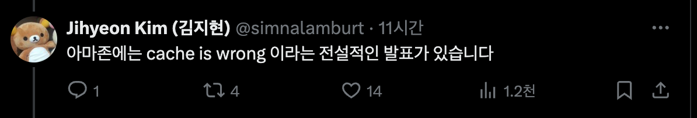
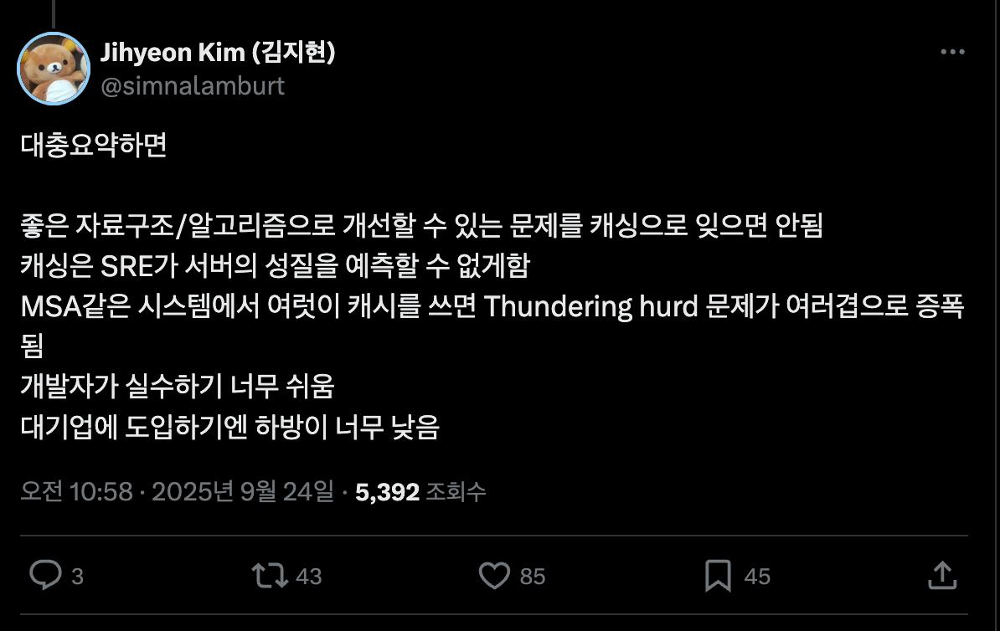

# Cache is Wrong

- 좋은 자료구조/알고리즘으로 개선할 수 있는 문제를 캐싱으로 잊으면 안됨
- 캐싱은 SRE가 서버의 성질을 예측할 수 없게함
- MSA같은 시스템에서 여럿이 캐시를 쓰면 [Thundering hurd 문제](https://en.wikipedia.org/wiki/Thundering_herd_problem) 가 여러겹으로 증폭됨
- 개발자가 실수하기 너무 쉬움
- 대기업에 도입하기엔 하방이 너무 낮음