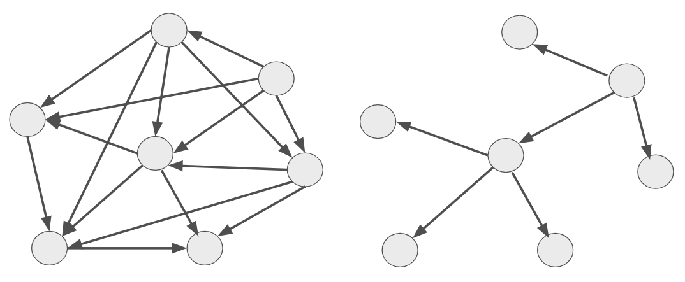

# Public / Private 인터페이스

> 여기서의 인터페이스란 `class`, `interface`, `abstract class` 등에서 이야기하는 `interface` 가 아니다.  
서로 다른 객체간에 어떤 것들을 사용할 수 있을지에 대한 명세를 이야기한다.  
`Method`, `Function` 등이 모두 포함된다.  

(위 2개 그림은 모두 동일한 원 (클래스)를 가지고 있으며, 화살표 (의존)만 다르다.)  
  
똑같은 클래스들을 가지고, 누구는 첫번째처럼 얼기설기 얽혀있는 구조로 모든 객체가 서로 연결된 구조를 만들고,  
누구는 두번째처럼 각 클래스들이 전달 하는 메세지와 관계가 명확하게 드러내도록 만든다.  
  
이렇게 차이 나는 이유는 클래스가 하는 일에만 집중하고, **무엇을 드러내고, 무엇을 숨길지**에 대해 전혀 고려하지 않았기 때문이다.  
  
첫번째는 이를 전혀 고려하지 않아서 **클래스의 모든 Method가 외부에 의해 호출될 수 있게** 되어 그림과 같은 의존관계가 되어버렸다.  
두번째는 반대로 객체간에 **서로 어떤 메세지를 주고 받을지에 대한 합의**가 있다.  
 
즉, **다른 객체가 사용해도 되는 것과 사용할 수 없는 것을 분리**한 것이다.  
  
단일 책임 원칙을 따른다면, **public interface는 해당 책임을 나타내는 일종의 설명서**이다.  
  
public interface와 private interface의 차이를 이야기할때 **안정적** 이란 단어를 꺼냈다.  
이 안정적이라는 것이 어떤 메소드를 public 과 private 중에 어떤것으로 나타낼지 중요한 기준이 된다.  
  
해당 클래스의 핵심 책임을 나타내고, 다른 객체가 호출할 수 있는 public interface는 **안정적**이여야한다.  
반면, 자잘한 내부 구현을 담당하고 다른 객체가 호출하지 않는 private interface는 **쉽게 변경될 수 있다**.  
(쉽게 변경되어야한다가 아니라, “될 수 있다”이다.)  
   
즉, Method의 public / private 를 결정한다는 것은 이 클래스를 사용하는 객체에게 A ~ Z까지 메소드 중 어느 Method를 쓰는게 다른 Method들에 비해 안정적인지 미리 알려주는 것이다.  
  
그래서 테스트를 작성할때도 세부구현을 담당하는 private interface (private Method)를 테스트할게 아니라, **쉽게 변경되지 않고 다른 객체가 안정적으로 의존할 수 있는** public interface (public Method) 를 대상으로 삼아야하는 이유이기도 하다.  

  
