# Gmail의 다중 수신함 활용하기

나는 주로 [Angellist](https://klinger.io/posts/angellist-is-the-nasdaq-of-our-generation), [스타트업](https://klinger.io/posts/startup-mentoring-sessions-how-to-be-a-decent-maybe-even-good-startup-mentor), [창업자](https://klinger.io/posts/the-founders-lie-about-comfort-zones), [미래](https://klinger.io/posts/why-the-future-needs-a-brandname), 그리고 특히 [지표(Metrics)](https://klinger.io/posts/a-primer-on-startup-metrics-which-analytics-tool-to-pick)에 대해 글을 써왔다.  
그런데 이 “라이프핵”을 너무 많은 사람에게 설명해주다 보니, 블로그 글로 따로 정리해두는 게 좋을 것 같았다. 도움이 되길 바란다.

**만약 Gmail에서 이메일을 정리하는 게 어렵다면, 내가 사용하는 방법을 한번 써보는 걸 추천한다.**  
나는 쉽게 산만해지는 편인데, 이 세팅을 사용하면 거의 메일을 놓치는 일이 없다.

---

## **2010년부터 이렇게 Gmail을 써왔다**

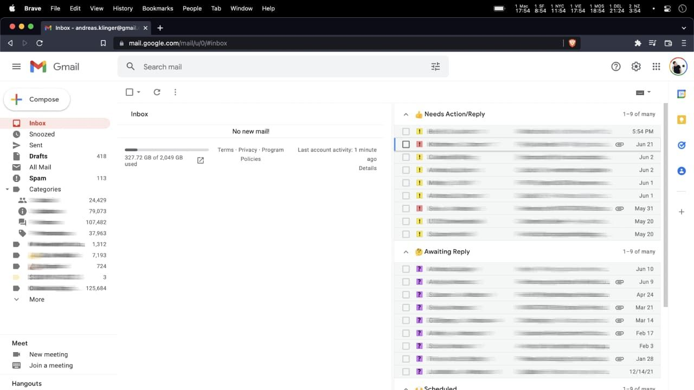

- **GTD (Getting Things Done)** 방식  
- 왼쪽엔 항상 **비워진(혹은 거의 비워진) 인박스**  
- Box 1 - 해야 할 일 (Todos)  
- Box 2 - 답변 대기 중 (Awaiting Reply)  
- Box 3 - 위임한 이메일 (Delegated)  
- Box 4 - 일정, 비행기, 미팅 관련 이메일 (Events)  
- **모두 Gmail의 기본 기능만 사용 — 확장 플러그인 없음**

이렇게 하면 메일을 놓치기가 정말 어렵다.  
다른 방식으론 이제 도저히 못 쓸 것 같다.  

솔직히 Gmail의 “탭” 기반 인박스(프로모션, 소셜 등)를 보면 좀 무섭다.  
언젠가 구글이 나를 강제로 그 방식으로 옮기지 않기를 바랄 뿐이다.  

참고로 이 방법은 내가 처음 고안한 게 아니다.  
2010년 LeWeb 행사에서 어떤 사람(이름은 기억 안 남)에게 배웠고,  
당시 “Gmail Ninja”라는 블로그 글에서도 소개되었다 (지금은 링크를 못 찾겠다).

---

## **내가 매일 이메일을 처리하는 방식**

- 새 이메일이 들어온다.  
- 바로 처리할 수 있으면 즉시 처리한다.  
- 바로 못 하면 “Todo(Box 1)”로 표시한다.  
- 답장을 보낸 경우, “Awaiting Reply”나 “Delegated”로 표시해둔다.  
- 모든 메일은 아카이브한다.  
- 이제 인박스(왼쪽)는 비워진다.  
- 중요한 이메일들은 오른쪽 박스들에 정리되어 있다.

### 예시

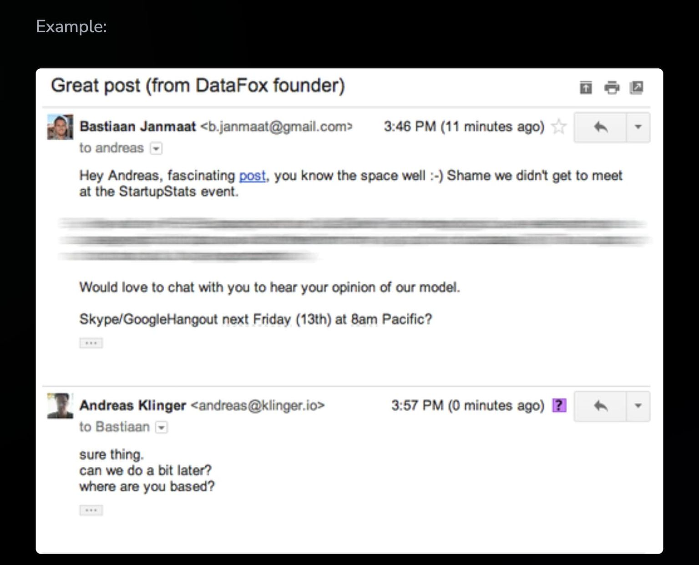

- 이메일을 받음  
- 바로 답장할 수 있어 답장함 (못했으면 “노란 느낌표 = Todo”로 표시했을 것)  
- 답장 보냄  
- “Awaiting Reply(질문표)”로 표시  
- 아카이브함  
- 이제 인박스엔 보이지 않지만, 오른쪽 “Awaiting Reply” 목록에서 확인 가능  
- 상대방의 답장이 오면 인박스로 다시 들어오고, 같은 사이클 반복  
- 답장 후 아카이브 → **Inbox Zero**

**끝! 이게 전부다.**

---

## **15분이면 세팅 끝, 하지만 일하는 방식이 완전히 바뀔 수도 있다 😉**

요약하면 이렇다:

1. **Multiple Inboxes 설정**
2. **특수별(Star) 선택**
3. **별을 Inbox 섹션과 연결**
4. **인박스 레이아웃 활성화**
5. **Inbox Zero 달성**

---

### **1. Multiple Inboxes 설정**

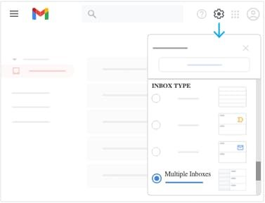
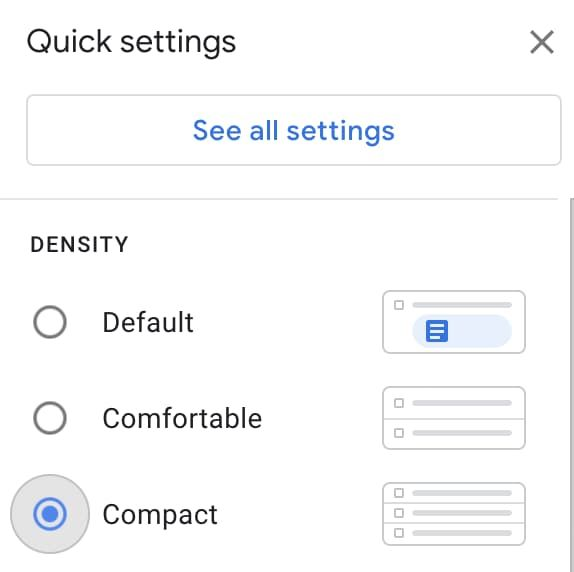

1. Gmail 설정으로 이동  
2. “Multiple Inboxes” 선택  
3. 레이아웃은 “Compact(압축)”으로 변경

---

### **2. Special Stars(특수별) 선택**

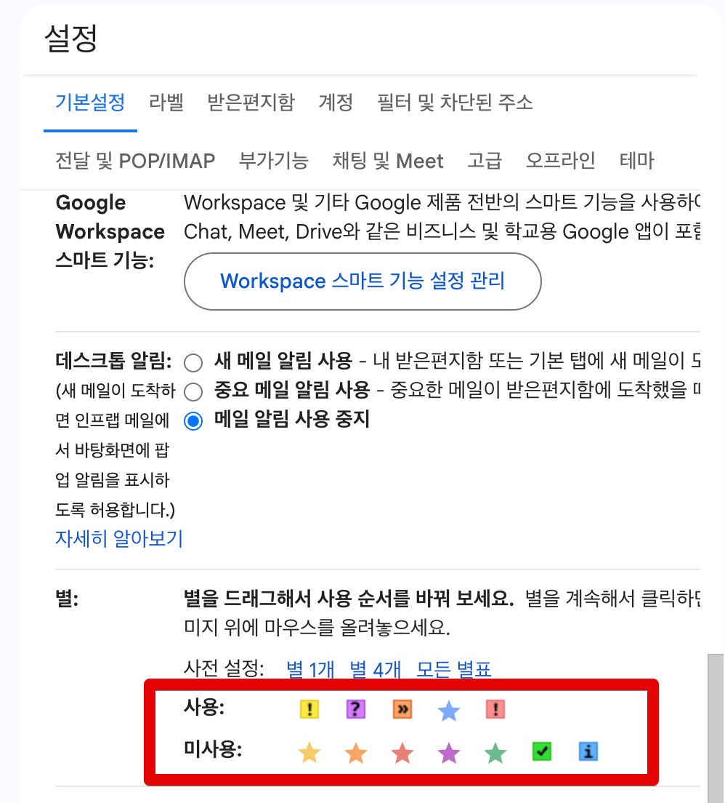

1. 설정 → 일반 탭으로 이동  
2. “별표” 항목으로 스크롤  
3. 사용할 별들을 추가  

내가 쓰는 조합은 다음과 같다:

- **노란 느낌표(⚠️)** – 해야 할 일 (Todo)  
- **빨간 느낌표(❗)** – 중요한 Todo  
- **물음표(❓)** – 답변을 기다리는 메일  
- **주황색 화살표(⇔)** – 누군가에게 위임했지만 결과를 기다리는 메일  
- **보라색 별(★)** – 일정, 항공권, 회의 등 빠르게 찾아야 하는 이벤트 관련 메일  

---

### **3. 별을 Inbox와 연결하기 (필터 추가)**

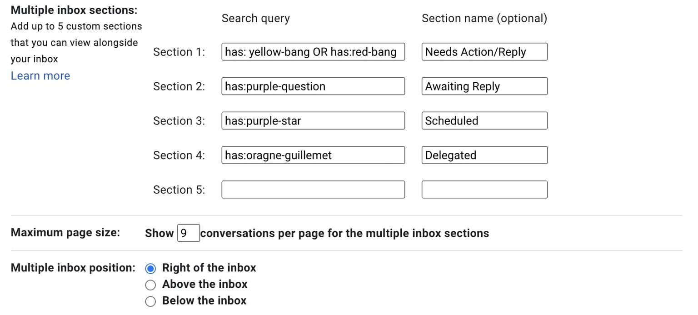

1. 설정 → Multiple Inboxes  
2. 각 Inbox에 사용할 필터 규칙 추가  
3. 아래쪽의 옵션에서 **‘오른쪽에 표시(Right of Inbox)’** 선택  

별 이름(필터명) 치트시트:

- `has:red-star`  
- `has:orange-star`  
- `has:green-star`  
- `has:blue-star`  
- `has:purple-star`  
- `has:red-bang`  
- `has:orange-guillemet`  
- `has:yellow-bang`  
- `has:green-check`  
- `has:blue-info`  
- `has:purple-question`

복잡한 필터도 가능하다. 예를 들어 “중요한 Todo”와 “매우 중요한 Todo”를 함께 보고 싶다면 `OR`를 써서 조합할 수 있다.  

> 📱 참고: 모바일 Gmail 앱은 기본 노란 별(`⭐`)만 지원하므로, 모바일에서도 Todo를 표시하려면 노란 별을 사용하는 걸 추천한다.

---

### **4. 인박스 레이아웃 활성화 (탭 제거)**

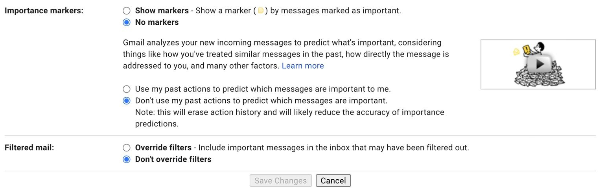

이 단계는 좀 귀찮지만 꼭 해야 한다.  
새 레이아웃이 적용되지 않았다면 이 부분을 놓친 걸 가능성이 높다.

설정 → 인박스 탭에서:

- 인박스 유형을 “기본(Default)”으로 변경  
- 모든 탭(프로모션, 소셜 등) 비활성화  
- 중요도 표시, 자동 분류 등도 전부 끔  
- **저장 후 새로고침**

---

### **5. 처음으로 Inbox Zero 만들기**

처음엔 아마 수천 개의 메일이 있을 것이다.  
나도 처음엔 그랬다.  
하지만 걱정 마라, 의외로 간단하다.

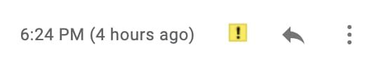

1. 첫 2~3페이지의 메일을 훑는다.  
2. 해야 할 건 “Todo(노란 느낌표)”로 표시  
3. 답변 대기 중이면 “Awaiting Reply(물음표)”로 표시  
4. 위임한 메일, 일정 관련 메일도 각각 표시  

그다음, 중요하지 않은 것 같다면 과감히...

1. 상단의 체크박스로 **모두 선택**  
2. 전체 메일 수(예: 6523개) 확인  
3. **Archive 클릭**

이제 인박스는 완전히 비어 있고,  
오른쪽 박스들에 필요한 메일만 깔끔히 정리되어 있을 것이다. ✅

---

## **보너스: 추가 Gmail 생산성 팁**

### **자동 필터링**

뉴스레터나 알림 메일이 너무 많다면 이렇게 해보자:

- 필요 없는 건 과감히 **구독 해지**
- 나중에 검색해서만 볼 메일은 **자동 라벨링 후 숨김 처리**
- 자동 처리 가능한 건 필터로 라벨 지정 후 **자동 전달**

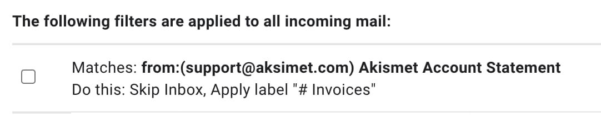

나도 100개 이상의 필터를 쓰고 있고,  
진짜 필요한 메일만 눈앞에 보인다.

---

### **키보드 단축키**

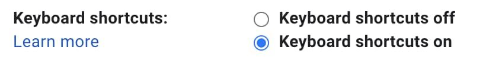

- 설정에서 **단축키 활성화**
- [공식 단축키 가이드](https://support.google.com/mail/answer/6594?hl=en&ctx=mail) 참고
- 자주 쓰는 단축키  
  - **y**: 아카이브  
  - **r**: 답장  
  - **a**: 전체 답장  
  - **s**: 별표 표시  

---

### **Auto-Advance**

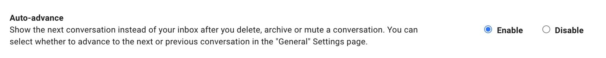

- 설정 → 고급 → **Auto-advance** 기능 켜기  
- 아침에 새 메일들을 훨씬 빠르게 처리 가능  

---

### **모든 계정 하나로 통합하기**

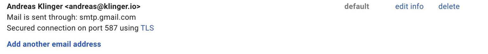

- 여러 계정 로그인은 불편하다.  
- 다른 이메일들을 모두 주 계정으로 불러오기  
- “on behalf of” 문구 없이 보내려면 **SMTP** 설정 사용  

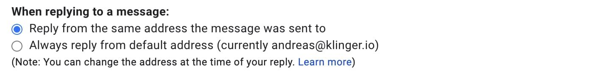

- 받은 이메일 주소로 자동 답장 설정  
- 개인/업무 메일을 하나의 인박스에서 관리 가능  

---

### **라벨 vs 별표**

라벨(Label)을 쓰면 모바일 앱에서도 접근이 가능하다.  
다만 나는 빠르게 클릭할 수 있는 **별표(Star)** 방식이 더 효율적이라고 느낀다.  
모바일 접근성이 중요하다면 라벨 방식을 고려해도 좋다.

- https://klinger.io/posts/how-to-use-gmail-more-efficiently