# Gmail 여러 받은편지함(다중 수신함)으로 메일을 업무 보드처럼 쓰기

메일함이 지저분해지는 이유는 메일이 많아서만은 아니다.
메일 하나하나의 상태가 다르기 때문이다.

어떤 메일은 내가 답장을 해야 한다.
어떤 메일은 이미 답장을 보냈고 상대의 답을 기다리는 중이다.
어떤 메일은 팀원에게 넘겼지만 끝났는지 확인해야 한다.
어떤 메일은 일정, 항공권, 회의 링크처럼 당장은 할 일은 아니지만 빠르게 다시 찾아야 한다.

이런 메일들이 모두 같은 받은편지함에 섞여 있으면 메일함을 열 때마다 다시 판단해야 한다.
"이건 내가 해야 하나?", "답장 보냈던가?", "이 사람에게 다시 물어봐야 하나?" 같은 판단을 매번 반복하게 된다.

Gmail의 `받은편지함 여러 개 사용하기` 기능은 이 문제를 꽤 단순하게 풀 수 있다.
별도 앱이나 확장 프로그램을 쓰지 않고도 받은편지함 오른쪽에 작은 업무 보드 같은 영역을 만들 수 있다.

이 글에서는 이 기능을 편의상 "다중 수신함"이라고 부른다.

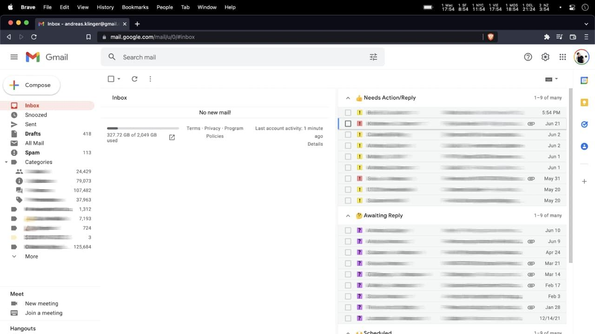

이 글에서 만들고 싶은 상태는 "메일이 0개인 깨끗한 화면"이 아니다.
진짜 목표는 다음과 같다.

- 받은편지함에는 아직 판단하지 않은 메일만 남긴다.
- 내가 해야 할 메일은 Todo에 모은다.
- 내가 답장을 보냈고 상대를 기다리는 메일은 Awaiting Reply에 모은다.
- 다른 사람에게 넘긴 메일은 Delegated에 모은다.
- 일정, 항공권, 회의 링크처럼 다시 찾아야 하는 메일은 Events에 모은다.
- 처리가 끝난 메일은 아카이브해서 화면에서 치운다.

핵심은 "아카이브"를 삭제처럼 쓰지 않는 것이다.
Gmail에서 아카이브는 메일을 없애는 기능이 아니라 받은편지함에서만 치우는 기능이다.
검색하면 그대로 찾을 수 있고, 같은 스레드에 새 답장이 오면 다시 받은편지함으로 올라온다.

그래서 이 방식에서는 받은편지함을 "메일 저장소"가 아니라 "아직 처리하지 않은 메일함"으로 본다.
메일을 보고 다음 상태를 정했다면 별표를 붙이고 아카이브한다.
그러면 메일은 받은편지함에서는 사라지지만, 오른쪽 다중 수신함 영역에는 계속 남아 있다.

## 전체 흐름

메일 하나를 처리하는 흐름은 이렇다.

1. 새 메일이 받은편지함에 들어온다.
2. 바로 처리할 수 있으면 답장하거나 처리한다.
3. 나중에 해야 하면 Todo 별표를 붙인다.
4. 내가 답장을 보냈고 상대의 답이 필요하면 Awaiting Reply 별표를 붙인다.
5. 다른 사람에게 맡겼다면 Delegated 별표를 붙인다.
6. 일정이나 예약 정보처럼 다시 찾아야 하면 Events 별표를 붙인다.
7. 판단이 끝난 메일은 아카이브한다.

예를 들어 메일을 받자마자 답장을 보냈지만 상대의 회신이 필요한 상황이라면, 답장을 보낸 뒤 Awaiting Reply 별표를 붙이고 아카이브한다.

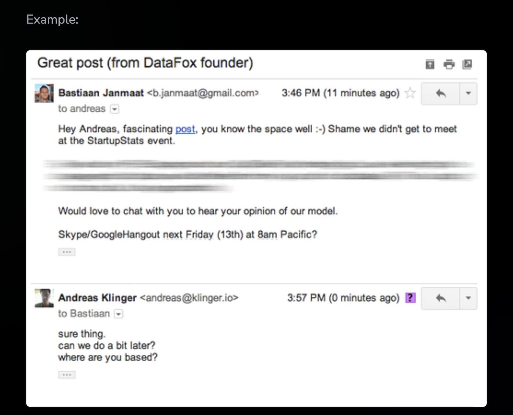

이제 그 메일은 받은편지함에서는 사라진다.
대신 오른쪽 Awaiting Reply 영역에 남아 있다.
상대가 답장하면 같은 스레드가 다시 받은편지함으로 올라오고, 그때 다시 처리하면 된다.
일이 끝났다면 별표를 제거하고 아카이브하면 된다.

이 작은 규칙이 생각보다 중요하다.
받은편지함을 열 때마다 "내가 뭘 해야 하지?"를 다시 생각하지 않아도 된다.
이미 각 메일의 상태가 보드에 올라가 있기 때문이다.

## 1. 받은편지함 유형을 다중 수신함으로 바꾸기

이 설정은 데스크톱 Gmail에서 해야 한다.
모바일 앱에서는 다중 수신함 레이아웃을 설정할 수 없다.

Gmail 우측 상단의 설정 버튼을 누르고 받은편지함 유형에서 `받은편지함 여러 개 사용하기`를 선택한다.
빠른 설정에 보이지 않으면 `모든 설정 보기`로 들어간 뒤 `받은편지함` 탭에서 변경하면 된다.

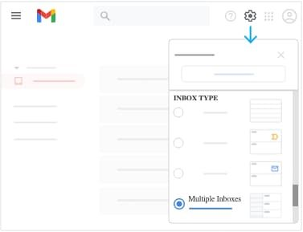

다중 수신함은 화면 밀도에 영향을 많이 받는다.
메일을 많이 훑어봐야 한다면 화면 밀도는 `기본값`보다 `편안하게`나 `좁게` 쪽이 낫다.
오른쪽 보드까지 한 화면에 같이 봐야 하기 때문이다.

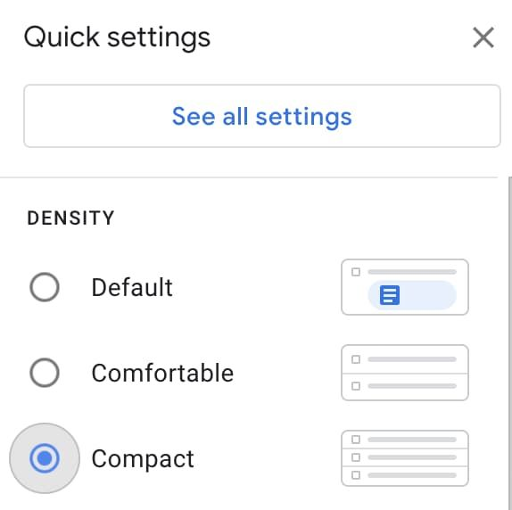

## 2. 별표를 상태값으로 정하기

Gmail의 별표는 단순히 "중요한 메일" 표시로만 쓸 필요가 없다.
여러 종류의 별표를 켜두면 각각을 메일의 상태값처럼 사용할 수 있다.

설정의 `기본설정` 탭에서 `별표` 영역을 찾는다.
사용할 별표를 `사용 안함`에서 `사용 중`으로 끌어오면 된다.

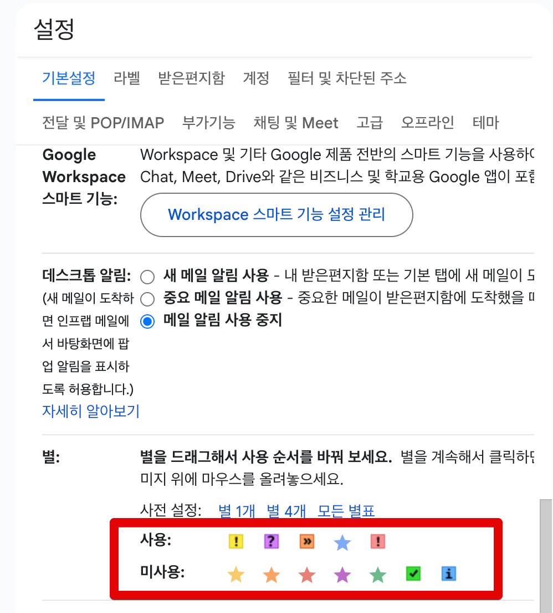

내가 추천하는 최소 구성은 다음과 같다.

| 영역 | 별표 | 검색 조건 | 의미 |
| --- | --- | --- | --- |
| Todo | 노란 느낌표 | `has:yellow-bang` | 내가 처리해야 하는 메일 |
| Important Todo | 빨간 느낌표 | `has:red-bang` | 오늘 처리하거나 놓치면 안 되는 메일 |
| Awaiting Reply | 보라색 물음표 | `has:purple-question` | 내가 답장을 보냈고 상대의 답을 기다리는 메일 |
| Delegated | 주황색 화살표 | `has:orange-guillemet` | 다른 사람에게 넘겼지만 결과 확인이 필요한 메일 |
| Events | 보라색 별 | `has:purple-star` | 일정, 항공권, 회의 링크, 예약 정보 |

모바일에서 메일을 자주 분류한다면 Todo만큼은 기본 노란 별표인 `has:yellow-star`를 써도 된다.
모바일 Gmail 앱에서는 데스크톱처럼 여러 종류의 별표를 고르기 어렵기 때문이다.
반대로 메일 처리를 거의 데스크톱에서 한다면 위처럼 느낌표, 물음표, 화살표를 나눠두는 편이 더 선명하다.

별표를 너무 많이 쓰는 것은 추천하지 않는다.
처음에는 Todo, Awaiting Reply, Delegated 정도만 있어도 충분하다.
상태가 많아질수록 메일을 분류하는 데 다시 시간이 든다.

## 3. 다중 수신함 섹션 만들기

이제 별표를 오른쪽 수신함 섹션과 연결한다.

설정에서 `여러 받은편지함` 맞춤설정을 열고 각 섹션에 검색 조건과 이름을 넣는다.

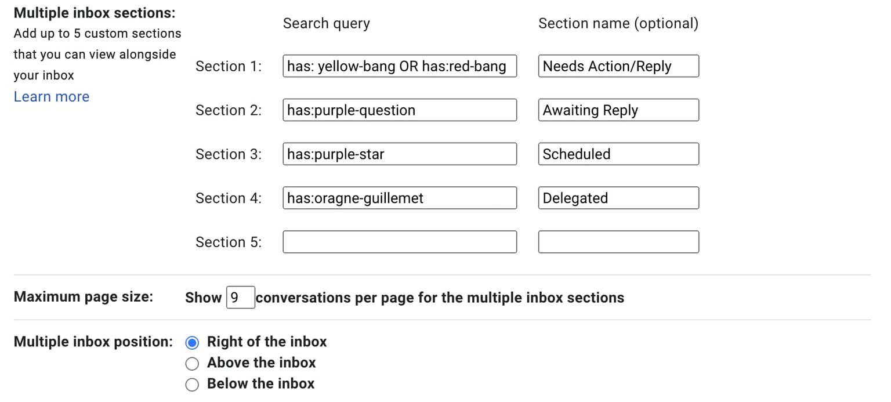

예시는 다음과 같다.

| 섹션 이름 | 검색 조건 |
| --- | --- |
| Todo | `has:yellow-bang OR has:red-bang` |
| Awaiting Reply | `has:purple-question` |
| Delegated | `has:orange-guillemet` |
| Events | `has:purple-star` |

`OR`는 반드시 대문자로 쓰는 편이 좋다.
Todo처럼 중요한 항목과 일반 항목을 한 번에 보고 싶을 때 유용하다.

섹션별 최대 메일 수는 처음에는 10개 정도가 적당하다.
20개, 30개씩 보이게 하면 오른쪽 영역도 다시 부담스러워진다.
목표는 모든 메일을 한 화면에 많이 보는 것이 아니라, 지금 신경 써야 하는 상태를 놓치지 않는 것이다.

`다중 수신함 위치`는 `받은편지함 오른쪽`을 추천한다.
받은편지함을 왼쪽에 두고, 상태별 보드를 오른쪽에 두면 "새로 들어온 메일"과 "이미 분류된 일"이 한눈에 분리된다.

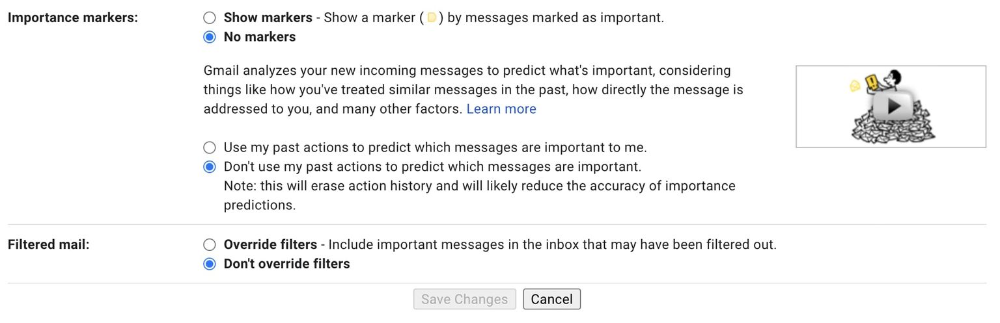

설정 저장 후 화면을 새로고침했는데도 기존 프로모션, 소셜 같은 탭 화면이 계속 보인다면 받은편지함 유형이 아직 `기본`으로 남아 있을 가능성이 크다.
받은편지함 유형이 `받은편지함 여러 개 사용하기`인지 다시 확인한다.

## 4. 처음 한 번 받은편지함 비우기

이미 받은편지함에 수천 개의 메일이 쌓여 있다면 처음부터 완벽히 정리하려고 하면 안 된다.
그렇게 시작하면 설정보다 정리에 지쳐서 그만두게 된다.

처음에는 최근 메일 1~2페이지 정도만 훑는다.

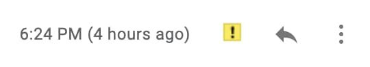

그중 실제로 해야 할 일이 있으면 Todo를 붙인다.
내가 이미 답장을 보냈는데 아직 기다리는 중이면 Awaiting Reply를 붙인다.
누군가에게 넘긴 일이라면 Delegated를 붙인다.
일정이나 예약 정보라면 Events를 붙인다.

그 다음에는 오래된 받은편지함 메일을 과감히 아카이브한다.
불안하다면 전체를 한 번에 치우지 말고 `older_than:30d`처럼 30일보다 오래된 메일부터 아카이브해도 된다.

이때 중요한 것은 "정리하지 않은 과거 메일을 보관함으로 보내는 것"이지 "삭제하는 것"이 아니다.
나중에 필요하면 검색해서 찾을 수 있다.
그리고 진짜 해야 할 일은 이미 별표를 붙여 오른쪽 보드에 남겨두었다.

## 매일 쓰는 규칙

설정보다 중요한 것은 운영 규칙이다.
규칙이 복잡하면 며칠 지나지 않아 원래대로 돌아간다.

내가 추천하는 규칙은 이것뿐이다.

- 받은편지함에 있는 메일은 위에서부터 판단한다.
- 2분 안에 끝낼 수 있으면 바로 끝내고 아카이브한다.
- 내가 해야 하는데 지금 못 하면 Todo를 붙이고 아카이브한다.
- 답장을 보낸 뒤 상대 응답이 필요하면 Awaiting Reply를 붙이고 아카이브한다.
- 다른 사람에게 넘겼다면 Delegated를 붙이고 아카이브한다.
- 일정, 항공권, 회의 링크는 Events를 붙이고 아카이브한다.
- 일이 끝난 메일은 별표를 제거하고 아카이브한다.

여기서 제일 어색한 부분은 "별표를 붙인 뒤에도 아카이브한다"는 점이다.
하지만 이 방식의 장점은 바로 거기에 있다.
받은편지함은 비워지고, 해야 할 일은 오른쪽에 남는다.

반대로 별표를 붙인 메일을 받은편지함에 계속 남겨두면 효과가 줄어든다.
받은편지함이 다시 Todo, 대기, 위임, 일정, 뉴스레터가 섞인 공간이 되기 때문이다.

## 오래 방치된 메일 찾기

다중 수신함을 쓰다 보면 다음으로 필요한 것은 "오래된 상태"를 찾는 일이다.
특히 Awaiting Reply와 Delegated는 주기적으로 확인하지 않으면 그냥 잊힌다.

Gmail 검색창에서 이런 식으로 찾을 수 있다.

```text
has:yellow-bang older_than:7d
has:purple-question older_than:5d
has:orange-guillemet older_than:14d
has:purple-star newer_than:30d
```

첫 번째는 일주일 넘게 방치된 Todo를 찾는다.
두 번째는 5일 넘게 답장을 기다리는 메일을 찾는다.
세 번째는 2주 넘게 결과 확인이 안 된 위임 메일을 찾는다.
마지막은 최근 30일 안의 일정 관련 메일을 찾는다.

이 검색어들은 북마크해두거나 Gmail 검색창에 가끔 입력해보면 좋다.
다중 수신함은 현재 상태를 보여주는 데 좋고, 검색은 오래된 상태를 털어내는 데 좋다.

## 자동 필터는 조심해서 쓰기

뉴스레터, 서비스 알림, 결제 내역 같은 메일은 필터로 자동 정리하면 좋다.

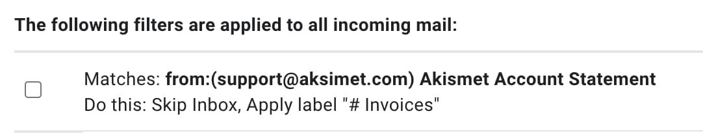

예를 들어 이런 식이다.

- 뉴스레터는 자동 라벨을 붙이고 받은편지함을 건너뛴다.
- 결제 영수증은 `영수증` 라벨을 붙이고 아카이브한다.
- 모니터링 알림 중 참고용 메일은 라벨만 붙이고 받은편지함에서 숨긴다.
- 더 이상 읽지 않는 뉴스레터는 필터보다 먼저 구독 해지한다.

다만 Todo 별표를 자동으로 붙이는 필터는 신중해야 한다.
기계가 너무 많은 메일을 Todo로 올리기 시작하면 Todo 영역을 믿지 않게 된다.
Todo는 가능하면 사람이 직접 판단해서 붙이는 편이 낫다.

자동화의 기준은 단순하다.
"생각 없이 치워도 되는 메일"은 필터로 보내고, "내 판단이 필요한 메일"은 받은편지함에 남긴다.

## 키보드 단축키까지 켜면 훨씬 빨라진다

이 방식은 키보드 단축키와 같이 쓸 때 훨씬 편하다.

설정에서 `키보드 단축키 사용`을 켠다.
Gmail 화면에서 `?`를 누르면 현재 사용할 수 있는 단축키 목록을 볼 수 있다.

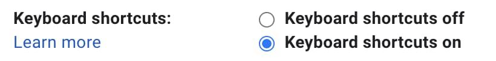

자주 쓰는 단축키는 이 정도면 충분하다.

| 단축키 | 동작 |
| --- | --- |
| `e` | 아카이브 |
| `r` | 답장 |
| `a` | 전체 답장 |
| `s` | 별표 표시 또는 별표 종류 순환 |
| `j` / `k` | 다음/이전 메일로 이동 |
| `o` 또는 `Enter` | 메일 열기 |
| `u` | 목록으로 돌아가기 |
| `[` / `]` | 아카이브 후 이전/다음 메일 열기 |
| `?` | 단축키 도움말 |

마우스로 메일을 열고, 별표를 누르고, 아카이브 버튼을 누르는 것도 괜찮다.
하지만 하루에 처리하는 메일이 많다면 `s`, `e`, `r`, `a` 정도만 익혀도 체감이 크다.

## Auto-advance는 선택 사항

메일을 하나 처리할 때마다 목록으로 돌아오는 흐름이 불편하다면 Auto-advance를 켜면 된다.
이 기능은 메일을 아카이브하거나 삭제한 뒤 자동으로 다음 메일을 열어준다.

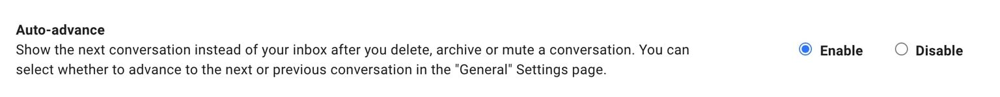

설정의 `고급` 탭에서 Auto-advance를 활성화한 뒤, `기본설정` 탭에서 다음 메일로 갈지 이전 메일로 갈지 고를 수 있다.
단축키를 쓴다면 `[`와 `]`로도 비슷한 흐름을 만들 수 있다.

개인적으로는 처음부터 켜기보다, 다중 수신함 방식에 익숙해진 뒤 켜는 것을 추천한다.
처음에는 메일마다 상태를 판단하는 습관을 만드는 게 더 중요하다.

## 여러 계정을 하나로 모을 때

개인 메일, 회사 메일, 외부 활동용 메일을 따로 열어보면 결국 어느 한쪽을 놓치게 된다.
가능하다면 주로 보는 Gmail 계정 하나로 메일을 모으는 편이 낫다.

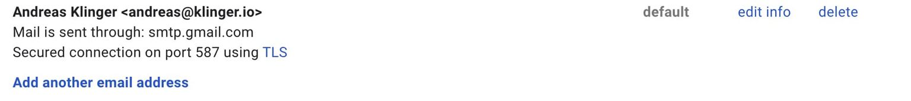

다른 주소의 메일을 가져오고, 답장은 원래 받은 주소로 보내도록 설정할 수 있다.
`on behalf of` 같은 문구 없이 보내고 싶다면 SMTP 설정까지 해두면 된다.

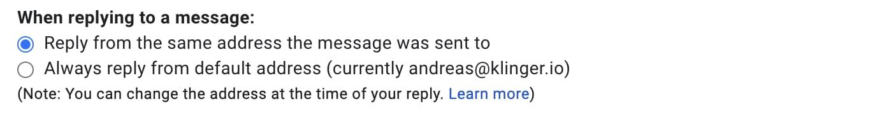

다만 회사 보안 정책이나 Google Workspace 설정에 따라 외부 계정 연동이 제한될 수 있다.
이 경우 억지로 합치기보다 계정별로 같은 다중 수신함 규칙을 적용하는 편이 안전하다.

## 라벨과 별표를 어떻게 나눌까

Gmail에는 라벨도 있고 별표도 있다.
둘 다 메일을 분류하는 데 쓸 수 있지만, 역할을 나눠두면 덜 헷갈린다.

나는 이렇게 나누는 편이 좋다.

- 별표는 상태다.
- 라벨은 주제다.

Todo, Awaiting Reply, Delegated처럼 지금 어떤 상태인지 나타내는 것은 별표가 어울린다.
고객사, 결제, 채용, 장애, 영수증처럼 나중에 검색하거나 묶어볼 주제는 라벨이 어울린다.

라벨은 장기 보관과 검색에 좋고, 별표는 빠른 클릭과 현재 상태 확인에 좋다.
특히 다중 수신함에서는 별표 검색 조건을 섹션으로 바로 보여줄 수 있어서 상태 관리에 잘 맞는다.

## 이 방식이 잘 안 맞는 경우

모든 생산성 방식이 그렇듯 이 방법도 만능은 아니다.

하루 대부분을 모바일 Gmail 앱에서만 처리한다면 불편할 수 있다.
모바일에서는 다중 수신함 레이아웃이 보이지 않고, 여러 종류의 별표를 빠르게 바꾸기도 어렵다.
이 경우에는 기본 별표 하나와 라벨을 조합하는 편이 낫다.

이미 TickTick, Todoist, Linear, Jira 같은 태스크 관리 도구로 모든 일을 관리하고 있다면 Gmail 안에 또 하나의 Todo 보드를 만들 필요가 없을 수도 있다.
그럴 때는 Gmail의 별표를 "태스크로 보내기 전 임시 표시" 정도로만 쓰는 편이 낫다.

반대로 메일 자체가 업무의 상당 부분이라면 이 방식이 꽤 잘 맞는다.
메일을 별도 도구로 옮기지 않아도 되고, 원문 맥락이 그대로 남아 있으며, 답장이 오면 같은 스레드가 다시 받은편지함으로 올라오기 때문이다.

## 마무리

메일 정리의 핵심은 깨끗한 화면을 만드는 것이 아니다.
다시 판단하지 않아도 되는 상태를 만드는 것이다.

받은편지함에 남아 있는 메일은 "아직 판단하지 않은 것"이어야 한다.
Todo에는 내가 할 일이 있어야 한다.
Awaiting Reply에는 기다리는 일이 있어야 한다.
Delegated에는 확인할 일이 있어야 한다.
Events에는 다시 찾아야 할 정보가 있어야 한다.

이렇게만 나눠도 Gmail을 열 때의 부담이 꽤 줄어든다.
메일함 전체를 뒤지는 대신, 지금 봐야 할 상태만 보면 된다.

처음부터 완벽하게 정리할 필요는 없다.
별표 3개와 다중 수신함 3개만 만들어도 충분하다.
며칠 써보고 정말 필요한 상태만 하나씩 추가하면 된다.

참고:

- [Gmail 여러 받은편지함 공식 도움말](https://support.google.com/mail/answer/9694882)
- [Gmail 별표 공식 도움말](https://support.google.com/mail/answer/5904)
- [Gmail 키보드 단축키 공식 도움말](https://support.google.com/mail/answer/6594)
- [원 아이디어 글](https://klinger.io/posts/how-to-use-gmail-more-efficiently)
