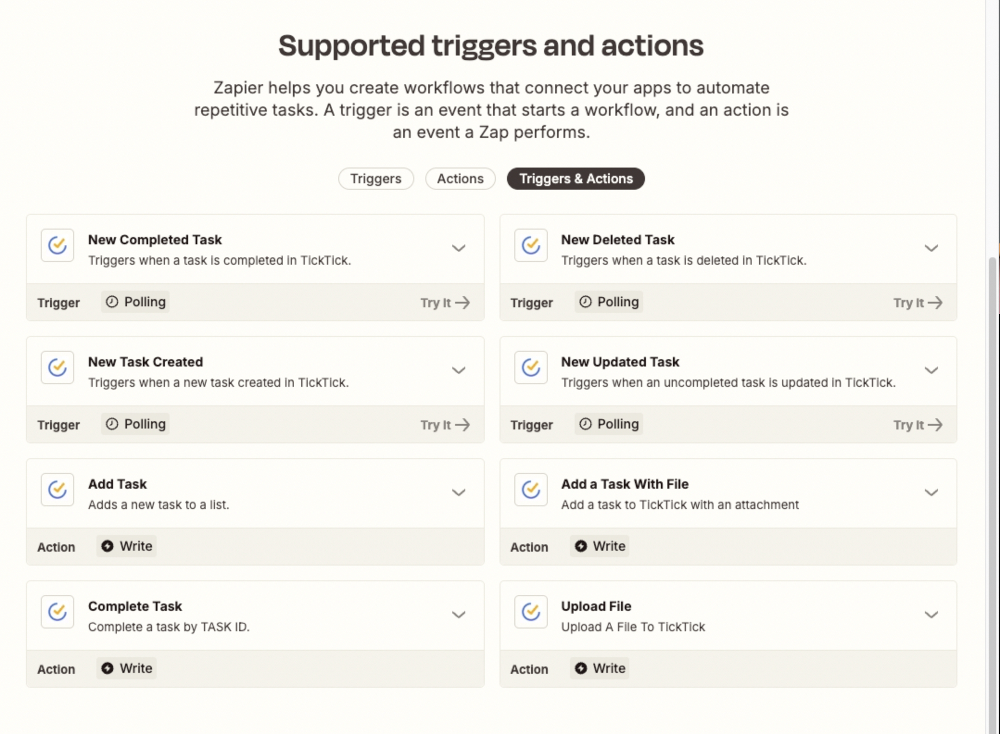
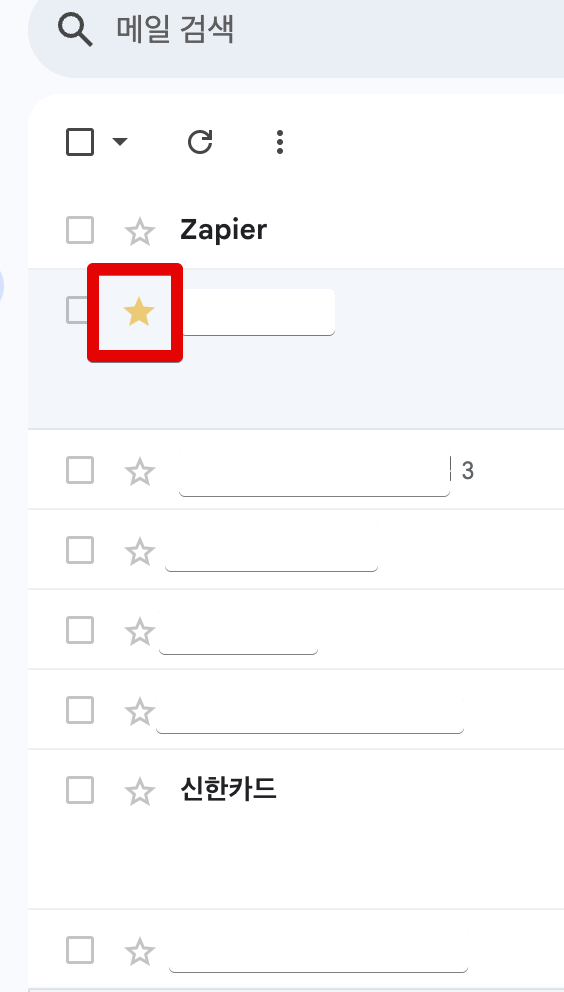
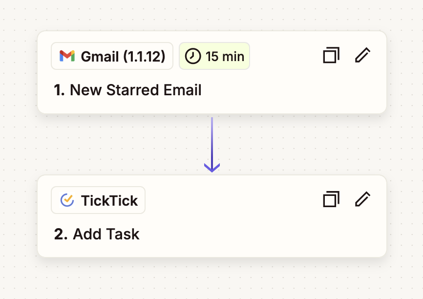
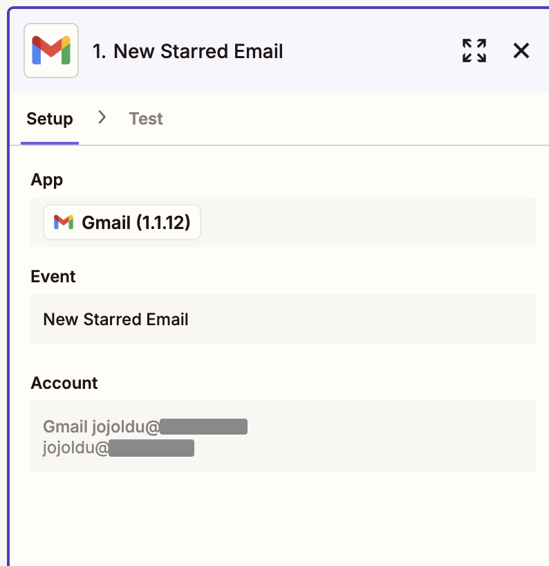
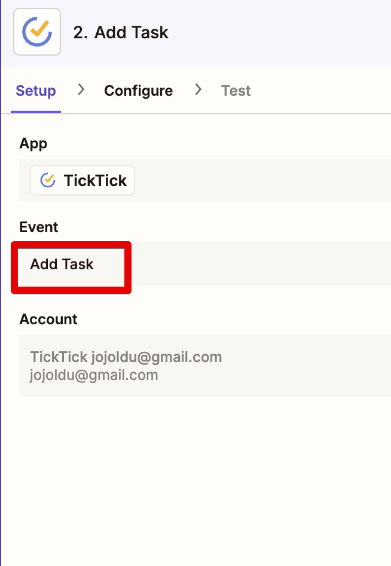
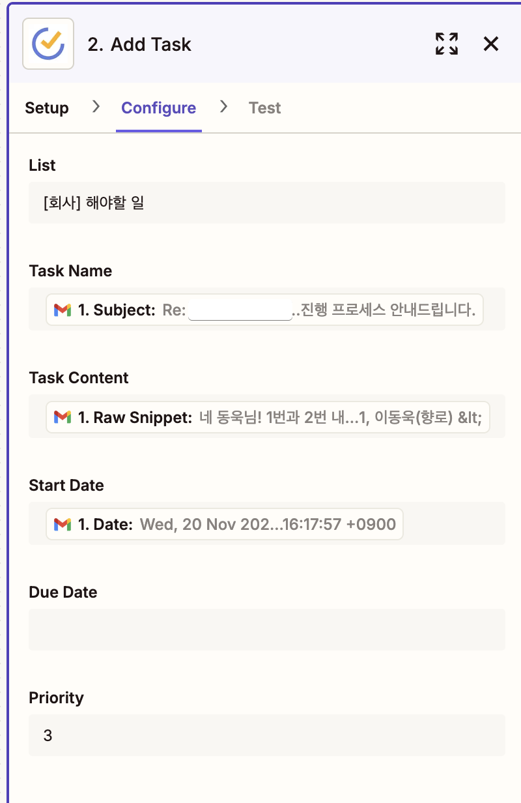
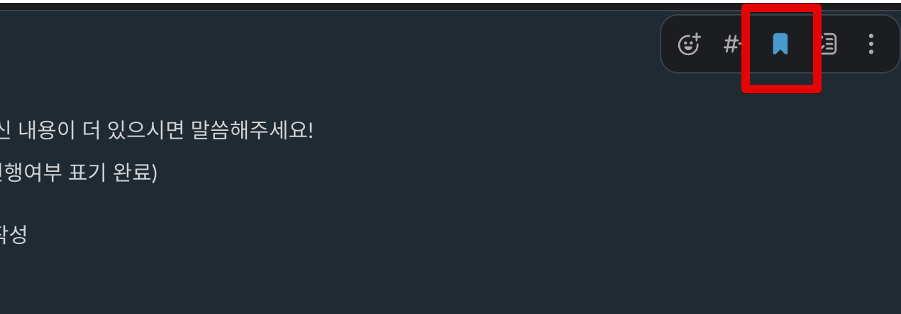
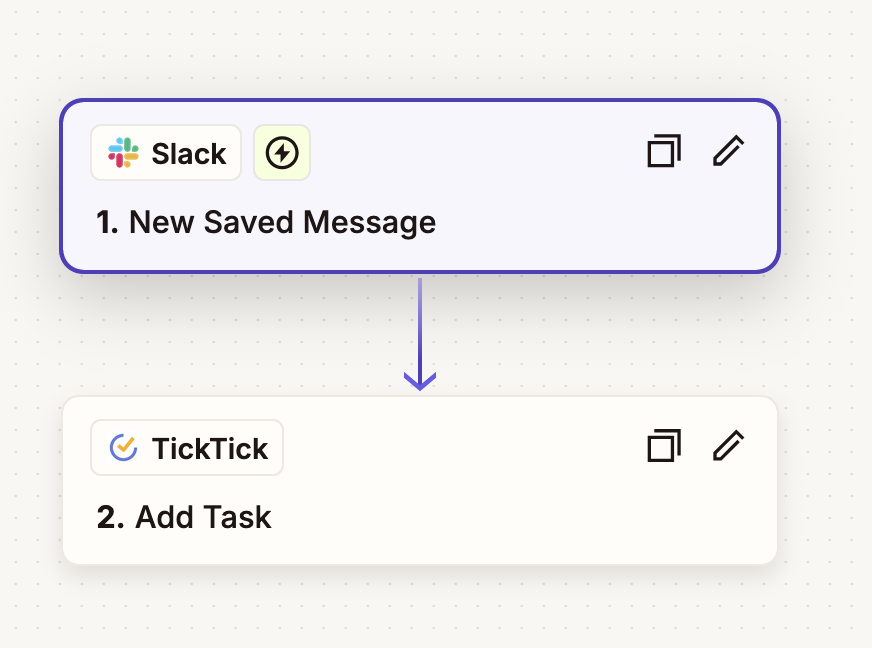
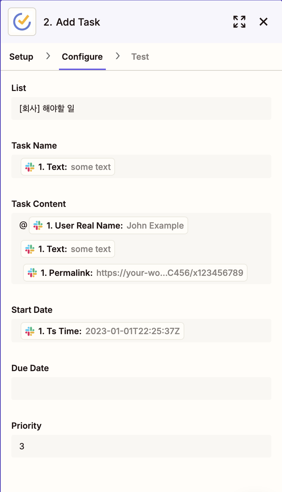

# Slack, Gmail 의 북마크로 TickTick Task 만들기

요즘 다시 TickTick을 메인 Todo App으로 사용하고 있다.  

> 맥북, 아이패드, 안드로이드 휴대폰, 윈도우 PC에서 모두 다 잘 작동되고 에디터가 막강하고 여러 SaaS 에서 잘 지원하는 도구가 TickTick 밖에 없다보니 다시 유료 결제하고 사용하고 있다.  
> 에디터가 옵시디언보다 더 좋다는 생각이 들어서 노트앱도 TickTick을 요즘 좀 더 활용하고 있다.
  
TickTick에서는 여러 업무 도구와의 통합을 지원한다.  
Gmail, Slack 등등에서 모두 플러그인 형태로 지원하는데, 이게 [오프라이트](https://www.offlight.work/ko?gad_source=1&gclid=Cj0KCQjwqcO_BhDaARIsACz62vN1FeGjd3Tcpj9ZIjAXqrf-S7C9XVXZrUX8xklPOZ_BMuGvqPPMSmEaAphzEALw_wcB)를 몇개월간 사용해본 내 입장에서는 꽤나 불편했다.  
  
그래서 TickTick도 오프라이트와 마찬가지로 편하게 업무도구와의 통합을 연동했다.

- Gmail 에서 "이메일을 Star" 할 경우 Task가 자동 생성
- Slack 에서 "메세지를 Bookmark" 할 경우 메세지 내용으로 Task가 자동 생성

이 2가지 환경을 [Zapier](https://zapier.com/)를 통해 쉽게 구축할 수 있다.  
Zapier는 TickTick과 Gmail, Slack의 대부분의 Event에 대해 트리거 할 수 있고, 액션으로 등록해둘 수 있다.

> [Zapier](https://zapier.com/)와 [Make](https://www.make.com/en) 모두 TickTick을 지원하기에 주로 사용하는 도구를 사용하면 된다.

## Gmail에서 star 시 TickTick Task 생성

Gmail에서 수신된 이메일을 보고 당장은 처리할 수 없어서  시간이 될 때 처리하기 위해 휴대폰이나 PC에서 star만 누르는 경우가 많다.  

근데 이렇게 star를 누른 것을 매번 확인할 수 없으니 TickTick에 자동으로 Task로 등록해두고 할일로서 관리하는 것이 편하다.  
  
Zapier를 통해서 아주 쉽게 할 수 있다.  

### 설정

Zapier 의 Zap 생성으로 넘어가서 다음과 같이 `New Starred Email` 를 트리거, TickTick의 `Add Task` 를 액션으로 등록한다.

다음과 같이 star 를 할 Google Email 계정과 SSO 연동을 해두고

TickTick에서는 `Add Task` 를 선택한다.

다음과 같이 Email 의 내용을 Task의 어떤 항목으로 연동할 것인지 설정해둔다.

- List: TickTick의 Todo List 중 관련된 것으로 선택한다
- Task Name: Email의 제목으로 설정한다
- Task Content: Email의 본문으로 설정한다.

기타 등등 원하는 대로 설정한다.

설정이 끝나고 Test를 진행해보면 Email의 내용이 Task로 정상적으로 등록되는 것을 확인할 수 있다.

## Slack에서 bookmark 시 TickTick Task 생성

Slack 역시 바쁜 와중에 **당장 답변할 필요가 없는 메세지들은 뒤로 미루고 다음에 할 때가 많다**.  
늦더라도 꼭 답변 해야할 내용들을 하나의 Task처럼 관리하려면 이 역시 쉽게 TickTick의 Task로 관리하면 좋다.  
  
Slack의 북마크 기능은 이럴때 유용하고, 북마크 액션이 발생하면 자동으로 TickTick Task로 등록시킨다.

### 설정

Slack 역시 설정에 관해서는 Gmail과 크게 다르진 않다.  
  
Slack의 `New Saved Message` 를 트리거로 두고, TickTick의 `Add Task`를 액션으로 설정한다.

마찬가지로 각각의 항목을 TickTick Task의 속성으로 설정해둔다.

설정이 끝나고 Test를 진행해보면 Slack의 내용이 Task로 정상적으로 등록되는 것을 확인할 수 있다.

