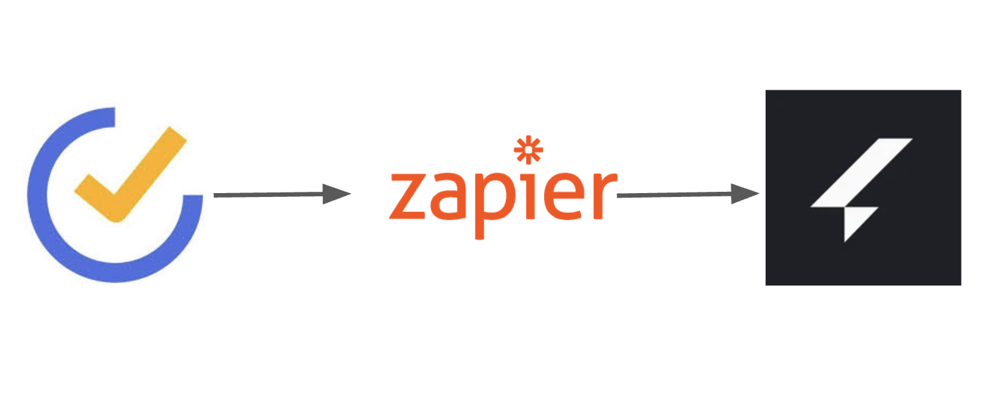
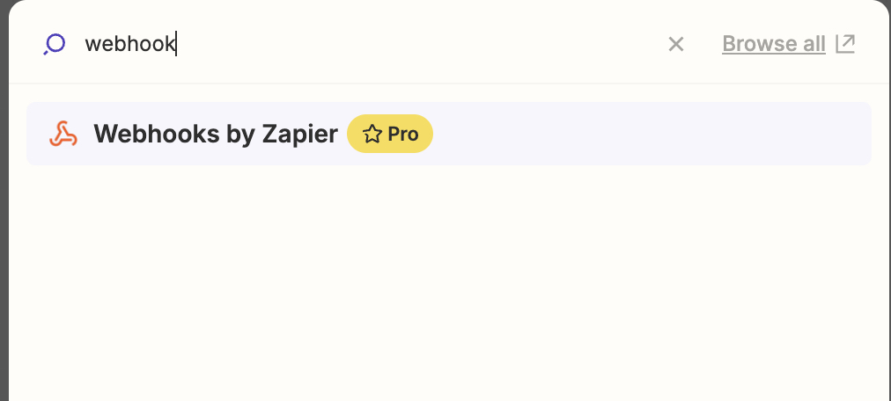
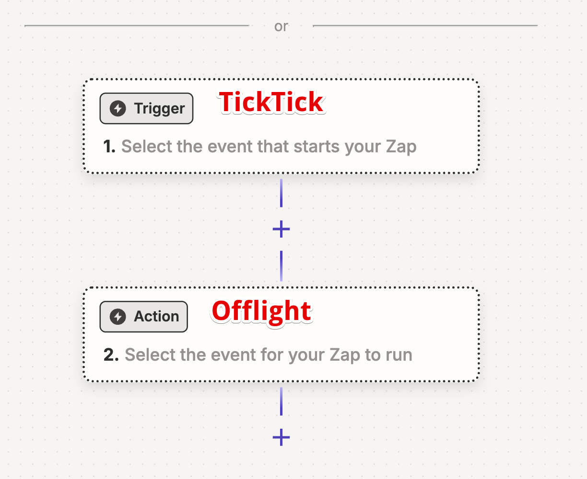
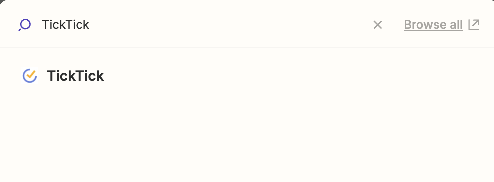
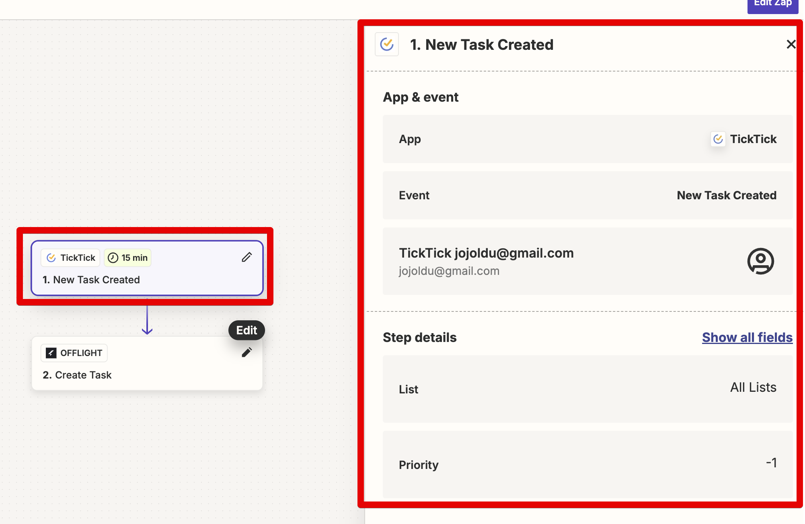
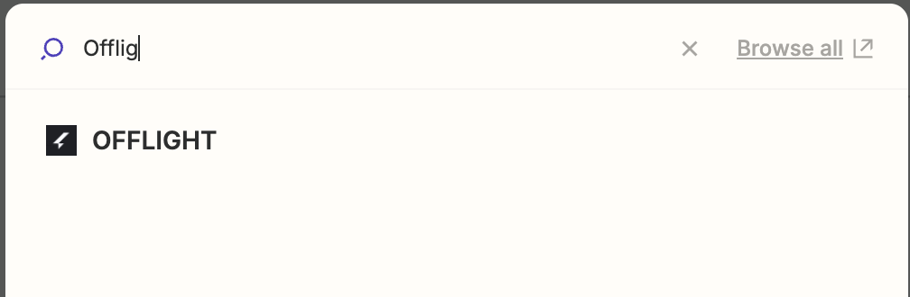
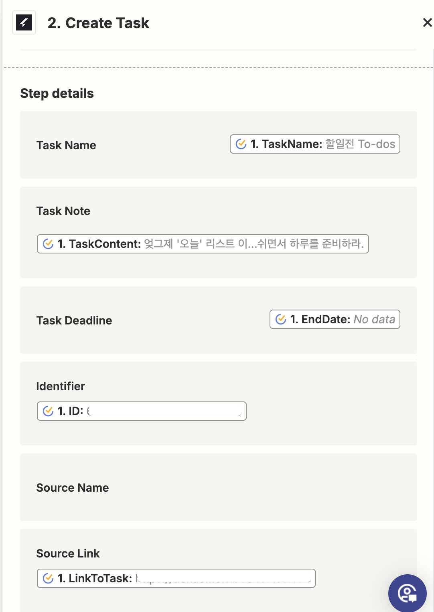
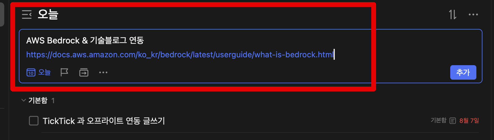
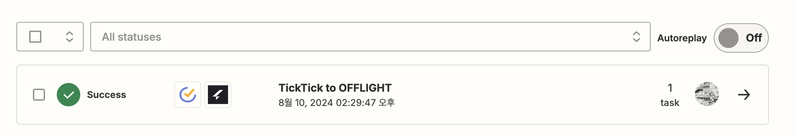
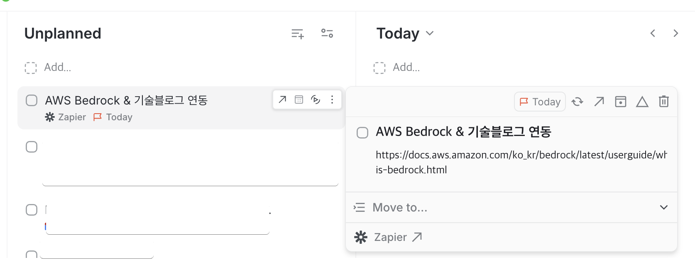

# 오프라이트 & TickTick 연동하기 (feat. Zapier)

요즘 Todo App을 [오프라이트](https://www.offlight.work/ko)로 바꿔서 사용해보고 있다.  
  
기존에 TickTick을 사용했는데, TickTick이 가지는 여러가지 장점이 있지만, 아직 통합 기능이 부족하다.  
분산된 여러 업무 도구들이 자동으로 연계 되어 굳이 내가 별도로 기록할 일이 없도록 하는 것이 필요한데, 그런 부분에서 TickTick은 현재까지 (2024.08.06) 구글 캘린더 통합만 지원한다.  
  
반면 오프라이트의 경우 슬랙, 지메일, 구글 캘린더, Zapier 등 여러 플랫폼을 지원하고 있어 파편화 된 업무 정보를 한 곳에서 볼 수 있다.

> 물론 이런 업무 도구에 쌓인 정보들은 회사의 중요 정보가 되기도 하기 때문에 공개 범위를 적절하게 사용하는 것이 좋다.

다만, 여전히 TickTick도 함께 사용중인데, 그 이유는 **모바일 기기에서의 사용성이 떨어지기 때문**이다.  
  
TickTick 은 여태 사용해본 Todo App 중 에디터의 사용성이 가장 좋았다.  
**대부분의 기기에서 준수한 사용성을 가진 네이티브 앱**을 지원한다.  
나처럼 안드로이드, 맥 OS, IOS (아이패드), 윈도우를 모두 다 사용하는 사람에게는 TickTick은 아주 좋은 Todo App이다.  
안드로이드와 같은 모바일 기기에서 사용하기 좋은 준수한 에디터를 지원하기 때문에 **이동 중에 빠르게 할일을 작성해야할때 TickTick의 Task 에디터는 아주 편하고 활용도가 높았다**.  
  
아직까지 **오프라이트에서는 제대로 된 모바일 앱이 없다**.  
앱 뿐만 아니라 **모바일 웹도 제대로 지원하지 못하고 있다**.  
  
물론 모비일 웹을 지원하더라도 Todo App 특성상 네이티브 앱이 아니면 사용성 차이가 크기 때문에 결국엔 네이티브 모바일 앱이 출시가 되어야만 제대로 사용할 수 있다고 생각한다.  
  
그래서 **PC에서는 오프라이트 앱**을, **모바일에서는 TickTick**을 사용하고, 이를 오프라이트의 통합 기능을 활용해서 **TickTick에 쓴 내용이 자동으로 오프라이트에 연동 되도록**해서 사용중이다.  

이에 대해 정리한다.

## 연동

TickTick과 오프라이트는 서로간에 공식적으로 연동을 지원하지 않기 때문에 중간에 Zapier를 사용해야만 한다.

> [Zapier를 이용한 오프라이트 연동은 공식 문서](https://www.offlight.work/ko/docs/zapier)에서 자세히 설명하고 있어 이를 참고해서 다른 다양한 연동도 해봐도 좋다.

Zapier는 Webhook을 쓰는 것일까 싶지만, **Webhook은 프리미엄 구독시에만 사용**할 수 있다.

다행히 **오프라이트는 벌써 Zapier App으로 사용이 가능**하다.  
(Beta 버전이라 이후 어떻게 될지는 모르겠다.)  
  
그래서 정식으로 지원하는 TickTick과 Offlight App 을 연동한다.  
  
Zapier에서 Zap 생성 페이지로 가서 아래와 같이 선택한다.
- Trigger: TickTick
- Action: Offlight

Trigger에는 TickTick App을 등록하고

Event를 `New Task Created` 로 선택하고, 본인의 TickTick 계정과 연동한다.  

이후 Action에는 Offlight 를 선택한다.

Offlight 의 각 항목에 맞춰 TickTick의 속성들을 등록한다.

TaskName, TaskNote, Source Link 를 꼭 등록해둬야 Offlight 에서 사용하기 수월하다.  
이 외에 EndDate 등 다양한 속성을 취향에 맞게 등록한다.  
  
등록이 다 끝나고나면 TickTick 에 Task를 생성해본다.  

Task 생성 후 Zap History에서 Zap이 실행되었는지 확인한다.

정상적으로 수행되었다면 Offlight에 자동으로 Task가 생성되었는지 확인한다.

> Offlight 에서 Task를 Done 처리하면 TickTick 에도 자동으로 Complete 되도록 하는 자동화도 가능하다.  
> 다만, **TickTick과 연동된 Task에만 Zapier가 실행되는 조건문**을 추가할 수 없어, **Zapier 무료 플랜 제한 (월 100건의 Zap만 실행) 을 쉽게 초과해버린다**.  
> 그래서 Done에 대한 연동은 하지 않고 생성에 대한 것만 연동해둔다.  
> 본인이 Zapier 프리미엄 플랜을 사용한다면 당연히 Done Task도 연동하면 좋다.