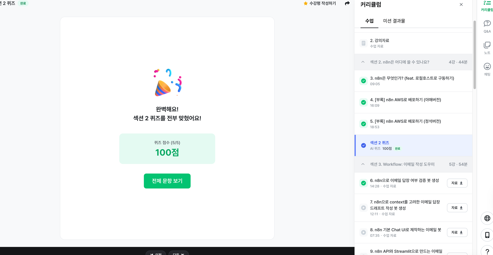
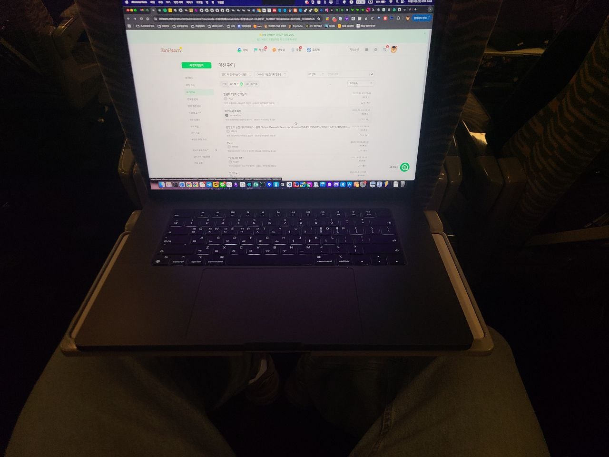

# 2025년 추석 연휴 시작!

벌써 연휴 3일차 입니다.  
다들 재밌게 챌린지 참여 중이신가요?  
  
저도 현재 강병진님의 [회사에서 바로 쓰는 업무자동화 AI 에이전트 (w. n8n, LangGraph)](https://inf.run/yAEnE) 를 재밌게 매일 매일 듣고 있습니다.

 

매일 미션 참가해주시는 분들 덕분에 저도 계속해서 자극 받고 더 열심히 해야겠다는 동기부여를 많이 받고 있습니다.

거의 하루에 1천개의 미션이 제출되더라구요 ㅎㅎ

 

매 시간 마다 수십개씩 미션 제출 알람이 뜨는데, 결제 알림 뜨는 것 보다 미션 제출 알람이 더 좋았습니다 ㅎㅎ

>이런 얘기하면 대표님이 싫어하실려나...?

인프런은 교육 콘텐츠를 다루는 오픈 플랫폼이다보니 종종 교육 콘텐츠를 판매하는 커머스처럼 생각하시는 분들이 많으신데요.

얼핏 보면 그럴 순 있는 것 같지만,
커머스와 본질적으로 다른 것은 어떻게든 고객에게 결제를 시킨다 가 목적이 아니라어떻게든 고객의 목적에 맞게 성장시킨다 가 목적인 면에서는 큰 차이가 있는 것 같아요.

그리고 그 목적을 이루는 과정에서는 지식을 나눔해주시는 분들의 지식 가치가 훼손되지 않도록 적정선의 가격대와 프로모션 정책을 유지하면서 학습하시는 분들께는 지불하신 그 이상으로 배움을 얻어갈 수 있도록 기능,제도 등을 개선해나가고 있습니다.

전 직장인 배민에서의 비전은 "좋은 음식을 먹고 싶은 곳에서" 였는데요.

당시 이 비전이 너무 명확해서 진짜 그런 세상이 왔으면 좋겠다는 생각을 하며 전사 발표를 봤었습니다.

> 요즘은 비전이 바뀐 것 같더라고요?
 
인프런은 제가 합류할때도, 지금도 여전히 비전이 동일합니다.

"**성장 기회의 평등**"

온라인 강의 플랫폼이 넘치는 이 시대에도 과연 이 비전이 유효한가? 라는 질문도 많이 받습니다.

패스트캠퍼스, 클래스 101, 휴넷, 멀티캠퍼스 등 여러 온라인 교육 서비스가 존재하고,

특히 쿠팡이 도서를 판매하고 있고, 네이버에서는 '프리미엄 콘텐츠' 라는 서비스로 콘텐츠를 판매하는 이 시대에 말이죠.

근데, 저는 아무리 세상이 편리해지고 많은 플랫폼이 등장해도 그 플랫폼들이 가지고 있는 방향성이 정말로 "성장 기회의 평등" 을 향하고 있는가? 에 대해서는 물음표가 있습니다.

세상엔 평등하지 않은게 많더라구요.

"**아는데 안하는 것은 어쩔 수가 없지만**,
**몰라서 못하는 것 만큼은 해결해야하는 것 아닌가**?" 라는 생각인 것이죠.

이번 챌린지 역시 비슷한 마음이였습니다.

사실 다들 마음속 열정이 가득할텐데,
누가 심지에 불만 붙여주면 활활 타오를 수 있는 사람들인데,
그걸 당사자도, 주변에서도 모르는게 아닐까?
그걸 알려드리면 그것 조차 우리의 비전과 맞는 것 아닌가? 라는 생각이였죠.

가설에 가까운 실험이였지만,
이만큼이나 열정적으로 미션에 참여하고 오픈 카톡방에서 매일 매일 공부 인증을 하시는 것을 보면서
"아 역시... 다들 마음속 열정이 가득찬 분들이라서 누가 계기만 마련해주면 정말로 대단한 열정을 뿜어내주시는구나" 라는 생각을 하게 됐습니다.

저희의 비전에 맞춰서 더 열심히 행동해야겠다는 생각을 하게 되어서,
그래서 결제 알림 보다, 미션 제출 알람이 더 좋았습니다 🙂

> 아 물론..... 결제 알림도 너무나 좋아합니다 ㅋㅋㅋㅋ

저도 내일 있을 제사를 위해 처가를 갔다가, 지금 SRT를 타고 대구로 내려가는 중입니다.
제출해주신 수천개의 미션들을 보면서 동기부여 뿜뿜하면서 기차안에서 노트북을 열 수 있었습니다.

(SRT 기차 안에서)

오늘을 비롯해서 화요일까지가 추석 연휴라서 아마도 오늘 이동하시는 분들이 많으실 것 같아요.
다들 조심히 이동하시고,
추석에 제사가 있으신 분들은 제사 잘 보내시고,
이동 계획이 없으신 분들은 하루 정도는 짧게(?)만 챌린지 참여하신 뒤 휴식을 취해보시면 좋겠어요!!
