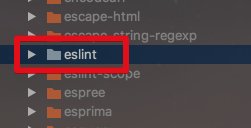
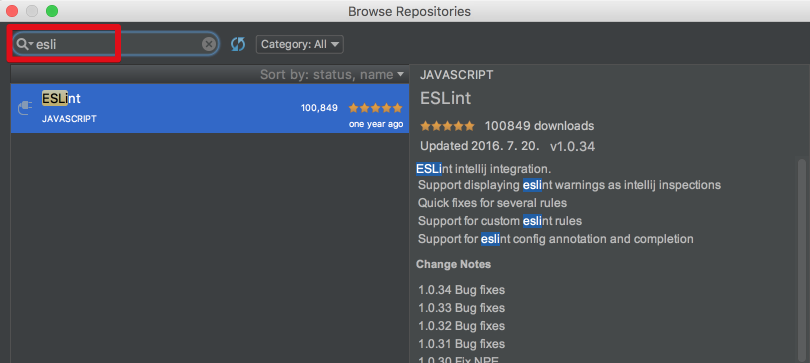
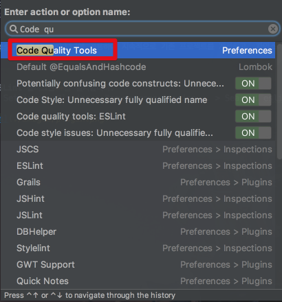
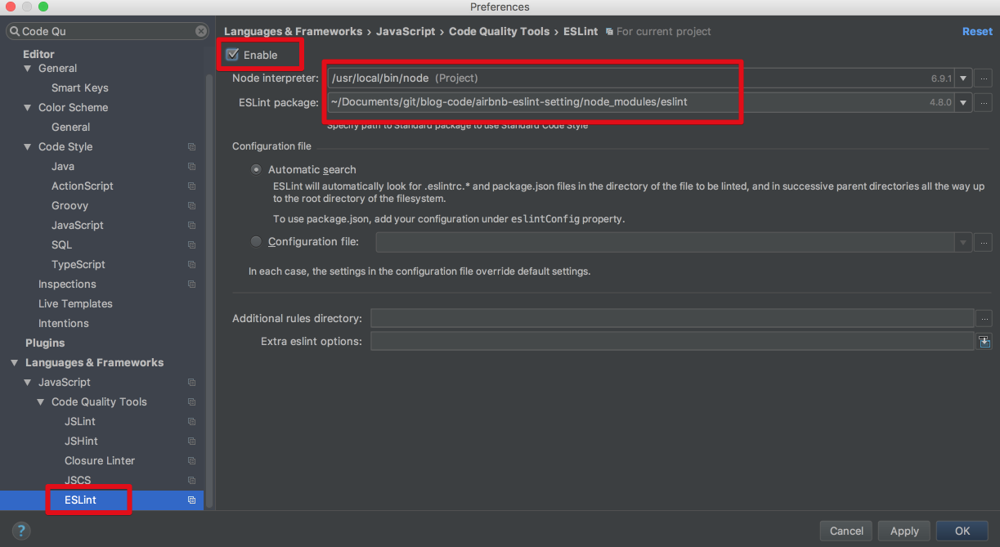
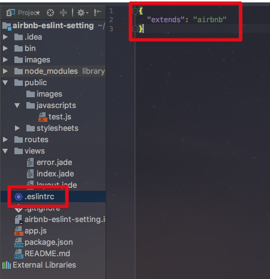
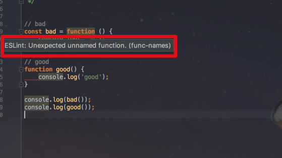
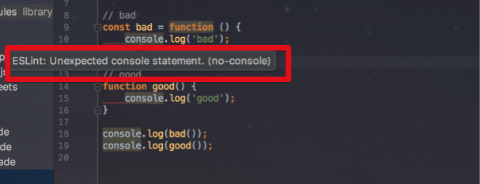

# airbnb-eslint-setting

안녕하세요? 이번 시간엔 airbnb의 eslint를 IntelliJ에 적용하는 예제를 진행해보려고 합니다.  
모든 코드는 [Github](https://github.com/jojoldu/blog-code/tree/master/airbnb-eslint-setting)에 있기 때문에 함께 보시면 더 이해하기 쉬우실 것 같습니다.  
(공부한 내용을 정리하는 [Github](https://github.com/jojoldu/blog-code)와 세미나+책 후기를 정리하는 [Github](https://github.com/jojoldu/review), 이 모든 내용을 담고 있는 [블로그](http://jojoldu.tistory.com/)가 있습니다. )<br/>
 

## 들어가며

팀내에서 프론트엔드 코딩 컨벤션을 정하자는 이야기가 나왔습니다.  
구성원 모두가 백엔드 개발자이며, 메인 언어가 되는 Java를 다들 최근에 시작하셔서(기존엔 ASP, PHP) Java & 백엔드 학습으로도 시간이 부족하기에 프론트엔드 쪽은 거의 등한시 하고 있었습니다.  
  
그러다 최근에 큰 프로젝트가 끝나고 회고 시간에 **백엔드 코드에 비해 프론트엔드 코드가 컨벤션없이 작성되어 퀄리티가 상대적으로 너무 떨어진다**는 이야기가 나왔습니다.  
(물론 저희는 백엔드 개발자이고, Java 개발자로 전환하는 과정속에서 JS까지 잘하길 바라면 욕심일수도 있습니다.)  
  
그래도 JS 컨벤션은 필요하다 생각되어 이런 프론트엔드 컨벤션은 Airbnb가 잘되어있음을 알게되었습니다.  
Airbnb eslint를 IntelliJ에 적용하여 지속적으로 기존 프로젝트를 개선하고, 자연스레 좋은 코딩 스타일을 익히는것을 목표로 하여 환경설정방법을 작성합니다.

## 본론

먼저 현재 프로젝트에 [eslint](https://www.npmjs.com/package/eslint) npm 패키지를 설치합니다.  

```bash
npm install --save-dev eslint
```

설치가 완료되시면 프로젝트내 node_modules아래에 eslint가 생성되었는지 확인합니다.  



그리고 **ESLint 플러그인**을 설치합니다.  



(File > Settings > Plugins > Browse repositories... > Search: eslint > Install > IDEA Restart)  
  
재시작 되어 설치가 완료되면 플러그인 설정을 진행합니다.  
(맥OS 기준) ```command+shift+a```로 ```Code Quality Tools```를 검색하여 설정창을 오픈합니다.



해당 설정창에서 ESLint -> Enable 체크 -> node 위치 지정, (좀전에 설치한) ESLint npm 패키지 위치 지정  
  
> 보통은 Enable 체크하면 IntelliJ가 직접 필요한 파일들의 위치를 자동으로 찾아줍니다.
 


IntelliJ 관련 설정은 이게 끝입니다.  
이제는 airbnb eslint 설정을 진행하겠습니다.  
  
먼저 airbnb-eslint와 관련된 eslint 기타 플러그인들을 설치하겠습니다.

```bash
npm install --save-dev eslint-plugin-import
npm install --save-dev eslint-plugin-react
npm install eslint-plugin-jsx-a11y@5.1.1 --save-dev
```

> 현재 (2017.10.03) eslint-config-airbnb의 버전인 15.1.0 에서는 eslint-plugin-jsx-a11y 5.1.1 버전이 필요한데 eslint-plugin-jsx-a11y가 현재 6.x.x 버전이 되어서 5.1.1 버전을 강제로 지정해서 install 합니다.

설치가 완료되셨으면 바로 [eslint-config-airbnb](https://www.npmjs.com/package/eslint-config-airbnb)를 설치하겠습니다.

```bash
npm install --save-dev eslint-config-airbnb
```

설치가 완료되셨으면 실제 프로젝트에 적용해보겠습니다.  
프로젝트 내부에 ```.eslintrc``` 파일을 하나 생성합니다.  
그리고 아래와 같이 airbnb 옵션을 추가합니다.



ES6와 Node 환경을 적용하기 위해 추가 설정도 포함합니다.

```javascript
{
  "env": {
    "node": true,
    "es6": true
  },
  "extends": "airbnb"
}
```

이렇게 하면 설정은 끝이났습니다!  
실제로 간단하게 테스트를 해보겠습니다.  
test.js파일을 생성해서 아래의 코드를 작성하겠습니다.

```javascript
// bad
const bad = function () {
    console.log('bad');
};

// good
function good() {
    console.log('good');
}

console.log(bad());
console.log(good());
```

이렇게 작성해보면 IntelliJ에서 수많은 Warn 메세지가 등장합니다.



첫번째 메세지는 함수 선언 방식에 대한 메세지입니다.

> Airbnb ESLint에선 함수 선언문 보다 함수표현식을 권장합니다.  
콜스텍에서 좀더 쉽게 찾을 수 있으며, 호이스팅의 혼란을 줄이며 애로우함수(자바의 람다)로 대체해서 사용할수 있다는 등의 장점이 있기 때문입니다.  
참고: [Airbnb ES6 스타일 가이드(번역)](https://firejune.com/1794/Airbnb%EC%9D%98+ES6+%EC%9E%90%EB%B0%94%EC%8A%A4%ED%81%AC%EB%A6%BD%ED%8A%B8+%EC%8A%A4%ED%83%80%EC%9D%BC+%EA%B0%80%EC%9D%B4%EB%93%9C#functions)

2번째 메세지는 ```console.log``` 사용을 자제하라는 메세지입니다.



> 브라우저에서 실행되도록 설계된 JavaScript에서는 콘솔에서 메서드를 사용하지 않는 것이 좋습니다.  
이러한 메시지는 디버깅 목적으로 간주되므로 클라이언트에 제공하기에 적합하지 않습니다.  
일반적으로 콘솔을 사용하는 호출은 프로덕션으로 푸시되기 전에 제거되어야합니다.  
참고: [ESLint 공식 문서](https://eslint.org/docs/rules/no-console)

기타 등등 수많은 권장 가이드라인이 IntelliJ에 노출되는 것을 확인할 수 있습니다.  
  
혹시나 ESLint외에 IntelliJ에서 ES6 문법을 허용하지 않는 경우가 있습니다.  
이럴 경우 아래와 같이 Preferences -> Javascript -> Javascript Language version을 ECMAScript6로 선택하시면 됩니다.


추가적으로 필요한 옵션이 있으시거나, 본인 팀만의 JS 스타일로 변경하고 싶으시다면 ```.eslintrc``` 에 옵션을 주어 편하게 변경할 수 있습니다.  

## 마무리

너무 빡빡한 Lint 옵션은 생산성을 저하시키지만, 중구난방의 코드 스타일을 개선하고 싶다면 조금은 빡빡하게 해도 되지 않을까 싶습니다.  
추석연휴가 지나고 조금씩 팀내에 적용하면서 새로 알게된 점이나 문제점들을 발견하면 계속 공유하겠습니다!  
  
다들 추석연휴 잘보내세요!  
끝까지 읽어주셔서 고맙습니다.