# AOP 시작하기
현재 신입사원 분들의 입사로 Spring에서 중요한 개념들에 대해 한번 정리하려고 작성하게 되었습니다. <br/>
Spring의 가장 중요한 개념 중 하나인 AOP를 제 나름의 이해로 정리하였습니다. 틀린 내용이 있다면 가감 없이 댓글 부탁드리겠습니다.<br/>
모든 코드는 [Github](https://github.com/jojoldu/blog-code/aop)에 있으니 코드와 함께 보셔도 좋을것 같습니다. <br/>
(공부한 내용을 정리하는 [Github](https://github.com/jojoldu/blog-code)와 세미나+책 후기를 정리하는 [Github](https://github.com/jojoldu/review)를 star 하시면 실시간으로 feed를 받을 수 있습니다.)
<br/>
Spring을 이해하는데 있어 최고는 토비님의 토비의 스프링을 읽어보는 것입니다. <br/>
제 블로그의 내용들은 단발성에 지나지 않습니다. 이것만으로는 Spring을 사용만 하는것이지 이해한 것은 아니라고 개인적으로 생각하고 있습니다. <br/>
Spring의 이런 개념이 왜 나오게 된것인지, 어떻게 해결하고 해결하다보니 결국 이 형태가 된것인지 정말 상세하게 나오기 때문에 객체지향과 Java를 좀 더 잘 이해하기 위해서라도 무조건 읽어보시길 추천드립니다. <br/>
### 문제 상황
하나의 게시판 서비스가 있다고 가정하겠습니다. <br/>
해당 게시판은 간단하게 구현하기 위해 SpringBoot + JPA + H2 + Gradle로 구현되었습니다. <br/>
게시글을 전체 조회, 단일 조회 기능이 있는 서비스입니다. 해당 서비스의 구현 코드는 아래와 같습니다. <br/>

**build.gradle**

```
buildscript {
	ext {
		springBootVersion = '1.4.2.RELEASE'
	}
	repositories {
		mavenCentral()
	}
	dependencies {
		classpath("org.springframework.boot:spring-boot-gradle-plugin:${springBootVersion}")
	}
}

apply plugin: 'java'
apply plugin: 'eclipse'
apply plugin: 'org.springframework.boot'

jar {
	baseName = 'aop'
	version = '0.0.1-SNAPSHOT'
}
sourceCompatibility = 1.8
targetCompatibility = 1.8

repositories {
	mavenCentral()
}


dependencies {
	compile('org.springframework.boot:spring-boot-starter-aop')
	compile('org.springframework.boot:spring-boot-starter-web')
	compile('org.springframework.boot:spring-boot-starter-data-jpa')

	runtime('org.springframework.boot:spring-boot-devtools')
	runtime('com.h2database:h2')

	testCompile('org.springframework.boot:spring-boot-starter-test')
}

```

**Board.java**

```
@Entity
public class Board {

    @Id
    @GeneratedValue
    private Long idx;

    @Column
    private String title;

    @Column
    private String content;

    public Board() {
    }

    public Board(String title, String content) {
        this.title = title;
        this.content = content;
    }

    public Long getIdx() {
        return idx;
    }

    public void setIdx(Long idx) {
        this.idx = idx;
    }

    public String getTitle() {
        return title;
    }

    public void setTitle(String title) {
        this.title = title;
    }

    public String getContent() {
        return content;
    }

    public void setContent(String content) {
        this.content = content;
    }
}
```

**BoardService.java**

```
@Service
public class BoardService {

    @Autowired
    private BoardRepository repository;

    public List<Board> getBoards() {
        return repository.findAll();
    }
}
```

**BoardRepository.java**

```
@Repository
public interface BoardRepository extends JpaRepository<Board, Long>{}
```
Board외에 User도 추가해보겠습니다. <br/>
<br/>
**User.java**

```
@Entity
public class User {
    @Id
    @GeneratedValue
    private long idx;

    @Column
    private String email;

    @Column
    private String name;

    public User() {
    }

    public User(String email, String name) {
        this.email = email;
        this.name = name;
    }

    public long getIdx() {
        return idx;
    }

    public void setIdx(long idx) {
        this.idx = idx;
    }

    public String getEmail() {
        return email;
    }

    public void setEmail(String email) {
        this.email = email;
    }

    public String getName() {
        return name;
    }

    public void setName(String name) {
        this.name = name;
    }
}
```
**UserService.java**

```
@Service
public class UserService extends UserPerformance{

    @Autowired
    private UserRepository repository;

    @Override
    public List<User> getUsers() {
        return repository.findAll();
    }
}
```

**UserRepository.java**

```
@Repository
public interface UserRepository extends JpaRepository<User, Long>{
}

```

**Application.java**

```
@SpringBootApplication
@RestController
public class Application implements CommandLineRunner{

	@Autowired
	private BoardService boardService;

	@Autowired
	private BoardRepository boardRepository;

	@Autowired
	private UserService userService;

	@Autowired
	private UserRepository userRepository;

	@Override
	public void run(String... args) throws Exception {
		for(int i=1;i<=100;i++){
			boardRepository.save(new Board(i+"번째 게시글의 제목", i+"번째 게시글의 내용"));
			userRepository.save(new User(i+"@email.com", i+"번째 사용자"));
		}
	}

	@GetMapping("/boards")
	public List<Board> getBoards() {
		return boardService.getBoards();
	}

	@GetMapping("/users")
	public List<User> getUsers() {
		return userService.getUsers();
	}
	
	public static void main(String[] args) {
		SpringApplication.run(Application.class, args);
	}
}
```
위와 같은 상황에서 각 기능별로 실행시간을 남겨야 하는 조건이 추가되었다고 가정해보겠습니다.<br/>
가장 쉬운 방법은 서비스 코드에서 직접 시간을 측정하여 남기는 것입니다. <br/>

**BoardService.java와 UserService.java**

```
    public List<Board> getBoards() {
        long start = System.currentTimeMillis();
        List<Board> boards = repository.findAll();
        long end = System.currentTimeMillis();

        System.out.println("수행 시간 : "+ (end - start));
        return boards;
    }
    
	public List<User> getUsers() {
	    long start = System.currentTimeMillis();
	    List<User> users = repository.findAll(); 
        long end = System.currentTimeMillis();

        System.out.println("수행 시간 : "+ (end - start));
		return users; 
	}
	
```
아주 쉽게 해결이 되었지만, 이게 정답일까요?? <br/>
현재 getXXX메소드들은 몇가지 문제가 있습니다. <br/>
* 각 메소드들이 본인의 역할에 집중하지 못한다.
  - 메소드들은 모두 **조회** 라는 기능을 위해 존재해야한다
  - 현재는 수행시간을 측정하고, 이를 출력하는것까지 포함되어 있다.
* 중복코드가 존재한다.
  - 수행시간 측정, 출력의 기능들이 중복되고 있다.

위와 같은 문제를 해결하려면 어떻게 해야할까요? <br/>
제일 먼저 떠올릴수 있는 것은 **상속** 인것 같습니다. <br/>
상속을 이용해서 한번 해결해보도록 하겠습니다. <br/>

### 문제해결하기 - 상속
이전시간에 이어 상속으로 문제를 해결해보도록 하겠습니다. <br/>

**BoardPerformance.java와 UserPerformance.java 추가**

```
public abstract class BoardPerformance {

    private long before() {
        return System.currentTimeMillis();
    }

    private void after(long start) {
        long end = System.currentTimeMillis();
        System.out.println("수행 시간 : "+ (end - start));
    }

    public List<Board> getBoards() {
        long start = before();
        List<Board> boards = findAll(); //구현은 자식 클래스에게 맡김
        after(start);

        return boards;
    }
    
    //추상메소드
    public abstract List<Board> findAll();
}

public abstract class UserPerformance {

    private long before() {
        return System.currentTimeMillis();
    }

    private void after(long start) {
        long end = System.currentTimeMillis();
        System.out.println("수행 시간 : "+ (end - start));
    }

    public List<User> getUsers() {
        long start = before();
        List<User> users = findAll(); //구현은 자식 클래스에게 맡김
        after(start);

        return users;
    }
    
    //추상메소드
    public abstract List<User> findAll();
}
```

**BoardService.java 와 UserService.java**

```
@Service
public class BoardService extends BoardPerformance {

    @Autowired
    private BoardRepository repository;

    @Override
    public List<Board> findAll() {
        return repository.findAll();
    }
}

@Service
public class UserService extends UserPerformance{

    @Autowired
    private UserRepository repository;

    @Override
    public List<User> findAll() {
        return repository.findAll();
    }
}
```

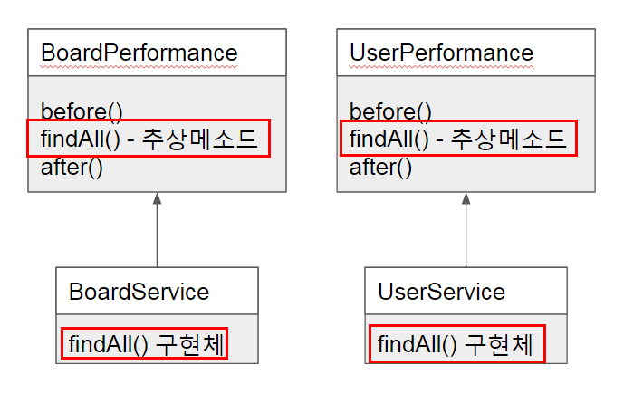

(구조도) <br/>
XXXPerformance 추상 클래스를 생성하여 메소드 실행순서를 강제하였습니다. <br/>
시작시간 (before) -> 실제 메소드 실행 -> 종료 및 출력으로 메소드가 실행될 것입니다. <br/>
자 이렇게 하고나니 각 Service 메소드들은 **본인의 역할에만 충실**할 수 있게 되었습니다. <br/>
하지만 아직 중복된 코드가 많이 남아있습니다. <br/>
이 부분은 **제네릭**을 통해 해결해보겠습니다. <br/>


(개편된 구조도) <br/>

**SuperPerformance.java**

```
public abstract class SuperPerformance<T> {
    private long before() {
        return System.currentTimeMillis();
    }

    private void after(long start) {
        long end = System.currentTimeMillis();
        System.out.println("수행 시간 : "+ (end - start));
    }

    public List<T> getDataAll() {
        long start = before();
        List<T> datas = findAll();
        after(start);

        return datas;
    }

    public abstract List<T> findAll();
}
```

**BoardService.java 와 UserService.java**

```
@Service
public class BoardService extends SuperPerformance<Board> {
    ....
}

@Service
public class UserService extends SuperPerformance<User> {
    ....
}
```

**Application.java**

```
	@GetMapping("/boards")
	public List<Board> getBoards() {
		return boardService.getDataAll();
	}

	@GetMapping("/users")
	public List<User> getUsers() {
		return userService.getDataAll();
	}
```
중복되던 before와 after의 문제를 해결하였습니다. <br/>
하지만 상속은 부모 클래스에 너무나 종속적인 문제 때문에 특별한 일이 있지 않는 이상 피하는 것이 좋습니다. ([이펙티브 자바](http://www.kyobobook.co.kr/product/detailViewKor.laf?barcode=9788966261161) 참고)<br/>
그래서 이 상속으로 범벅인 코드를 **DI (Dependency Injection)**으로 개선해보겠습니다. <br/>

### 문제해결하기 - DI
상속을 피하기 위해 이번시간엔 DI (Dependency Injection)를 통해 문제를 해결해보려고 합니다. <br/> 
제일 먼저 바꿀것은 BoardService 입니다. <br/>
전체적으로 바꿀 구조는 아래와 같습니다. <br/>

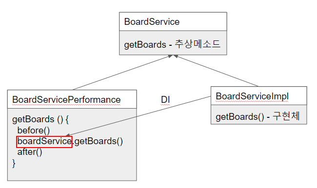

BoardService 인터페이스를 BoardServicePerformance와 BoardServiceImpl이 구현하였습니다. <br/>
대신 집중해야할 로직인 Board 리스트를 조회하는 것은 BoardServiceImpl이 담당하고, <br/>
기타옵션인 수행시간 측정은 BoardServicePerformance가 구현하되, 그 과정에서 BoardServiceImpl을 주입(Injection) 받도록 하였습니다. <br/>
이렇게 되면 BoardServiceImpl과 BoardServicePerformance는 **느슨한 관계**를 가지며, Board 리스트를 조회라는 기능은 BoardServiceImpl만 보면 되는 구조가 될 수 있습니다. <br/>
이를 직접 코드로 구현해보겠습니다. <br/>

**BoardService.java**

```
public interface BoardService {
    List<Board> getBoards();
}
```

**BoardServicePerformance.java**

```
@Service
@Primary
public class BoardServicePerformance implements BoardService{

    @Autowired
    @Qualifier("boardServiceImpl")
    private BoardService boardService;

    @Override
    public List<Board> getBoards() {
        long start = before();
        List<Board> boards = boardService.getBoards();
        after(start);

        return boards;
    }

    private long before() {
        return System.currentTimeMillis();
    }

    private void after(long start) {
        long end = System.currentTimeMillis();
        System.out.println("수행 시간 : "+ (end - start));
    }
}
```

**BoardServiceImpl.java**

```
@Service
public class BoardServiceImpl implements BoardService{

    @Autowired
    private BoardRepository repository;

    @Override
    public List<Board> getBoards() {
        return repository.findAll();
    }
}
```
지금부터는 테스트코드를 작성해서 테스트를 해보겠습니다. <br/>
지속적으로 결과를 확인하는데 있어서 브라우저에서 URL을 입력하며 확인하는 방식은 불편함이 많습니다. <br/>
테스트 코드를 통해 좀 더 수월하고 자동화된 테스트를 진행하겠습니다.

**ApplicationTests.java**
```
@RunWith(SpringRunner.class)
@SpringBootTest
public class ApplicationTests {

	@Autowired
	private BoardService boardService;

	@Test
	public void findBoards() throws Exception {
		assertThat(boardService.getBoards().size()).isEqualTo(100);
	}

}
```
자 이렇게 테스트 코드를 작성후에 코드가 잘 돌아가는지 확인해보겠습니다.

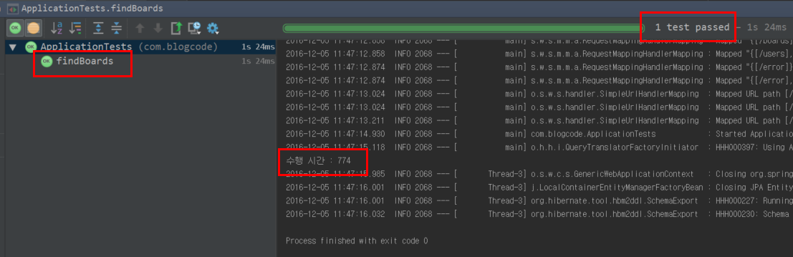

정상적으로 수행시간과 테스트결과가 통과되는 것을 확인하였습니다. <br/>
BoardService와 마찬가지고 UserService도 같은 구조로 코드를 작성해보겠습니다. <br/>
<br/>
**UserService.java**

```
public interface UserService {
    List<User> getUsers();
}

```

**UserServiceImpl.java**

```
@Service
public class UserServiceImpl implements UserService{

    @Autowired
    private UserRepository repository;

    @Override
    public List<User> getUsers() {
        return repository.findAll();
    }
}
```

**UserServicePerformance.java**
```
@Service
@Primary
public class UserServicePerformance implements UserService{

    @Autowired
    @Qualifier("userServiceImpl")
    private UserService userService;

    @Override
    public List<User> getUsers() {
        long start = before();
        List<User> users = userService.getUsers();
        after(start);
        return users;
    }

    private long before() {
        return System.currentTimeMillis();
    }

    private void after(long start) {
        long end = System.currentTimeMillis();
        System.out.println("수행 시간 : "+ (end - start));
    }
}
```
테스트를 위해 테스트 코드도 추가해보겠습니다.

**ApplicationTests.java**

```
	@Autowired
	private UserService userService;

	@Test
	public void findUsers() throws Exception {
		assertThat(userService.getUsers().size()).isEqualTo(100);
	}
```

테스트 코드를 작성후 실행해보면!

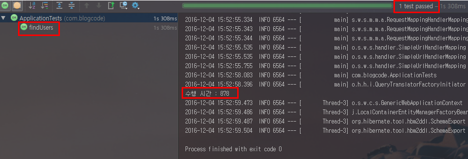

정상적으로 잘 되는 것을 확인할 수 있습니다. <br/>
기능은 정상적으로 잘되지만 코드가 깔끔하지 않고, 많은 관계가 필요한 상태입니다. <br/>
만약 getXXX외에 다른 메소드에도 이와 같은 수행시간출력 기능이 포함되어야된다면 코드는 어떻게 될까요? <br/>
Board와 User외에 다른 타입의 Service에 수행시간출력이 필요하면 어떻게 될까요? <br/>
실제 가장 중요한 비지니스 로직외에 **부가 기능**들에 대해서는 신경 쓰지 않도록 하려면 어떻게 해야할까요?? <br/>
이와 비슷한 경우로 메소드 실행전에 Connection을 open하고, 메소드가 정상적으로 실행완료 되면 commit을, 
예외 발생시엔 rollback을 처리하도록 하는 트랜잭션은 어떻게 처리되고 있기에 개발자가 비지니스 로직만 작성하면 될까요? <br/>
<br/>
이 의문에 대답하기 위해 AOP에 대해 학습을 시작해보겠습니다.

### AOP란?
Spring의 핵심 개념중 하나인 DI가 애플리케이션 모듈들 간의 결합도를 낮춰준다면, AOP는 **애플리케이션 전체에 걸쳐 사용되는 기능을 재사용**하도록 지원하는 것입니다. <br/>  
AOP (Aspect-Oriented Programming) 란 단어를 번역하면 **관점(관심) 지향 프로그래밍**으로 됩니다. <br/>
이 관점(관심)이란 단어가 잘 와닿지 않아 AOP를 이해하는데 있어 더 어려움을 일으킨다고 생각하였습니다. <br/>
쉽게 얘기하면 프로젝트 구조를 바라 보는 **관점**을 바꿔보자는 이야기입니다. <br/>
우리는 보통 제 3자의 관점에서 바라보자 라는 이야기를 합니다. <br/>


(제 3자의 관점) <br/>
<br/>
즉, **대상을 바라보는 방향을 바꿔보자**라는 이야기입니다. <br/>

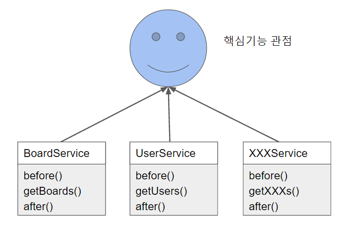

(핵심기능에서 바라본 관점) <br/>
<br/>
각각의 Service는 핵심기능에서 바라보았을때는 Board, User, XXX 등 **공통된 요소가 없습니다**. <br/>
이런 관점에서는 각각의 Service는 각자 코드를 구현하고 있습니다. 하지만, 이 관점을 돌려서 **부가기능** 이란 관점에서 바라보면 상황이 달라집니다. <br/>

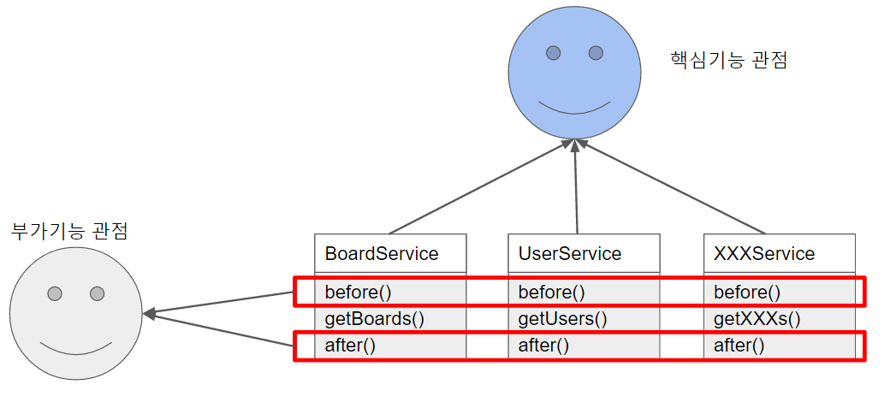

(부가기능에서 바라본 관점)<br/>
<br/>
부가기능의 관점에서 바라보면 각각의 Service는 수행시간 측정을 나타내는 before라는 메소드와 after라는 메소드가 공통되는 것을 알 수 있습니다. <br/>
AOP는 여기서부터 시작합니다. <br/>
기존에 OOP에서 바라보던 관점을 다르게 하여 부가기능적인 측면에서 보았을때 공통된 요소를 추출하자는 것입니다. <br/>
이때 가로(횡단) 영역의 공통된 부분을 잘라냈다고 하여, AOP를 크로스 컷팅(Cross-Cuttin) 이라고 불리기도 합니다. <br/>
요약하자면 아래와 같습니다. <br/>

* OOP : 비지니스 로직의 모듈화
  - 모듈화의 핵심 단위는 비지니스 로직
* AOP : 인프라 혹은 부가기능의 모듈화
  - 대표적 예 : 로깅, 트랜잭션, 보안 등
  - 각각의 모듈들의 주 목적 외에 필요한 부가적인 기능들 
  
AOP라고 해서 전에 없던 새로운 개념이 등장한것이 아닙니다. 결국은 **공통된 기능을 재사용하는 기법**입니다. <br/>
OOP에선 공통된 기능을 재사용하는 방법으로 상속이나 위임을 사용합니다. <br/>
하지만 전체 어플리케이션에서 여기저기에서 사용되는 **부가기능**들을 상속이나 위임으로 처리하기에는 깔끔하게 모듈화가 어렵습니다. <br/>
(위 수행시간출력에 대한 코드를 다시 확인해보셔도 좋고, 트랜잭션 기능에 대해 다시 떠올려보셔도 좋습니다.) <br/>
그래서 이 문제를 해결하기 위해 AOP가 등장하게 됩니다. <br/>
AOP의 장점은 2가지입니다. <br/>

* 어플리케이션 전체에 흩어진 공통 기능이 하나의 장소에서 관리된다는 점
* 다른 서비스 모듈들이 본인의 목적에만 충실하고 그외 사항들은 신경쓰지 않아도 된다는 점

AOP에 대한 소개는 여기까지하고, 실제 AOP 사용에 대해 소개해보겠습니다. <br/>
(참고로 AOP가 어떻게 구현되어있는지 혹은 어떤 과정을 거쳐 오게되었는지 자세히 알고 싶으시다면 토비님의 스프링 책을 꼭꼭! 읽어보시길 바랍니다. <br/>
DI와 IoC에 대한 개념이 갖춰져있다면 6장만 보셔도 충분히 이해하실 수 있으실것 같습니다.)<br/>

### AOP 용어
아래 용어들은 Spring에서만 사용되는 용어들이 아닌 **AOP 프레임워크 전체에서 사용되는 공용어**입니다. <br/>
**타겟 (Target)** <br/>
부가기능을 부여할 대상을 얘기합니다. <br/>
여기선 핵심기능을 담당하는 getBoards 혹은 getUsers를 하는 Service 들을 얘기합니다. <br/>
<br/>
**애스펙트 (Aspect)** <br/>
객체지향 모듈을 오프젝트라 부르는것과 비슷하게 부가기능 모듈을 애스펙트라고 부르며, **핵심기능에 부가되어 의미를 갖는** 특별한 모듈이라 생각하시면 됩니다. <br/>
애스펙트는 부가될 기능을 정의한 **어드바이스**와 어드바이스를 어디에 적용할지를 결정하는 **포인트컷**을 함께 갖고 있습니다. <br/>
참고로 AOP(Aspect Oriented Programming)라는 뜻 자체가 어플리케이션의 핵심적인 기능에서 부가적인 기능을 분리해서 애스팩트라는 독특한 모듈로 만들어서 설계하고 개발하는 방법을 얘기합니다. <br/>
<br/>
**어드바이스 (Advice)** <br/>
실질적으로 부가기능을 담은 구현체를 얘기합니다.<br/>
어드바이스의 경우 타겟 오프젝트에 종속되지 않기 때문에 순수하게 **부가기능에만 집중**할 수 있습니다. <br/>
어드바이스는 애스펙트가 '무엇'을 '언제' 할지를 정의하고 있습니다. <br/>
<br/>
**포인트컷 (PointCut)** <br/>
부가기능이 적용될 대상(메소드)를 선정하는 방법을 얘기합니다. <br/>
즉, 어드바이스를 적용할 조인포인트를 선별하는 기능을 정의한 모듈을 애기합니다. <br/>
<br/>
**조인포인트 (JoinPoint)** <br/>
어드바이스가 적용될 수 있는 위치를 얘기합니다. <br/>
다른 AOP 프레임워크와 달리 Spring에서는 **메소드 조인포인트만 제공**하고 있습니다. <br/>
(그래서 여러 책이나 문서에서 조인포인트에 대해 생략하기도 합니다. 무조건 메소드 단위로만 지정하기 때문입니다.)<br/>
따라서 Spring 프레임워크 내에서 조인포인트라 하면 **메소드**를 가리킨다고 생각하셔도 됩니다. <br/>
타 프레임워크에서는 예외 발생할 경우, 필드값이 수정될 경우 등도 지원하고 있습니다.<br/>
<br/>
**프록시 (Proxy)** <br/>
타겟을 감싸서 타겟의 요청을 대신 받아주는 랩핑(Wrapping) 오브젝트입니다. <br/>
호출자 (클라이언트)에서 타겟을 호출하게 되면 타겟이 아닌 타겟을 감싸고 있는 프록시가 호출되어, 
타겟 메소드 실행전에 선처리, 타겟 메소드 실행 후, 후처리를 실행시키도록 구성되어있습니다. <br/>

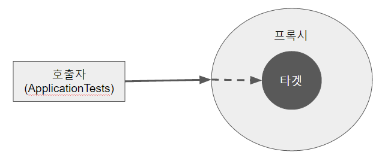

(AOP에서 프록시는 호출을 가로챈 후, 어드바이스에 등록된 기능을 수행 후 타겟 메소드를 호출합니다.)<br/>
<br/>
**인트로덕션 (Introduction)** <br/>
타겟 클래스에 코드 변경없이 신규 메소드나 멤버변수를 추가하는 기능을 얘기합니다. <br/>
자세한 설명은 [자바지기님의 포스팅](http://www.javajigi.net/pages/viewpage.action?pageId=1084) 참고 <br/>
<br/>
**위빙 (Weaving)** <br/>
지정된 객체에 애스팩트를 적용해서 새로운 프록시 객체를 생성하는 과정을 얘기합니다. <br/>
예를 들면 A라는 객체에 트랜잭션 애스팩트가 지정되어 있다면, A라는 객체가 실행되기전 커넥션을 오픈하고 실행이 끝나면 커넥션을 종료하는 기능이 추가된 프록시 객체가 생성되고, 
이 프록시 객체가 앞으로 A 객체가 호출되는 시점에서 사용됩니다. 이때의 프록시객체가 생성되는 과정을 **위빙**이라 생각하시면 됩니다. <br/> 
컴파일 타임, 클래스로드 타임, 런타임과 같은 시점에서 실행되지만, Spring AOP는 런타임에서 프록시 객체가 생성 됩니다. <br/>

AOP에서 사용되는 용어들을 대략적으로 알아보았습니다. <br/>
그럼 이들을 이용하여 실질적으로 이전의 문제들을 해결해보겠습니다. <br/>

### 실습
제일 먼저 BoardService에 애스펙트를 적용해보겠습니다. <br/>
<br/>
**Performance.java**
```
@Aspect
public class Performance {

    @Around("execution(* com.blogcode.board.BoardService.getBoards(..))")
    public Object calculatePerformanceTime(ProceedingJoinPoint proceedingJoinPoint) {
        Object result = null;
        try {
            long start = System.currentTimeMillis();
            result = proceedingJoinPoint.proceed();
            long end = System.currentTimeMillis();

            System.out.println("수행 시간 : "+ (end - start));
        } catch (Throwable throwable) {
            System.out.println("exception! ");
        }
        return result;
    }
}
```
위와 같이 애스펙트를 선언후, Spring 컨테이너의 Bean으로 등록하겠습니다.<br/>
<br/>
**Application.java**
```
	@Bean
	public Performance performance() {
		return new Performance();
	}
```

그리고 Bean으로 등록된 애스펙트의 프록시를 생성하고, 어노테이션을 해석할 수 있도록 설정을 추가하겠습니다.<br/>
<br/>
**Application.java**
```
@SpringBootApplication
@RestController
@EnableAspectJAutoProxy //오토 프록싱
public class Application implements CommandLineRunner{
    ...
}
```

이렇게 코드를 작성후에 BoardServicePerformance.java 파일을 삭제하겠습니다. <br/>
BoardServiceImpl.java는 코드를 **수정하지 않습니다.** <br/>  
BoardServiceImpl은 본인의 원래 목적인 Board와 관련된 기능에만 집중하도록 그대로 코드를 보존하고 테스트를 수행해보겠습니다. <br/>

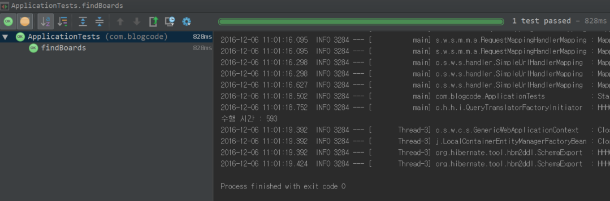

(AOP getBoards 테스트 결과) <br/>
<br/>
BoardServicePerformance 없이도 수행시간이 출력되는것을 확인할 수 있습니다. <br/>
여기서 중요한 것은 핵심로직을 담당하는 BoardServiceImpl과 BoardService는 전혀 변경이 없었다는 것입니다. <br/>
우리가 그토록 원했던 **핵심기능과 보조기능이 함께**있지만, **코드는 완전히 분리**된 상태가 된 것입니다. <br/>
자 그럼 하나하나 사용한 코드에 대해 알아보겠습니다. <br/>

### 사용법
방금 전 예제에서 사용한 코드 중 처음 보는 코드가 몇개가 있을 것입니다. <br/>
그 중 가장 독특한 것이 아래와 같은 코드라 예상됩니다. <br/>

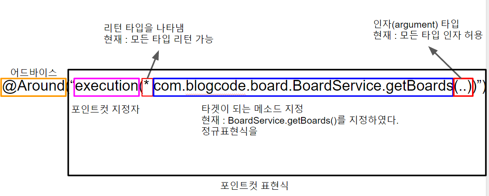

(예제에서 사용한 코드 해석)<br/>
<br/>
제일 먼저 보이는 @Around는 **어드바이스**입니다. <br/>
앞서 설명드린것 처럼 어드바이스는 애스펙트가 "무엇을", "언제" 할지를 의미하고 있습니다. <br/>
여기서 "무엇"은 calculatePerformanceTime() 메소드를 나타냅니다. <br/>
그리고 "언제"는 @Around가 되는데, 이 언제 라는 시점의 경우 @Around만 존재하지 않고 총 5가지의 타입이 존재합니다.
<br/>
* @Before (이전) 
  - 어드바이스 타겟 메소드가 호출되기 전에 어드바이스 기능을 수행
* @After (이후)
  - 타겟 메소드의 결과에 관계없이(즉 성공, 예외 관계없이) 타겟 메소드가 완료 되면 어드바이스 기능을 수행
* @AfterReturning (정상적 반환 이후)
  - 타겟 메소드가 성공적으로 결과값을 반환 후에 어드바이스 기능을 수행
* @AfterThrowing (예외 발생 이후)
  - 타겟 메소드가 수행 중 예외를 던지게 되면 어드바이스 기능을 수행
* @Around (메소드 실행 전후)
  - 어드바이스가 타겟 메소드를 감싸서 타겟 메소드 호출전과 후에 어드바이스 기능을 수행

예를 들어 타겟 메소드의 이전 시점에서만 어드바이스 메소드를 수행하고 싶다면, 
```
@Before("포인트컷 표현식")
public void 어드바이스메소드() {
    ....
}
```
식으로 작성하시면 됩니다. <br/>
여기서 주의하실 점은 @Around의 경우 **반드시 proceed() 메소드가 호출**되어야 한다는 것입니다. <br/>
proceed() 메소드는 타겟 메소드를 지칭하기 때문에 proceed 메소드를 실행시켜야만 타겟 메소드가 수행이 된다는것을 잊으시면 안됩니다. <br/>
<br/>
다음으로 알아볼것은 @Around 다음에 작성된 ```"execution(* com.blogcode.board.BoardService.getBoards(..))"``` 입니다. <br/>
어드바이스의 value로 들어간 이 문자열을 **포인트컷 표현식** 이라고 합니다. <br/>
포인트컷 표현식은 2가지로 나눠지는데, ```execution```을 **지정자**라고 부르며 <br/>
```(* com.blogcode.board.BoardService.getBoards(..))```는 **타겟 명세**라고 합니다. <br/>
포인트컷 지정자는 execution을 포함하여 총 9가지가 있습니다. <br/>
* args()
  - 메소드의 인자가 타겟 명세에 포함된 타입일 경우
  - ex) args(java.io.Serializable) : 하나의 파라미터를 갖고, 그 인자가 Serializable 타입인 모든 메소드
* @args()
  - 메소드의 인자가 타겟 명세에 포함된 어노테이션 타입을 갖는 경우
  - ex) @args(com.blogcode.session.User) : 하나의 파라미터를 갖고, 그 인자의 타입이 @User 어노테이션을 갖는 모든 메소드 (@User User user 같이 인자 선언된 메소드)
* execution()
  - 접근제한자, 리턴타입, 인자타입, 클래스/인터페이스, 메소드명, 파라미터타입, 예외타입 등을 전부 조합가능한 가장 세심한 지정자
  - 이전 예제와 같이 풀패키지에 메소드명까지 직접 지정할 수도 있으며, 아래와 같이 특정 타입내의 모든 메소드를 지정할 수도 있다.
  - ex) execution(* com.blogcode.service.AccountService.*(..) : AccountService 인터페이스의 모든 메소드
* within()
  - execution 지정자에서 클래스/인터페이스까지만 적용된 경우
  - 즉, 클래스 혹은 인터페이스 단위까지만 범위 지정이 가능하다.
  - ex) within(com.blogcode.service.*) : service 패키지 아래의 클래스와 인터페이스가 가진 모든 메소드
  - ex) within(com.blogcode.service..*) : service 아래의 모든 **하위패키지까지** 포함한 클래스와 인터페이스가 가진 메소드
* @within()
  - 주어진 어노테이션을 사용하는 타입으로 선언된 메소드
* this()
  - 타겟 메소드가 지정된 빈 타입의 인스턴스인 경우
* target()
  - this와 유사하지만 빈 타입이 아닌 타입의 인스턴스인 경우
* @target()
  - 타겟 메소드를 실행하는 객체의 클래스가 타겟 명세에 지정된 타입의 어노테이션이 있는 경우
* @annotation
  - 타겟 메소드에 특정 어노테이션이 지정된 경우
  - ex) @annotation(org.springframework.transaction.annotation.Transactional) : Transactional 어노테이션이 지정된 메소드 전부

다양한 지정자가 등장하였지만 실제로 execution과 @annotation을 주로 사용하는 것으로 알고 있습니다. (혹시 아니라면 댓글 부탁드립니다.) <br/>
기본적인 사용법을 정리하였으니, 이젠 좀 더 응용해서 사용해보겠습니다.

### 사용법 확장
먼저 아직 AOP가 적용되지 않은 UserService를 진행해보겠습니다. <br/>
**Perpormance.java**
```
@Around("execution(* com.blogcode.board.BoardService.getBoards(..)) || execution(* com.blogcode.user.UserService.getUsers(..))")
```
포인트컷 표현식에 OR 연산자인 ||를 이용하여 UserService를 추가시켰습니다. <br/>
이로 인해 알 수 있는 것은 포인트컷 표현식에는 AND, OR, NOT와 같은 **관계연산자를 이용**할 수 있다는 것입니다. <br/>
여기서 만약 추가로 표현식이 더 추가가 되면 어떻게 될까요? <br/>
저 긴 표현식이 하나씩 추가 될때마다 가독성에 큰 무리가 있습니다. <br/>
추가로 해당 표현식을 재사용하고 싶을땐 어떻게 해야할까요? 변수처럼 표현식을 담을수는 없을까요? <br/>
이제 저 표현식을 변수처럼 변경해보겠습니다. <br/>

```
@Aspect
public class Performance {

    @Pointcut("execution(* com.blogcode.board.BoardService.getBoards(..))")
    public void getBoards(){}

    @Pointcut("execution(* com.blogcode.user.UserService.getUsers(..))")
    public void getUsers(){}

    @Around("getBoards() || getUsers()")
    public Object calculatePerformanceTime(ProceedingJoinPoint proceedingJoinPoint) {
        Object result = null;
        try {
            long start = System.currentTimeMillis();
            result = proceedingJoinPoint.proceed();
            long end = System.currentTimeMillis();

            System.out.println("수행 시간 : "+ (end - start));
        } catch (Throwable throwable) {
            System.out.println("exception! ");
        }
        return result;
    }
}
```
@Pointcut 어노테이션은 애스펙트에서 마치 변수와 같이 **재사용 가능한 포인트컷**을 정의할 수 있습니다.
그래서 이를 이용하여 각각의 표현식을 getBoards() 메소드와 getUsers() 메소드에 담았습니다. <br/>
이렇게 될 경우 다음부터는 동일한 표현식은 **미리 지정된 메소드명으로 표현식을 그대로 사용**할 수 있는 것입니다. <br/>
<br/>
그럼 좀 더 추가예제를 진행해보겠습니다. <br/>
여태 한 것은 파라미터가 없는 애스펙트만 다루었습니다. <br/>
만약 타겟 메소드를 어드바이스 하는 애스펙트가 타겟 메소드에 전달된 인자(Arguments)값을 사용하고 싶을땐 어떻게 해야할까요? <br/>
이번엔 타겟 메소드의 인자를 사용하는 애스펙트를 만들어 보겠습니다. <br/>
신규 기능은 User의 정보가 수정되면 이를 History에서 저장하여 관리하는 **수정내역관리** 입니다.
userService의 update 메소드가 실행될때마다 History Table에 user의 idx가 저장되도록 코드를 추가하겠습니다. <br/>
<br/>
**History.java**
```
@Entity
public class History {

    @Id
    @GeneratedValue
    private long idx;

    @Column
    private long userIdx;

    @Column
    private Date updateDate;

    public History() {
    }

    public History(long userIdx, Date updateDate) {
        this.userIdx = userIdx;
        this.updateDate = updateDate;
    }

    public long getIdx() {
        return idx;
    }

    public void setIdx(long idx) {
        this.idx = idx;
    }

    public long getUserIdx() {
        return userIdx;
    }

    public void setUserIdx(long userIdx) {
        this.userIdx = userIdx;
    }

    public Date getUpdateDate() {
        return updateDate;
    }

    public void setUpdateDate(Date updateDate) {
        this.updateDate = updateDate;
    }
}
```

**HistoryRepository.java**
```
@Repository
public interface HistoryRepository extends JpaRepository<History, Long>{}

```
**UserHistory**
```
@Aspect
@Component // @Bean과 동일하게 Spring Bean 등록 어노테이션
public class UserHistory {

    @Autowired
    private HistoryRepository historyRepository;

    @Pointcut("execution(* com.blogcode.user.UserService.update(*)) && args(user)")
    public void updateUser(User user){}

    @AfterReturning("updateUser(user)")
    public void saveHistory(User user){
        historyRepository.save(new History(user.getIdx()));
    }
}
```
가장 중요한 UserHistory 애스펙트입니다. <br/>
이전의 Performance 애스펙트와 다르게 bean등록을 @Bean을 사용하지 않고 @Component를 사용하여 등록하였습니다. <br/>
(@Bean과 @Component의 차이는 [이전의 포스팅](http://jojoldu.tistory.com/27)을 참고하시면 될것 같습니다.) <br/>
**애스펙트 역시 Spring이 관리하는 bean**이기 때문에 같은 bean인 HistoryRepository를 사용할 수 있습니다. <br/>
<br/>
여기 코드에서 중점으로 보셔야할 것은 ```args(user)``` 표현식입니다. <br/>
해당 표현식을 통해 타겟 메소드의 인자와 어드바이스의 인자가 매칭이 되는 것입니다. <br/>
(저 코드를 제거해보시면 무슨말인지 바로 이해하실 수 있으실 것입니다.)<br/>
updateUser라는 포인트컷이 user라는 인자를 사용하도록 args(user) 표현식으로 지정한 것입니다. <br/>
<br/>
@AfterReturning를 통해 **정상적으로 타겟 메소드가 실행 후**에 DB에 저장되도록 구현을 완성하였습니다. <br/>
자 그럼 마지막으로 UserService와 UserServiceImpl 코드를 수정하도록 하겠습니다. <br/>
<br/>
**UserService.java와 UserServiceImpl.java**
```
public interface UserService {
    List<User> getUsers();

    void update(User user) throws Exception;
}

@Service
public class UserServiceImpl implements UserService{

    @Autowired
    private UserRepository repository;

    @Override
    public List<User> getUsers() {
        return repository.findAll();
    }

    @Override
    public void update(User user) throws Exception{
        repository.save(user);
    }
}
```
최종적으로 프로젝트 구조는 아래와 같습니다. <br/>

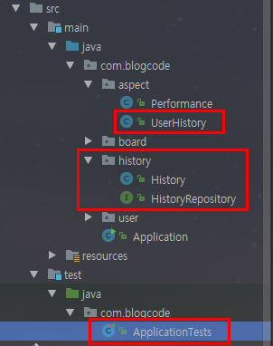

(최종 프로젝트 구조)<br/>
<br/>
그럼 위 코드가 정상적으로 작동하는지 확인 하기 위해 테스트 코드를 작성하겠습니다. <br/>

**ApplicationTests.java**
```
@RunWith(SpringRunner.class)
@SpringBootTest
public class ApplicationTests {

	@Autowired
	private UserService userService;

	@Autowired
	private HistoryRepository historyRepository;

	@Test
	public void updateUsers() throws Exception {
		List<User> users = userService.getUsers();
		for(int i=0;i<5;i++){
			User user = users.get(i);
			user.setEmail("jojoldu@gmail.com");
			userService.update(user);
		}

		List<History> histories = historyRepository.findAll();
		assertThat(histories.size()).isEqualTo(5);
		assertThat(histories.get(0).getUserIdx()).isEqualTo(1L);
		assertThat(histories.get(1).getUserIdx()).isEqualTo(2L);
	}
}
```
1~5까지의 user들의 메일을 수정하였습니다. <br/>
그리고 수정 후, History 테이블에 정상적으로 데이터가 들어간 것인지 확인하도록 코드가 작성되었습니다. <br/>
그럼 테스트를 돌려보겠습니다!

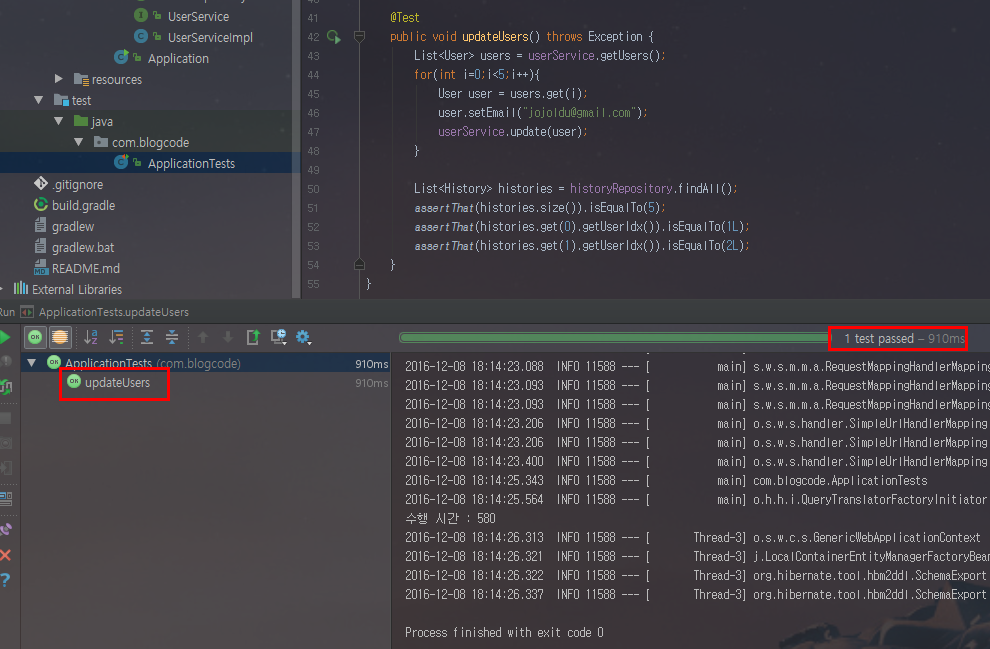

(테스트 결과) <br/>
<br/>
짠! 테스트가 정확히 통과하는 것을 확인할 수 있습니다. <br/>
AOP에 대해 어느정도 감이 잡히시나요? <br/>
저 개인적으로 Spring을 다시 이해해야하는 시기가 되서 공부중인데 다른분들께도 조금이나마 도움이 되었길 바랄뿐입니다. <br/>
여기에 소개한 예제외에도 AOP는 많은 곳에서 사용되고 있습니다. <br/>
실제로 트랜잭션, 캐시 추상화 외에도 프로젝트에 맞춰 AOP를 사용하는 경우가 많습니다. <br/>
예를 들어 Dao에서 Service를, Service에서 Controller를 호출하지 못하도록(계층형 구조에서 하위계층이 상위 계층을 호출하는 것은 금지합니다.) 막는 용도로 사용되기도 합니다. <br/>
([백기선님의 블로그](http://whiteship.tistory.com/1960) 참고) <br/>
이외에도 AOP를 사용한 사례를 많은 분들이 공유해주시면 저같은 주니어 개발자들이 AOP와 스프링을 이해하는데 큰 도움이 되지 않을까 생각합니다^^;
너무나 긴글 끝까지 읽어주셔서 정말 감사드립니다.

### 마무리
> 작성하면서도 이게 과연 다른분들께 얼마나 이해를 드릴수있을까 하는 고민이 계속 들었던 포스팅인것 같습니다.<br/>
개인적으로 감사한 것은 이번주 평일이 전부 휴가로 쉴 수 있어서 마무리 할 수 있었습니다. <br/>
평소 시간만으로는 생각보다 진도가 나가지 않아 포스팅을 완료하는데 정말 긴 시간이 들었습니다. <br/>

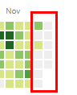

> 보시는것처럼 11월 28일부터 contribution이 없는데, aop 작업을 브랜치를 따서 진행하다보니 master에 머지된것이 없어 여태껏 커밋그래프가 비어보이게 되었습니다. ㅠㅠ <br/>
이번 내용이 merge되면 아마 이쁜 그래프로 다시 돌아갈것 같습니다. <br/>
다음은 전에 작성했던 [블랙잭 게임의 코드리뷰](http://okky.kr/article/362491?note=1147582)를 반영해보려고 합니다. <br/>
계속해서 좋은 내용들을 정리하고 공유하도록 하겠습니다. 매번 방문해주셔서 더할나위 없이 감사드립니다.