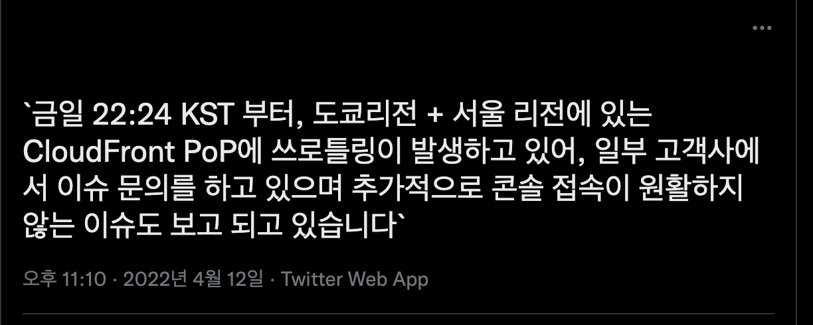
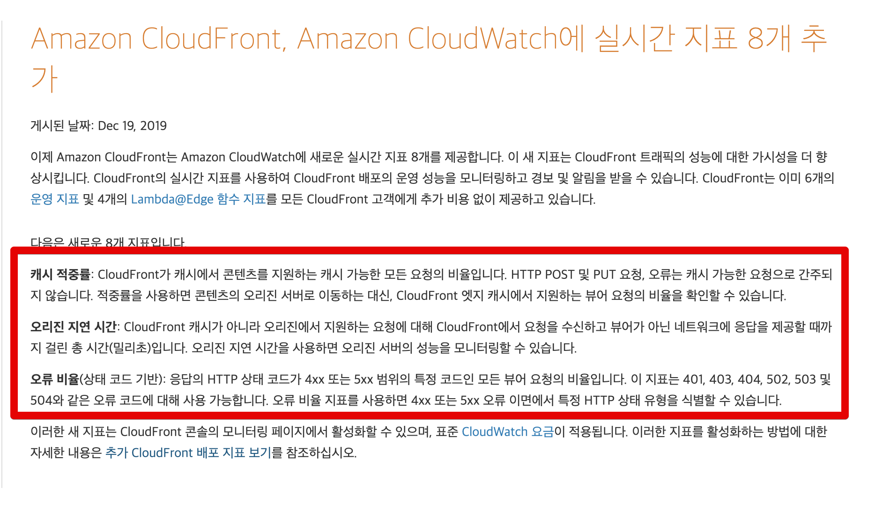
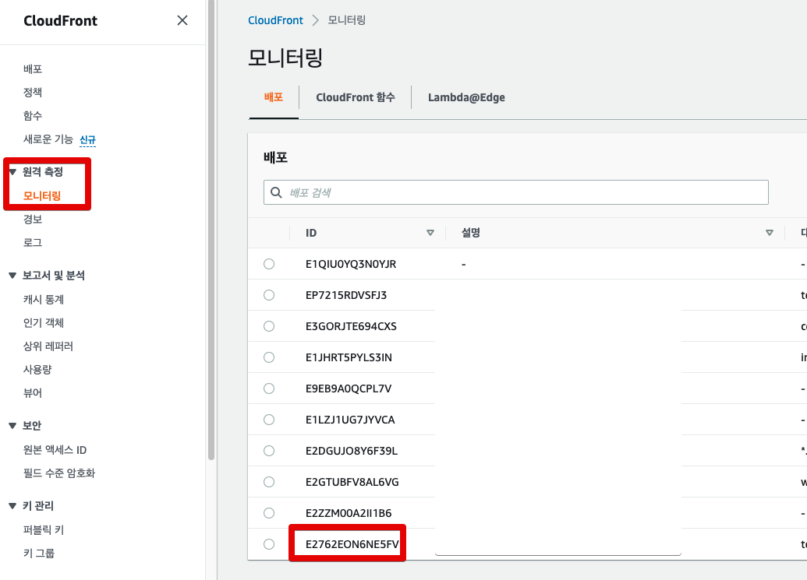
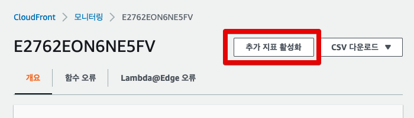
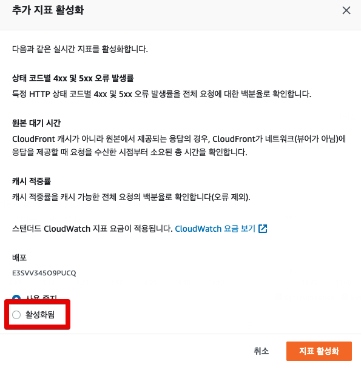
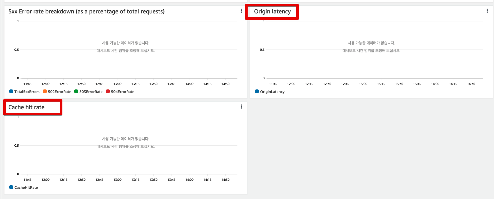
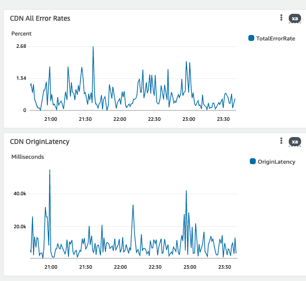
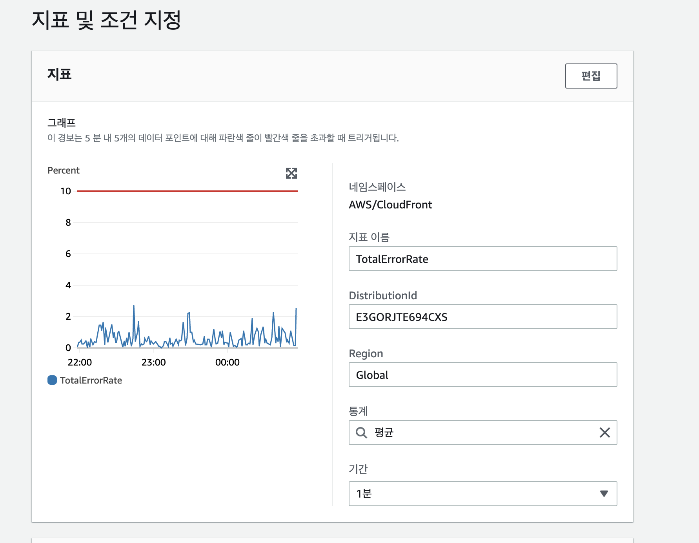
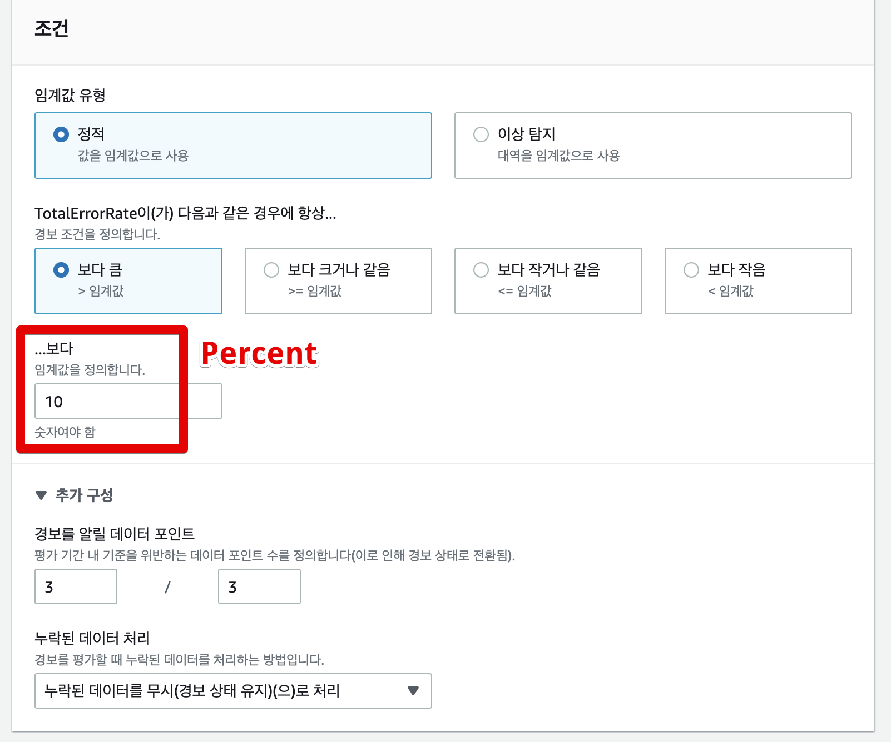
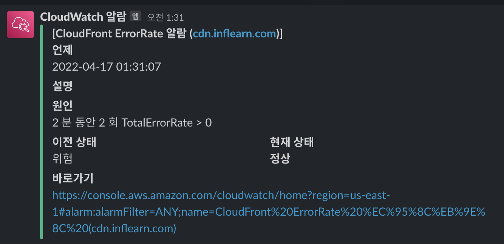

# CloudFront 모니터링 하기

최근에 AWS의 서울/도쿄 리전에서 CloudFront 장애가 발생했다.  

([착한 트위터의 세계](https://twitter.com/search?q=cloudfront&src=typed_query)에서는 실시간으로 공유가 된다)  
  
EC2, RDS, ElasticCache에 비해 CloudFront는 모니터링을 잘 안하게 되는데, 장애가 발생하면 서비스 전체에 직격타가 된다.  
  
대부분의 정적 파일 (이미지 등)이 CloudFront를 통한 CDN으로 전달이 되기 때문이다.  
  
그래서 CloudFront가 평소보다 응답이 늦거나 에러 발생율이 높을때를 알 수 있게 모니터링할 필요가 있다.  
  
여기서는 바로 적용할 수 있는 CloudWatch로 모니터링 하는 방법을 소개하지만, 만약 Datadog 같이 전문적인 APM 도구를 사용하고 있다면 APM을 통해 CloudFront를 모니터링하고 알람을 거는 것이 장기적인 관점에서 훨씬 좋다.  

* [Datadog & CloudFront integrations](https://docs.datadoghq.com/integrations/amazon_cloudfront/?tab=standardlogs)

## 1. CloudFront 설정

CloudFront의 메트릭 지표를 CloudWatch로 바로 설정하면 좋겠지만, **일부 주요 지표들은 별도의 설정**이 되어야만 수집이 가능하다.  

추가 설정으로 수집 가능한 지표는 다음과 같다.
  
* 캐시 적중율 (Cache Hit Rate) 
* 지연시간 (Origin Latency)
* Status별 오류 비율 (Error Rate by status code)

([AWS 공식 문서](https://aws.amazon.com/ko/about-aws/whats-new/2019/12/cloudfront-realtime-metrics/))  

위 지표들 역시 `TotalErrorRate` 와 더불어 CF 모니터링에 주요하기 때문에 지표 활성화를 꼭 하면 좋다.   
  
설정 방법은 다음과 같다.

* 원격 측정 -> 모니터링 -> 배포 -> **배포 지표 보기**

CloudFront의 원격측정 -> 모니터링으로 이동후, 원하는 ID를 선택후 **배포 지표 보기**버튼을 클릭한다.

모니터링 개요를 보면 우측 상단에 **추가 지표 활성화** 버튼을 클릭한다.

기본값이 사용중지이기 때문에 **활성화**를 선택후 지표 활성화 버튼을 클릭한다.

이렇게 하면 이제 캐시 히트율, 레이턴시등 여러 지표들을 CloudWatch로 수집할 수 있게 된다.

## 2. CloudWatch 설정

위와 같이 설정이 끝나면 이제 CloudWatch 대시보드에서 추가 지표들을 모니터링할 수 있게 된다.

TotalErrorRate의 경우엔 추가 지표 항목은 아니지만 **모든 에러들의 비율**을 확인할 수 있기 때문에 대시 보드상에서 추가해놓으면 좋다.  

수집 가능한 지표들은 CloudWatch의 경보를 통해 이상지표, 특정 수치 이상으로 튈 경우 Slack 알람 발송이 가능하다.  
  
예를 들어 TotalErrorRate에 대해 Slack 알람발송을 하고 싶다면, 

* CloudWatch -> 경보 -> 모든 경보 -> 경보생성

으로 들어가 본인이 원하는 이상 수치로 설정해서 알림을 발송할 수 있다.

ErrorRate의 경우 이상 탐지로 해도 괜찮으나, 서비스에 따라 너무 들쑥날쑥한 지표가 된다면 차라리 특정 수치 이상일 경우 알람이 가도록 하는것도 좋다.  
  
여기서는 **10%이상일 경우**로 지정했다.  

그리고 정상 -> 경보, 경보 -> 정상일 경우 Slack 알람이 가도록 구성한다.

(테스트용도로 0%일 경우 발송이 되는지 진행했을때의 슬랙 알람이다.)  

> CloudWatch 경보 & SNS & Lambda를 통한 Slack 알람 발송의 자세한 구성 방법은 [이전에 작성된 포스팅](https://jojoldu.tistory.com/586)을 참고한다.