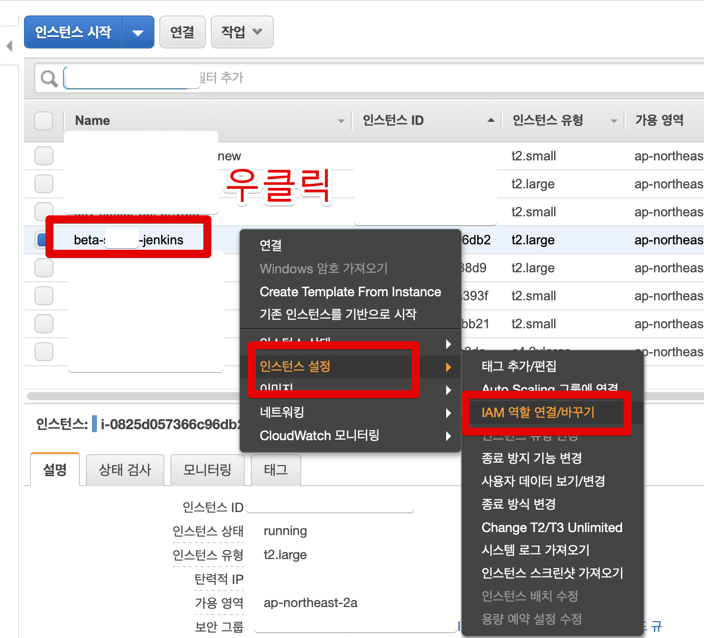
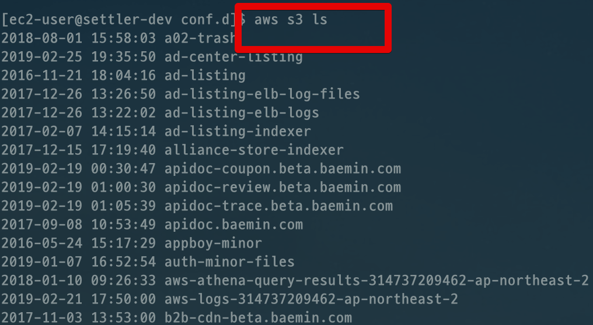
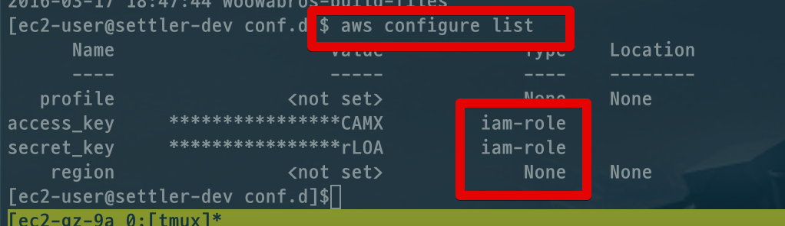

# AWS Credentials were refreshed 발생시 해결 방법

S3를 사용하는 젠킨스 서버에서 갑자기 아래와 같은 에러가 발생했습니다.

```bash
fatal error: Credentials were refreshed, but the refreshed credentials are still expired.
```

EC2에 등록된 인증 방식이 만료되었다는 의미인데요.  
저는 **access_key와 secret_key를 등록하지 않았습니다**.  
그럼에도 발생한것이죠.  
  
이유는 IAM Role로 할당한 것 역시 인증 방식으로 보기 때문입니다.  
  
그래서 이를 갱신하겠습니다.  
EC2의 IAM 교체를 선택합니다.



갱신을 해야하니 아래와 같이 진행합니다.

* **기존과 다른 Role**을 선택해서 저장
* 저장 완료 되면 다시 **기존 Role 선택해서 저장**

여기서 **기존과 같은 Role을 선택**하는 이유는 EC2에 할당된 인증이 만료 된 것이지, **Role 자체가 만료된 건 아닙니다**.  
  
동일한 정책을 가진 Role을 계속 만들긴 귀찮으니 기존걸 다시 선택하시면 됩니다.  
  
갱신하셨으면 **꼭! EC2를 재부팅하셔야 됩니다**.

```bash
sudo reboot
```

부팅이 끝났다면 간단한 aws cli를 실행해봅니다.



정상적으로 cli가 실행됐다면, 최종적으로 key 등록까지 확인합니다.  
  
아래와 같이 **iam-role** 로 저장되어있는게 확인되면 정상적으로 갱신된 것입니다.



