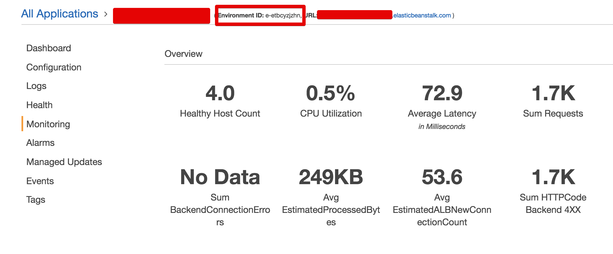
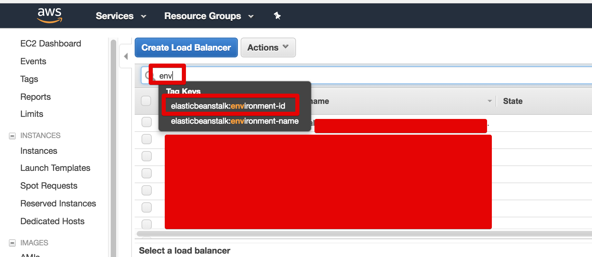
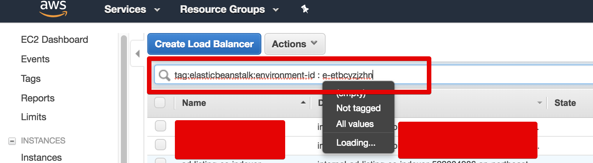
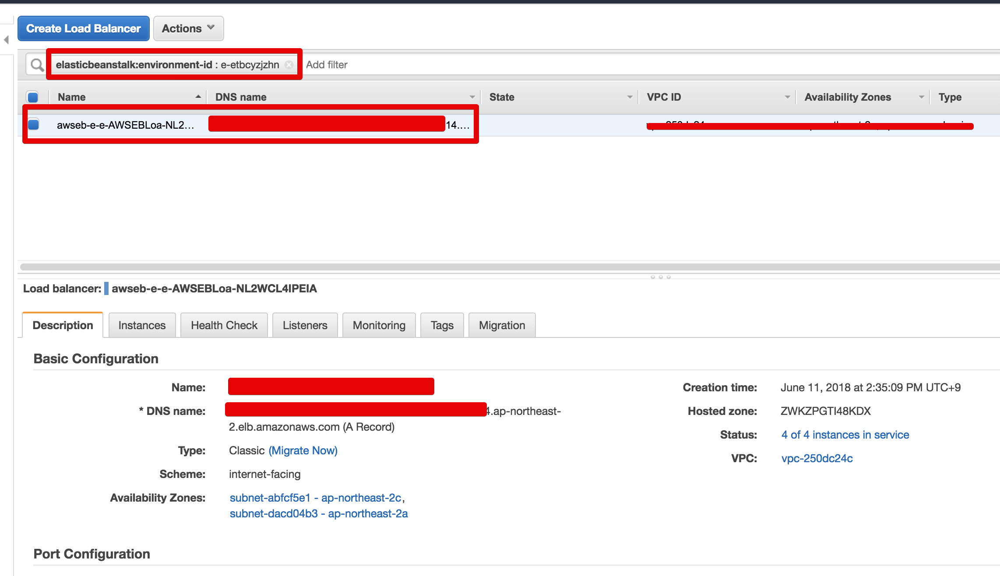

# AWS ElasticBeanstalk의 ELB 찾기

AWS ElasticBeanstalk의 경우 ELB가 자동 생성 및 할당되지만, 이를 ELB 항목에서 찾기가 쉽지 않습니다.  
ELB를 찾을수 있어야 좀 더 **다양한 메트릭과 연결된 인스턴스 상태**를 볼수 있기 때문에 혹시 모르셨다면 꼭 해보시길 추천드립니다.  

## 본문

아래와 같이 ElasticBeanstalk의 Environment 메인화면을 보면 **Environment ID**가 있습니다.  



이 값을 복사하고, Load Balancer 서비스로 이동합니다.  
검색창에 ```env```만 입력하시면, 아래처럼 추천검색어가 나오는데요.



여기서 ```environment-id```를 선택합니다.  
그리고 다음 값에 EB에서 복사한 **Environment ID**을 입력합니다.  



그리고 ```Enter```를 치시면!  



이렇게 ElasticBeanstalk의 ELB가 바로 검색이 됩니다.  

