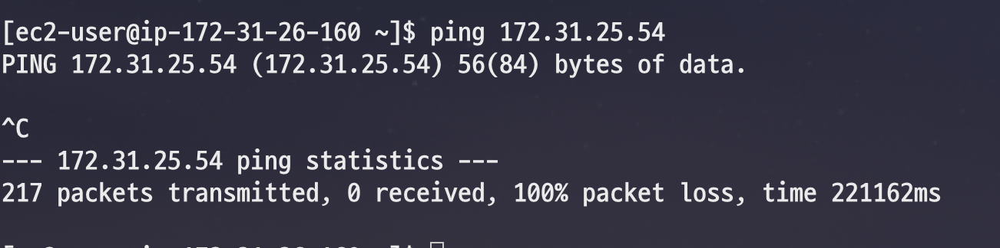
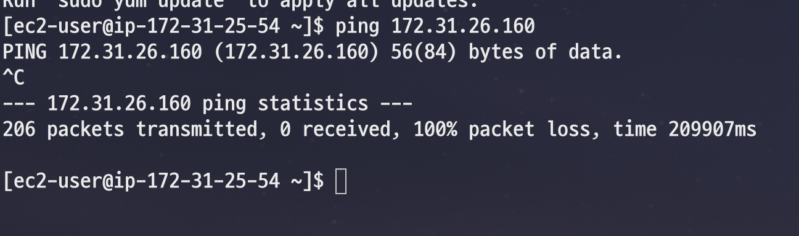
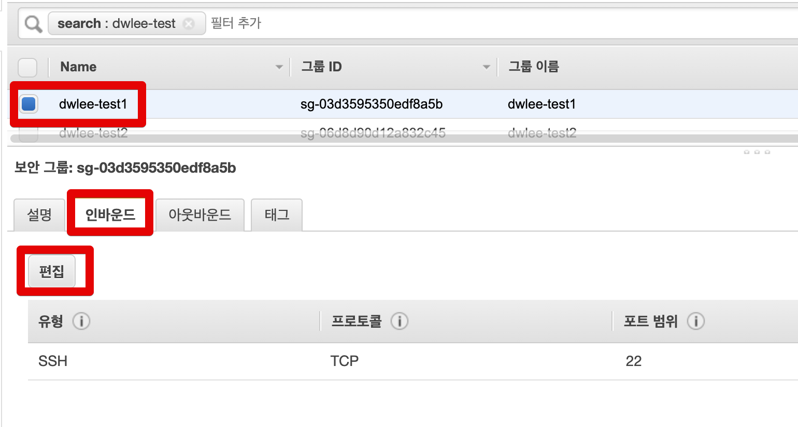
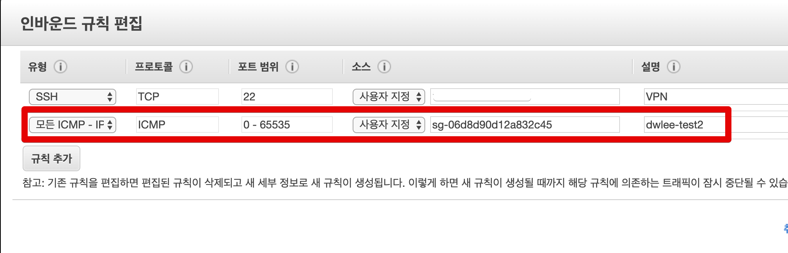
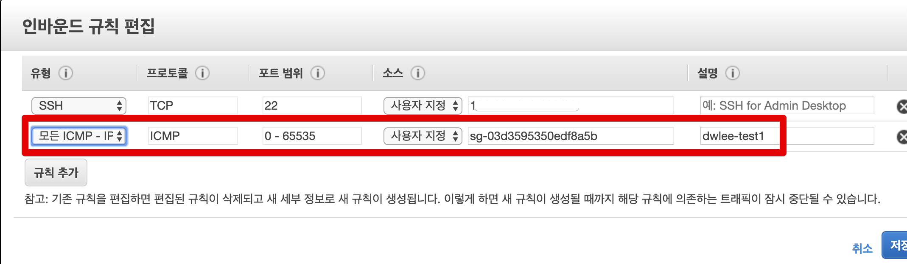
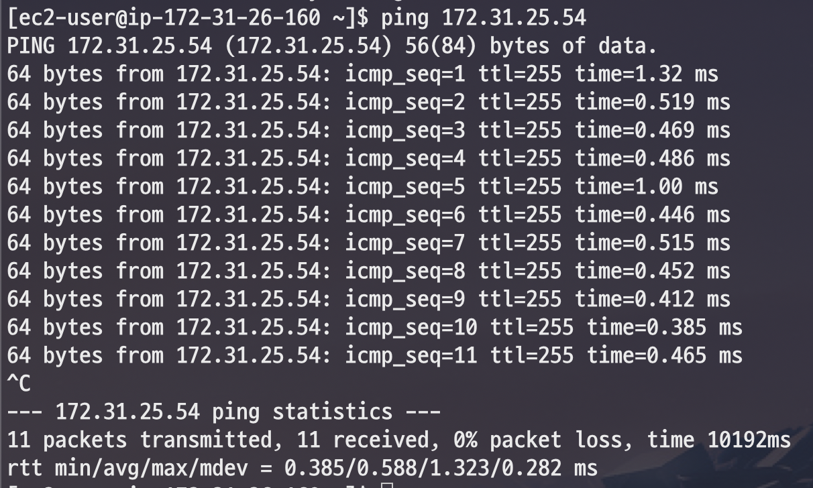
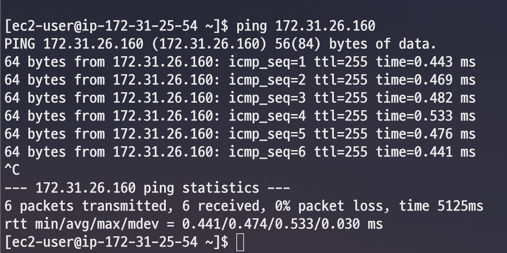
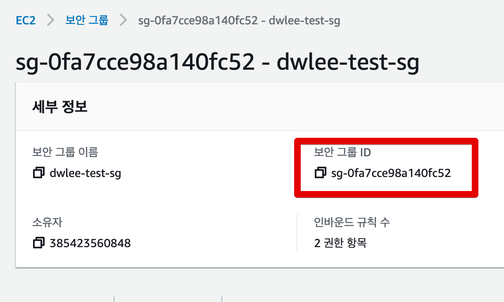
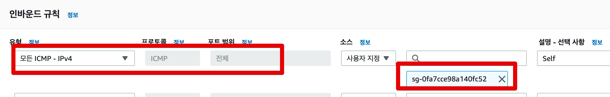

# 서로 다른 EC2 인스턴스간에 연결하기 (feat. SSH)

서로 다른 EC2 인스턴스간에 통신이 필요할때가 있습니다.  

* 앤서블을 통한 전체 명령어 수행
* 쉘 스크립트 혹은 젠킨스를 통한 명령어 수행

등등 외부에서 ssh 혹은 scp 명령어 수행 등이 필요한 상황입니다.  
  
기본적으로는 해당 EC2의 **IP를 보안 그룹에 추가**하는 걸로 해결이 됩니다.  
  
다만 이 방식은 **IP가 변경 되면 무용지물**이 됩니다.  

* 오토 스케일링 그룹 (ASG) 으로 신규 추가된 서버들
* 빈스톡 (Beanstalk) 으로 신규 추가된 서버들
* EIP (탄력적 IP) 를 사용하지 않는 서버의 재부팅

이런 경우 매번 보안 그룹에 신규 IP를 추가해야만 합니다.  
  
이 과정이 너무 귀찮으니 다른 해결책을 진행해보겠습니다.  

## 1. 환경

먼저 2개의 EC2 인스턴스가 있다고 가정합니다.  
  
둘은 **서로 다른 보안 그룹**을 가지고 있습니다.  
스펙은 아래와 같습니다.

* test1 인스턴스
  * 인스턴스명: dwlee-test1
  * private IP: 172.31.26.160
  * 보안그룹 이름: dwlee-test1
  * 보안그룹 코드: sg-03d3595350edf8a5b
* test2 인스턴스
  * 인스턴스명: dwlee-test2
  * private IP: 172.31.25.54
  * 보안그룹 이름: dwlee-test2
  * 보안그룹 코드: sg-06d8d90d12a832c45

현재는 둘 사이에 ```ping```을 날려보면 서로 응답이 오지 않습니다.  
  
**1->2**



**2->1**



이제 이걸 해결해보겠습니다.

## 2. 해결

방법은 간단합니다.  
**나의 보안 그룹이 상대의 보안 그룹을 인바운드로 가지고** 있으면 됩니다.  
  
먼저 1번 인스턴스의 보안 그룹으로 이동합니다.



보안 그룹 인바운드에 아래와 같이 **2번 인스턴스의 보안 그룹 코드**를 등록합니다.



그리고 2번 인스턴스에는 **1번 인스턴스의 보안 그룹 코드**를 등록합니다.



자 그리고 다시 테스트를 해보면!  
  
**1->2**



**2->1**



정상적으로 서로 통신이 되는 것을 확인할 수 있습니다.  
  
이제는 새로운 인스턴스가 추가되어도 **같은 보안 그룹만 가지고 있으면 서로 통신**할 수 있습니다.  

> 저는 테스트를 위해 전체 포트를 열었지만, 실제로 사용하실때는 22 (ssh 포트), 3306 (RDS 포트) 등 **필요한 포트만 열어서** 사용하시면 됩니다.

## 3. 같은 보안그룹으로 통신하려면?

서로 다른 보안 그룹을 갖고 있을때는 위 처럼 사용하면 되는데, 만약 EC2들이 **서로 같은 보안 그룹**을 갖고 있다면 어떻게 해야할까요?  
  
위와 비슷하게 **Self 참조**를 하면 됩니다.  
  
이를테면 **A 보안 그룹**을 사용하는 EC2들간에 통신이 되어야 한다면 A 보안그룹의 ID를



**A 보안그룹의 인바운드에 등록** 하면 됩니다.



그럼 **해당 보안 그룹을 갖고 있는 EC2들 간에는 서로 통신**이 되는 것을 확인할 수 있습니다.


