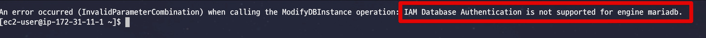

# RDS에 IAM 권한으로 접근하기

> [Github](https://github.com/jojoldu/income-bot) 코드가 있습니다.

## 주의 사항

MySQL / PostgreSQL 을 제외하고는 IAM DB 인증 옵션이 없습니다.  
다음과 같이 CLI로 실행하시려고 해도 해결이 되지 않습니다.

```bash
aws rds modify-db-instance \
    --db-instance-identifier mydbinstance \
    --apply-immediately \
    --enable-iam-database-authentication
```





