# 서로 다른 계정의 RDS에 대량 데이터 복사하기

다른 계정의 RDS 데이터를 대량으로 복사해야할 때가 있습니다.  
예를 들어 테스트를 위해 운영 DB의 데이터를 개발 DB로 복사해야하는 등의 일이 될수 있겠죠?  
이런 일이 있을때 해결할 수 있는 방법 2가지를 소개합니다.

## 1. 스냅샷으로 전체 백업하기

RDS간 데이터 복사에 가장 흔한 방법이 스냅샷을 이용하는 것입니다.  
여기선 좀 더 현실감 있고, 이해하기 쉽게 **운영 RDS의 데이터를 개발 RDS로 복사**하는 과정이라고 하겠습니다.  
  
> 다만 스냅샷은 **새로운 DB를 생성할때만 사용**할 수 있습니다.  
기존 DB에 데이터를 넣을때는 사용할 수 없습니다.  
만약 전체 데이터와 스키마를 이미 생성된 DB에 넣고 싶다면 DB Dump를 사용해보세요.

먼저 운영 RDS의 Snapshots 페이지로 가보겠습니다.

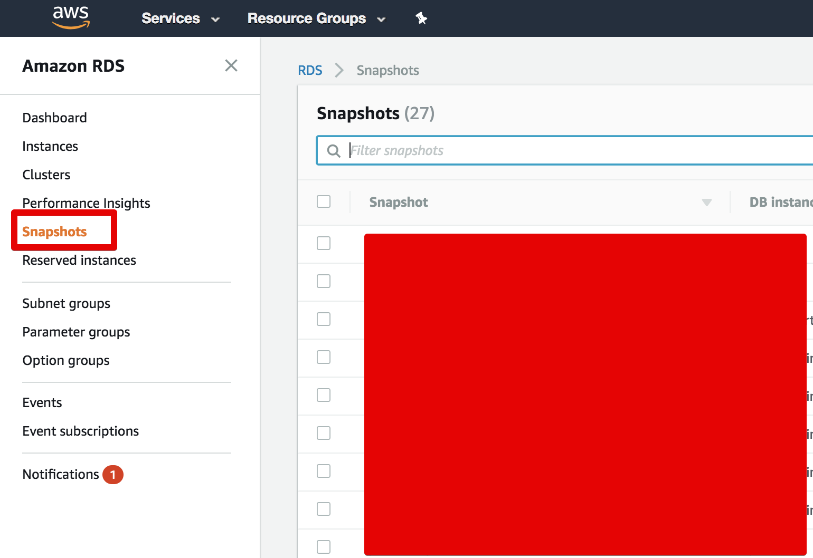

대부분의 RDS는 기본설정에 따라 Snapshots을 남기고 있는데요.  
여기서 **수동 생성한 Snapshots만 공유가 가능합니다**.  
  
예를 들어 RDS 옵션으로 자동 생성한 Snapshot의 경우 아래 그림처럼 Share Snapshot 버튼이 비활성화 되어있습니다.

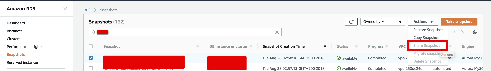

하지만 수동으로 생성한 Snapshot은 Share Snapshot이 활성화 되어있는 것을 알 수 있습니다.  

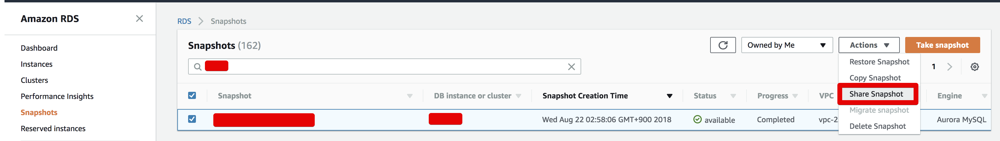

그래서 저희는 수동 Snapshot을 하나 생성하겠습니다.  
원하시는 날짜의 Snapshot을 선택하시고, Copy Snapshot을 선택합니다.

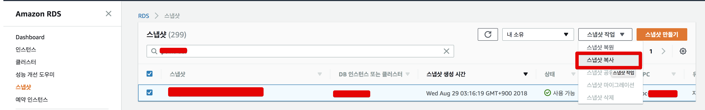

그럼 아래와 같은 설정 화면이 나올텐데요.  
원하시는 값으로 설정하신후 생성 버튼을 클릭합니다.

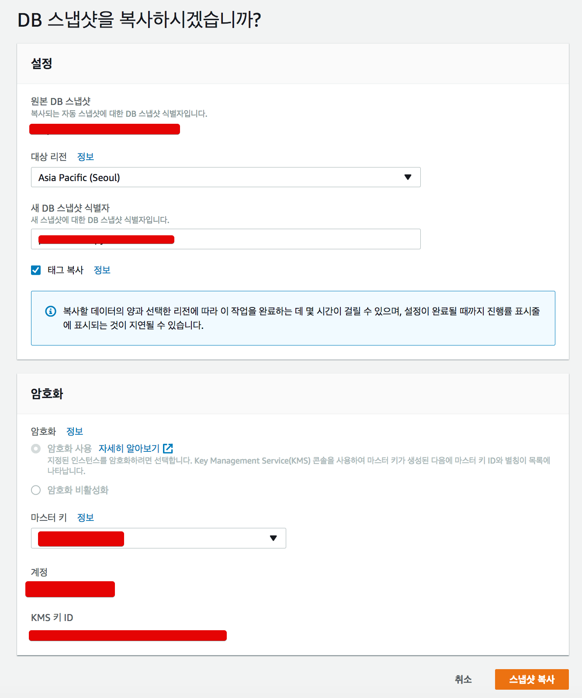

그럼 아래처럼 Snapshot이 복사되고 있는 것을 확인할 수 있습니다.

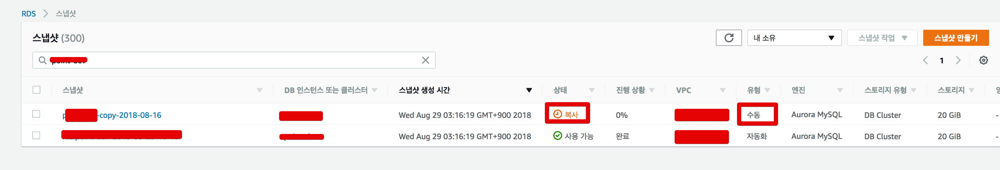

Status가 available이 될때까지 기다리신뒤, 생성이 완료 되면 복사 Snapshot을 선택하고 Share Snapshot을 선택합니다.

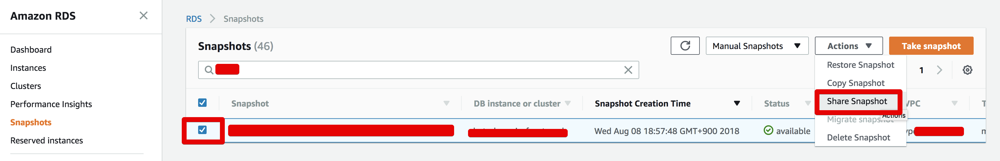

공유 설정 페이지로 가셔서 아래와 같이 설정합니다.

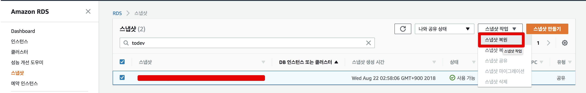

* Snapshot visibility는 **Private**로 설정
* Account ID에는 개발 AWS 계정 (복사 받을) 의 Account ID를 등록

여기서 AccountID는 **로그인할때 사용하는 계정은 아닙니다**.  
이걸 확인하시려면 복사 받을 계정으로 가셔서 우측 상단의 지원 (Support) -> 지원 센터 -> Account number를 보시면 됩니다.  
**Account number가 Account ID**입니다.  
  
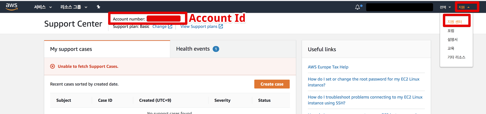

ID를 확인하셨다면 Share Snapshot 화면에서 Input 화면에 ID를 등록 하신후 ADD 버튼을 클릭합니다.  
그러면 아래와 같이 해당 ID가 추가된 것을 확인할 수 있습니다.

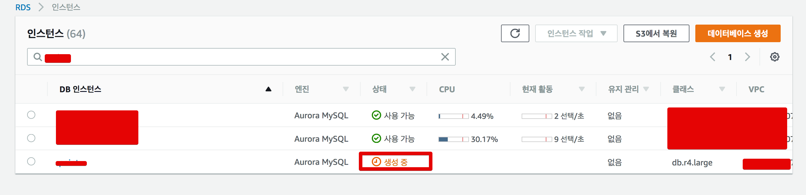

추가가 완료 되시면 개발 AWS 계정 (복사 받을) 계정의 RDS Snapshot 페이지로 가셔서 **Shared with Me(나와 공유 상태)** 버튼을 클릭해서 공유 된 것을 확인합니다.

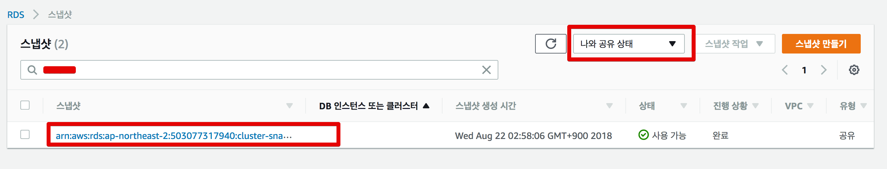

그럼 이 Snapshot을 통해 **복원**을 진행합니다.


이외 다른 설정들은 복원 되어 생성된 RDS에서 수정할 수 있습니다.

* DB Parameter Group
* Security Group
* 계정 비밀번호

등등은 생성후 수정해서 진행하시면 됩니다.  
  
자 그럼 생성되는걸 기다립니다.


아래와 같이 사용가능한게 확인이 되면 완전히 복사된 것입니다!

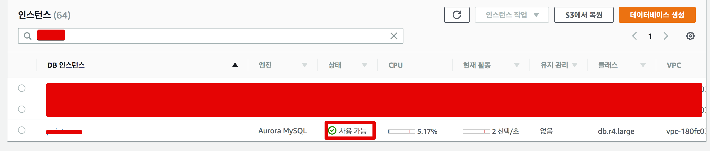


## 2. SQL 파일로 부분 복사하기

스냅샷으로 해결할 수 없는 문제가 생길 수 있습니다.  

* 기존 데이터는 그대로 둔채 일부분만 복사하고 싶은 경우
* 복사 대상이 RDS가 아닌 경우

등등 다양한 경우에 스냅샷을 못쓸수 있습니다.  
이럴 경우 **직접 Insert SQL 파일을 생성해서 진행**합니다.  
이걸 위해선 2개가 필요한데요.

* RDS에 접근할 수 있는 EC2
* EC2에서 접근 가능한 S3

위 2개가 갖춰지시면 진행하실수 있습니다.

> 아시겠지만 **RDS는 직접 ssh 접속이 불가능**합니다.  
그래서 EC2에서 원격으로 붙어야만 합니다.

### 2-1. Insert SQL 파일 생성하기

가장 먼저 Insert SQL 파일을 만들어야 합니다.  
이건 각자의 DB Client를 통해서 진행합니다.  
예를 들어 IntelliJ나 DataGrip을 사용하시는 분들이라면 아래와 같이 생성할 수 있습니다.  
(파일로 만들 조회 데이터를 조회한 상태에서 사용하셔야 합니다.)

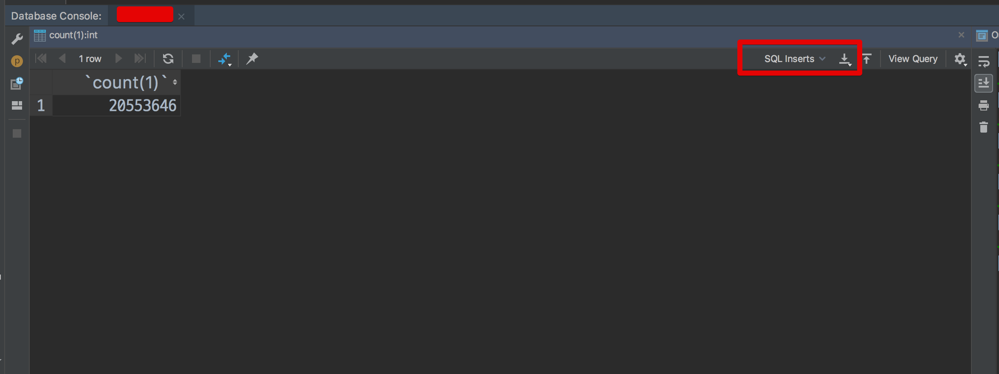

내려 받을 데이터 전체를 조회후 받으시면 됩니다.  
  
```sql
ex)

select * from point_event;
```

### 2-2. S3 에서 주고 받기

위에서 만든 Insert SQL파일을 복사 받을 RDS와 같은 계정의 S3에 업로드 합니다.  

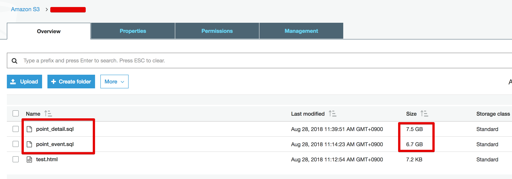

그리고 업로드한 S3 파일을 RDS에 접속 가능한 EC2로 접속해 다운 받습니다.

```bash
aws s3 cp s3://버킷명/파일위치 저장하고싶은 로컬 위치
```

### 2-3. Foreign Key 제약조건 해제

다운 받은 Insert SQL의 제약 조건을 한번 확인해봅니다.  
혹시나 FK가 물려있다면 Insert 가 안될수 있으니 Insert SQL **파일 최상단에 제약 조건을 푸는 쿼리** 한줄 (```set foreign_key_checks = 0```)과 **파일 최하단에 다시 제약 조건을 원래대로 돌리는 쿼리** 한줄 (```set foreign_key_checks = 1;```) 을 추가합니다.

```bash
sed -i '1i set foreign_key_checks = 0;' sql파일위치
```

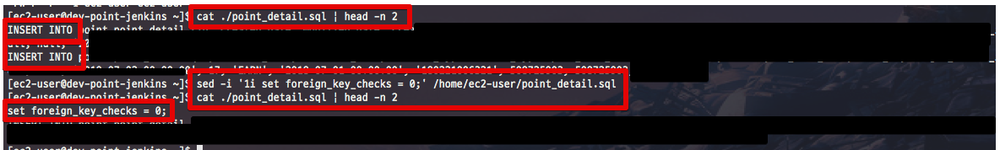

```bash
echo 'set foreign_key_checks = 1;' >> sql파일위치
```

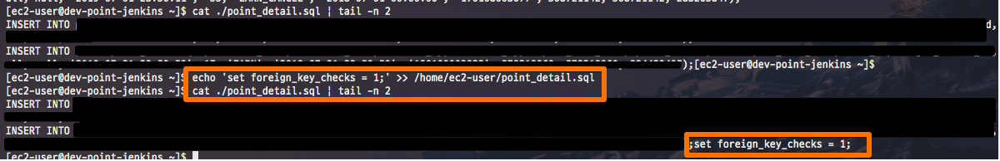

### 2-4. SQL 파일 실행

준비가 다 되셨다면 EC2에서 MySQL에 명령어를 실행합니다.  
EC2에 mysql client 가 설치되어 있지 않으시다면 아래 명령어로 설치합니다.

```bash
sudo yum install mysql
```

설치가 되셨으면 아래 명령어로 Insert SQL을 실행합니다.

```bash
mysql -u DB사용자명 -p 패스워드 -h DB주소 < sql파일위치
```

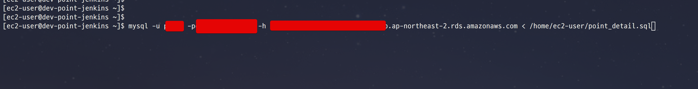

이렇게 하시면 Insert SQL 파일을 통한 데이터 입력은 끝납니다!  
  
  
대략 제 기준으로는 150만 Row를 넣는데 1시간정도 걸렸습니다.  
테이블의 크기나 잡혀있는 인덱스에 따라 다를수 있기 때문에 참고만 부탁드립니다 :)

