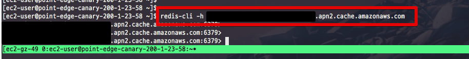

# EC2에 Redis CLI 설치하기

보안 정책으로 로컬 PC에서 바로 Redis에 접근하지 못하는 경우가 종종 있습니다.  
그럴 경우 Redis에 접근 가능한 다른 EC2 서버에서 Redis 접속을 하고 데이터 확인을 하는데요.  
EC2에 Redis CLI 설치 방법을 소개합니다.  
  
아래 커맨드를 차례로 입력하시면 됩니다.

```bash
# make 하기 위핸 gcc 다운
sudo yum install -y gcc

# redis-cli 설치 및 make
wget http://download.redis.io/redis-stable.tar.gz && tar xvzf redis-stable.tar.gz && cd redis-stable && make

# redis-cli를 bin에 추가해 어느 위치서든 사용 가능하게 등록
sudo cp src/redis-cli /usr/bin/
```

이렇게 설치가 끝나시면 바로 접속 테스트를 해봅니다.

```bash
redis-cli -h redis주소
```

위 커맨드를 이용해 접속되신다면 성공입니다!


