# AWS SES (Simple Email Service) Spring Boot 프로젝트에서 사용하기

안녕하세요?  
이번시간에는 AWS의 SES를 Java로 사용해보는 과정을 진행해보려 합니다.  
  
개인 프로젝트 중 email 발송기능이 필요했는데, 생각보다 Java로 AWS SES를 사용하는 방법이 잘 공유되어 있지 않는것 같아서 진행과 동시에 정리하게 되었습니다.  
  
저와 같은 고민을 하시는 분들에게 도움이 되길 바랍니다.

## 0. 이메일 인증받기

기본적으로 AWS에 가입되어있다는 가정으로, 회원가입은 생략하고 진행하겠습니다.  
  
AWS 웹페이지로 접속하여 서비스 항목에서 SES를 검색합니다.  

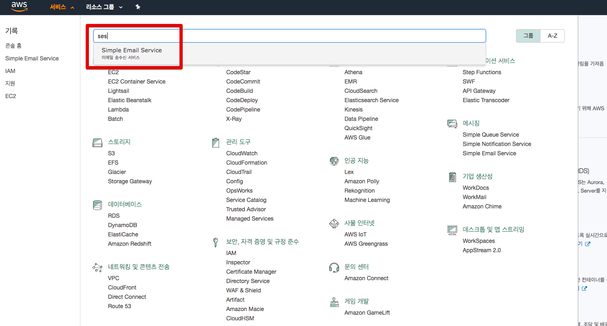

SES 관리 페이지에 접속하면 아래와 같은 화면이 등장합니다.  
여기서 좌측 **Email Addresses**를 클릭하면 우측에 이메일 인증 관리 페이지가 등장합니다.

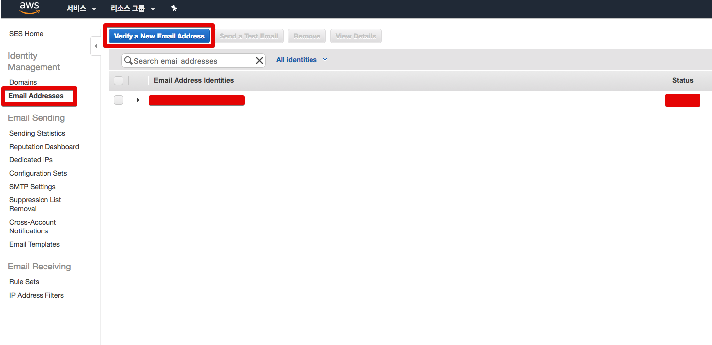

좌측 상단의 **Verify a New Email Address**를 클릭합니다.

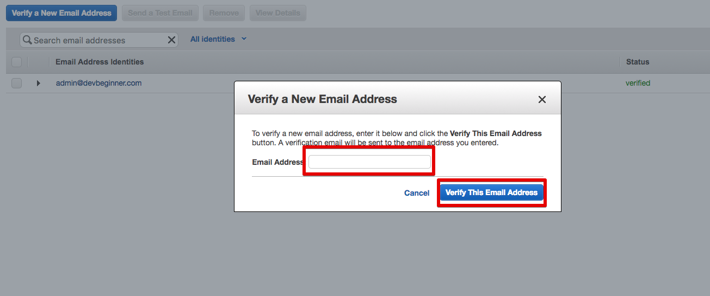

인증받고자 하는 이메일 주소를 **Email Address** 인풋 박스에 입력하여 **Verify This Email Address** 버튼을 클릭합니다.  
그럼 AWS에서 인증 메일을 발송해줍니다.

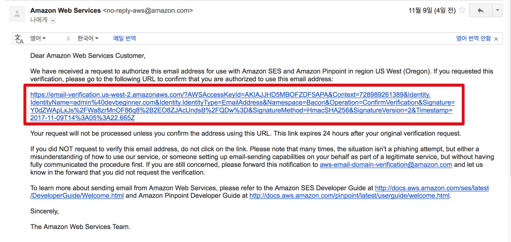

빨간색 박스에 있는 링크를 클릭하시면 인증이 성공되며, SES Dash Board에는 인증한 메일이 보여집니다.

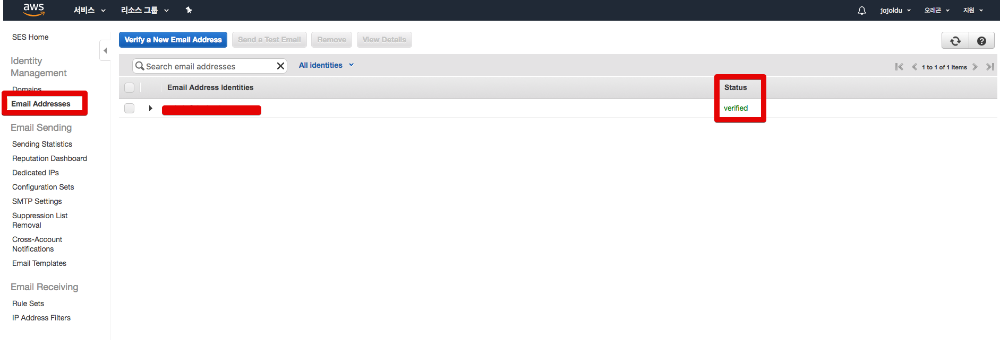

## 1. sand box 해제하기

AWS SES는 기본적으로는 하루 200개 메일 전송 제한이 있습니다.([참고](https://docs.aws.amazon.com/ko_kr/ses/latest/DeveloperGuide/request-production-access.html))  
이를 해제하여 많은 양을 전송할수 있도록 수정하겠습니다.

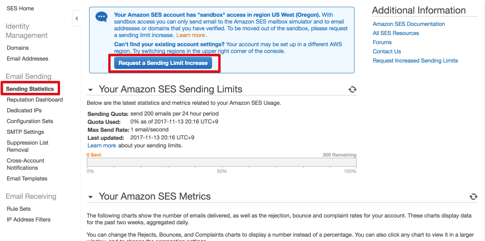

좌측 사이드바에 있는 **Sending Statistics**를 클릭 -> **Request a Sending Limit Increase** 버튼을 클릭합니다.  
그럼 설정화면이 등장합니다.

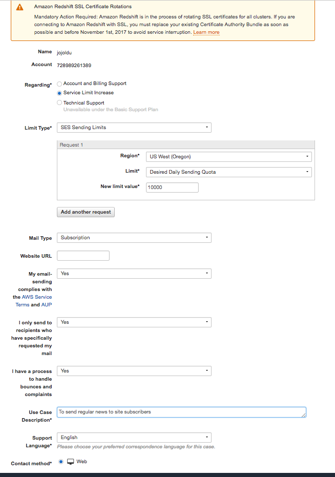

각 항목들을 본인 서비스에 맞게 선택하시면 되는데, Select box로 되어있는 곳은 다 Yes로 변경하셔야 합니다.  
Limit Type에서 저는 **Desired Daily Sending Quota**를 선택했습니다.  
  
Use Case Description에서는 어디에 쓸건지 사용목적을 작성하시면 되는데 크게 중요한 곳이 아닌지라 간단하게 영어로 작성하시면 됩니다.  
저는 ```To send regular news to web site subscribers``` (사이트 구독자들에게 정기 뉴스 발송하기 위해)로 작성했습니다.  
  
작성이 끝나셨으면 Submit 버튼을 클릭합니다.  
접수가 되면 보통 1~2시간 안에 완료 메일이 도착합니다.  

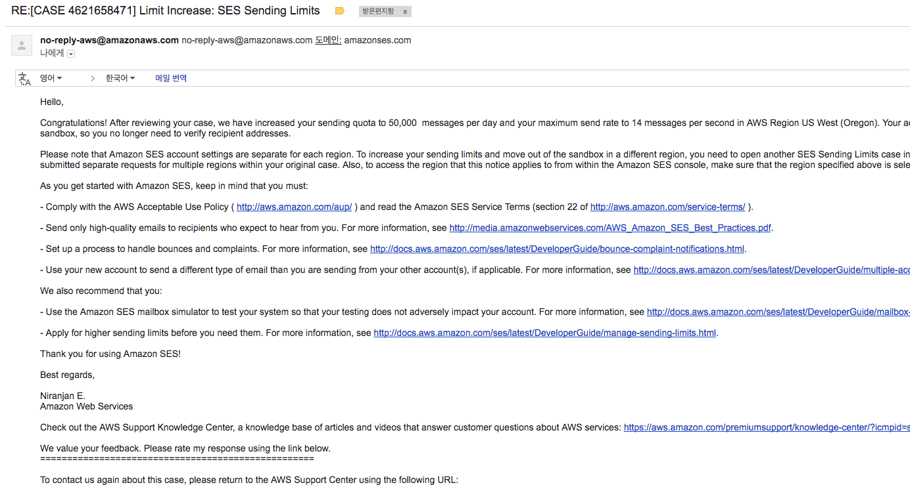

이렇게 완료 메일을 받으시고 SES 메인 페이지를 새로고침 하시면!


Sending Limit가 해제된 것을 알 수 있습니다.  

## 2. Java SDK로 메일 전송하기

### 2-1. Security Credentials 발급

AWS SES를 API로 사용하기 위해 먼저 Security Credentials를 발급 받겠습니다.  

> SMTP Credentials를 받는것이 아닙니다. 주의하세요!

[링크](https://console.aws.amazon.com/iam/home?#/security_credential)로 접속합니다.

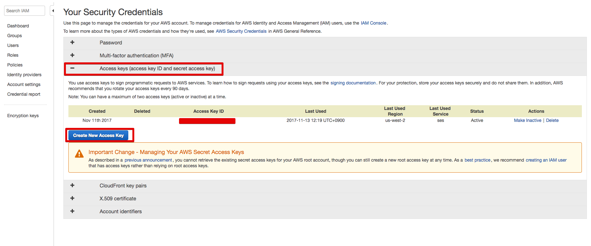

Access keys -> Create New Access Key를 차례로 클릭하여 key를 발급 받습니다.  

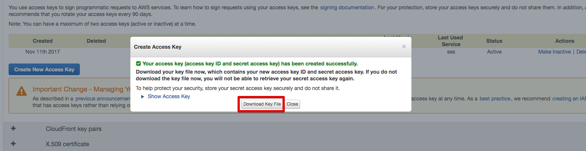

Download key File을 클릭하여 csv 파일로 다운받습니다.  
해당 csv 파일을 vim을 통해 열어봅니다.

```bash
vim csv파일위치
``` 
그럼 아래와 같이 ```AWSAccessKeyId```와 ```AWSSecretKey``` 값이 있습니다.

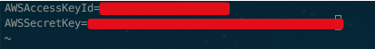

이 2개의 값이 AWS SES 를 사용할때 필요한 인증키값 입니다.  
AWS SDK가 읽을 수 있게 이들을 credentials로 만들겠습니다.  
아래 명령어를 통해 파일을 생성합니다. (Mac OS 기준)

```bash
vim ~/.aws/credentials
```

열린 vim 창에 다음과 같은 코드를 입력합니다.

```bash
[default]
aws_access_key_id=AWSAccessKeyId값
aws_secret_access_key=AWSSecretKey값
```

그리고 저장 종료(```:wq```)합니다.  
환경 구성은 끝났습니다.  
이제 실제 Java 코드로 이를 발송해보겠습니다.

### 2-2. Java SDK로 메일 발송하기

Gradle & SpringBoot 프로젝트로 진행하겠습니다.  
먼저 AWS SDK를 의존성으로 추가합니다.

```gradle
dependencies {
	compile('com.amazonaws:aws-java-sdk-ses:1.11.227')
}
```

그리고 메일 발송용 DTO를 생성합니다.  
(lombok을 사용하였습니다.)

```java
@Getter
public class SenderDto {
    private String from;
    private List<String> to = new ArrayList<>();
    private String subject;
    private String content;

    @Builder
    public SenderDto(String from, List<String> to, String subject, String content) {
        this.from = from;
        this.to = to;
        this.subject = subject;
        this.content = content;
    }

    public void addTo(String email){
        this.to.add(email);
    }

    public SendEmailRequest toSendRequestDto(){
        Destination destination = new Destination()
                .withToAddresses(this.to);

        Message message = new Message()
                .withSubject(createContent(this.subject))
                .withBody(new Body()
                        .withHtml(createContent(this.content))); // content body는 HTML 형식으로 보내기 때문에 withHtml을 사용합니다.

        return new SendEmailRequest()
                .withSource(this.from)
                .withDestination(destination)
                .withMessage(message);
    }

    private Content createContent(String text) {
        return new Content()
                .withCharset("UTF-8")
                .withData(text);
    }
}
```

수신자는 여러명이 될 수 있기 때문에 ```addTo``` 메소드를 통해 추가로 email 주소를 받을수 있도록 열어두었습니다.  
  
다음엔 이를 발송하는 ```Sender``` 클래스를 생성합니다.

```java
@Slf4j
public class Sender {

    public void send(SenderDto senderDto){
        try {
            log.info("Attempting to send an email through Amazon SES by using the AWS SDK for Java...");

            ProfileCredentialsProvider credentialsProvider = new ProfileCredentialsProvider();

            try {
                credentialsProvider.getCredentials();
            } catch (Exception e) {
                throw new AmazonClientException(
                        "Cannot load the credentials from the credential profiles file. " +
                                "Please make sure that your credentials file is at the correct " +
                                "location (~/.aws/credentials), and is in valid format.",
                        e);
            }

            AmazonSimpleEmailService client = AmazonSimpleEmailServiceClientBuilder.standard()
                    .withCredentials(credentialsProvider)
                    .withRegion("us-west-2")
                    .build();

            // Send the email.
            client.sendEmail(senderDto.toSendRequestDto());
            log.info("Email sent!");

        } catch (Exception ex) {
            log.error("The email was not sent.");
            log.error("Error message: " + ex.getMessage());
            throw new AmazonClientException(
                    ex.getMessage(),
                    ex);
        }
    }
}
```

AWS SDK에서는 ```ProfileCredentialsProvider```의 ```getCredentials()```를 통해 credentials값을 가져오는데, 이때 기본 Path가 좀전에 만든 ```~/.aws/credentials```입니다.  
  
Region의 경우 Oregon은 ```us-west-2```을 나타내기 때문에 ```.withRegion("us-west-2")```로 등록하였습니다.  
  
자 그럼 실제로 잘 발송되는지 테스트 코드로 한번 수행해보겠습니다.  
테스트 코드는 Spock으로 작성하였습니다.

```groovy
class SenderTest extends Specification {

    Sender sender = new Sender()

    def "메일 발송 테스트" () {
        given:
        SenderDto dto = SenderDto.builder()
                .from("admin@devbeginner.com")
                .to(Lists.newArrayList("jojoldu@gmail.com"))
                .subject("테스트")
                .content("안녕하세요")
                .build()

        when:
        sender.send(dto)

        then:
        println "전송되었습니다."
    }
}
```

참고로, ```from```에 들어갈 수 있는 것은 SES에서 인증받은 이메일뿐입니다.  
그 외에 다른 메일로는 발송할수 없습니다.  
자 이제 이 테스트 코드를 실행해보면!

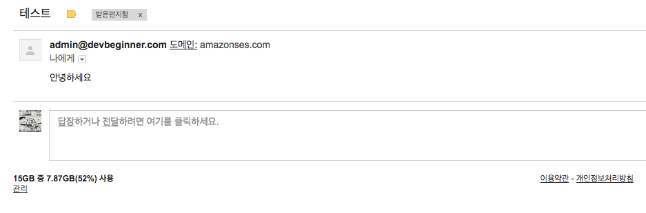

성공적으로 메일이 도착하였습니다!

## 마무리

어떠셨나요?  
크게 어렵지 않으셨죠?  
조금씩 AWS도 실제로 사용하면서 계속 기록하겠습니다.  
끝까지 봐주셔서 감사합니다^^

