# AWS의 Certificate Manager 로 SSL 인증서 발급 받기

보통 서비스가 소규모라면 1대의 서버에 Nginx를 설치하고 Let's Encrypt 를 설치해서 SSL을 등록합니다.  
  
다만 이럴 경우 트래픽이 늘어 로드밸런서 + 여러 서버 구성으로 확장하기가 쉽지 않습니다.  

> 불가능하진 않습니다. Nginx를 ELB 대신에 로드밸런서로 사용하면 됩니다.

AWS의 Certificate Manager로 생성한 인증서는 무료입니다.  

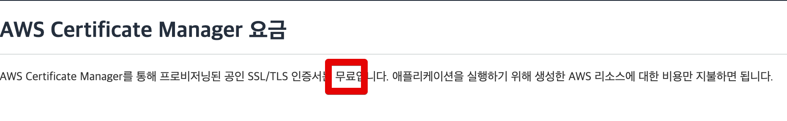

> 사설 기관은 비용이 청구됩니다.

Certificate Manager 서비스로 이동합니다.  
**인증서 프로비저닝**의 시작하기 버튼을 클릭합니다.

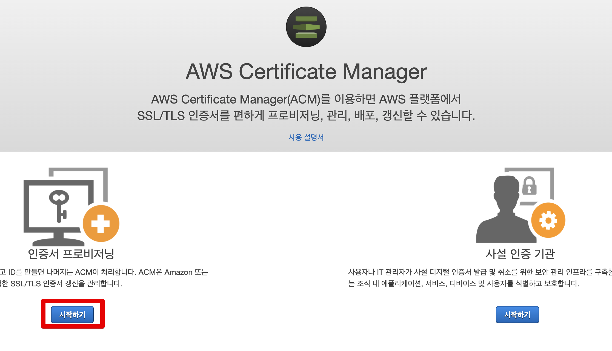

공인 인증서 요청을 선택하고 다음으로 이동합니다.

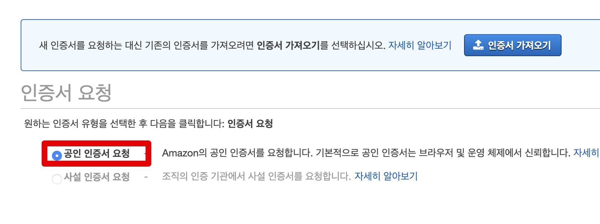

본인이 SSL을 설치하고자 하는 도메인을 등록합니다.  
(여기서 도메인을 사는건 아닙니다.)  
  
아래와 같이 ```*.aaa.com``` 식으로 등록하면 ```*```로 인해 **하위 도메인들이 모두 사용할 수 있는 인증서**가 됩니다.  
(```www.aaa.com```, ```admin.aaa.com``` 등등이 하위 도메인입니다.)

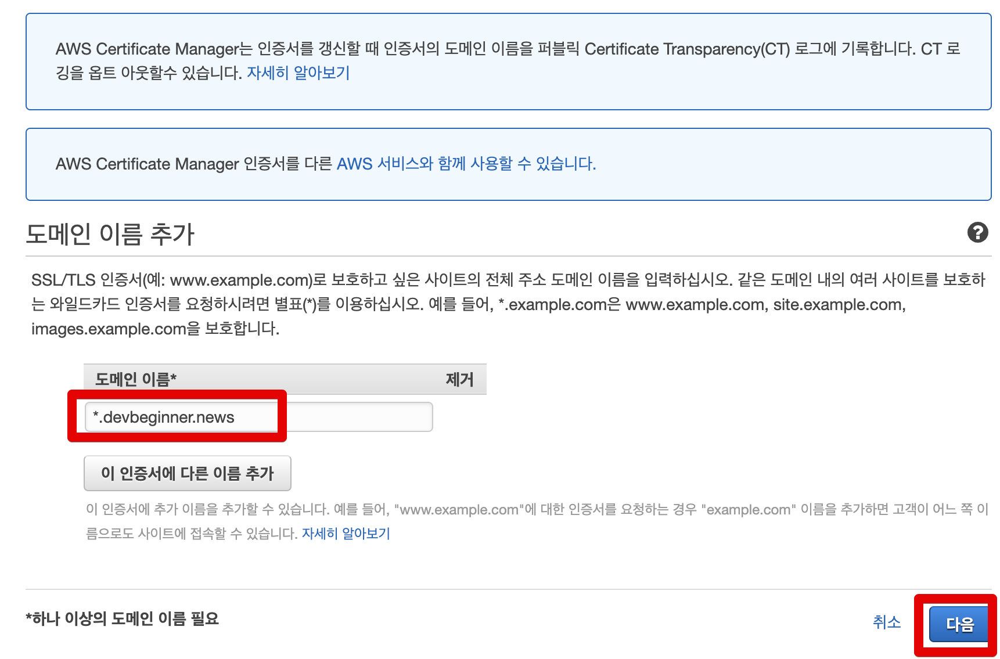

다만, ```aaa.com```에선 사용할 수 없는 인증서이다보니 2차 도메인 (```aaa.com```) 과 3차 도메인 (```*.aaa.com```) 모두에서 사용하실려면 아래와 같이 도메인 이름을 추가하면 됩니다.

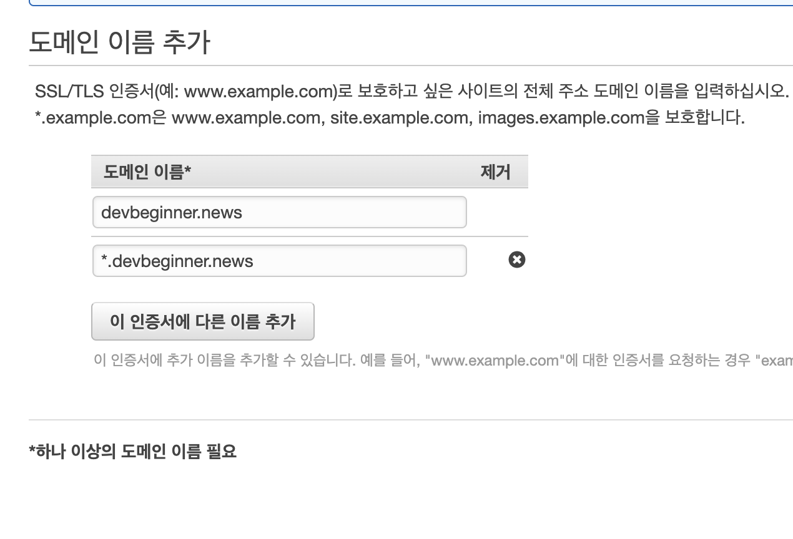

다음으로 넘어가시면 해당 인증서 검증 방법을 선택합니다.  
예전에는 이메일 검증 밖에 없었지만, 현재는 DNS 검증이 추가되어 DNS 검증을 선택합니다.

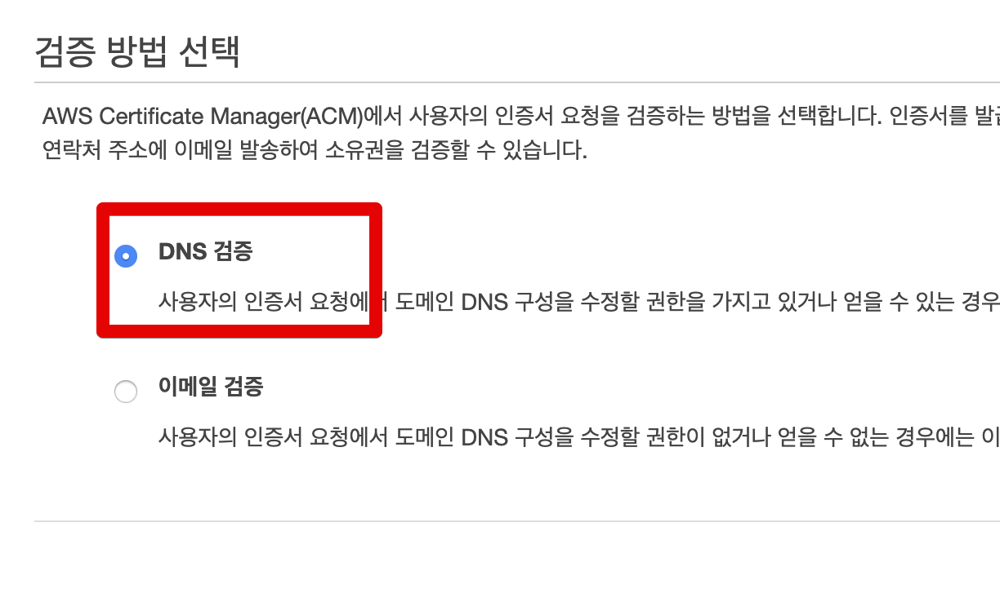

선택 항목들을 모두 확인 하신 후 **확인 및 요청**을 클릭합니다.

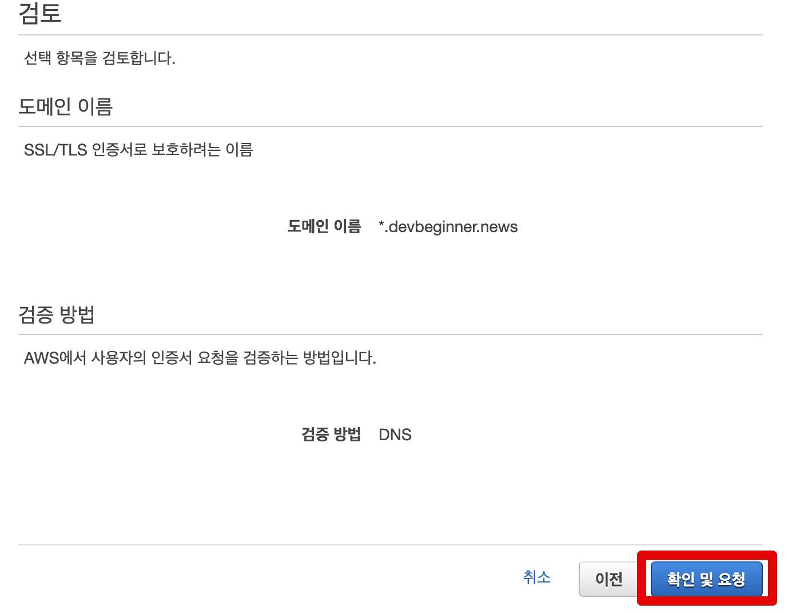

바로 계속으로 넘어갑니다.
'
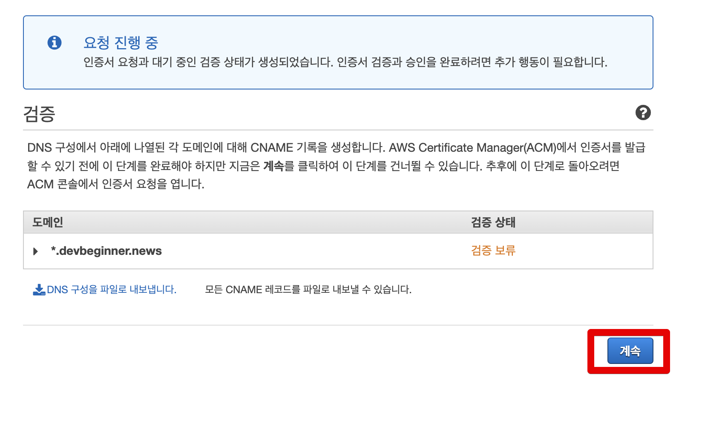

현재 검증 보류 상태입니다.  
이는 DNS 검증이 진행되지 않았기 때문인데요.  
아래와 같이 도메인 좌측의 화살표를 클릭하시면 **Route 53에서 레코드 생성** 버튼이 있습니다.  

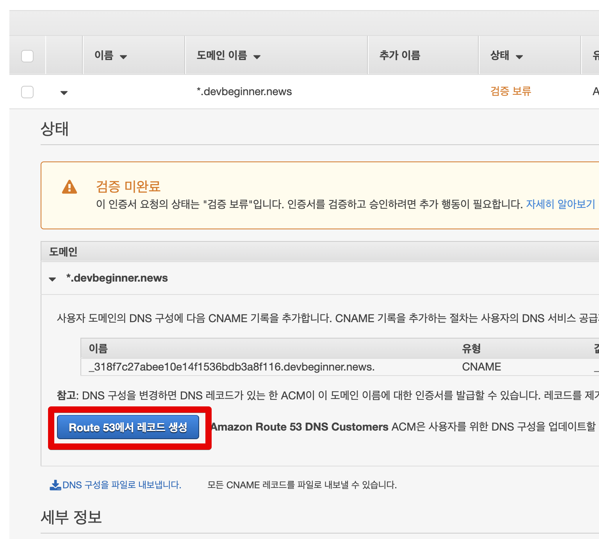

해당 버튼을 클릭하시면 Route 53 을 통해 자동으로 CNAME 이 등록되며 **DNS 검증이 진행**됩니다.  
  
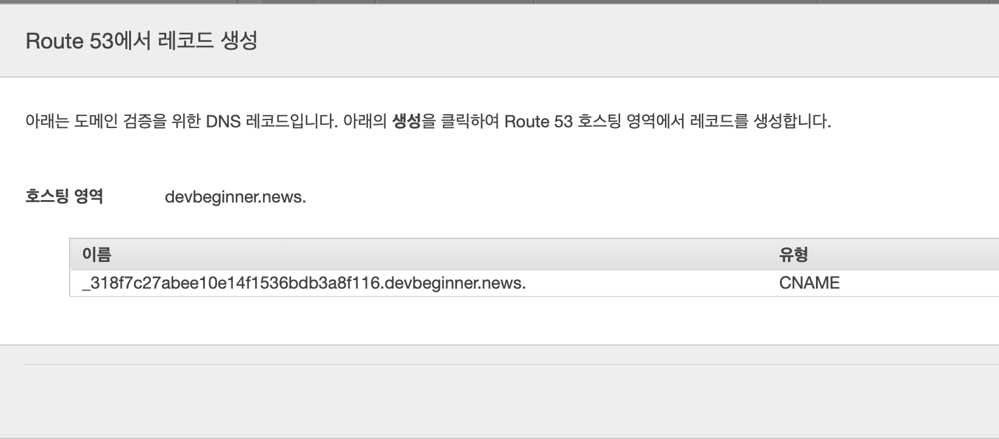

Route 53에 DNS 레코드가 생성되었다는 메세지가 나온다면 성공입니다.  
  
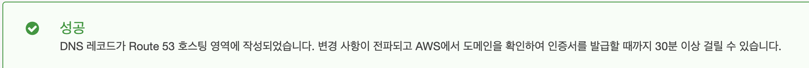

실제로 Route 53에 가보시면 CNAME이 생성된 것을 확인할 수 있습니다.

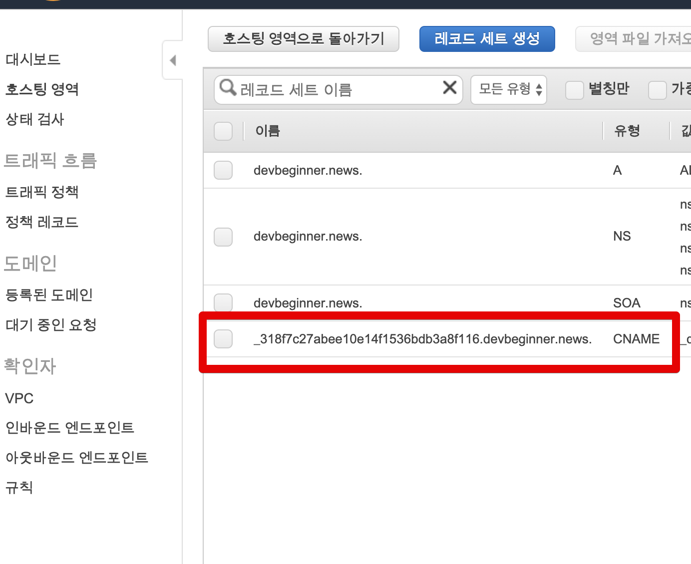

최대 30분정도 기다리시면 발급 완료를 확인할 수 있습니다.

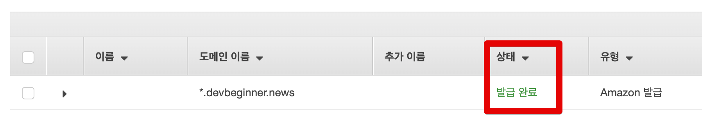

발급 완료된 인증서를 본인의 ELB 혹은 ALB에 등록 하신 뒤 해당 도메인으로 접근해보시면 아래와 같이 AWS에 발급 해준 인증서 임을 확인할 수 있습니다.

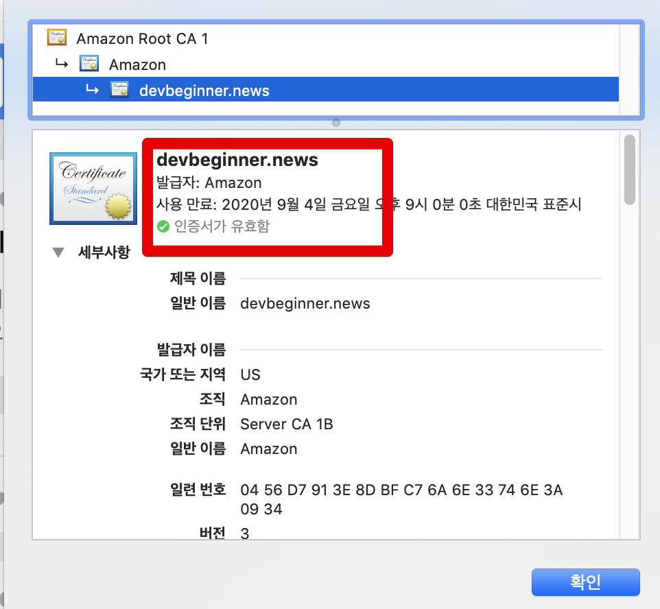
