# Amazon Athena로 ALB Access Log에서 원하는 데이터 추출하기

AWS 서비스를 이용하다보면 ALB (Application Load Balancer: 애플리케이션 로드 밸런서) 의 로그에서 상세 데이터를 확인하고 싶을때가 종종 있습니다.  
이를테면 다음과 같은 경우인데요.

* 하나의 로드밸런서에 2개 이상의 도메인이 붙어서 개별적으로 count 확인이 필요할때
  * 이를테면 A 로드밸런서에 a.com과 b.com 도메인 두개가 붙어있을 경우 a.com이 호출된 횟수와 b.com이 호출된 횟수 각각을 알고 싶은 경우
* ELK 등 로그 모니터링 환경이 구축 안되어 있는 환경에서 URL Path별 확인이 필요할 때
* Nginx 호출은 없었는데, 로드밸런서 요청 이력이 있었을때

등등 굉장히 다양한 상황에서 로드밸런서의 로그 확인이 필요합니다.  
이럴 경우를 대비해서 AWS에서는 ELB, ALB등 로드밸런서의 로그를 남기는 옵션을 제공해주는데요.  
해당 로그는 S3에 모든 것들이 남게 됩니다.

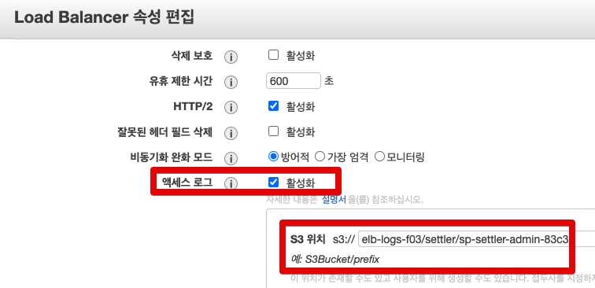

헌데, 아쉬운 점은 이렇게 남긴 ALB 로그는 모든 요청 로그를 남기기 때문에 **수백/수천개의 압축파일**로 생성됩니다.

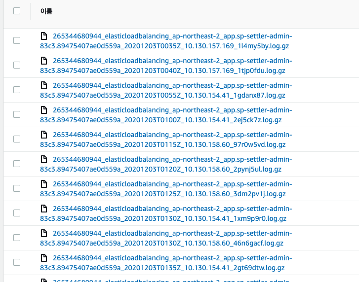

서비스의 트래픽이 얼마나 많으냐에 따라 다르겠지만, 대량의 트래픽이 발생하는 경우 1시간에도 수백/수천개의 gz 파일이 생성되기도 합니다.  
  
이렇게 수백/수천개의 gz파일로 원하는 로그 데이터를 뽑아보려면

* log.gz 파일 수백/수천개를 S3에서 다운 받아서
* 해당 압축 파일들의 압축을 풀어서 (혹은 ```zcat``` 을 쓰시거나)
* 파일 전체에 대해 ```grep```과 정규표현식으로 원하는 데이터들을 걸러서 봐야만 합니다.

생각만해도 머리가 지끈지끈한데요.  

> 특히나 리눅스의 여러 커맨드명령어와 파이프라인, 정규표현식등이 어색하신 분들에게는 아주 어려운 문제입니다.
  
그래서 AWS에서는 이렇게 대량/대용량의 S3 파일들을 간편하게 분석할 수 있도록 Athena 라는 서비스를 제공합니다.  
  
이번 시간에는 바로 그 Amazon Athena를 이용해서 ALB Access Log 에서 원하는 데이터를 쉽게 추출하는 방법을 배워보겠습니다.

## 1. AWS Athena 환경 구축

[Amazon Athena](https://aws.amazon.com/ko/athena/?whats-new-cards.sort-by=item.additionalFields.postDateTime&whats-new-cards.sort-order=desc)는 표준 SQL을 사용해 Amazon S3에 저장된 데이터를 간편하게 분석할 수 있는 서버리스 Query 서비스입니다.  
  
Athena는 서버리스 서비스이므로 관리할 인프라가 없으며 실행한 쿼리에 대해서만 비용을 지불하면 됩니다.

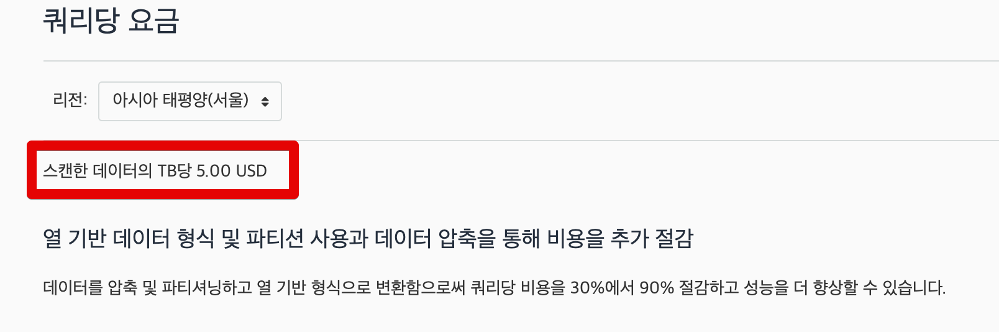

스캔 데이터양 1테라바이트당 5달러 (서울 리전 기준)의 아주 저렴한 비용이며, 특히나 **표준 SQL** 문법을 지원하기 때문에 일반적인 RDBMS을 사용하듯이 로그파일들을 조회할 수 있습니다.  
  
자 그럼 이제 실제로 Athena로 로그 데이터를 조회해보겠습니다.

> 실습에 앞서, **ALB의 로그 활성화가 필수**입니다.  
> ALB의 로그가 S3에 잘 저장되고 있는지 먼저 확인 후에 실습을 진행해주세요.  
> 애초에 남지 않은 로그를 분석할 수 없습니다.

[[ad]]

### 1-1. Athena 테이블 생성

웹 콘솔에서 athena를 검색합니다.

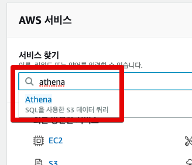

시작하기 버튼을 클릭합니다.

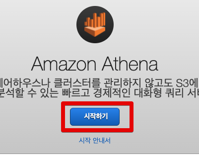

완전히 처음 사용하신다면 아래와 같이 **Athena의 실행로그**를 보관할 S3 위치를 등록해야하는데요.

> MySQL의 실행/에러로그를 보관하는 로그디렉토리 지정하는것과 비슷하다고 보시면 됩니다.

S3에 가셔서 Athena용 로그 버킷과 버킷내 디렉토리를 생성하시고, 아래 빨간색 박스친 "Amazon S3에서 쿼리 결과 위치를 설정해야 합니다" 메세지를 클릭합니다.

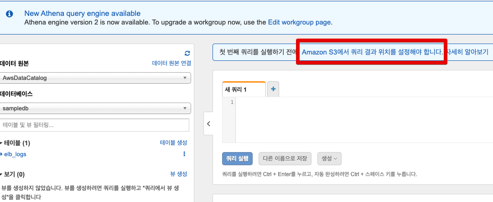

S3에 생성한 위치를 아래 **쿼리 결과 위치**에 등록하고 저장합니다.

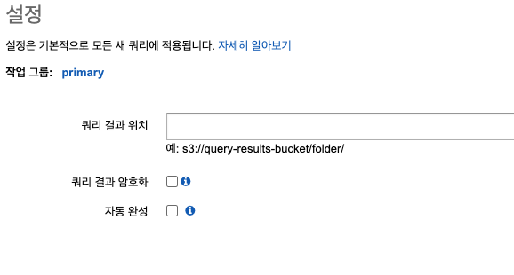

자 그럼 이제 바로 Athena 쿼리를 실행해볼 수 있는데요.  
  
일반적인 RDBMS와 마찬가지로 데이터베이스 / 테이블 구조를 가지고 있는 Athena이기 때문에 여기서도 마찬가지로 데이터베이스와 테이블을 모두 생성하겠습니다.
  
아래 쿼리 편집기에 각각의 SQL을 입력해서 실행하시면 되는데요.

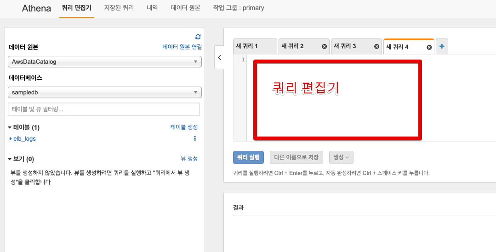

먼저 데이터베이스를 생성합니다.  
  
아래 쿼리를 쿼리 편집기에 등록하신뒤 **쿼리 실행 버튼** or ```ctrl+ Enter```를 누르시면 쿼리가 실행됩니다.

```sql
create database 데이터베이스명
```

그럼 아래와 같이 좌측 데이터베이스 항목에 신규 데이터베이스가 생성 된 것을 확인할 수 있습니다.

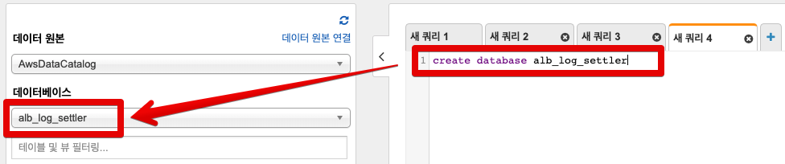

방금 생성한 데이터베이스에 이제 ALB 로그를 담을 테이블을 생성하겠습니다.

> ALB 로그 위치 하나당 1개의 테이블을 생성하신다고 보시면 됩니다.

테이블 생성 쿼리는 **ALB 로그 내용을 테이블 컬럼에 매칭**시키기 위해 아래 양식 그대로를 따라해주셔야 하는데요.

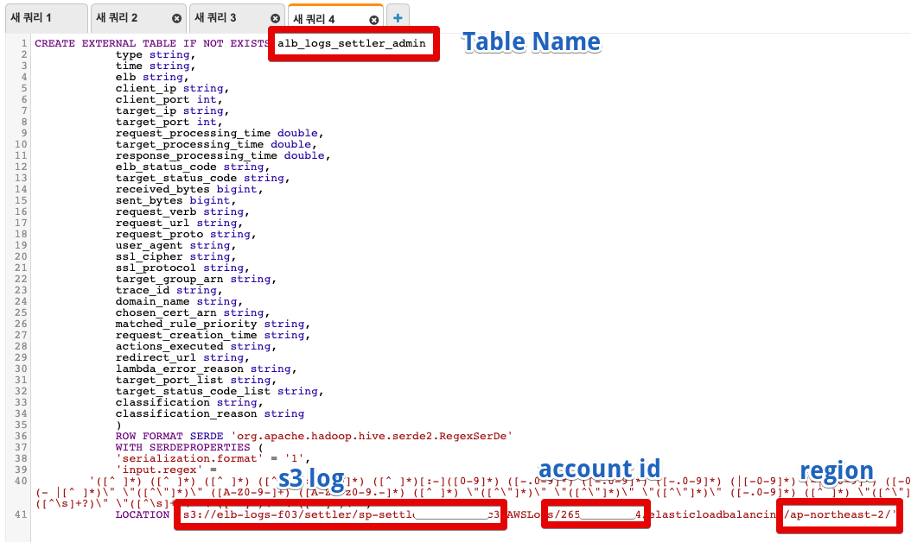

```sql
CREATE EXTERNAL TABLE IF NOT EXISTS 테이블명 (
            type string,
            time string,
            elb string,
            client_ip string,
            client_port int,
            target_ip string,
            target_port int,
            request_processing_time double,
            target_processing_time double,
            response_processing_time double,
            elb_status_code string,
            target_status_code string,
            received_bytes bigint,
            sent_bytes bigint,
            request_verb string,
            request_url string,
            request_proto string,
            user_agent string,
            ssl_cipher string,
            ssl_protocol string,
            target_group_arn string,
            trace_id string,
            domain_name string,
            chosen_cert_arn string,
            matched_rule_priority string,
            request_creation_time string,
            actions_executed string,
            redirect_url string,
            lambda_error_reason string,
            target_port_list string,
            target_status_code_list string,
            classification string,
            classification_reason string
            )
            ROW FORMAT SERDE 'org.apache.hadoop.hive.serde2.RegexSerDe'
            WITH SERDEPROPERTIES (
            'serialization.format' = '1',
            'input.regex' = 
        '([^ ]*) ([^ ]*) ([^ ]*) ([^ ]*):([0-9]*) ([^ ]*)[:-]([0-9]*) ([-.0-9]*) ([-.0-9]*) ([-.0-9]*) (|[-0-9]*) (-|[-0-9]*) ([-0-9]*) ([-0-9]*) \"([^ ]*) ([^ ]*) (- |[^ ]*)\" \"([^\"]*)\" ([A-Z0-9-]+) ([A-Za-z0-9.-]*) ([^ ]*) \"([^\"]*)\" \"([^\"]*)\" \"([^\"]*)\" ([-.0-9]*) ([^ ]*) \"([^\"]*)\" \"([^\"]*)\" \"([^ ]*)\" \"([^\s]+?)\" \"([^\s]+)\" \"([^ ]*)\" \"([^ ]*)\"')
            LOCATION 's3://<aws로그위치>/AWSLogs/<aws계정번호>/elasticloadbalancing/<region>/';
```

여기서 **테이블명**은 본인이 원하시는 것을 작성하시면 되는데, **최하단의 LOCATION** 항목은 실제 존재하는 값들을 찾아서 넣으셔야 합니다.  

LOCATION 의 각 항목들은 아래와 같이 확인해서 등록해주시면 됩니다.  
  
**aws로그위치**  
  
aws 로그 위치의 경우 아래와 같이 ALB에 등록된 위치를 그대로 복사해오시면 됩니다.

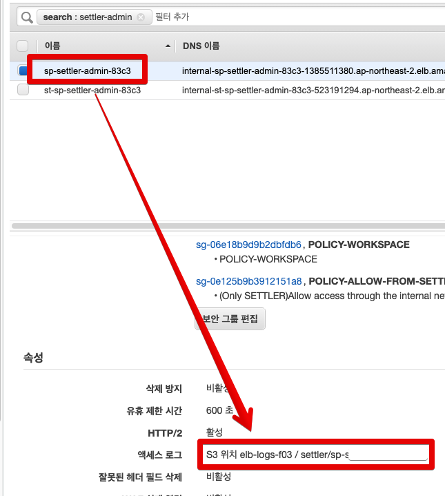

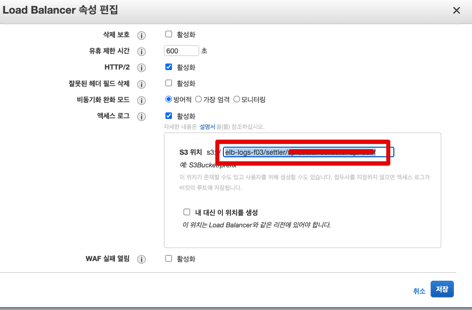

**aws계정번호**  
  
account id의 경우 **로그인 계정이 아닌** AWS에서 발급된 번호인데요.  
확인 방법은 웹 콘솔 **우측 상단**의 계정명을 클릭하시면 아래와 같이 **내 계정**으로 된 항목에 있는 숫자를 이야기합니다.


**region**  

리전명은 다들 아시다시피 리전 코드를 그대로 사용하시면 됩니다.


> 서울 리전 코드는 ```ap-northeast-2``` 입니다.

자 이렇게 생성된 쿼리를 실행해보시면?

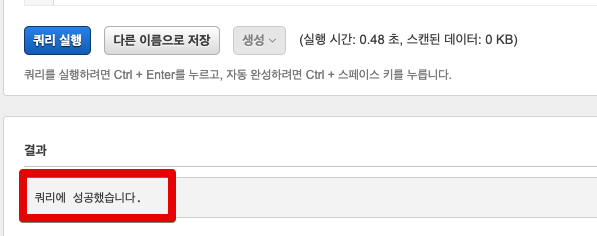

(쿼리에 오타가 없다면) 아래와 같이 테이블이 생성된 것을 확인할 수 있습니다.

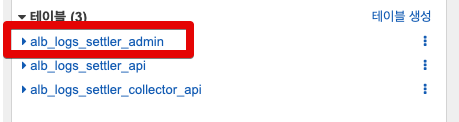

여기까지 하셨다면 Athena 환경은 모두 구성되었습니다!  
  
그럼 이렇게 생성된 테이블에서 우리가 원하는 로그 데이터를 뽑아보겠습니다.

[[ad]]

### 1-2. Athena 쿼리 실습

실제 업무를 하시면서 만나볼만한 예제 3가지를 한번 쿼리로 확인해보겠습니다.  

> 아래의 쿼리들은 쿼리 콘솔에서 바로 입력해서 실행해보시면 됩니다.  

**가장 최근의 요청 100건**

```sql
SELECT *
FROM 테이블명
ORDER by time DESC
LIMIT 100;
```

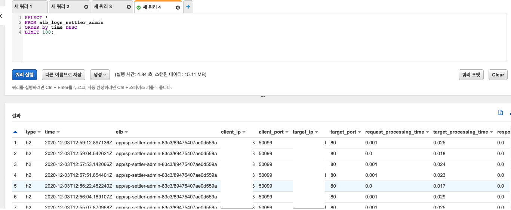

**2020.12.01 ~ 2020.12.02**까지 **5초이상** 수행된 **URL과 수행시간**

```sql
SELECT target_processing_time, request_url
from 테이블명
WHERE parse_datetime(time,'yyyy-MM-dd''T''HH:mm:ss.SSSSSS''Z') >= parse_datetime('2020-12-01-00:00:00','yyyy-MM-dd-HH:mm:ss')
AND parse_datetime(time,'yyyy-MM-dd''T''HH:mm:ss.SSSSSS''Z') < parse_datetime('2020-12-03-00:00:00','yyyy-MM-dd-HH:mm:ss')
AND (target_processing_time >= 5.0)
```

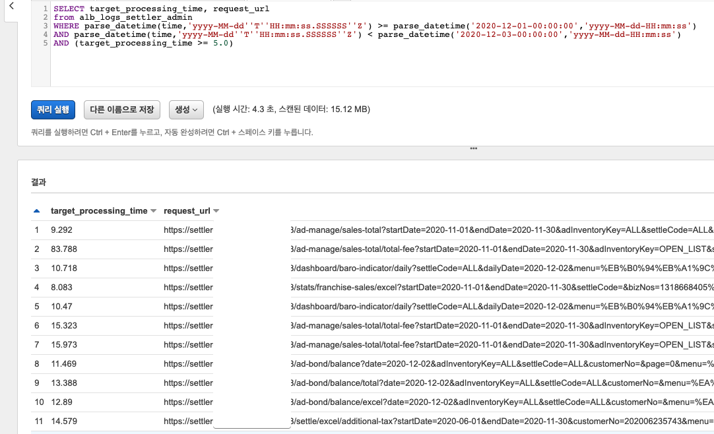

**2020.12.01** 하루 동안 **a.baemin.com**으로 호출된 **건수**

```sql
SELECT count(1)
FROM 테이블명
WHERE request_url LIKE '%a.baemin.com%'
AND parse_datetime(time,'yyyy-MM-dd''T''HH:mm:ss.SSSSSS''Z') >= parse_datetime('2020-12-01-00:00:00','yyyy-MM-dd-HH:mm:ss')
AND parse_datetime(time,'yyyy-MM-dd''T''HH:mm:ss.SSSSSS''Z') < parse_datetime('2020-12-02-00:00:00','yyyy-MM-dd-HH:mm:ss');
```


> 이외에도 다양한 사례가 궁금하시면 [AWS 공식 문서](https://aws.amazon.com/ko/premiumsupport/knowledge-center/athena-analyze-access-logs/)를 참고해보세요.

## 2. 마무리

어떠신가요? 조금은 Athena에 대해서 알게 되신것 같으신가요?  
꼭 ALB 뿐만 아니라 S3에 저장된 다양한 데이터들을 분석할 수 있으니 [AWS 공식 문서](https://docs.aws.amazon.com/ko_kr/athena/latest/ug/what-is.html)를 읽어보신뒤 여러 방면에서 활용해보시면 그동안 했던 많은 수작업들을 해결할 수 있으니 적극 추천드립니다.  
  
저도 계속 사용해보면서 실제 업무에서 겪을만한 사례들이 나올때마다 공유하겠습니다.  


