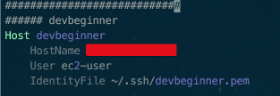
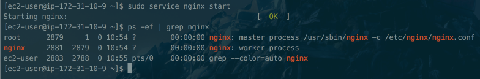

# aws-springboot-nginx

안녕하세요? 이번 시간엔 aws-springboot-nginx 예제를 진행해보려고 합니다.  
모든 코드는 [Github](https://github.com/jojoldu/blog-code/tree/master/aws-springboot-nginx)에 있기 때문에 함께 보시면 더 이해하기 쉬우실 것 같습니다.  
(공부한 내용을 정리하는 [Github](https://github.com/jojoldu/blog-code)와 세미나+책 후기를 정리하는 [Github](https://github.com/jojoldu/review), 이 모든 내용을 담고 있는 [블로그](http://jojoldu.tistory.com/)가 있습니다. )<br/>


### ssh 접속 추가

```bash
mkdir ~/.ssh && chmod 700 ~/.ssh
```

```bash
vim ~/.ssh/config
```

```bash
############################
###### devbeginner
Host 해당접속 대표명
    HostName 탄력적IP
    User ec2-user
```



config 파일에 권한 추가

```bash
chmod 700 ~/.ssh/config
```

## Nginx + SSL

### Nginx 설치

```bash
sudo yum install nginx
```

Nginx 실행

```bash
sudo service nginx start
```

Nginx 실행 확인

```bash
ps -ef | grep nginx
```



### Let's Encrypt 설치

도메인 할당 받고 오기

```bash
sudo yum install epel-release
```

맥북에서

```bash
sudo vim /etc/hosts
```

AWS에서

```bash
sudo vi /etc/nginx/nginx.conf
```

```bash
sudo nginx -t
```

```bash
sudo service nginx reload
sudo service nginx stop
```

```bash
wget https://dl.eff.org/certbot-auto
chmod a+x certbot-auto
sudo ./certbot-auto --nginx
```

## 참고

* [Nginx+Tomcat](https://medium.com/@taeyeolkim/aws-ec2%EC%97%90-tomcat8-%EC%84%A4%EC%B9%98%ED%95%98%EA%B8%B0-nginx%EC%99%80-%EC%97%B0%EB%8F%99-1a2c91adf09a)
* [how-to-secure-nginx-with-let-s-encrypt-on-centos-7](https://www.digitalocean.com/community/tutorials/how-to-secure-nginx-with-let-s-encrypt-on-centos-7)