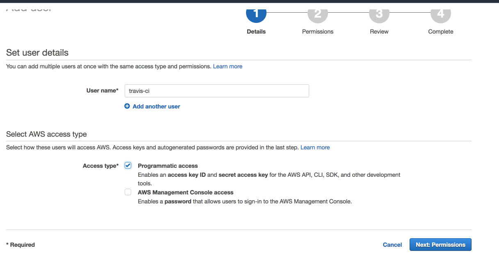
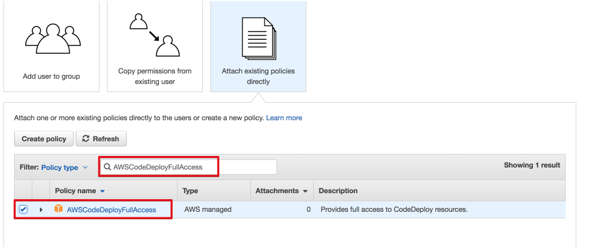
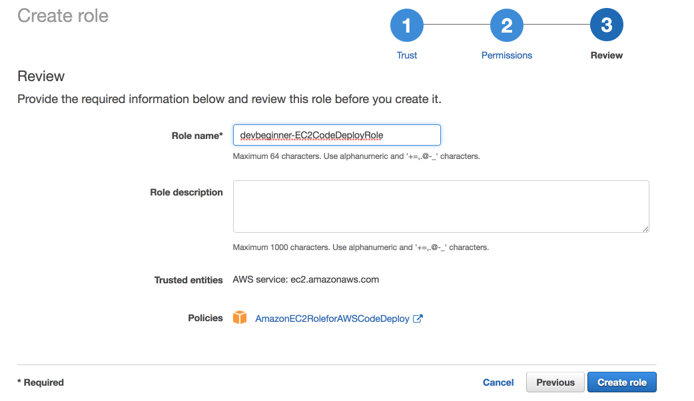
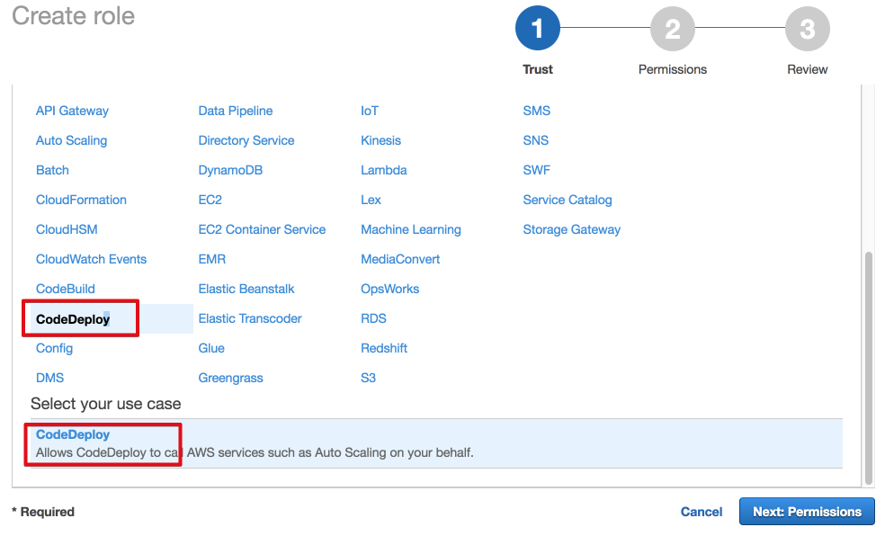
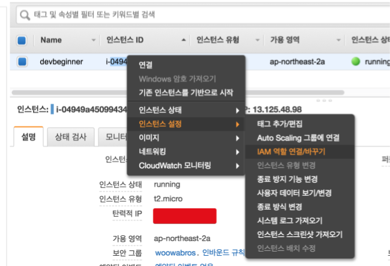
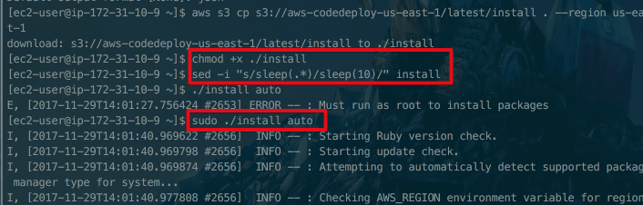
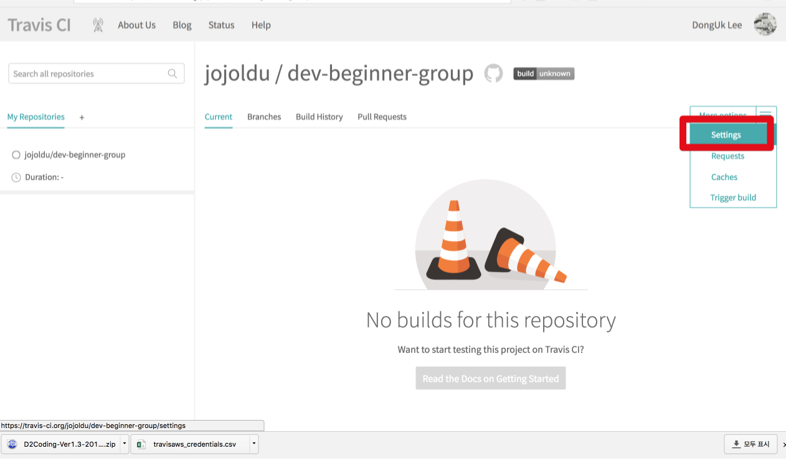

# Travis CI & AWS를 이용한 CI/CD

 ```AmazonS3FullAccess```, ```AWSCodeDeployFullAccess```


### Step 1: Image



















### Step 3: Create roles in IAM for CodeDeploy

### Step 5:

```bash
sudo aws configure
```

```bash
aws s3 cp s3://aws-codedeploy-ap-northeast-2/latest/install . --region ap-northeast-2
```

```bash
chmod +x ./install
```

```bash
sed -i "s/sleep(.*)/sleep(10)/" install
```

```bash
sudo ./install auto
sudo service codedeploy-agent start
```

```bash
sudo service codedeploy-agent status
```

EC2 인스턴스가 부팅되면 자동으로 codedeploy가 실행될 수 있도록 쉘 스크립트 파일을 하나 생성하겠습니다.  

```bash
sudo vim /etc/init.d/codedeploy-startup.sh
```

스크립트 파일에 아래의 내용을 추가합니다.

```bash
#!/bin/bash

echo 'Starting codedeploy-agent'
sudo service codedeploy-agent start
```

* [TeamApex Wiki](https://github.com/airavata-courses/TeamApex/wiki/Milestone-5-Guide-to-Setting-Up-Amazon's-CodeDeploy-Travis-Integration)

* [Travis CI 설정 Sample](https://github.com/travis-ci/cat-party)