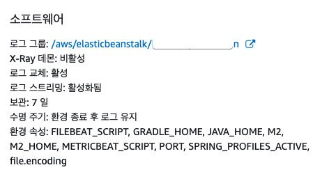
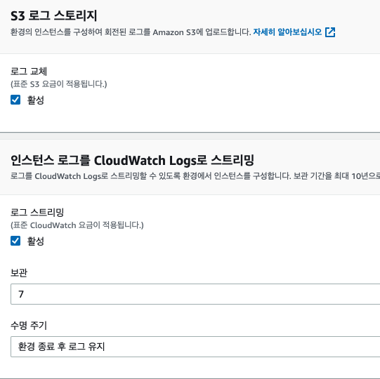
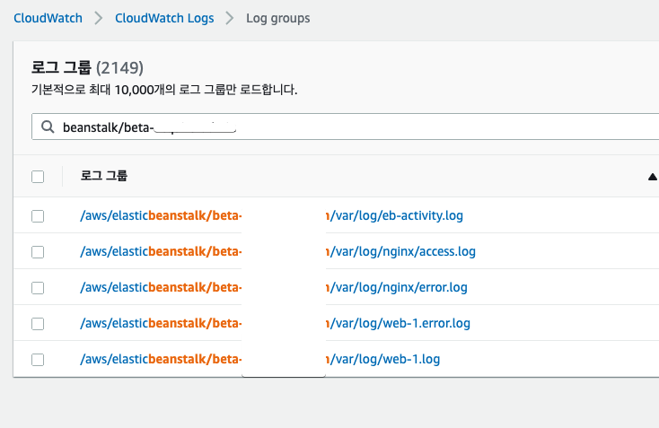

# AWS Beanstalk에 직접 생성한 (Custom) AMI 적용하기

AWS Beanstalk 의 공식 AMI를 사용할 수도 있지만, 사내 표준 AMI를 사용해야할 수도 있습니다.

> 이를테면 사내 표준 모니터링 도구가 설치된 AMI라던가, 보안 프로그램이 설치된 AMI가 되겠죠?

그래서 AWS의 표준 AMI가 아닌 사용자 지정 (Custom) AMI 를 Beanstalk 에 적용하는 방법을 소개 드립니다.

## 1. 사전 작업

진행하기에 앞서, Beanstalk **배포 실패시 원인 파악**을 위해 로그 설정을 미리 해놓습니다.

> 배포가 실패된 인스턴스는 Terminate 되어 별도로 로그 보관하지 않으면 찾아 보기가 쉽진 않습니다.

Beanstalk의 구성 (Configuration) 으로 이동하여 소프트웨어 (Software) 항목으로 이동합니다.

설정 화면을 가보면 아래와 같이 S3 로그 스토리지와 Cloud Watch Logs 스트리밍 설정이 있습니다.  
이를 활성화합니다.

> 물론 AMI 교체가 성공적으로 되고 난 이후부터는 다시 비활성화 해도 됩니다.

설정이 되셨으면 이제 아래와 같이 CloudWatch 로그 그룹에 신규 그룹들이 생성된 것들을 볼 수 있습니다.

설정이 되셨다면 이제 AMI를 교체하러 갑니다.

## 2. AMI 교체

AWS Beanstalk 에서 본인 애플리케이션 환경의 **구성**으로 이동합니다.

[용량] 구성 범주에서 [편집]을 선택합니다.

편집 항목에서 AMI를 선택한 뒤, 본인이 원하는 AMI로 교체합니다.

아래와 같이 변경된 내용을 확인합니다.

[Apply]를 선택합니다.

## 3. .ebextensions 반영

AMI가 교체될 때, 만약 AWS Linux1 에서 Linux2 로 변경이 된다면 배포가 실패할 수도 있습니다.

* Nginx 위치 변경
  * [AWS Beanstalk Linux2 에서 Nginx 설정이 안될때](https://jojoldu.tistory.com/541)

