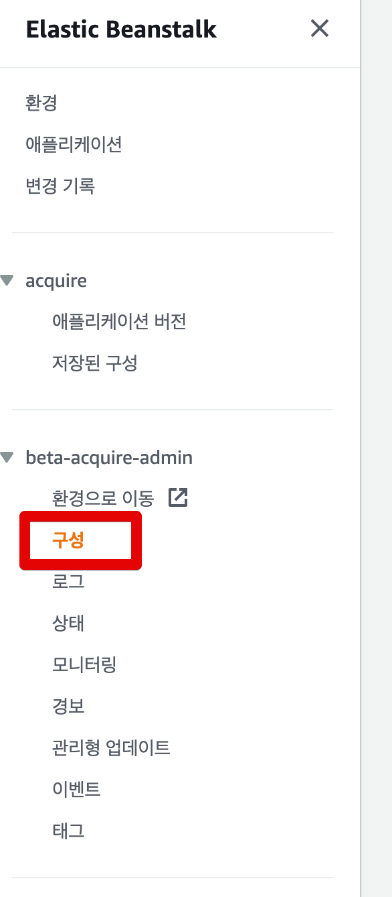
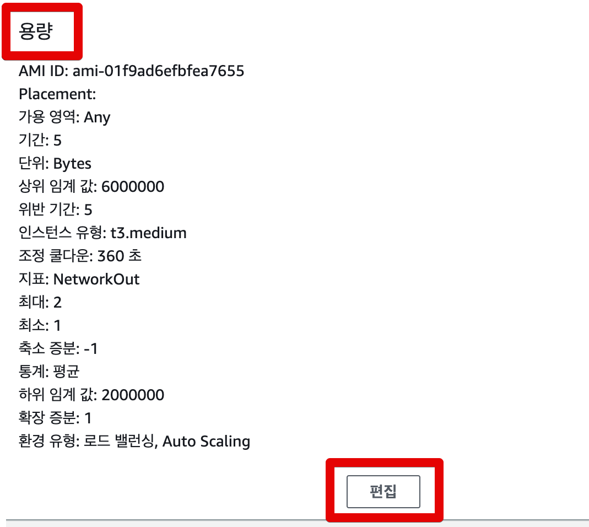
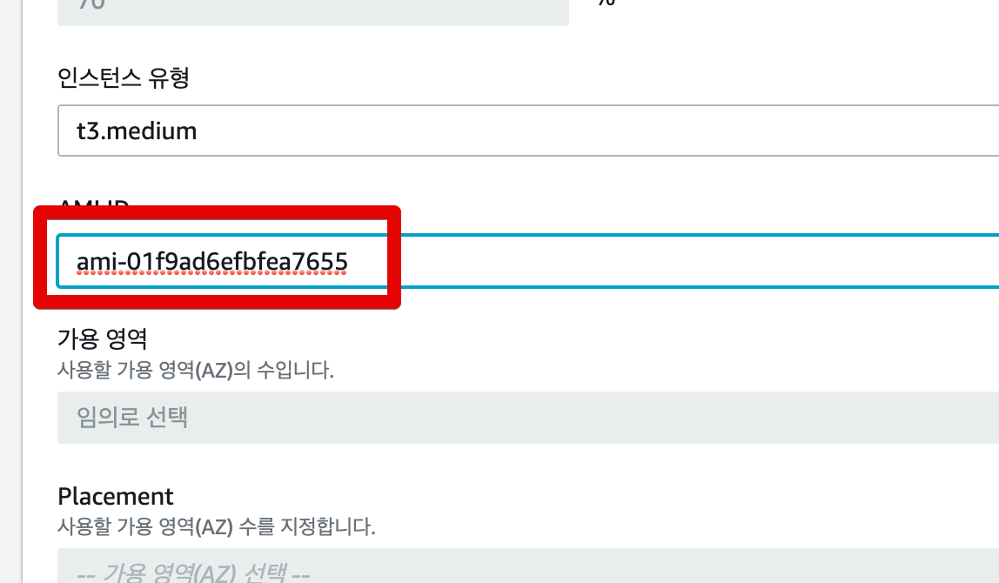
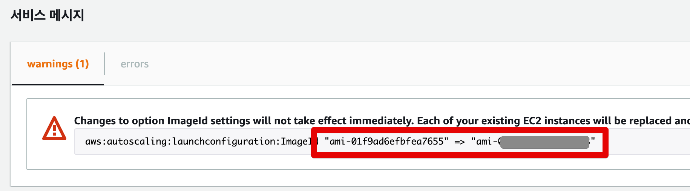
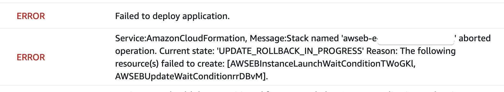

# AWS Beanstalk에 직접 생성한 (Custom) AMI 적용하기

AWS Beanstalk 의 공식 AMI를 사용할 수도 있지만, 사내 표준 AMI를 사용해야할 수도 있습니다.

> 이를테면 사내 표준 모니터링 도구가 설치된 AMI라던가, 보안 프로그램이 설치된 AMI가 되겠죠?

그래서 AWS의 표준 AMI가 아닌 사용자 지정 (Custom) AMI 를 Beanstalk 에 적용하는 방법을 소개 드립니다.

## 1. AMI 교체

AWS Beanstalk 에서 본인 애플리케이션 환경의 **구성**으로 이동합니다.

[용량] 구성 범주에서 [편집]을 선택합니다.

편집 항목에서 AMI를 선택한 뒤, 본인이 원하는 AMI로 교체합니다.

아래와 같이 변경된 내용을 확인합니다.

[Apply]를 선택합니다.

## 2. .ebextensions 반영

AMI가 교체될 때, 만약 AWS Linux1 에서 Linux2 로 변경이 된다면 배포가 실패할 수도 있습니다.

* Nginx 위치 변경
  * [AWS Beanstalk Linux2 에서 Nginx 설정이 안될때](https://jojoldu.tistory.com/541)

