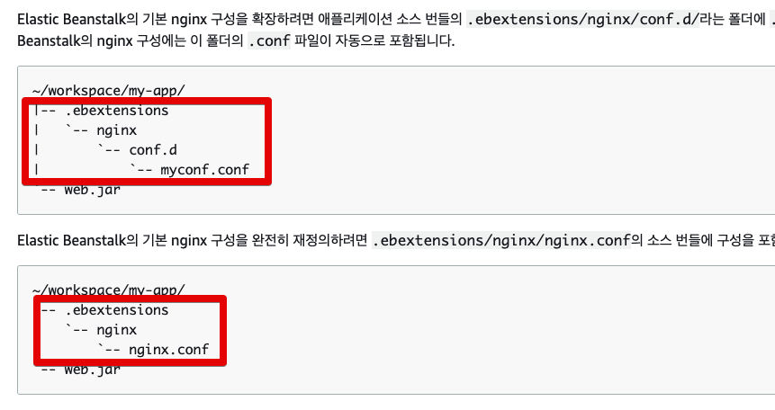
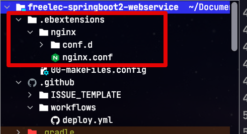
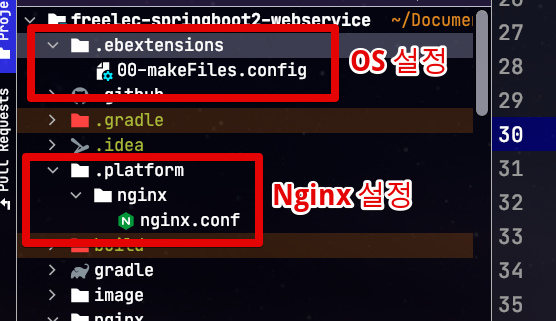
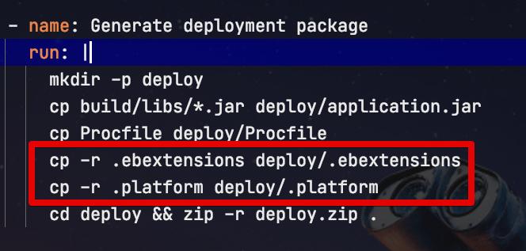

# AWS Beanstalk Linux2 에서 Nginx Config 교체하기

기존에 AWS Beanstalk을 사용할 경우 아래와 같이 ```nginx.config``` 파일을 교체하라고 가이드를 받는데요.  



([AWS 공식 문서](https://docs.aws.amazon.com/ko_kr/elasticbeanstalk/latest/dg/java-se-nginx.html))

그래서 실제로 프로젝트 구조를 다음과 같이 잡고 배포를 진행합니다.



배포할때 사용하는 스크립트 (```travis.yml``` 혹은 ```githubAction.yml```) 역시 이 구조를 그대로 가져가기 위해 다음과 같이 설정합니다.

```yaml
      - name: Generate deployment package
        run: |
          mkdir -p deploy
          cp build/libs/*.jar deploy/application.jar
          cp Procfile deploy/Procfile
          cp -r .ebextensions deploy/.ebextensions
          cd deploy && zip -r deploy.zip .
```

헌데 해당 설정대로 하면 Amazon Linux 1에서는 그대로 사용할 수 있지만, Amazon Linux2 에서는 **Nginx**설정만 교체가 안됩니다.  
  
기존에 사용되는 다른 config 파일들은 잘 교체가 되는데 ```.ebextensions/nginx``` 디렉토리는 **교체 대상에서 제외**가 됩니다.  
  
계속 Amazon Linux 1을 쓰다가 2로 교체하자마자 설정이 제대로 안먹어서 당황하였는데요.  
  
이에 대해서 Linux2에서 설정 변경이 있었습니다.

## 해결책

Amazon Linux2가 되면서 **역방향 프록시** [설정 방법에 변화](https://docs.aws.amazon.com/ko_kr/elasticbeanstalk/latest/dg/platforms-linux-extend.html#platforms-linux-extend.proxy.nginx)가 있었습니다.  

> 즉, 기존에 사용하던 일반적인 ```config```는 그대로 적용됩니다.

변경된 점은 딱 하나입니다.  
  
**as-is**

```bash
.ebextensions/nginx/nginx.conf
```

**to-be**

```bash
.platform/nginx/nginx.conf
```

즉, 기존에 ```.ebextensions```에 두던 nginx 설정들을 ```.platform``` 디렉토리로 변경만 하면 됩니다.  
  
단, 여기서 주의하실 점은 기존의 OS 설정 파일(XX-XXXX.config)들은 여전히 ```.ebextensions```에 두셔야 합니다.  

그래서 최종 설정 구조는 다음과 같이 되며, ```.ebextensions```와 ```.platform``` 두 디렉토리 모두 배포용 zip 파일로 묶어 주셔야 합니다.






