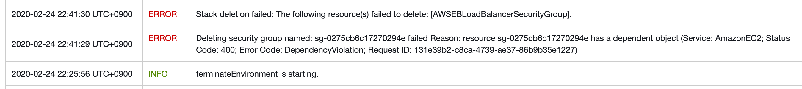
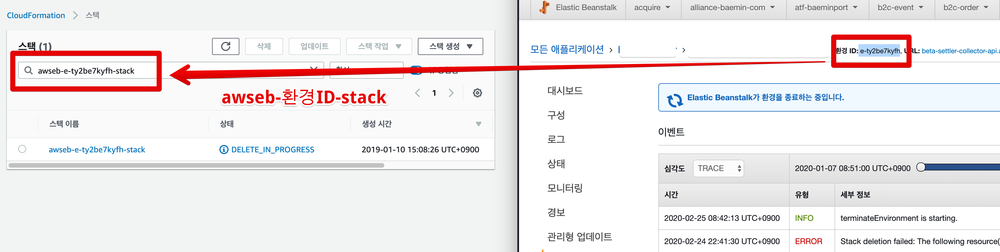
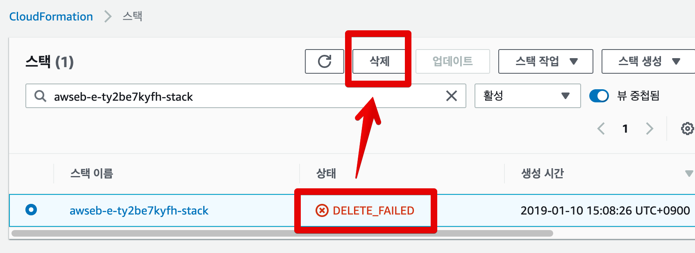
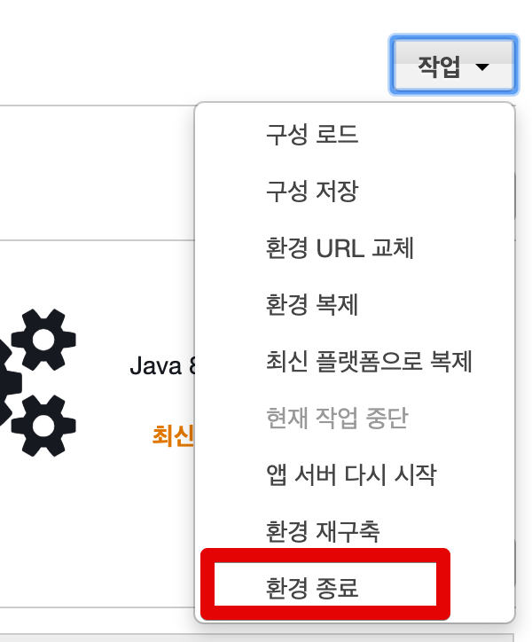
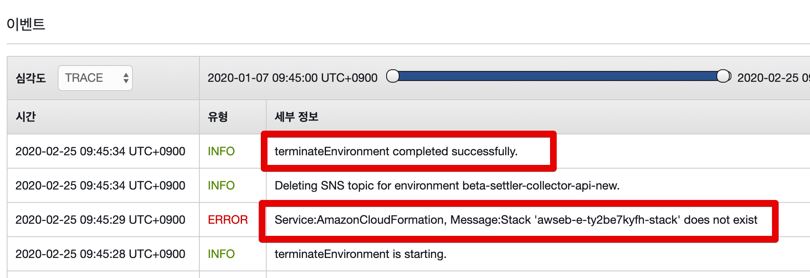

# AWS ElasticBeanstalk (빈스톡) 삭제 실패시 강제 삭제

AWS ElasticBeanstalk 삭제시 아래와 같은 메세지와 함께 삭제가 실패할때가 있습니다

```
ERROR Stack deletion failed: The following resource(s) failed to delete: [AWSEBLoadBalnaceSecurityGroup]
ERROR Deleting security group named failed reason resource has a dependent object
```



보통 위와 같이 **AWSEBLoadBalnaceSecurityGroup**, **AWSEBSecurityGroup** 등이 삭제가 안되어 Beanstalk 환경 삭제가 실패하게 되는데요.  
Beanstalk에서 사용하고 있는 Security Group을 Beanstalk 환경에서 수정 하지 않고, **직접 Security Group 서비스에서 수정**한적이 있다면 발생하게 됩니다.  
  
이에 대한 해결책은 Beanstalk 에 사용된 CloudFormation 스택을 삭제하는 것입니다.

> CloudFormation이란 테라폼처럼 **코드로 AWS 아키텍처를 모델링 하는 서비스**입니다.  
> Beanstalk 역시 AWS의 여러 서비스들을 조립하여 만든 패키지형 서비스인데요.  
> 그 중심에 Cloud Formation 으로 어떻게 조립할지가 결정되어있다고 보시면 됩니다.

자 그럼 CloudFormation 삭제 -> Beanstalk 삭제를 차례로 진행해보겠습니다.

## CloudFormation 스택 삭제

먼저 Beanstalk 의 환경 ID로 CloudFormation을 찾겠습니다.



(좌측: CloudFormation, 우측: Beanstalk)  
  
삭제가 실패된 Beanstalk의 CloudFormation이라면 상태가 **DELETE_FAILED**로 되어있습니다.  
해당 스택을 선택후 삭제합니다



여기서 SecurityGroup 역시 함께 삭제해줍니다.


여기까지 하신뒤 몇분 정도 기다리시면 CloudFormation이 완전 삭제 된 것을 확인할 수 있습니다.

## Beanstalk 다시 삭제

CloudFormation이 완전 다 삭제되셨다면 다시 Beanstalk 환경 종료를 실행해봅니다.



정상적으로 삭제가 진행되는 것을 확인할 수 있습니다.

