# CloudWatch 이상 지표를 슬랙 알람으로 받기 (feat. SNS, Lambda)

AWS 서비스를 이용하면 CloudWatch를 통해 서비스의 이상 지표를 손쉽게 확인할 수 있습니다.  
이를테면 다음과 같은 경우인데요.

* 평소보다 로드밸런서로 들어오는 요청양이 2배이상 높다거나
* RDS의 CPU가 60%이상이 된다거나
* RDS에 사용중인 Connection이 갑자기 줄어든다거나 

등등의 경우입니다.  
이때 별도의 알람을 붙여놓지 않는다면 **서비스가 죽고 나서야 알게 됩니다**.  
  
그래서 위와 같이 이상지표가 발생하면 즉시 Slack 등 메신저를 통해 알람을 받아야만 하는데요.  
AWS에서는 SNS와 Lambda를 통해 Cloud Watch의 이상 지표를 손쉽게 알람을 받을 수 있습니다.  
  
이번 시간에는 Cloud Watch와 SNS, Lambda를 활용해 이상 지표 알람 서비스를 만들어보겠습니다.

## 1. SNS 토픽 생성


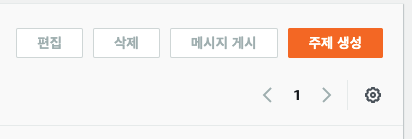

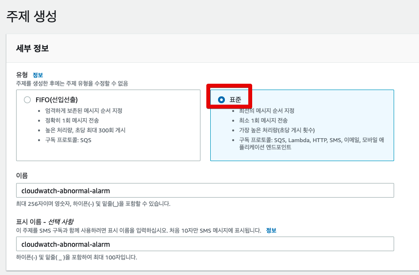

## 2. Lambda 함수 생성


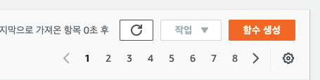

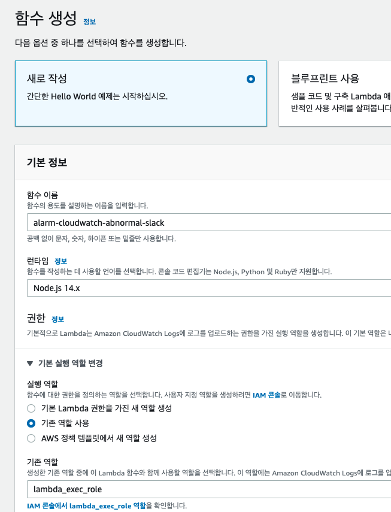

### Lambda 함수 코드 추가

> 모든 코드는 [Github](https://github.com/jojoldu/blog-code/tree/master/aws/cloudwatch-alarm)에 있습니다.

```js
const ENV = process.env
if (!ENV.webhook) throw new Error('Missing environment variable: webhook')

const webhook = ENV.webhook;
const https = require('https')

const statusColorsAndMessage = {
    ALARM: {"color": "danger", "message":"위험"},
    INSUFFICIENT_DATA: {"color": "warning", "message":"데이터 부족"},
    OK: {"color": "good", "message":"정상"}
}

const comparisonOperator = {
    "GreaterThanOrEqualToThreshold": ">=",
    "GreaterThanThreshold": ">",
    "LowerThanOrEqualToThreshold": "<=",
    "LessThanThreshold": "<",
}

exports.handler = async (event) => {
    await exports.processEvent(event);
}

exports.processEvent = async (event) => {
    console.log('Event:', JSON.stringify(event))
    const snsMessage = event.Records[0].Sns.Message;
    console.log('SNS Message:', snsMessage);
    const postData = exports.buildSlackMessage(JSON.parse(snsMessage))
    await exports.postSlack(postData, webhook);
}

exports.buildSlackMessage = (data) => {
    const newState = statusColorsAndMessage[data.NewStateValue];
    const oldState = statusColorsAndMessage[data.OldStateValue];
    const executeTime = exports.toYyyymmddhhmmss(data.StateChangeTime);
    const description = data.AlarmDescription;
    const cause = exports.getCause(data);

    return {
        attachments: [
            {
                title: `[${data.AlarmName}]`,
                color: newState.color,
                fields: [
                    {
                        title: '언제',
                        value: executeTime
                    },
                    {
                        title: '설명',
                        value: description
                    },
                    {
                        title: '원인',
                        value: cause
                    },
                    {
                        title: '이전 상태',
                        value: oldState.message,
                        short: true
                    },
                    {
                        title: '현재 상태',
                        value: `*${newState.message}*`,
                        short: true
                    },
                    {
                        title: '바로가기',
                        value: exports.createLink(data)
                    }
                ]
            }
        ]
    }
}

// Cloud Watch 알람 바로 가기 링크

exports.createLink = (data) => {
    return `https://console.aws.amazon.com/cloudwatch/home?region=${exports.exportRegionCode(data.AlarmArn)}#alarm:alarmFilter=ANY;name=${encodeURIComponent(data.AlarmName)}`;
}

exports.exportRegionCode = (arn) => {
    return  arn.replace("arn:aws:cloudwatch:", "").split(":")[0];
}

exports.getCause = (data) => {
    const trigger = data.Trigger;
    const evaluationPeriods = trigger.EvaluationPeriods;
    const minutes = Math.floor(trigger.Period / 60);

    if(data.Trigger.Metrics) {
        return exports.buildAnomalyDetectionBand(data, evaluationPeriods, minutes);
    }

    return exports.buildThresholdMessage(data, evaluationPeriods, minutes);
}

// 이상 지표 중 Band를 벗어나는 경우
exports.buildAnomalyDetectionBand = (data, evaluationPeriods, minutes) => {
    const metrics = data.Trigger.Metrics;
    const metric = metrics.find(metric => metric.Id === 'm1').MetricStat.Metric.MetricName;
    const expression = metrics.find(metric => metric.Id === 'ad1').Expression;
    const width = expression.split(',')[1].replace(')', '').trim();

    return `${evaluationPeriods * minutes} 분 동안 ${evaluationPeriods} 회 ${metric} 지표가 범위(약 ${width}배)를 벗어났습니다.`;
}

// 이상 지표 중 Threshold 벗어나는 경우 
exports.buildThresholdMessage = (data, evaluationPeriods, minutes) => {
    const trigger = data.Trigger;
    const threshold = trigger.Threshold;
    const metric = trigger.MetricName;
    const operator = comparisonOperator[trigger.ComparisonOperator];

    return `${evaluationPeriods * minutes} 분 동안 ${evaluationPeriods} 회 ${metric} ${operator} ${threshold}`;
}

// 타임존 UTC -> KST
exports.toYyyymmddhhmmss = (timeString) => {

    if(!timeString){
        return '';
    }

    const kstDate = new Date(new Date(timeString).getTime() + 32400000);

    function pad2(n) { return n < 10 ? '0' + n : n }

    return kstDate.getFullYear().toString()
        + '-'+ pad2(kstDate.getMonth() + 1)
        + '-'+ pad2(kstDate.getDate())
        + ' '+ pad2(kstDate.getHours())
        + ':'+ pad2(kstDate.getMinutes())
        + ':'+ pad2(kstDate.getSeconds());
}

exports.postSlack = async (message, slackUrl) => {
    return await request(exports.options(slackUrl), message);
}

exports.options = (slackUrl) => {
    const {host, pathname} = new URL(slackUrl);
    return {
        hostname: host,
        path: pathname,
        method: 'POST',
        headers: {
            'Content-Type': 'application/json'
        },
    };
}

function request(options, data) {

    return new Promise((resolve, reject) => {
        const req = https.request(options, (res) => {
            res.setEncoding('utf8');
            let responseBody = '';

            res.on('data', (chunk) => {
                responseBody += chunk;
            });

            res.on('end', () => {
                resolve(responseBody);
            });
        });

        req.on('error', (err) => {
            console.error(err);
            reject(err);
        });

        req.write(JSON.stringify(data));
        req.end();
    });
}
```

저 같은 경우 `exports`로 만든 function들은 `jest`로 모두 테스트코드를 작성해서 굳이 람다 실행전에 빠르게 검증/수정

### 환경변수에 Slack Webhook 추가

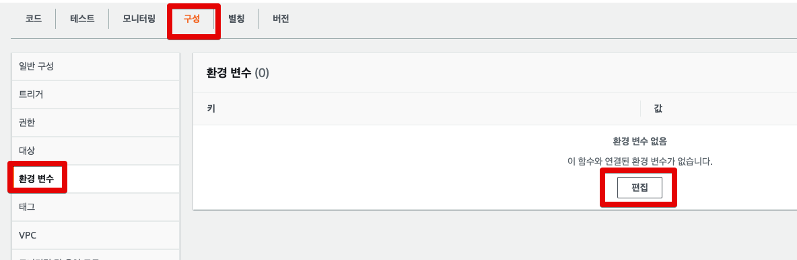

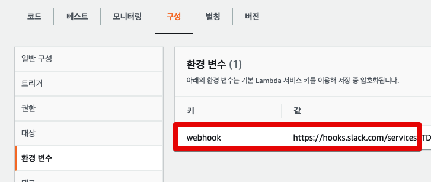

### Lambda 테스트

```json
{
  "Records": [
    {
      "EventSource": "aws:sns",
      "EventVersion": "1.0",
      "EventSubscriptionArn": "arn:aws:sns:ap-northeast-2:981604548033:alarm-topic:test",
      "Sns": {
        "Type": "Notification",
        "MessageId": "test",
        "TopicArn": "arn:aws:sns:ap-northeast-2:123123:test-alarm-topic",
        "Subject": "ALARM: \"RDS-CPUUtilization-high\" in Asia Pacific (Seoul)",
        "Message": "{\"AlarmName\":\"Aurora PostgreSQL CPU 알람 (60%이상시)\",\"AlarmDescription\":\"Aurora PostgreSQL CPU 알람 (60%이상시)\",\"AWSAccountId\":\"981604548033\",\"NewStateValue\":\"ALARM\",\"NewStateReason\":\"Threshold Crossed: 3 out of the last 3 datapoints [8.891518474692088 (14/07/21 23:18:00), 9.72 (14/07/21 23:17:00), 9.18241509182415 (14/07/21 23:16:00)] were greater than or equal to the threshold (7.0) (minimum 3 datapoints for OK -> ALARM transition).\",\"StateChangeTime\":\"2021-07-14T23:20:50.708+0000\",\"Region\":\"Asia Pacific (Seoul)\",\"AlarmArn\":\"arn:aws:cloudwatch:ap-northeast-2:981604548033:alarm:Aurora PostgreSQL CPU 알람 (60%이상시)\",\"OldStateValue\":\"OK\",\"Trigger\":{\"MetricName\":\"CPUUtilization\",\"Namespace\":\"AWS/RDS\",\"StatisticType\":\"Statistic\",\"Statistic\":\"MAXIMUM\",\"Unit\":null,\"Dimensions\":[{\"value\":\"aurora-postgresql\",\"name\":\"EngineName\"}],\"Period\":60,\"EvaluationPeriods\":3,\"ComparisonOperator\":\"GreaterThanOrEqualToThreshold\",\"Threshold\":7,\"TreatMissingData\":\"- TreatMissingData:                    ignore\",\"EvaluateLowSampleCountPercentile\":\"\"}}",
        "Timestamp": "2021-06-07T11:31:17.380Z",
        "SignatureVersion": "1",
        "MessageAttributes": {}
      }
    }
  ]
}
```

> 이 외에 다양한 형태의 SNS 메세지는 [Github](https://github.com/jojoldu/blog-code/tree/master/aws/cloudwatch-alarm/test)에 `test.json`과 `testRequestHigh.json` 으로 확인할 수 있습니다.


## 3. Cloud Watch 경보 생성

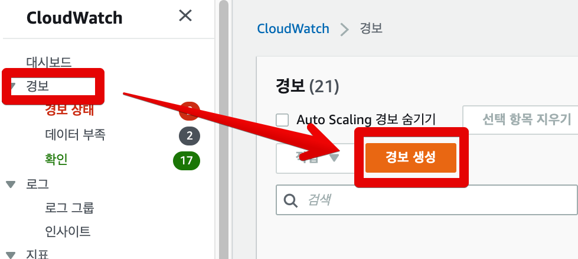

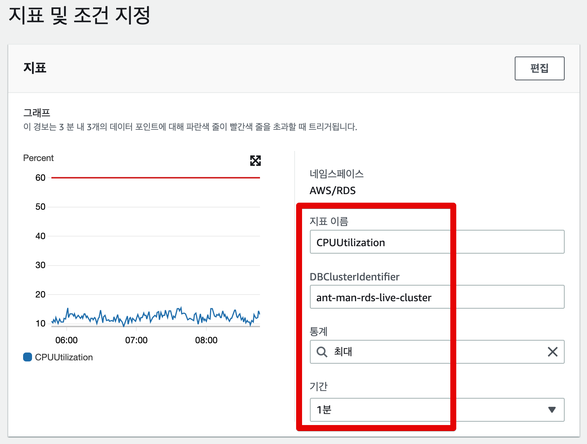

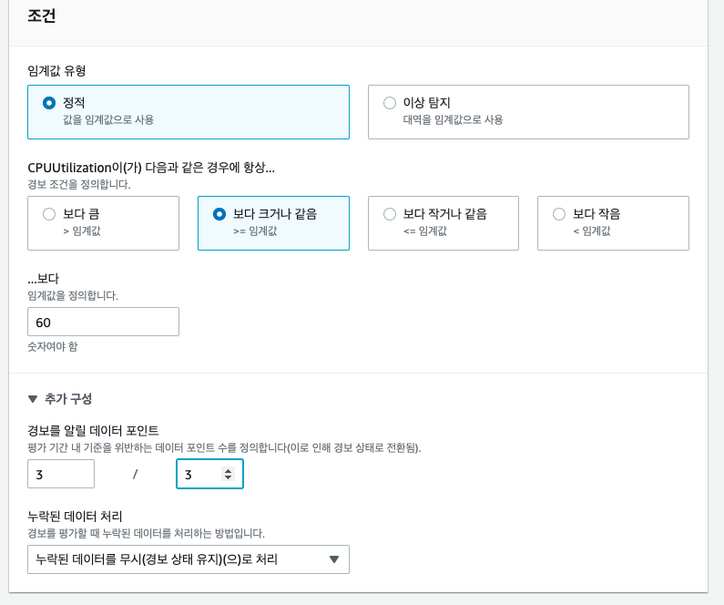


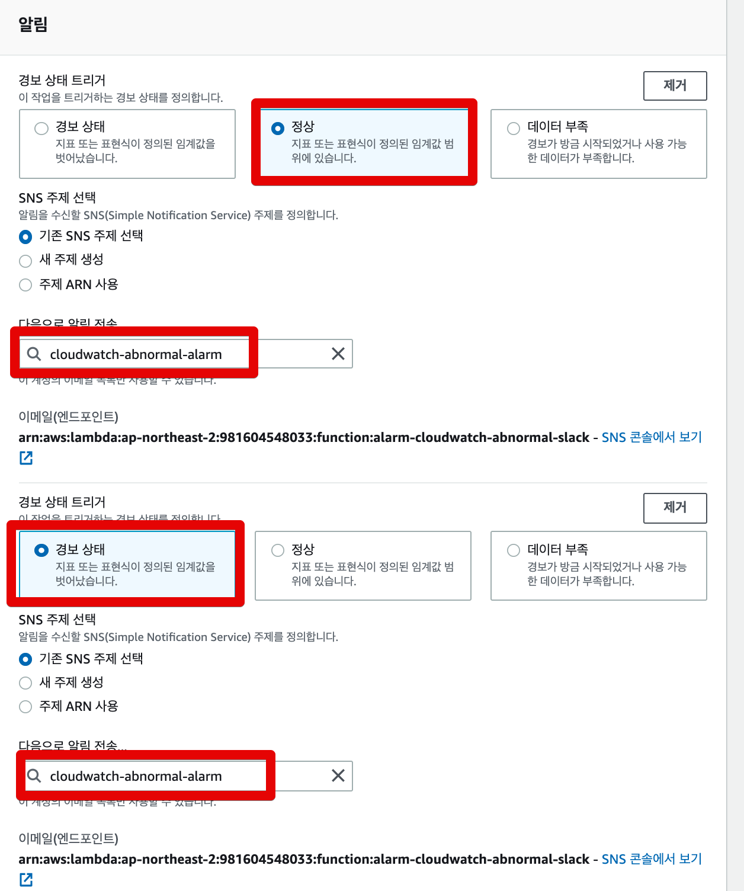

* 정상 => 경보
* 경보/데이터부족 => 정상

둘다 넣어야, **비정상 상태에서 정상으로 돌아왔음**을 알람으로 인지할 수 있기 때문입니다.  
정상 알람을 걸어두지않으면, **아직까지 장애인지 / 장애가 해소된건지**알수가 없기 때문에 무조건 노트북을 열어 확인할 수 밖에 없습니다.  
본인의 정신건강을 위해서라도 정상 알람까지 꼭 추가하기를 추천드립니다.  


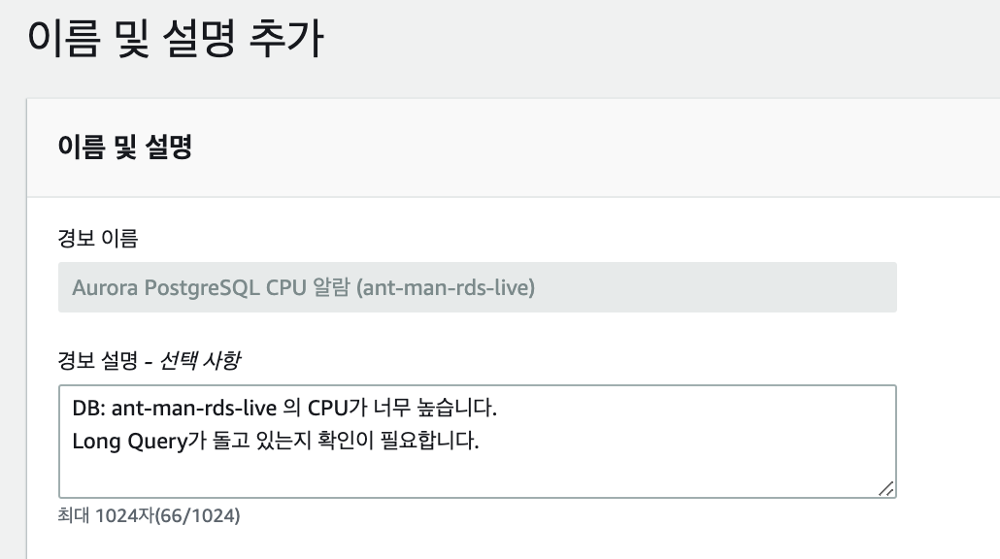

이 알람을 확인한 분들이 서비스/AWS 리소스을 잘 모르더라도 **이 알람이 어떤 알람인지 쉽게 이해할 수 있도록** 경보 설명을 상세하게 작성합니다.  


## 실제 알람 발생

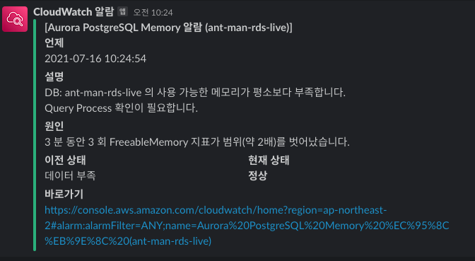

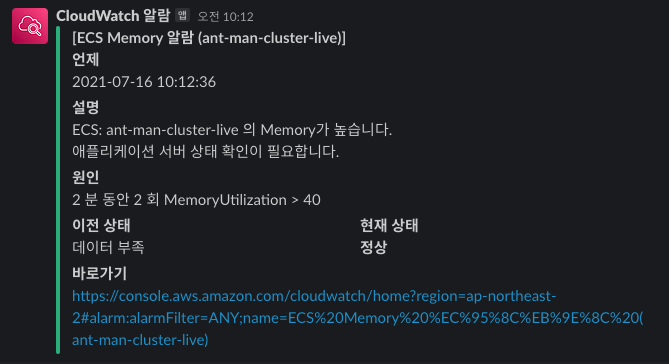