# ec2-gauza 설치 및 사용하기

개인적으로도 회사에서도 AWS를 사용중입니다.  
AWS와 같은 클라우드를 사용할때 가장 불편한것이 인스턴스를 터미널로 접속할때인데요.  
**매번 IP를 ~/.ssh/config에 등록하거나 pem 파일을 지정하는 것**이 너무나 불편합니다.  
어떻게 하면 좀 더 편하게 인스턴스에 접속할 수 있을까 고민중에!  
팀원분께서 직접 만든 오픈소스 접속기 [ec2-gauza](https://github.com/leejaycoke/ec2-gazua)를 알게 되어 사용하게 되었습니다!  

> 유용하셨다면 Github Star도 부탁드립니다! :)

사용해보니 너무 편리하여 정말 많은 분들이 사용해보셨으면 하는 마음에 정리하게 되었습니다.  
이번 기회에 한번 사용해보시길 강추드리며, 설치와 실행 하는 방법을 정리합니다.


## 1. IAM User 생성

ec2-gauza는 접속할 수 있는 EC2 인스턴스 목록을 불러옵니다.  
하지만 그럴려면 EC2 목록을 볼 수 있는 권한이 있는 Access Key와 Secret Key가 필요합니다.  
이를 위해 IAM User를 하나 생성하겠습니다.

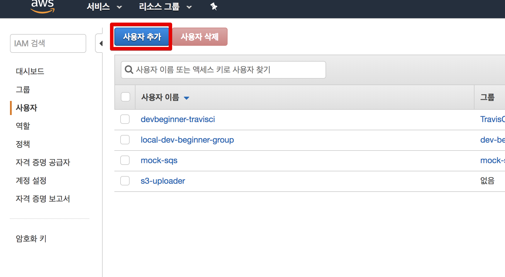

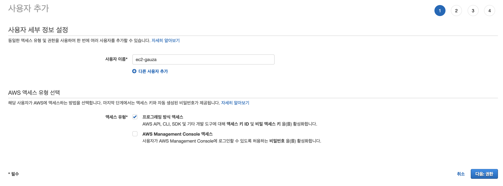


생성된 사용자의 엑세스키와 시크릿키는 잡깐 메모장에 복사해놓습니다.

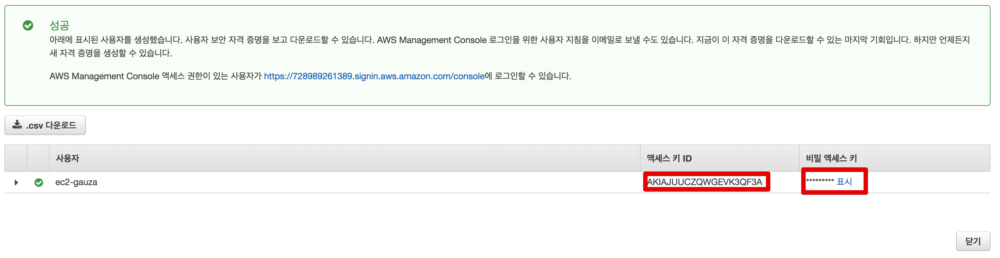

자 이제 본격적으로 ec2-gauza를 설치해보겠습니다.

## 2. 설치

기본적으로 **Python 2.x**만 지원합니다.  
Mac의 경우 Python2가 기본 설치되어있으니 생략하겠습니다.

### 2-1. 필요 환경 설정

ec2-gauza는 tmux와 pip가 필요합니다.  
이들을 먼저 설치합니다.

tmux 설치

```bash
brew install tmux
```

pip 설치

```bash
sudo easy_install pip
```

이제 ec2-gauza를 설치해보겠습니다.

### 2-2. ec2-gauza 설치

본인이 설치하고 싶은 곳으로 이동하여 설치를 진행합니다.  

> 저는 ```~/.ssh/```에 설치하겠습니다.


```bash
cd ~/.ssh/
git clone https://github.com/leejaycoke/ec2-gazua.git
```

clone 받은 ```ec2-gauza``` 디렉토리로 이동합니다.

```bash
cd ./ec2-gauza
```

ec2-gauza에서 필요한 Python 패키지를 받습니다.

```bash
pip install --user -r requirements.txt 
```

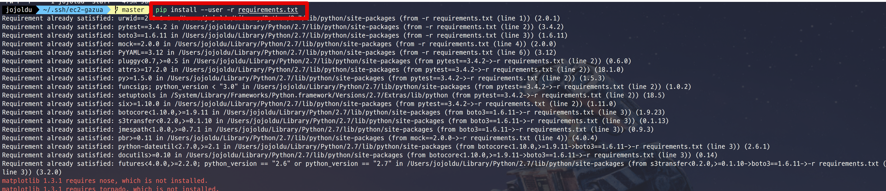

설치가 다 되셨으면, EC2 목록을 불러올 수 있도록 yml을 설정하겠습니다.  

### Yml 설정

ec2-gauza 디렉토리 안에 ```conf/aws```로 이동합니다.  

```bash
cd ./conf/aws
```

디렉토리를 보면 예제로 둔 ```aws.yml.example```이 있습니다.  
이 파일을 복사하여 나만의 yml 파일을 만들겠습니다.

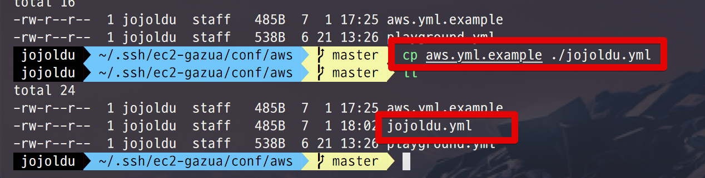

```bash
cp aws.yml.example ./jojoldu.yml
```

> 저는 yml 파일명을 ```jojoldu.yml```로 했지만, 원하시는 다른 이름으로 지으셔도 무방합니다.

생성한 yml 파일을 편집합니다.

```bash
vim ./jojoldu.yml
```

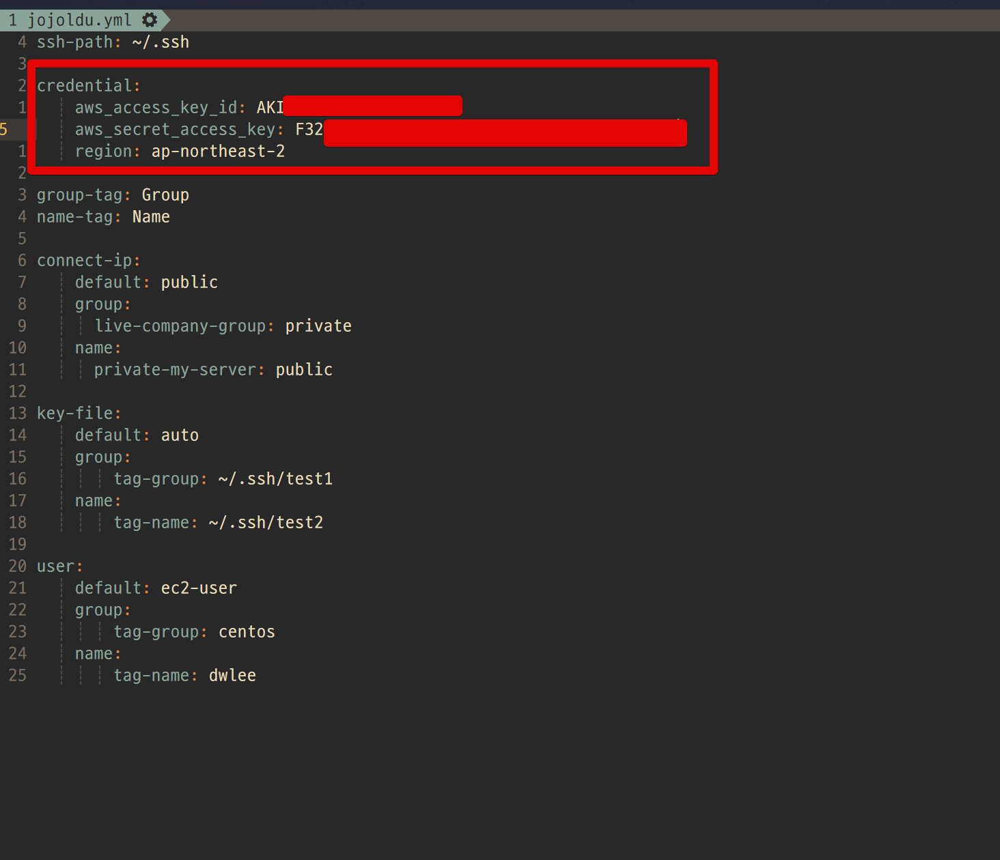

* ```aws_access_key_id```: IAM User의 액세스 키 ID
* ```aws_secret_access_key```: IAM User의 비밀 액세스 키

credential 하단을 보시면 group-tag와 name-tag가 있습니다.  
해당 계정의 **EC2에 달린 Tag을 접속 화면 카테고리**로 사용하겠다는 의미입니다.  

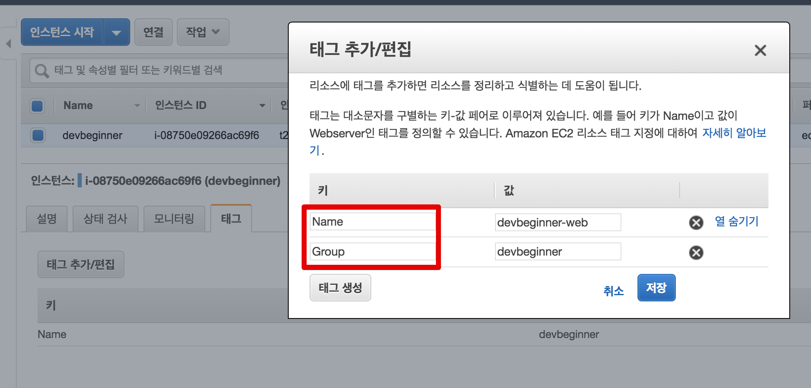

> 이렇게 본인의 EC2에 달린 태그를 확인해보시고 필요하시면 추가해보세요!  

편집이 끝나셨다면, 저장 (```:wq```) 합니다.  

주의 하실게 있는데, **모든 pem 파일들**은 ```~/.ssh/``` 안에 있어야만 찾을 수 있습니다.  

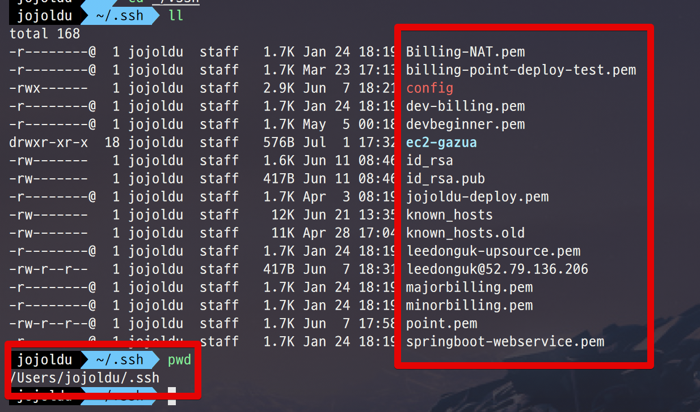

## 3. 실행

다시 ec2-gauza 디렉토리로 이동해봅니다.

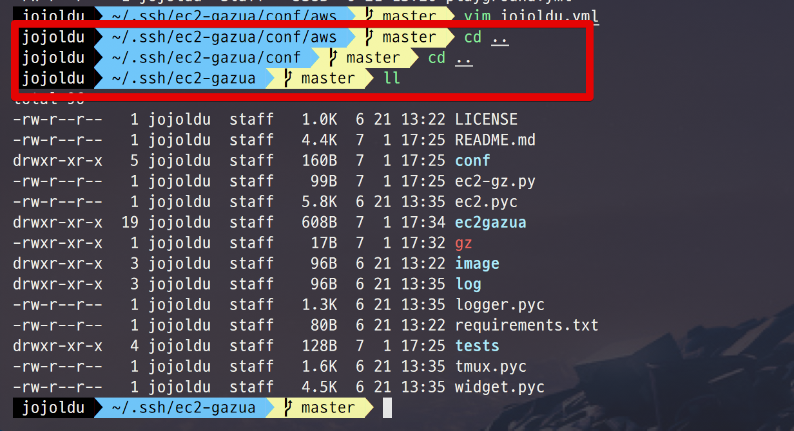

ec2-gauza를 실행해봅니다.

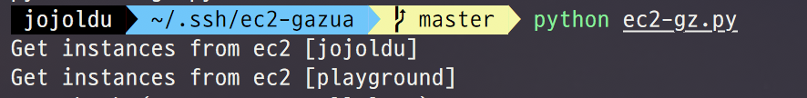

```bash
python ec2-gz.py
```

그럼 아래처럼 **mdir의 감성**을 가진 접속 화면이 실행됩니다.


> ```ctrl+c```를 누르시면 화면에서 빠져나옵니다.

보시는 것처럼 EC2 인스턴스의 ```Group Tag```와 ```Name Tag```로 화면에 노출됩니다.  
  
좌우 화살표로 원하는 인스턴스까지 이동하신 뒤, ```스페이스바``` 를 누릅니다.  
그럼 아래처럼 해당 인스턴스에 ```x```가 표기됩니다.

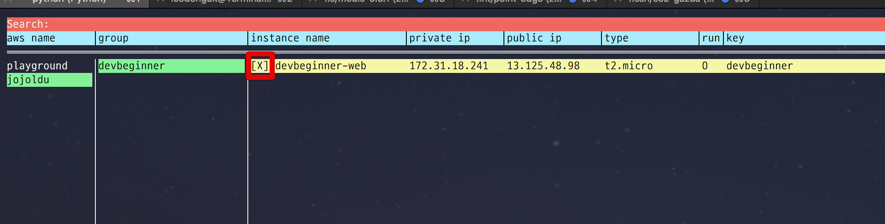

그리고 ```Enter```를 누르시면

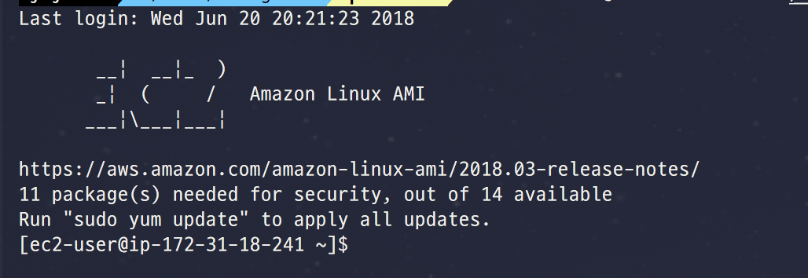

이렇게 쉽게 접속 되는 것을 알 수 있습니다!  
  
이것만 보면 그냥 커맨드로 접속하는것과 크게 차이점을 못느끼실텐데요.  
ec2-gauza의 장점은 **여러 인스턴스를 동시에 tmux로 접근**할 수 있습니다.  

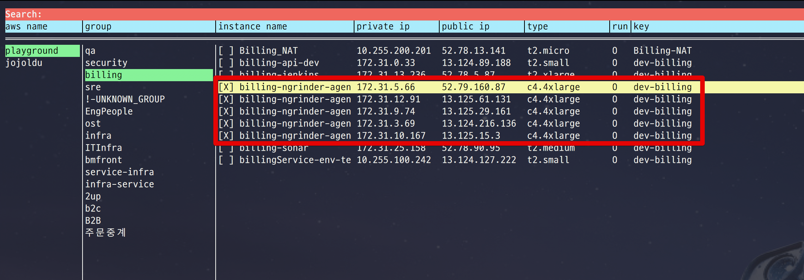

5개의 인스턴스를 동시에 선택한후, ```Enter```를 누르면 아래처럼 동시에 **모든 인스턴스에 접속** 됩니다.


특히 유용한 상황은 **AWS Beanstalk, Auto Scaling Group처럼 필요에 따라 인스턴스가 생성되고 삭제되어 IP가 계속 변하는 경우**입니다.  
Tag만으로 접근하기 때문에 오토스케일링 상황에서도 아주 쉽게 접속 할 수 있습니다.  
  

## Tip

ec2-gauza를 좀 더 잘 사용하기 위해 아래 2가지를 참고해보세요.

### 전역 실행 환경

어느 위치에서도 쉽게 ec2-gauza를 실행하기 위해 글로벌 커맨드로 등록하겠습니다.  
ec2-gauza 디렉토리에 ```gz``` 파일을 생성합니다.

```bash
vim gz
```

아래 커맨드를 등록합니다.

```bash
python ec2-gz.py
```

저장 (```:wq```) 하신 뒤 실행 권한을 추가합니다.

```bash
chmod +x ./gz
```

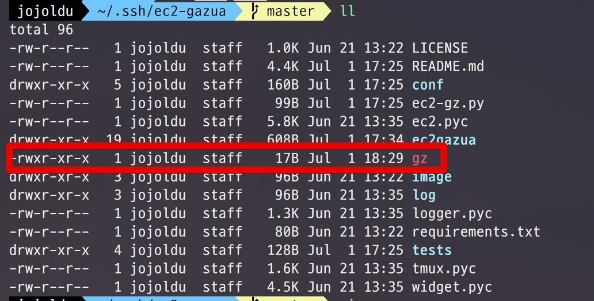

그리고 이 ```gz```를 본인의 쉘 환경변수에 등록합니다.  
저는 zsh를 쓰기 때문에 ```~/.zshrc```에 등록하겠습니다.

> bash를 쓰신다면 ```~/.bash_profile```에 등록하세요

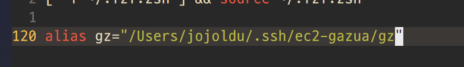

```bash
alias gz="/Users/jojoldu/.ssh/ec2-gazua/gz"
```

이렇게 등록하시면 **터미널 어느 위치에서도** ```gz```를 입력하시면 ec2-gauza가 실행됩니다.

### 화면깨짐 이슈

맥 환경에 따라 화면이 깨질수 있습니다.  
혹시나 접속 화면이 깨진다면 ```bash_profile```에 아래 코드를 추가해주세요.

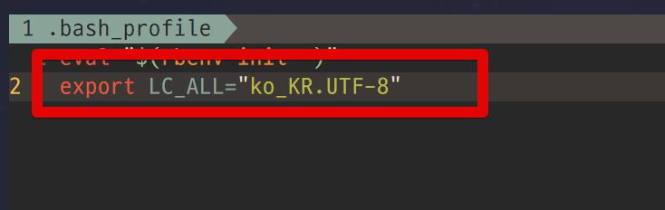

```bash
export LC_ALL="ko_KR.UTF-8"
```