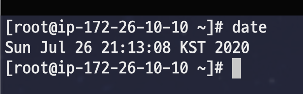
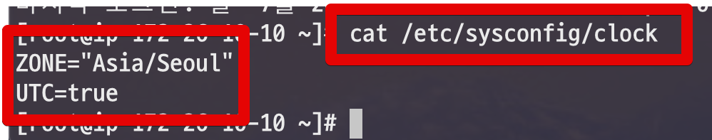

# AWS EC2의 Timezone KST로 변경하기 (Amazon Linux 1)

AWS의 Amazon Linux 1을 사용할 경우 Timezone을 변경하고, 잘 적용되다가 인스턴스를 재시작하면 다시 UTC로 롤백되는 경우가 종종 있는데요.  
이는 한가지 설정이 누락되어서 그렇습니다.  
  
먼저 기존의 다른 포스팅처럼 아래 명령어를 차례로 입력합니다.  

> ```root``` 계정으로 변경한 뒤, 진행합니다.  
> root 계정으로 변경은 ```sudo su - root``` 명령어로 하시면 됩니다.

```bash
sudo rm /etc/localtime
sudo ln -s /usr/share/zoneinfo/Asia/Seoul /etc/localtime
```

이렇게 변경 후 ```date```를 입력해보면 정상적으로 KST로 변경된 것을 볼 수 있는데요.  



그리고 ```/etc/sysconfig/clock``` 파일을 열어 **ZONE 값을 Asia/Seoul** 으로 변경합니다.  

```bash
vim /etc/sysconfig/clock
```

설정이 잘 되셨다면 아래와 같은 값이 되었을겁니다.




> ```UTC=true``` 는 변경하시면 안됩니다. 

그리고 마지막으로 인스턴스 재부팅을 하시면 됩니다.

```bash
reboot
```


