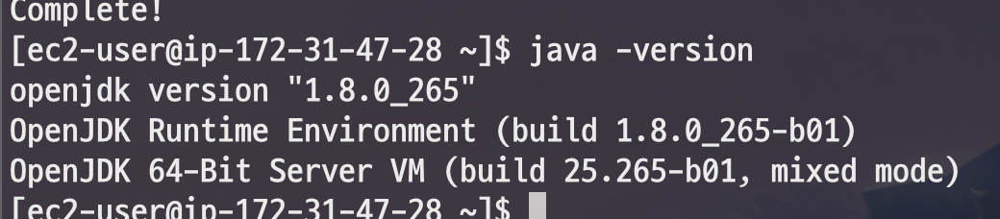
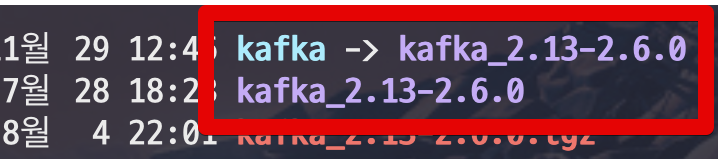
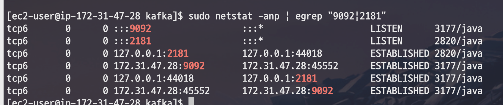

# EC2에 카프카 설치하기

## 1. EC2 생성

## 2. Kafka Consumer 설치

Amazon Linux2 로 진행할 경우 Java가 기본적으로 설치가 안되어있습니다.  
그래서 아래 명령어를 차례로 입력하여 Java를 설치합니다.

```bash
sudo yum update -y 
sudo yum install -y java-1.8.0-openjdk-devel.x86_64
java -version
```



Java가 설치된게 확인되셨으면 바로 카프카를 설치합니다.

```bash
wget https://downloads.apache.org/kafka/2.6.0/kafka_2.13-2.6.0.tgz
tar xvf kafka_2.13-2.6.0.tgz  
```

카프카 디렉토리 접근을 쉽게 할 수 있도록 link를 걸어줍니다.

```bash
ln -s kafka_2.13-2.6.0 kafka
```



설치된 카프카를 실행해봅니다.

```bash
cd kafka
```

zookeeper 실행

```bash
./bin/zookeeper-server-start.sh config/zookeeper.properties & 
```

> 실행 로그가 다 올라온뒤에 ```enter```를 치시면 됩니다.

카프카 브로커 실행

```bash
./bin/kafka-server-start.sh config/server.properties & 
```

zookeeper와 카프카가 잘 실행되었는지 확인합니다.

```bash
# 데몬확인
sudo netstat -anp | egrep "9092|2181"
```



### 카프카 토픽 생성

토픽의 이름은 ```twitter``` 로 하겠습니다.  

> 트위터로 테스트할 예정

```bash
bin/kafka-topics.sh --create --zookeeper localhost:2181 --replication-factor 1 --partitions 1 --topic twitter &
```

Topic 확인 

```bash
bin/kafka-topics.sh --list --zookeeper localhost:2181 
```


카프카 consumer 실행

```bash
./bin/kafka-console-consumer.sh --bootstrap-server localhost:9092 --topic twitter --from-beginning
```

## 3. 2. Kafka Producer 설치