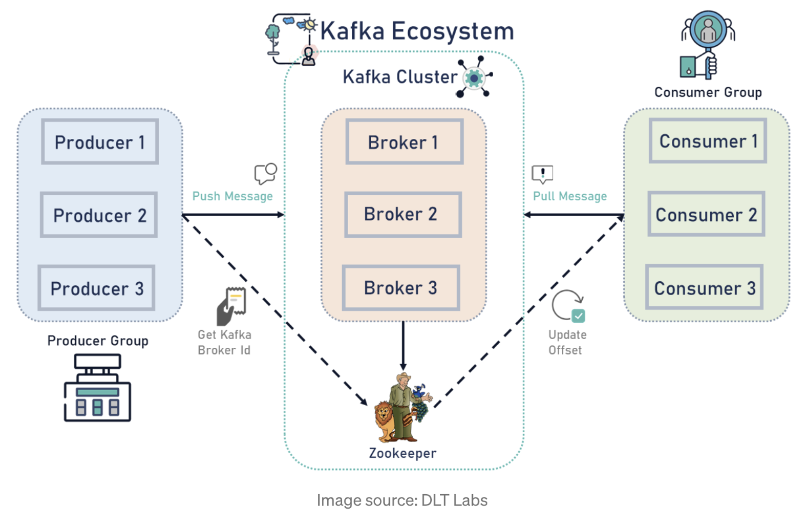
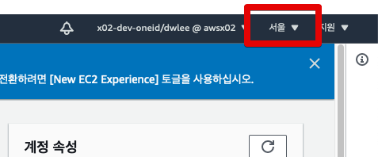
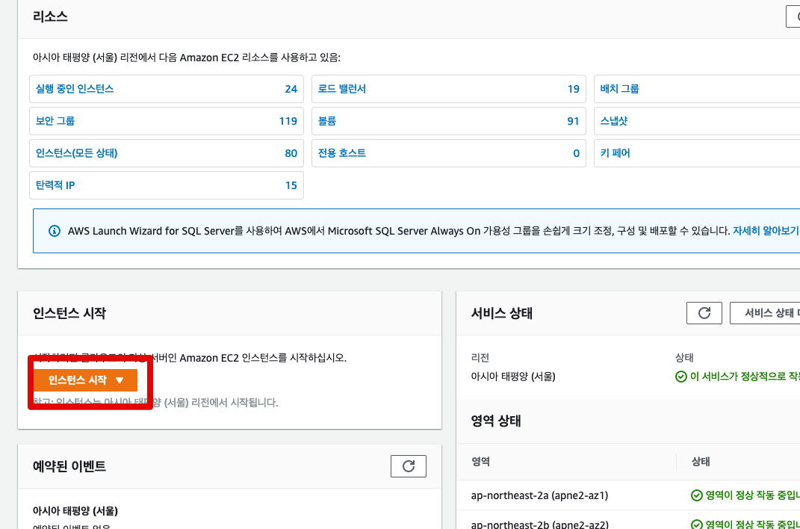
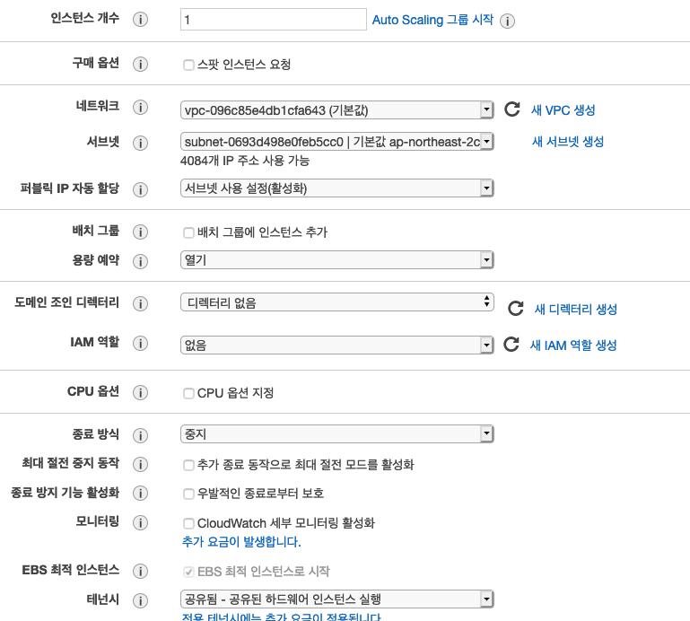
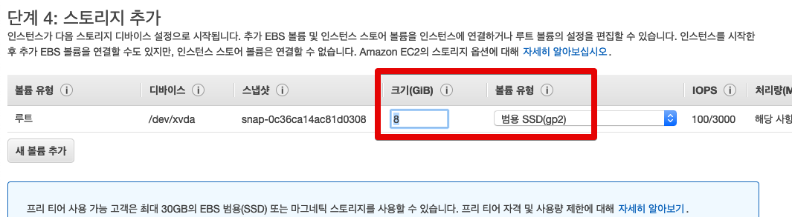
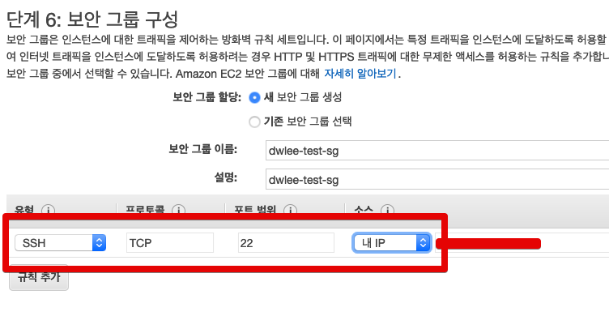
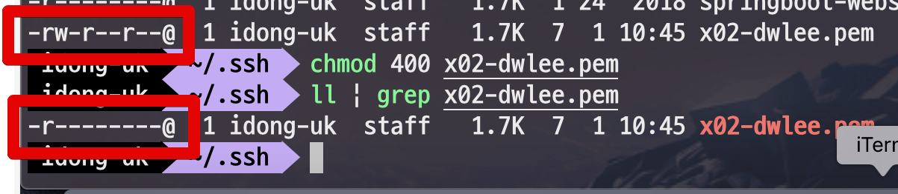
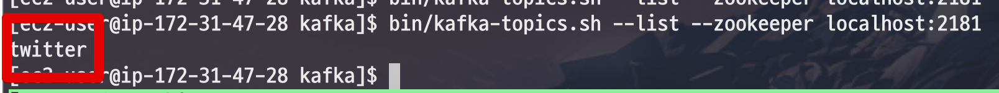

# EC2에 카프카 설치하기

> 패스트캠퍼스의 [실무에 활용하는 데이터 파이프라인 구축 CAMP](https://www.fastcampus.co.kr/data_camp_pipeline) 내용을 기반으로 합니다.

## 0. 개요

원래는 아래와 같은 형태가 카프카를 구성하는 아키텍처입니다.



하지만, 개인이 연습하기에는 Producer/Broker/Cosumer를 각각의 HA 구성을 하기가 어려우니 이번 시간에는 간단하게 아래와 같은 형태로 구성해보겠습니다.

## 1. EC2 생성

















## 2. Kafka Consumer 설치

Amazon Linux2 로 진행할 경우 Java가 기본적으로 설치가 안되어있습니다.  
그래서 아래 명령어를 차례로 입력하여 Java를 설치합니다.

```bash
sudo yum update -y 
sudo yum install -y java-1.8.0-openjdk-devel.x86_64
java -version
```


Java가 설치된게 확인되셨으면 바로 카프카를 설치합니다.

```bash
wget https://downloads.apache.org/kafka/2.6.0/kafka_2.13-2.6.0.tgz
tar xvf kafka_2.13-2.6.0.tgz  
```

카프카 디렉토리 접근을 쉽게 할 수 있도록 link를 걸어줍니다.

```bash
ln -s kafka_2.13-2.6.0 kafka
```


설치된 카프카를 실행해봅니다.

```bash
cd kafka
```

zookeeper 실행

```bash
./bin/zookeeper-server-start.sh config/zookeeper.properties & 
```

> 실행 로그가 다 올라온뒤에 ```enter```를 치시면 됩니다.

카프카 브로커 실행

```bash
./bin/kafka-server-start.sh config/server.properties & 
```

zookeeper와 카프카가 잘 실행되었는지 확인합니다.

```bash
# 데몬확인
sudo netstat -anp | egrep "9092|2181"
```


### 카프카 토픽 생성

토픽의 이름은 ```twitter``` 로 하겠습니다.  

> 트위터로 테스트할 예정

```bash
bin/kafka-topics.sh --create --zookeeper localhost:2181 --replication-factor 1 --partitions 1 --topic twitter &
```

Topic 확인 

```bash
bin/kafka-topics.sh --list --zookeeper localhost:2181 
```



카프카 consumer 실행

```bash
./bin/kafka-console-consumer.sh --bootstrap-server localhost:9092 --topic twitter --from-beginning
```

## 3. Kafka Producer 설치

```bash
sudo yum update -y 
sudo yum install -y java-1.8.0-openjdk-devel.x86_64
java -version
```

```bash
wget https://downloads.apache.org/kafka/2.6.0/kafka_2.13-2.6.0.tgz
tar xvf kafka_2.13-2.6.0.tgz  
ln -s kafka_2.13-2.6.0 kafka
```

```bash
cd kafka
bin/kafka-console-producer.sh --topic twitter --bootstrap-server 카프카서버privateIP:9092
```

해당 IP는 private IP로 아래와 같이 EC2 웹 콘솔 혹은 카프카 서버에서 직접 명령어를 실행해서 확인할 수 있습니다.

```bash
ifconfig -a
```

### Consumer & Producer 연동 테스트


