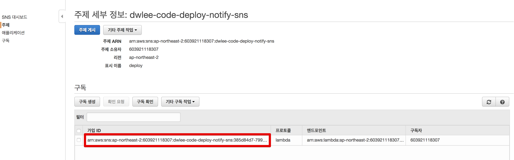
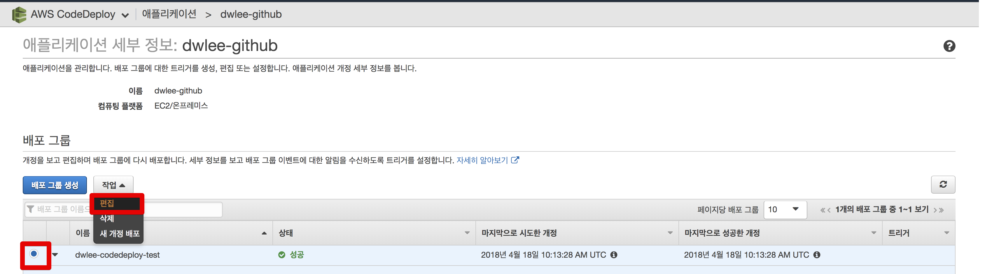
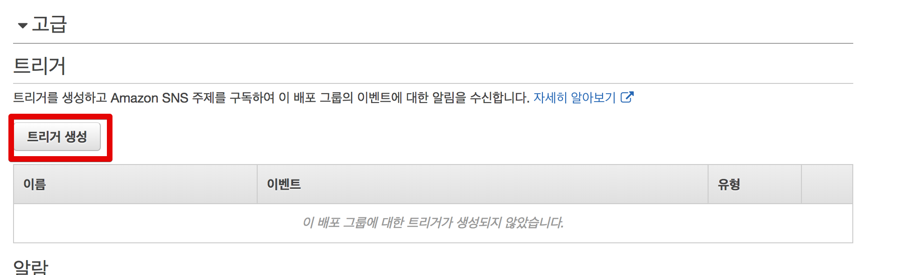
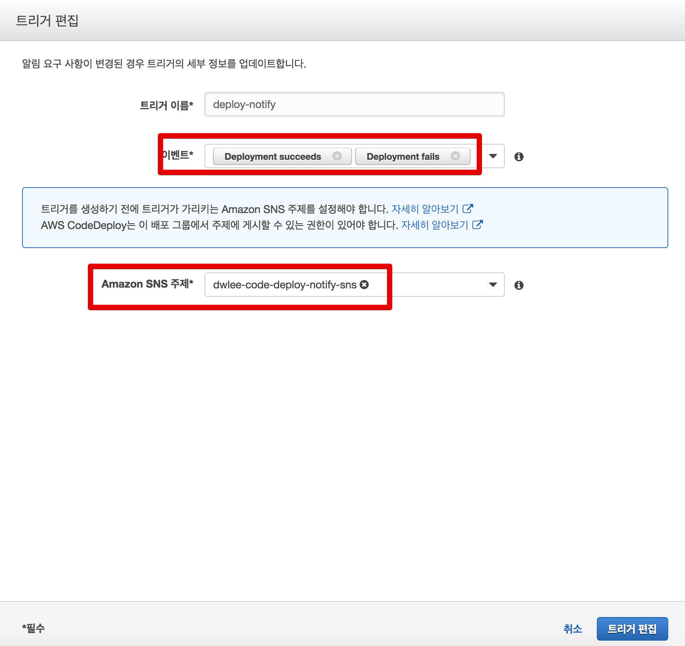

# AWS Lambda로 Code Deploy 배포 알람 받기

Code Deploy와 다른 CI 툴 (ex: TravisCI)를 조합해서 사용할때 가장 불편한 점은 **알람**입니다.  
저의 경우 TravisCI에서 빌드 & 테스트를 한 뒤에, Code Deploy를 통해 EC2로 배포 하는 구조를 자주 사용합니다.  
구축하기 편하다는 장점이 있지만, 이 구조에선 **배포 실패시 상세한 내용을 받기가 어렵습니다.**  
  
TravisCI에서는 Code Deploy에서 어떤 사유로 배포가 실패했는지를 알 수 없기 때문인데요.  
그래서 항상 배포가 실패하면 다음과 같은 내용으로만 알람을 받게 됩니다.


알람으로 온 링크를 클릭해서 들어가봐도 알 수 있는 내용은 없습니다.


그래서 배포 실패가 나면 항상 Code Deploy 화면으로 직접 이동해서 확인할 수 밖에 없습니다.  
이 과정이 굉장히 불편해서 AWS Lambda를 활용해서 Code Deploy의 배포 실패 코드, 실패 상세 메세지, 배포 링크 등 상세한 정보를 전달 받는 과정을 소개드리겠습니다.

## 1. AWS Lambda 소개

AWS Lambda (이하 람다)의 소개는 정말 많은 블로그에서 이야기하고 있기 때문에 여기서 중요하게 다루지는 않겠습니다.  
단지, 별도의 웹 서버 없이 작성한 코드를 실행할 수 있는 환경이며, **지정한 이벤트가 발생하면 작성한 코드를 AWS에서 대신 실행**해준다 정도로만 이해하시면 됩니다.  
현재 지원하는 언어는 Java, 파이썬, NodeJS 입니다.  
여기서는 NodeJS를 사용할 예정입니다.  

> Java나 파이썬은 사용 안해보신분들이 계실수 있지만, Javascript의 경우엔 백엔드/프론트엔드 관계 없이 대부분 조금씩들 해보셨을거라 생각되기 때문입니다.  

AWS 람다는 **월 1백만건까지 무료**이니 1인이 사용하기엔 충분한 양이니 걱정없이 쓰시면 됩니다.  
  
자 그럼 본격적으로 실습을 시작하겠습니다.

## 2. 본문

참고로 이번 실습에선 본인이 사용중인 AWS Code Deploy가 있다는걸 가정합니다.  
없으신 분들이라면 이전에 작성한 포스팅을 참고하시면 좋습니다.

* [AWS로 배포하기 시리즈 - 1. Code Deploy 사용하기](http://jojoldu.tistory.com/281)
* [스프링부트로 웹 서비스 출시하기 - 6. TravisCI & AWS CodeDeploy로 배포 자동화 구축하기](http://jojoldu.tistory.com/265?category=635883)

또한 Slack의 채널과 토큰이 필요하니 없으시면 이참에 테스트로 하나 만들어보시는걸 추천드립니다.

* [slack(슬랙), incoming webhooks 을 사용해보자.](http://seotory.tistory.com/24)
 
다 준비가 되셨으면 이제 시작합니다!

### 2-1. AWS Lambda 생성

먼저 AWS Lambda 서비스로 이동하고, **함수 생성**버튼을 클릭합니다.


좀 더 아래로 내려가보시면 실제 람다가 수행할 코드를 입력하는 화면이 나옵니다.


여기에 실행할 람다 함수를 지정해야만 합니다.  
아래에 제가 만든 코드를 그대로 복사합니다.  
([terranware gitst](https://gist.github.com/terranware/962da63ca547f55667f6)에 에러 메세지와 배포 링크, 타임존 등이 추가된 코드입니다.)

```javascript

var services = process.env.SERVICES;  //Slack service
var channel = process.env.CHANNEL;  //Slack channel

var https = require('https');
var util = require('util');

// 타임존 UTC -> KST
function toYyyymmddhhmmss(date) {

    if(!date){
        return '';
    }

    function utcToKst(utcDate) {
        return new Date(utcDate.getTime() + 32400000);
    }

    function pad2(n) { return n < 10 ? '0' + n : n }

    var kstDate = utcToKst(date);
    return kstDate.getFullYear().toString()
        + '-'+ pad2(kstDate.getMonth() + 1)
        + '-'+ pad2(kstDate.getDate())
        + ' '+ pad2(kstDate.getHours())
        + ':'+ pad2(kstDate.getMinutes())
        + ':'+ pad2(kstDate.getSeconds());
}

var formatFields = function(string) {
    var message = JSON.parse(string),
        fields  = [],
        deploymentOverview;

    // Make sure we have a valid response
    if (message) {
        fields = [
            {
                "title" : "Task",
                "value" : message.eventTriggerName,
                "short" : true
            },
            {
                "title" : "Status",
                "value" : message.status,
                "short" : true
            },
            {
                "title" : "Application",
                "value" : message.applicationName,
                "short" : true
            },
            {
                "title" : "Deployment Group",
                "value" : message.deploymentGroupName,
                "short" : true
            },
            {
                "title" : "Region",
                "value" : message.region,
                "short" : true
            },
            {
                "title" : "Deployment Link",
                "value" : 'https://'+message.region+'.console.aws.amazon.com/codedeploy/home?region='+message.region+'#/deployments/'+message.deploymentId,
                "short" : true
            },
            {
                "title" : "Create Time",
                "value" : toYyyymmddhhmmss(new Date(message.createTime)),
                "short" : true
            },
            {
                "title" : "Complete Time",
                "value" : toYyyymmddhhmmss(new Date((message.completeTime) ? message.completeTime : '')),
                "short" : true
            },
            {
                "title" : "Error Code",
                "value" : message.errorInformation? JSON.parse(message.errorInformation).ErrorCode: '',
                "short" : true
            },
            {
                "title" : "Error Message",
                "value" : message.errorInformation? JSON.parse(message.errorInformation).ErrorMessage: '',
                "short" : true
            }
        ];

    }

    return fields;
};

exports.handler = function(event, context) {

    var postData = {
        "channel": channel,
        "username": "AWS SNS via Lamda :: CodeDeploy Status",
        "text": "*" + event.Records[0].Sns.Subject + "*",
        "icon_emoji": ":aws:"
    };

    var fields = formatFields(event.Records[0].Sns.Message);
    var message = event.Records[0].Sns.Message;
    var severity = "good";

    var dangerMessages = [
        " but with errors",
        " to RED",
        "During an aborted deployment",
        "FAILED",
        "Failed to deploy application",
        "Failed to deploy configuration",
        "has a dependent object",
        "is not authorized to perform",
        "Pending to Degraded",
        "Stack deletion failed",
        "Unsuccessful command execution",
        "You do not have permission",
        "Your quota allows for 0 more running instance"];

    var warningMessages = [
        " aborted operation.",
        " to YELLOW",
        "Adding instance ",
        "Degraded to Info",
        "Deleting SNS topic",
        "is currently running under desired capacity",
        "Ok to Info",
        "Ok to Warning",
        "Pending Initialization",
        "Removed instance ",
        "Rollback of environment"
    ];

    for(var dangerMessagesItem in dangerMessages) {
        if (message.indexOf(dangerMessages[dangerMessagesItem]) != -1) {
            severity = "danger";
            break;
        }
    }

    // Only check for warning messages if necessary
    if (severity === "good") {
        for(var warningMessagesItem in warningMessages) {
            if (message.indexOf(warningMessages[warningMessagesItem]) != -1) {
                severity = "warning";
                break;
            }
        }
    }

    postData.attachments = [
        {
            "color": severity,
            "fields": fields
        }
    ];

    var options = {
        method: 'POST',
        hostname: 'hooks.slack.com',
        port: 443,
        path: services  // Defined above
    };

    var req = https.request(options, function(res) {
        res.setEncoding('utf8');
        res.on('data', function (chunk) {
            context.done(null);
        });
    });

    req.on('error', function(e) {
        console.log('problem with request: ' + e.message);
    });

    req.write(util.format("%j", postData));
    req.end();
};
```

* ```var services = process.env.SERVICES;  var channel = process.env.SERVICES;```
  * AWS 람다의 환경 변수를 사용합니다.
  * ```SERVICES```와 ```SERVICES```라는 환경변수를 하단에서 별도로 입력합니다.
* ```toYyyymmddhhmmss```
  * 기본적으로 AWS에선 UTC를 타임존으로 사용하다보니 알람에서 노출되는 시간이 잘못 표기되는데요
  * UTC 타임존을 KST로 변환하는 함수입니다.
* ```formatFields```
  * AWS Code Deploy의 배포 이벤트 내용을 Slack에서 보기 좋은 형태로 파싱한 결과입니다.
* ```exports.handler = function(event, context)```
  * 실제 AWS 람다의 이벤트 코드입니다.
  * 여기서 Slack으로 메세지를 보냅니다.

위 코드가 다 입력 되셨으면 바로 아래에 **환경 변수**에 본인의 슬랙 채널과 webhook 주소를 등록합니다.


슬랙의 webhook은 [https://api.slack.com/incoming-webhooks](https://api.slack.com/incoming-webhooks)로 가시면 확인할 수 있습니다.  
**Incomming webhook integration**을 클릭하시고


여기서 본인이 원하는 채널을 선택하신뒤 **Add Incoming WebHooks integration**을 클릭합니다.


그러면 본인의 webhook url이 나오는데, 여기서 ```/services```부터 복사해서 AWS 람다 환경변수에 등록하시면 됩니다.


최종적으로 AWS 람다는 다음과 같이 Nodejs 코드와 환경변수가 등록되어있으면 됩니다.


### 2-2. AWS SNS 연결

람다로 슬랙 알람을 보낼수 있도록 설정했습니다!  
자 그럼 이제 이 람다를 실행시킬 트리거를 만들어야 합니다.  
보통 람다를 실행시키는 방법에는 2가지를 쓰는데요.

* Amazon API Gateway
  * 람다에 URL을 할당해 해당 URL을 호출하면 람다가 실행됨
* AWS SNS
  * 푸시, 구독 서비스
  * 각 AWS 서비스에서 SNS를 실행시키도록 설정 가능
  * SNS가 람다를 실행

여기서 저희는 2번째 방법인 SNS를 사용하겠습니다.  

> API Gateway를 쓰려면 배포가 실패했을때나 성공했을때 누군가가 HTTP 요청을 해야하는데 이걸 위한 추가 구현이 또 필요하게 되기 때문입니다.  

먼저 AWS SNS를 검색해서 서비스로 이동합니다.  
**주제 생성** 을 클릭하시고


여기서 주제 이름과 표시 이름을 등록합니다.  
(표시 이름은 10자 제한이 있습니다.)


이렇게만 하면 생성이 끝납니다!  


생성한 SNS를 람다에 연결하겠습니다.  
좀전에 생성한 AWS 람다 페이지로 가시면 상단 좌측에 SNS 탭이 있습니다.  


SNS 탭을 클릭하시면 하단에 SNS 등록 페이지가 열리는데요.  
방금 생성한 SNS를 추가하면 됩니다.


추가되면 아래처럼 SNS와 연결된 것을 바로 확인할 수 있습니다.


SNS에서도 AWS 람다와 연결된 것을 확인할 수 있습니다.




### 2-3. 테스트

AWS 람다와 SNS가 모두 생성되었습니다.  
이제 이를 테스트 해보겠습니다.  
우측 상단의 테스트 이벤트 구성을 클릭합니다.


여기서 **새로운 테스트 이벤트 생성** 을 선택하시고, 이벤트 템플릿은 아무거나 선택하시면 됩니다.  (어차피 새로 입력합니다.)


하단의 코드는 아래 코드를 그대로 복사해서 붙여넣으시면 됩니다.  
(Code Deploy 메세지를 참고해서 만든 테스트용 메세지입니다.)

```javascript
{
  "Records": [
    {
      "EventVersion": "1.0",
      "EventSubscriptionArn": "arn:aws:sns:EXAMPLE",
      "EventSource": "aws:sns",
      "Sns": {
      	"Subject": "test notify",
        "Message": "{\"eventTriggerName\":\"test-notify\",\"status\":\"FAILED\",\"applicationName\":\"code-deploy-notify-slack\",\"deploymentGroupName\":\"code-deploy-notify\",\"region\":\"ap-northeast-2\",\"deploymentId\":\"d-testdeploy\",\"createTime\":\"2018-05-16 08:23:44\",\"completeTime\":\"2018-05-16 08:25:00\"}"
      }
    }
  ]
}
```

저장하신뒤 AWS 람다 페이지에서 방금 생성한 테스트를 선택하시고 **테스트** 버튼을 클릭합니다.  


그럼 아래처럼 실행한 결과가 노출 됩니다.


실제로 슬랙에도 다음처럼 아주 이쁘게 테스트 메세지가 노출됩니다.


### 2-4. AWS Code Deploy 연결

이제 AWS Code Deploy가 배포 성공/실패시 **SNS**로 전송하도록 설정하겠습니다.  
AWS Code Deploy에서 본인의 프로젝트를 선택하신뒤 **편집** 페이지로 이동합니다.



편집 페이지에서 고급 -> 트리거 -> 트리거 생성을 차례로 클릭합니다.



그리고 아래처럼 대상 이벤트로 Deployment succeeds, Deployment fails를 선택하시고, SNS는 방금 생성한 SNS를 선택하면 끝납니다.



### 2-5. 실제 테스트

자 그럼 실제로 AWS Code Deploy를 한번 실행해보겠습니다.  
먼저 배포가 성공하면!


이렇게 배포 링크 (Deployment Link)와 기타 정보들이 잘 노출됩니다.  
  
반대로 배포가 실패하게 되면!


Error Code, Error Message로 에러 메세지가 잘 노출되는걸 확인할 수 있습니다.  
메세지의 링크를 클릭해보면


해당 배포 결과 페이지로 잘 이동하는것까지도 확인할 수 있습니다.

## 마무리

AWS 초보자이지만, 쓰면 쓸수록 너무 편리한 기능들이 많다는걸 깨닫게 됩니다.  
하나씩 알게 되는게 너무 재밌어서 많은 분들이 개인 프로젝트는 호스팅 서비스를 쓰기 보다는 이런 클라우드 서비스를 써보시면 좋겠다는 생각이 계속 듭니다.  
다음에도 알게된 점들을 잘 기록하겠습니다.  
감사합니다!

## 참고

* [slack-channel-notification-for-aws-codedeploy](https://prashantrajput.info/blog/slack-channel-notification-for-aws-codedeploy/)
