# AWS Lambda로 Code Deploy 배포 알람 받기

Code Deploy와 다른 CI 툴 (ex: TravisCI)를 조합해서 사용할때 가장 불편한 점은 **알람**입니다.  
저의 경우 TravisCI에서 빌드 & 테스트를 한 뒤에, Code Deploy를 통해 EC2로 배포 하는 구조를 자주 사용합니다.  
구축하기 편하다는 장점이 있지만, 이 구조에선 **배포 실패시 상세한 내용을 받기가 어렵습니다.**  
  
TravisCI에서는 Code Deploy에서 어떤 사유로 배포가 실패했는지를 알 수 없기 때문인데요.  
그래서 항상 배포가 실패하면 다음과 같은 내용으로만 알람을 받게 됩니다.


알람으로 온 링크를 클릭해서 들어가봐도 알 수 있는 내용은 없습니다.


그래서 배포 실패가 나면 항상 Code Deploy 화면으로 직접 이동해서 확인할 수 밖에 없습니다.  
이 과정이 굉장히 불편해서 AWS Lambda를 활용해서 Code Deploy의 배포 실패 코드, 실패 상세 메세지, 배포 링크 등 상세한 정보를 전달 받는 과정을 소개드리겠습니다.

## 1. AWS Lambda 소개

AWS Lambda (이하 람다)의 소개는 정말 많은 블로그에서 이야기하고 있기 때문에 여기서 중요하게 다루지는 않겠습니다.  
단지, 별도의 웹 서버 없이 작성한 코드를 실행할 수 있는 환경이며, **지정한 이벤트가 발생하면 작성한 코드를 AWS에서 대신 실행**해준다 정도로만 이해하시면 됩니다.  
현재 지원하는 언어는 Java, 파이썬, NodeJS 입니다.  
여기서는 NodeJS를 사용할 예정입니다.  

> Java나 파이썬은 사용 안해보신분들이 계실수 있지만, Javascript의 경우엔 백엔드/프론트엔드 관계 없이 대부분 조금씩들 해보셨을거라 생각되기 때문입니다.  

AWS 람다는 **월 1백만건까지 무료**이니 1인이 사용하기엔 충분한 양이니 걱정없이 쓰시면 됩니다.  
  
자 그럼 본격적으로 실습을 시작하겠습니다.

## 2. 본문

참고로 이번 실습에선 본인이 사용중인 AWS Code Deploy가 있다는걸 가정합니다.  
없으신 분들이라면 이전에 작성한 포스팅을 참고하시면 좋습니다.

* [AWS로 배포하기 시리즈 - 1. Code Deploy 사용하기](http://jojoldu.tistory.com/281)
* [스프링부트로 웹 서비스 출시하기 - 6. TravisCI & AWS CodeDeploy로 배포 자동화 구축하기](http://jojoldu.tistory.com/265?category=635883)

또한 Slack의 채널과 토큰이 필요하니 없으시면 이참에 테스트로 하나 만들어보시는걸 추천드립니다.

* [slack(슬랙), incoming webhooks 을 사용해보자.](http://seotory.tistory.com/24)
 
다 준비가 되셨으면 이제 시작합니다!

### 2-1. AWS Lambda 생성

먼저 AWS Lambda 서비스로 이동하고, **함수 생성**버튼을 클릭합니다.


좀 더 아래로 내려가보시면 실제 람다가 수행할 코드를 입력하는 화면이 나옵니다.


여기에 실행할 람다 함수를 지정해야만 합니다.

```javascript

var services = process.env.SERVICES;  //Slack service
var channel = process.env.CHANNEL;  //Slack channel

var https = require('https');
var util = require('util');

// 타임존 UTC -> KST
function toYyyymmddhhmmss(date) {

    if(!date){
        return '';
    }

    function utcToKst(utcDate) {
        return new Date(utcDate.getTime() + 32400000);
    }

    function pad2(n) { return n < 10 ? '0' + n : n }

    var kstDate = utcToKst(date);
    return kstDate.getFullYear().toString()
        + '-'+ pad2(kstDate.getMonth() + 1)
        + '-'+ pad2(kstDate.getDate())
        + ' '+ pad2(kstDate.getHours())
        + ':'+ pad2(kstDate.getMinutes())
        + ':'+ pad2(kstDate.getSeconds());
}

var formatFields = function(string) {
    var message = JSON.parse(string),
        fields  = [],
        deploymentOverview;

    // Make sure we have a valid response
    if (message) {
        fields = [
            {
                "title" : "Task",
                "value" : message.eventTriggerName,
                "short" : true
            },
            {
                "title" : "Status",
                "value" : message.status,
                "short" : true
            },
            {
                "title" : "Application",
                "value" : message.applicationName,
                "short" : true
            },
            {
                "title" : "Deployment Group",
                "value" : message.deploymentGroupName,
                "short" : true
            },
            {
                "title" : "Region",
                "value" : message.region,
                "short" : true
            },
            {
                "title" : "Deployment Link",
                "value" : 'https://'+message.region+'.console.aws.amazon.com/codedeploy/home?region='+message.region+'#/deployments/'+message.deploymentId,
                "short" : true
            },
            {
                "title" : "Create Time",
                "value" : toYyyymmddhhmmss(new Date(message.createTime)),
                "short" : true
            },
            {
                "title" : "Complete Time",
                "value" : toYyyymmddhhmmss(new Date((message.completeTime) ? message.completeTime : '')),
                "short" : true
            },
            {
                "title" : "Error Code",
                "value" : message.errorInformation? JSON.parse(message.errorInformation).ErrorCode: '',
                "short" : true
            },
            {
                "title" : "Error Message",
                "value" : message.errorInformation? JSON.parse(message.errorInformation).ErrorMessage: '',
                "short" : true
            }
        ];

    }

    return fields;
};

exports.handler = function(event, context) {

    var postData = {
        "channel": channel,
        "username": "AWS SNS via Lamda :: CodeDeploy Status",
        "text": "*" + event.Records[0].Sns.Subject + "*",
        "icon_emoji": ":aws:"
    };

    var fields = formatFields(event.Records[0].Sns.Message);
    var message = event.Records[0].Sns.Message;
    var severity = "good";

    var dangerMessages = [
        " but with errors",
        " to RED",
        "During an aborted deployment",
        "FAILED",
        "Failed to deploy application",
        "Failed to deploy configuration",
        "has a dependent object",
        "is not authorized to perform",
        "Pending to Degraded",
        "Stack deletion failed",
        "Unsuccessful command execution",
        "You do not have permission",
        "Your quota allows for 0 more running instance"];

    var warningMessages = [
        " aborted operation.",
        " to YELLOW",
        "Adding instance ",
        "Degraded to Info",
        "Deleting SNS topic",
        "is currently running under desired capacity",
        "Ok to Info",
        "Ok to Warning",
        "Pending Initialization",
        "Removed instance ",
        "Rollback of environment"
    ];

    for(var dangerMessagesItem in dangerMessages) {
        if (message.indexOf(dangerMessages[dangerMessagesItem]) != -1) {
            severity = "danger";
            break;
        }
    }

    // Only check for warning messages if necessary
    if (severity === "good") {
        for(var warningMessagesItem in warningMessages) {
            if (message.indexOf(warningMessages[warningMessagesItem]) != -1) {
                severity = "warning";
                break;
            }
        }
    }

    postData.attachments = [
        {
            "color": severity,
            "fields": fields
        }
    ];

    var options = {
        method: 'POST',
        hostname: 'hooks.slack.com',
        port: 443,
        path: services  // Defined above
    };

    var req = https.request(options, function(res) {
        res.setEncoding('utf8');
        res.on('data', function (chunk) {
            context.done(null);
        });
    });

    req.on('error', function(e) {
        console.log('problem with request: ' + e.message);
    });

    req.write(util.format("%j", postData));
    req.end();
};
```

* ```toYyyymmddhhmmss```
  * 기본적으로 AWS에선 UTC를 타임존으로 사용하다보니 알람에서 노출되는 시간이 잘못 표기되는데요
  * UTC 타임존을 KST로 변환하는 함수입니다.
* ```formatFields```
  * AWS Code Deploy의 배포 이벤트 내용을 Slack에서 보기 좋은 형태로 파싱한 결과입니다.
* ```exports.handler = function(event, context)```
  * 실제 AWS 람다의 이벤트 코드입니다.
  * 여기서 Slack으로 메세지를 보냅니다.


### AWS SNS 연결

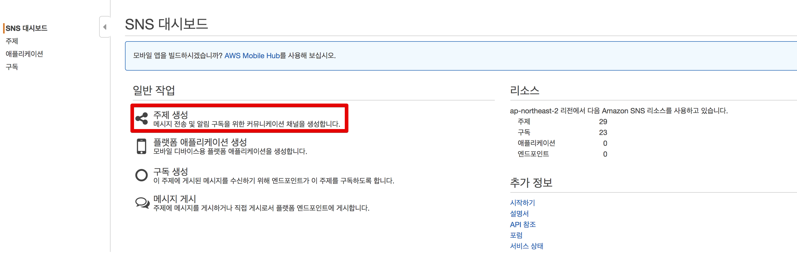

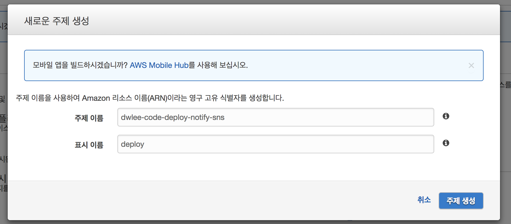

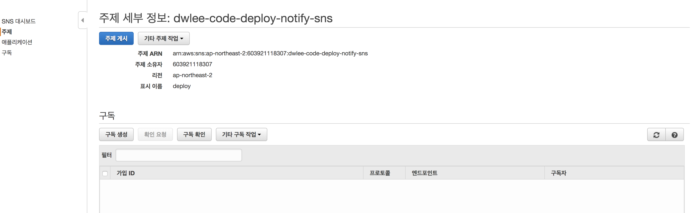

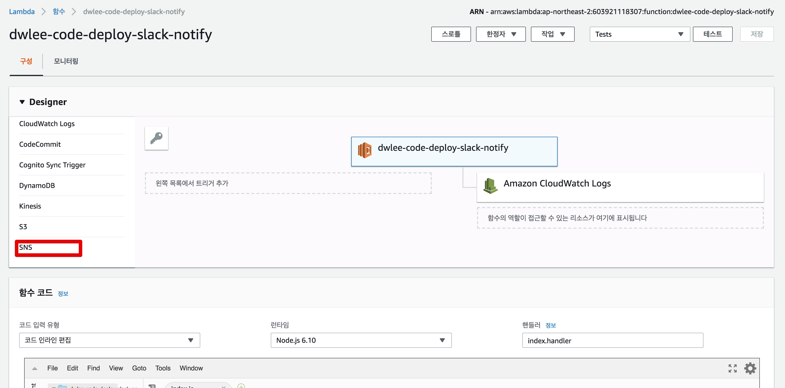

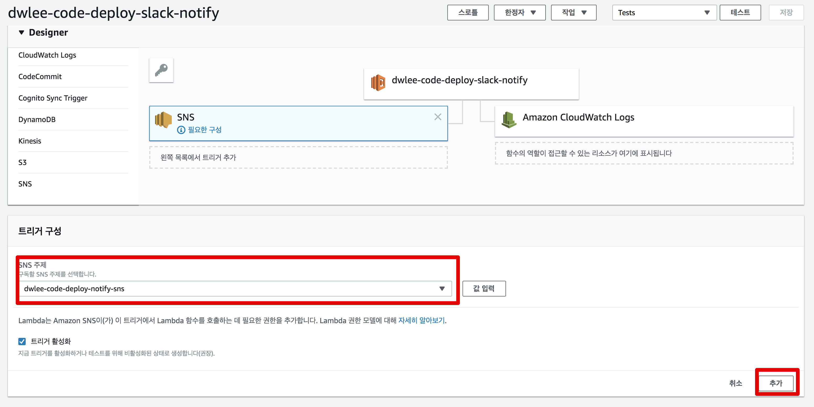

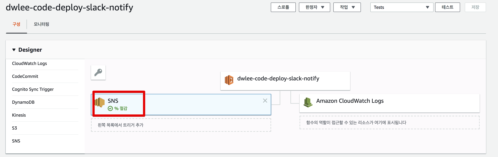


### 테스트

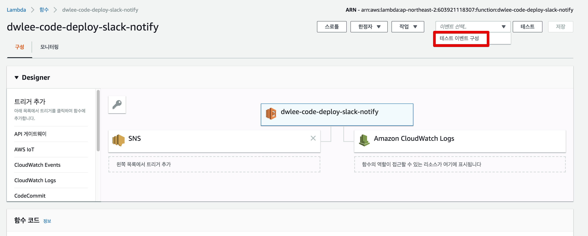

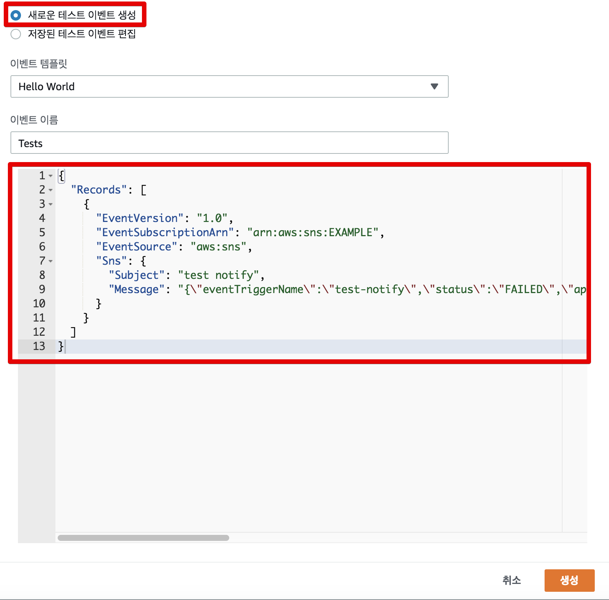

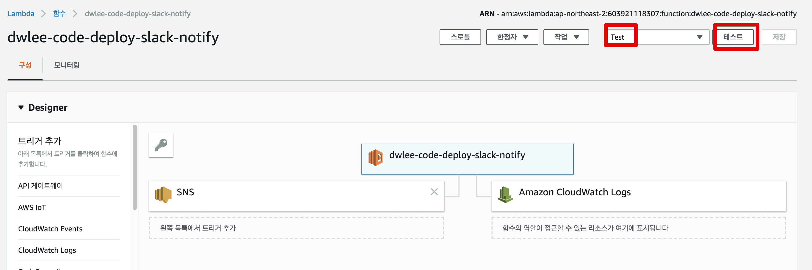

```javascript
{
  "Records": [
    {
      "EventVersion": "1.0",
      "EventSubscriptionArn": "arn:aws:sns:EXAMPLE",
      "EventSource": "aws:sns",
      "Sns": {
      	"Subject": "test notify",
        "Message": "{\"eventTriggerName\":\"test-notify\",\"status\":\"FAILED\",\"applicationName\":\"code-deploy-notify-slack\",\"deploymentGroupName\":\"code-deploy-notify\",\"region\":\"ap-northeast-2\",\"deploymentId\":\"d-testdeploy\",\"createTime\":\"2018-05-16 08:23:44\",\"completeTime\":\"2018-05-16 08:25:00\"}"
      }
    }
  ]
}
```

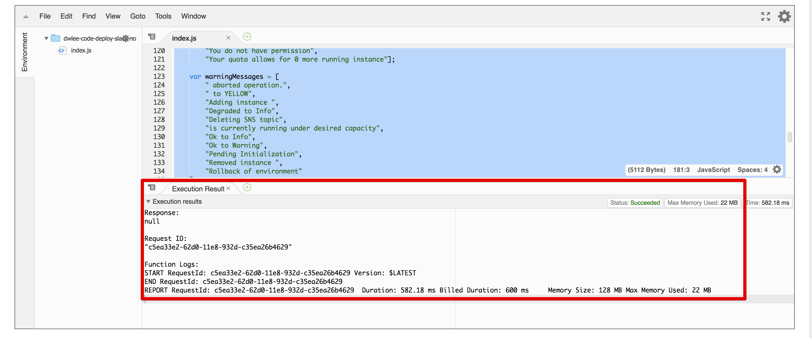

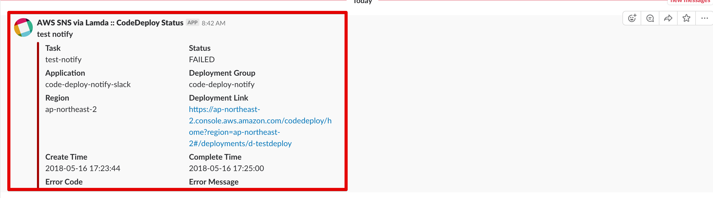

### 실제 테스트


## 참고

만약 람다를 HTTP API로 요청하고 싶은 분이 계시다면 outsider님이 작성하신 [포스팅](https://blog.outsider.ne.kr/1205)을 참고하시면 도움이 될것 같습니다.


* [slack-channel-notification-for-aws-codedeploy](https://prashantrajput.info/blog/slack-channel-notification-for-aws-codedeploy/)
