# Amazon Lightsail 인스턴스 생성하기

웹 서비스를 구성하는 모든 요소들이 항상 고사양의 서버를 필요로 하진 않습니다.  
이를 테면 관리자 어드민, Jenkins와 같은 설치형 CI/CD, Jira/Conflunce, 배치 애플리케이션 서버 등 트래픽에 영향을 안받지만 꼭 필요한 서비스들입니다.  

> 최근엔 많은 서비스들이 클라우드 버전도 함께 지원하곤 합니다.  
> Teamcity의 클라우드 버전, Jira/Conflunce의 클라우드 버전등이 있습니다.

이럴 경우 고사양의 EC2가 필요로 하지 않으며, 전문가 수준의 AWS 사용 방법도 필요로 하진 않습니다.  
  
Lightsail은 이렇게 작은 비용으로 시작할 수 있는 가상서버(VPS) 서비스인데요.  

> VPS란?  
> 하나의 물리 서버를 **여러 개의 가상 서버로 쪼개어 사용**하는 것을 의미합니다.  
> 그렇게 쪼개어진 가상 서버를 여러 명의 클라이언트가 나누어 쓰는 것이지요.  
> 따라서 하나의 물리서버를 다른 이들과 공유하는 개념이기는 하지만 각자 독립적인 서버 공간을 가지는 것이 가능합니다.  
> 다만, 하나의 물리서버에서 컴퓨팅 리소스들을 모든 사용자와 공유하기 때문에 만약 **한 사용자가 너무 많은 리소스를 점유**할 경우 RAM, CPU 등에 큰 영향이 간다는 단점이 있습니다.

기존 EC2에 비해 저렴한 비용과 웹 서비스에 필요한 **주요 기능들을 한 곳에서 쉽게 관리**할 수 있게 구성된 **입문자용 서비스**입니다.
  
입문자용이라 하더라도 로드밸런서/RDS/S3 등을 모두 사용할 수 있으니 웬만한 서비스 구축에는 큰 무리가 없습니다.  


다만, Lightsail에는 아래와 같은 제한이 있는데요.

* 계정당 최대 20개의 인스턴스 유지
* 5개의 고정 IP (EIP) 
* 총 3개의 DNS 존 
* 총합 20TB의 블록스토리지(디스크) 연결
* 5개의 로드 밸런서
* 최대 20개 인증서

위 조건을 초과할 경우 일반적인 AWS 방식대로 EC2를 직접 생성하시고 진행하시면 될 것 같습니다.  
  
가격의 경우 nano (512MB) 사양에서는 예약 인스턴스 (월 ```$3```) 보다는 조금 더 비싸며 온디멘드 인스턴스 (월 ```$4.875```) 보다는 훨씬 저렴합니다.  

> small (2GB 메모리) 부터는 예약 인스턴스 (월 ```$11.25```)보다 저렴해집니다.  

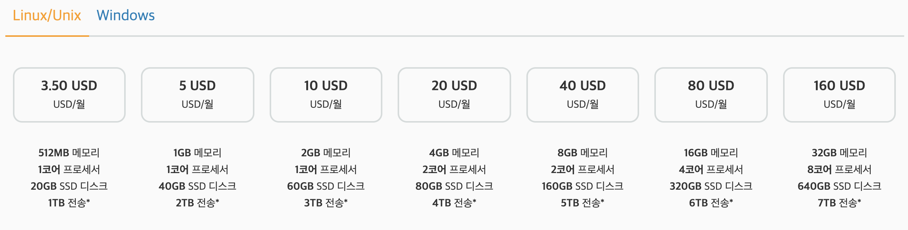

굉장히 작은 규모의 서비스인데, 매번 1년 선결제 하는게 부담되셨던 분들은 Lightsail은 좋은 선택지라고 생각됩니다.  
  
자 그럼 Lightsail 인스턴스 생성을 한번 시작해보겠습니다.

## 1. Lightsail 인스턴스 생성하기

AWS 의 서비스 검색에서 Lightsail을 검색합니다.

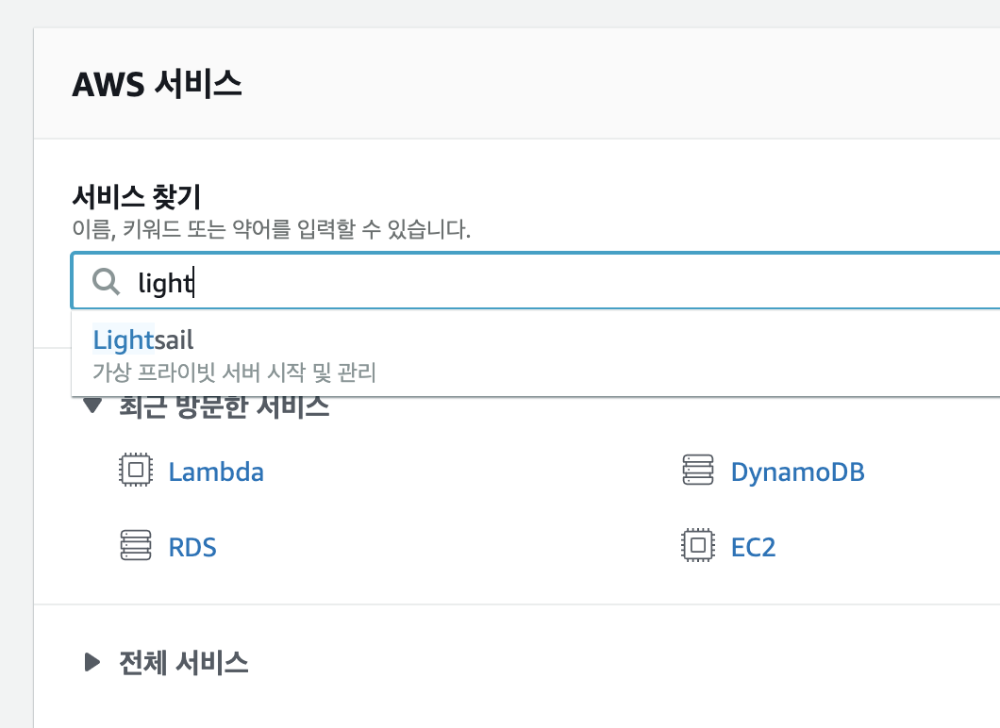

처음 접속하시면 아래와 같이 어떤 언어팩을 사용할지 선택화면이 나오는데요.  
본인이 편한 방식으로 선택하시면 됩니다.

> 저 같은 경우 실제로 사용할때는 Engligh를 선택하는데요.  
> 이슈가 났을때 검색을 좀 더 쉽게하기 위함입니다.  
> (한국어로 된 메뉴명/서비스명/이슈 설명 등은 검색에 별로 도움이 안되었습니다^^;)  

여기서는 일단 한국어로 선택해서 가겠습니다.

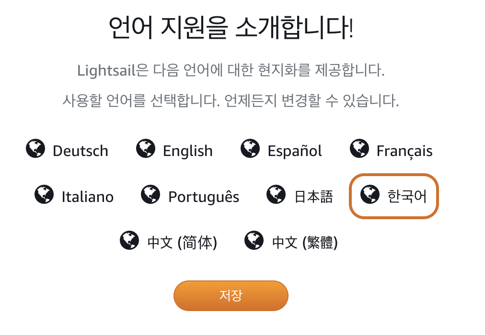

제일 첫번째 인스턴스 생성을 시작합니다.

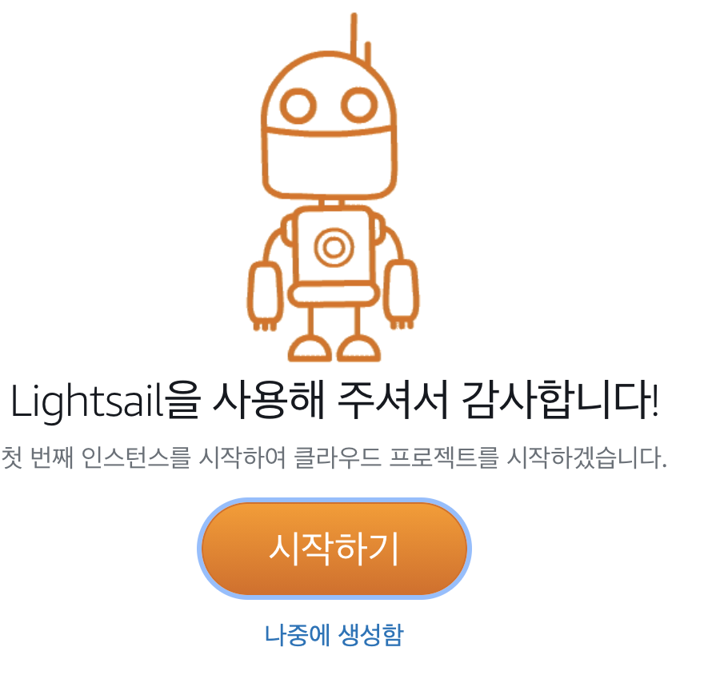

아주 기본적인 인스턴스를 생성할 예정이라, Linux 플랫폼을 선택하신 뒤 **OS 전용** 탭을 클릭하셔서 Amazon Linux를 선택합니다.

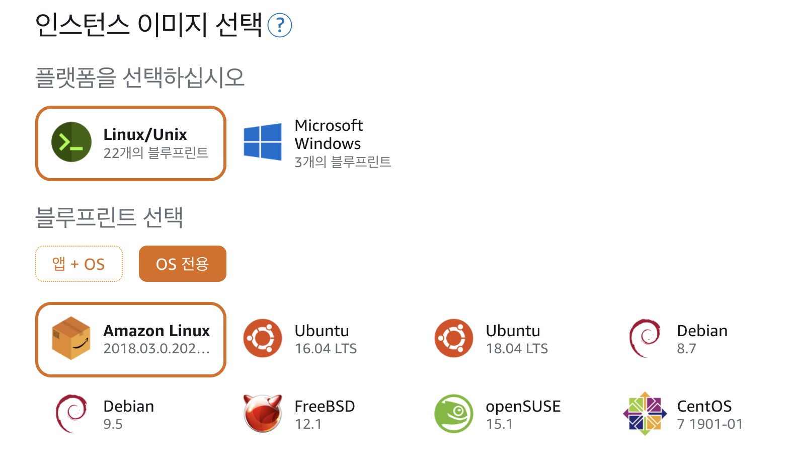

다음으로는 Lightsail 인스턴스의 ssh 접근을 위한 pem키 설정 단계인데요.  
자동으로 생성되는 pem키 이름보다는 별도의 pem키 이름을 사용하고 싶으시다면 아래처럼 **SSH 키 페어 변경**을 선택합니다.

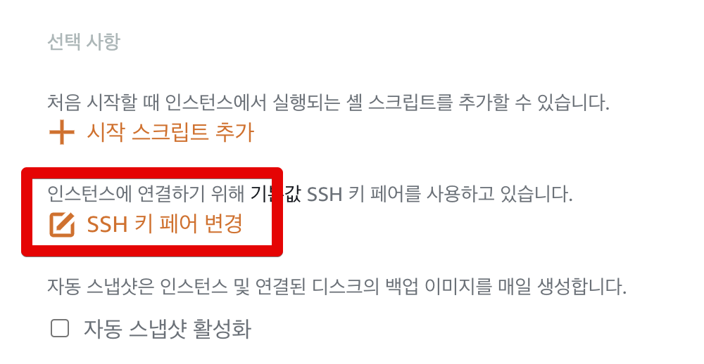

새로 생성 버튼을 클릭 하신뒤

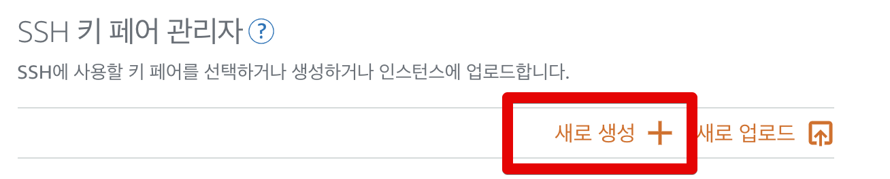

본인이 원하는 이름으로 pem키를 등록하신뒤 생성하시고, 키 다운로드를 합니다.
> 한번만 다운 받을 수 있으니 잘 관리하시는게 좋겠죠?


다음은 인스턴스 플랜을 선택해야하는데요.  
기존 AWS 가입자라 하더라도 **Lightsail이 처음이시라면** 최소 사양인 nano 플랜 ($3.5) 은 한달간 사용이 무료입니다.  

> 실제 한달은 아니고, EC2의 프리티어와 동일합니다.  
> EC2 인스턴스 사용 시간이 750시간 (24시간 * 31일) 까지만 무료라서, 2대의 인스턴스를 사용하신다면 2개 인스턴스 사용 시간의 총합이 750시간을 넘기면 안됩니다.

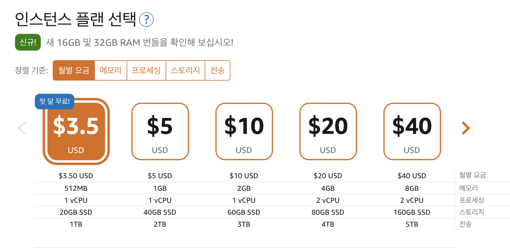

여기서 본인이 원하는 사양을 선택하시면 되는데요.  
일단은 테스트 용도로 첫 달 무료인 $3.5를 선택합니다.  
다만, Spring Boot/Jenkins 등 자바 애플리케이션을 실행시키길 원하시는 분들은 **최소 메모리 1GB 이상**을 선택하셔야 합니다.  
첫달 무료인 nano 는 메모리가 512MB인데, 실제 Linux 시스템에 필요한 메모리를 제외하면 200~300MB만 사용할 수 있어 Spring Boot를 실행시킬 수가 없습니다.  
  
다음은 인스턴스 이름을 등록합니다.  

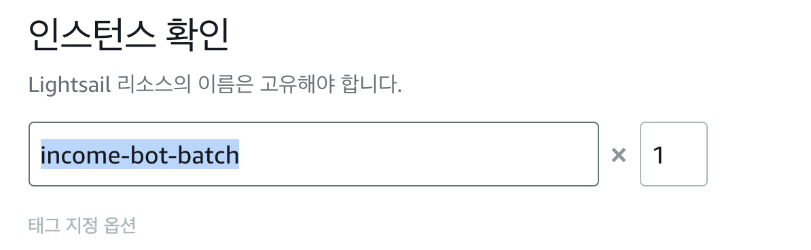

저는 검색을 좀 더 쉽게하기 위해 별도의 태그도 추가하였는데요.  
꼭 해야할 작업은 아니니 필요없으신 분들은 태그는 넘어가셔도 됩니다.

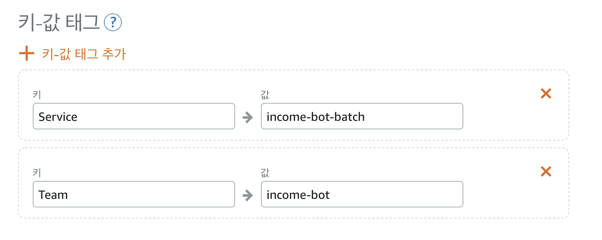


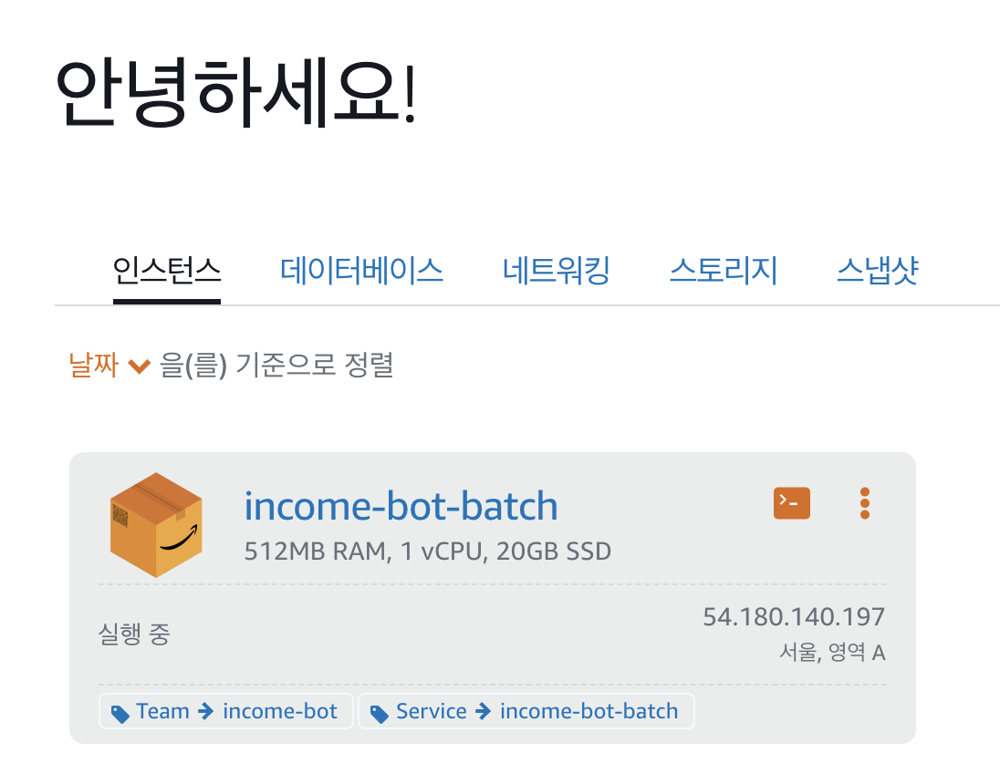

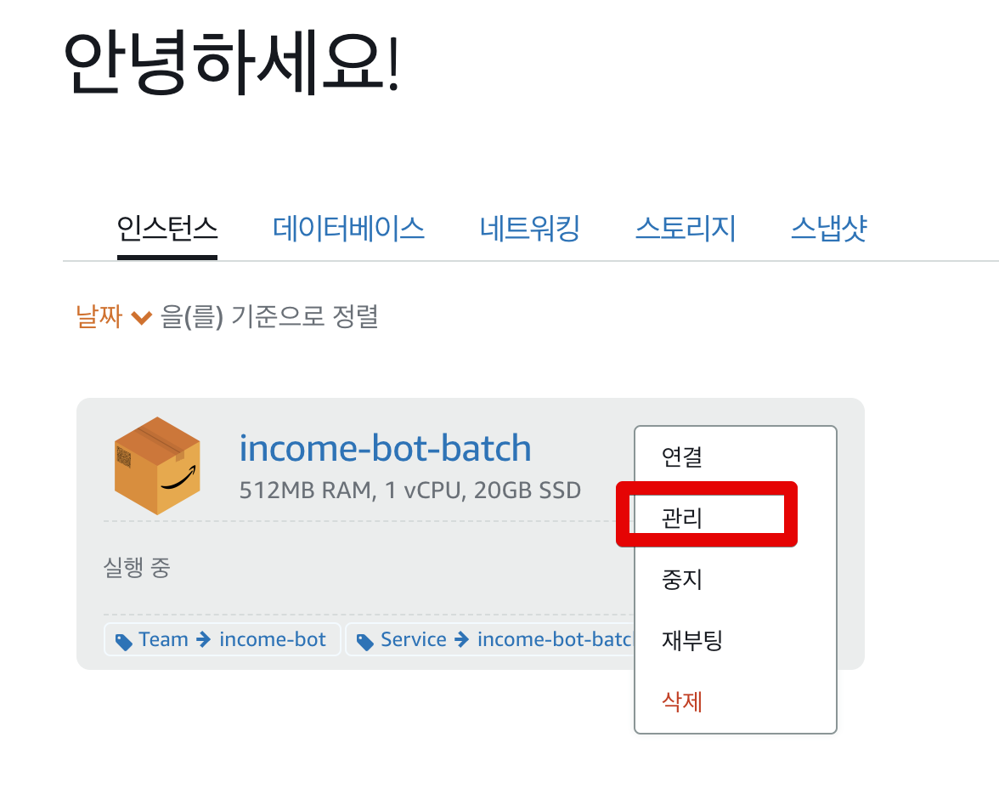

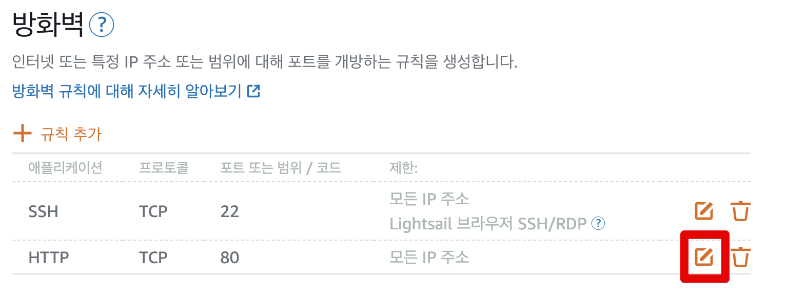

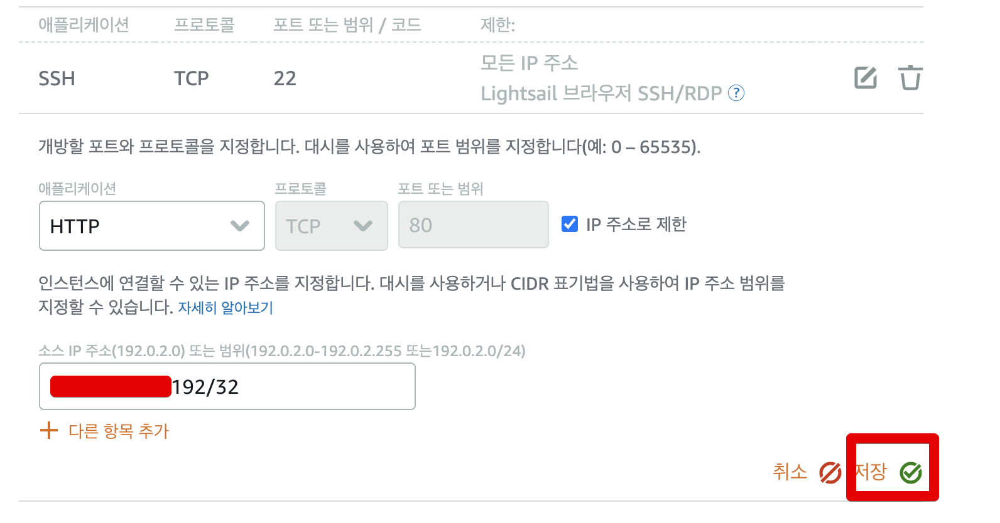


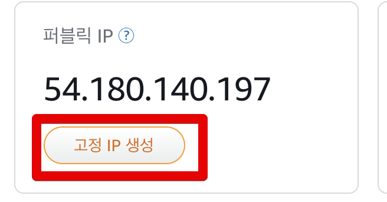

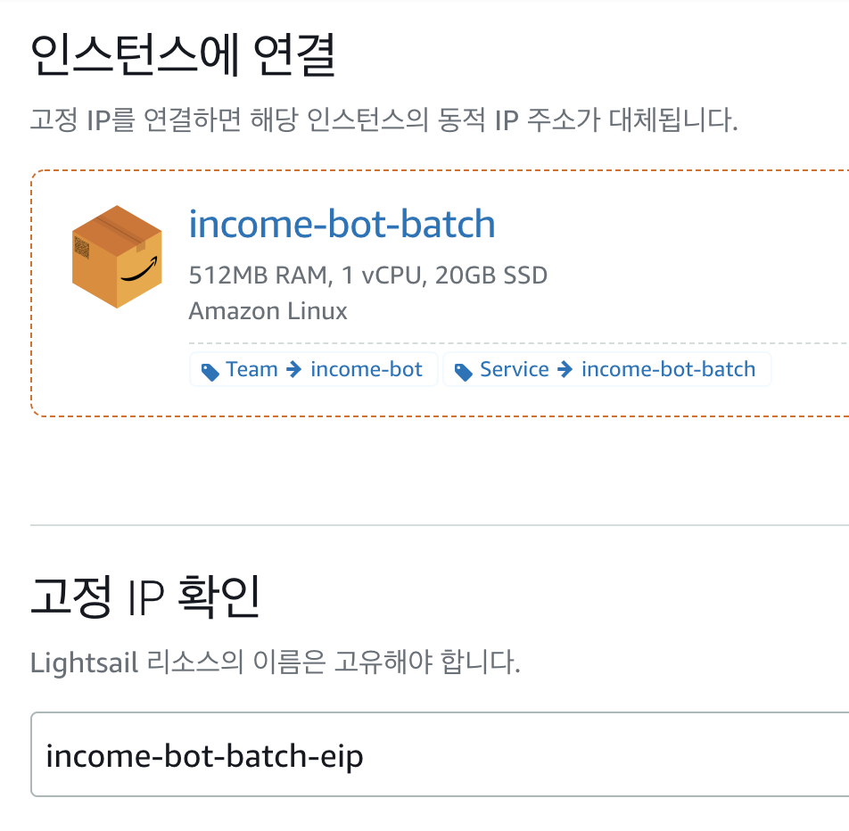


## 2. Lightsail 인스턴스 접속하기

```bash
ssh ec2-user@퍼블릭IP -i /Users/idong-uk/.ssh/jojoldu-lightsail.pem -o StrictHostKeyChecking=no
```

```bash
Warning: Permanently added 'XXX.XXX.XXX.XXX' (ECDSA) to the list of known hosts.
@@@@@@@@@@@@@@@@@@@@@@@@@@@@@@@@@@@@@@@@@@@@@@@@@@@@@@@@@@@
@         WARNING: UNPROTECTED PRIVATE KEY FILE!          @
@@@@@@@@@@@@@@@@@@@@@@@@@@@@@@@@@@@@@@@@@@@@@@@@@@@@@@@@@@@
Permissions 0644 for '/Users/idong-uk/.ssh/jojoldu-lightsail.pem' are too open.
It is required that your private key files are NOT accessible by others.
This private key will be ignored.
Load key "/Users/idong-uk/.ssh/jojoldu-lightsail.pem": bad permissions
ec2-user@XXX.XXX.XXX.XXX: Permission denied (publickey).
```

```bash
chmod 600 라이트세일pem키
```


```bash
sudo yum update -y
```


 
## 3. 더이상 사용하지 않을 시 삭제

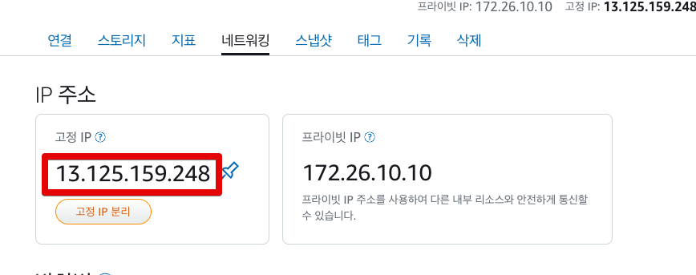

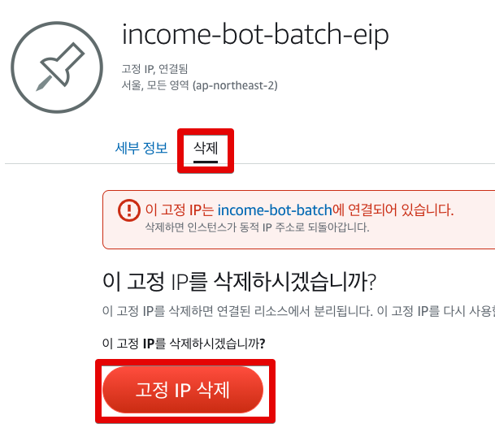

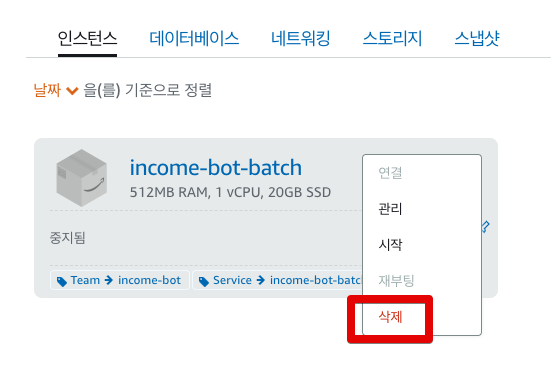