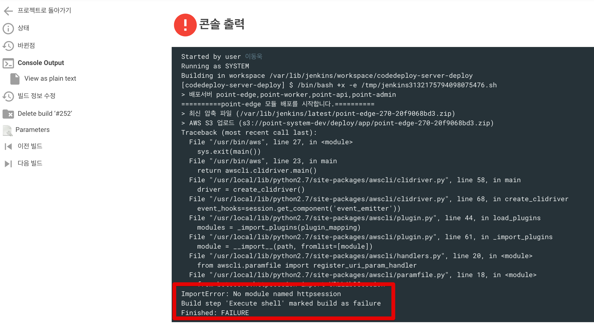
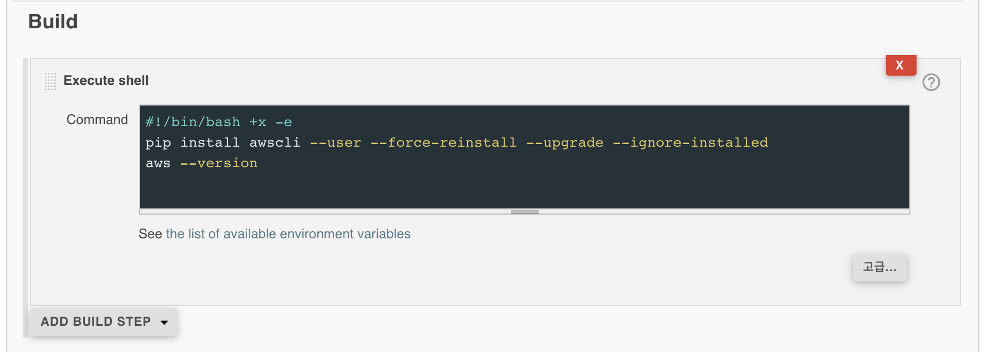
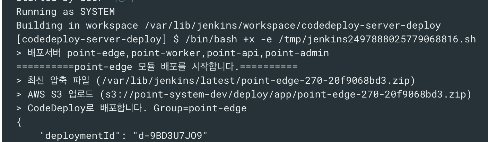

# ImportError: No module named httpsession 문제 발생시

aws cli를 사용하는 젠킨스에서 갑자기 에러가 발생했습니다.  



```bash
from botocore.httpsession import URLLib3Session
ImportError: No module named httpsession
```

aws cli의 경우 내부적으로 Python을 사용하는데 여기서 Python 에서 특정 모듈 (대부분은 botocore, boto3이였습니다.) 을 호출하지 못하는 이슈였습니다.  

실제로 뭔가 꼬여있는지 확인 하기 위해 EC2에 접속해서 간단한 aws cli 커맨드를 실행해도 똑같이 이슈가 발생하는지 확인합니다. 

```bash
aws --version
```

이슈가 확인됐다면 awscli를 다시 설치해서 해결합니다.  
  
아래 커맨드로 다시 설치하면 됩니다.

```bash
pip install awscli --user --force-reinstall --upgrade --ignore-installed
```

* --user
  * 현재 커맨드를 실행하는 사용자 (여기선 ec2-user) 만 허용되는 업데이트를 진행합니다.

진행한 뒤에 다시 **젠킨스 Job을 실행해도 똑같이 이슈가 발생**할 수 있습니다.  
  
보통 젠킨스를 실행할때 ec2-user 그대로 실행하진 않습니다.  
(거의 root와 비슷한 권한을 갖고 있기 때문이죠)  
  
그래서 jenkins 라는 별도의 계정을 만들어 실행하는데, 위 커맨드는 ec2-user에만 적용되기 때문에 젠킨스에서 실행하는 Job은 여전히 문제가 발생합니다.  
  
아래와 같이 현재 터미널에 접속된 계정을 젠킨스를 실행한 계정으로 변경해서 커맨드를 다시 실행하시거나

```bash
sudo su - 젠킨스실행한계정명
```

만약 계정에 권한이 없다면 아래와 같이 **젠킨스 Job에 커맨드를 등록해서 실행**합니다.



그럼 다시 해당 젠킨스 Job을 실행해보면 정상적으로 되는 것을 확인할 수 있습니다.




