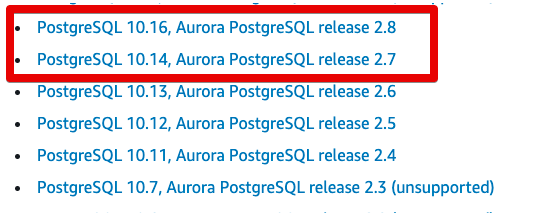
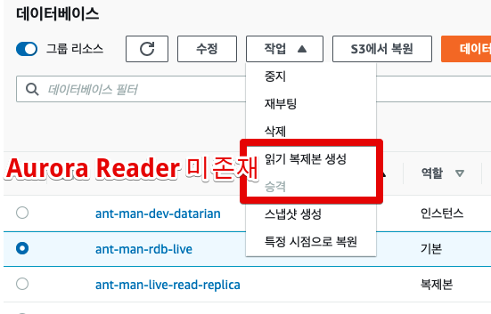

# AWS RDS to Aurora Migratoin

## 1. 스펙확인
RDS에서 Aurora 마이그레이션에서 가장 중요한 건은 **둘 간의 엔진 버전이 일치해야만** 한다.

즉, RDS가 PostgreSQL 10.15를 쓴다면 Aurora 역시 PostgreSQL 10.15 엔진을 쓰는 것으로 변경이 필요하다.

다만, 아래 링크에서 보는것처럼 Aurora는 10.15를 엔진으로 선택한 버전이 없다.

* [Aurora Version](https://docs.aws.amazon.com/AmazonRDS/latest/AuroraUserGuide/AuroraPostgreSQL.Updates.20180305.html)

실제로 RDS로 가서 확인해봐도 호환되는 버전이 아니면 Aurora Reader 추가가 존재하지 않는다.

그래서 버전을 맞추려면 마스터 역시 10.16으로 한번 업데이트를 진행하고 오로라 전환을 진행한다.

### 버전 업데이트

## 2. 

https://aws.amazon.com/ko/blogs/korea/best-practices-for-migrating-rds-for-mysql-databases-to-amazon-aurora/