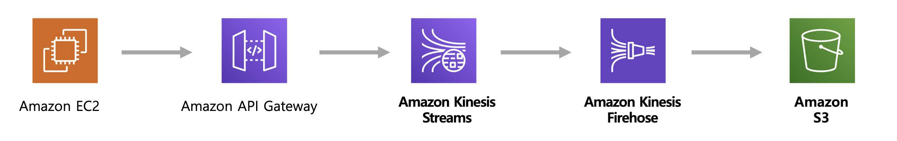

# 2주차


* kinesis Stream
  * 대규모 데이터 레코드 스트림을 실시간으로 수집하고 처리할 수 있다
  * 요청이 많아져도 KinesisStream 의 shard 조정만으로 빠른 scalability 처리
  * 데이터 유실에 대한 KinesisStream 에서 기본적으로 24시간의 데이터 보존 기능

* kinesis Firehose
  * 실시간스트리밍데이터를 S3, Amazon ES, Splunk 등의 대상으로 전송하기 위한 완전 관리형 서비스

* [수업시간에 하지 않은 실습](https://docs.aws.amazon.com/ko_kr/apigateway/latest/developerguide/integrating-api-with-aws-services-kinesis.html)
  * 목적에따라
    * api-gateway는 재활용하고 
    * stream이랑 firehorse는 여러개 만들어서 사용할 수 있음 

## 실습




```bash
p20 
Execution role : 

p23
HTTP HEADER 
Name : Content-Type 
Mapped from : 'application/x-amz-json-1.1'
p25
Mapping templates 
application/json
#set ( $enter = "
")
#set($json = "$input.json('$')$enter")
{
"Data": "$util.base64Encode("$json")",
"PartitionKey": "$input.params('X-Amzn-Trace-Id')",
"StreamName": "data15"
}

테스트 발송 (Producer)
Post json  
curl -d "{\"value\":\"30\",\"type\":\"Tip 3\"}" -H "Content-Type: application/json" -X POST  api 주소

p48 
SHARD_ITERATOR=$(aws kinesis get-shard-iterator --region=ap-northeast-2 --shard-id shardId-000000000000 --shard-iterator-type TRIM_HORIZON --stream-name data15 --query 'ShardIterator')

echo $SHARD_ITERATOR

aws kinesis get-records --region=ap-northeast-2 --shard-iterator $SHARD_ITERATOR

p50 
java -jar sendPost.jar -f ./danji_master.csv -u api주소
```
