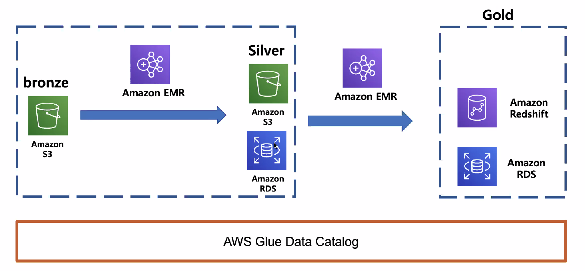

# 3주차

## EMR

* AWS에서 Hadoop, Spark와 같은 빅데이터 프레임워크 실행을 간소화하는 관리형 클러스터 플랫폼



* 데이터 수준에 따라 bronze / silver / gold
  * AWS에서는 티어 1/2/3

## Zeppelin Notebook

```scala
val csvDF = spark.read
  .option("header", "true")
  .option("delimiter", ",")  
  .option("inferSchema","true")
  .csv("s3://fc-datapipeline/danji_master.csv")
```

* ```.csv```: csv파일
  * ```.json```: json파일

#### Write JSON

```scala
csvDF.coalesce(1)
      .write
      .mode("Overwrite")
      .format("json")
      .save("s3://fc-datapipeline/target/data15/master/json/")
```

* ```coalesce(1)```

### RDB

EMR EC2 접속
```
wget https://repo1.maven.org/maven2/mysql/mysql-connector-java/5.1.35/mysql-connector-java-5.1.35.jar
sudo mv mysql-connector-java-5.1.35.jar /usr/lib/spark/jars/
```

restart하면 다시 실행이 필요함
