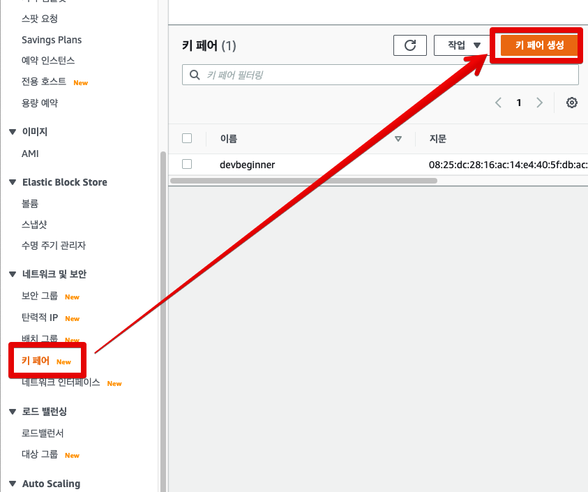
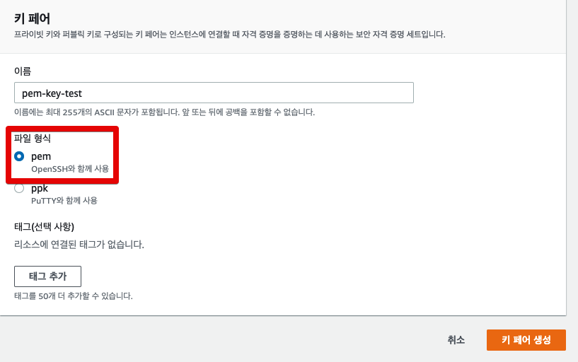
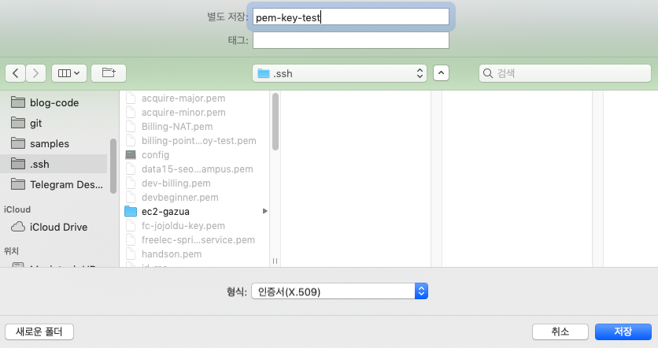
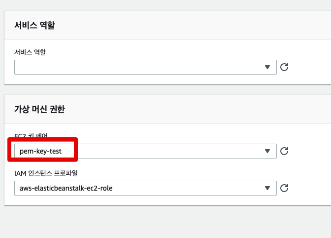
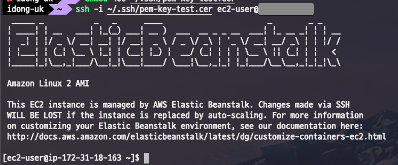

# AWS에서 수동으로 ssh 접속을 위한 Pem key 생성하기

자주 있는 일은 아니지만 EC2를 통해 pem키를 생성해본 적 없이, 곧바로 AWS의 Beanstalk을 사용하는 경우를 봅니다.  

> 일반적으로는 EC2를 생성할때 pem키 생성을 함께 진행합니다.

이럴 경우 한번도 pem키를 만들지 않은 상태라서 ssh 접속을 위해서 별도로 pem 키 생성을 진행해야하는데요.  

## 1. Pem Key 생성

먼저 AWS의 서비스로 EC2로 들어갑니다.  
EC2 대시보드의 좌측 사이드바를 보시면 "네트워크 및 보안 -> 키 페어 -> 키 페어 생성"을 차례로 클릭합니다.



파일형식을 **pem**을 선택하고, 본인이 원하는 이름으로 Key를 생성합니다.



생성 버튼을 클릭하면 바로 다운로드 화면으로 전환이 되는데요.  
pem키(수동 생성시에는 ```.cer``` 확장자) 를 다운 받을 디렉토리를 지정합니다.  
저는 ```~/.ssh/``` 로 다운 받았습니다.



자 이렇게 하면 pem키 생성은 끝입니다.  
잘 되는지 테스트 해보겠습니다.

## 2. SSH 접속 테스트

본인이 사용하는 Beanstalk의 키페어로 방금 생성한 pem키 (```.cer```) 를 선택합니다.



그리고 ```ssh``` 명령어를 통해 접속을 시도합니다.




만약 아래와 같이 에러가 발생하면 pem키에 실행 권한을 주지 않은 것입니다.

```bash
]The authenticity of host 'xx.xx.xx.xx (xx.xx.xx.xx)' can't be established.
ECDSA key fingerprint is SHA256:9Rf+KX61FTrPbwWHDbLKqUiEcPBmNvtO5EeHA+shIgg.
Are you sure you want to continue connecting (yes/no)? yes
Warning: Permanently added 'xx.xx.xx.xx' (ECDSA) to the list of known hosts.
@@@@@@@@@@@@@@@@@@@@@@@@@@@@@@@@@@@@@@@@@@@@@@@@@@@@@@@@@@@
@         WARNING: UNPROTECTED PRIVATE KEY FILE!          @
@@@@@@@@@@@@@@@@@@@@@@@@@@@@@@@@@@@@@@@@@@@@@@@@@@@@@@@@@@@
Permissions 0644 for '/Users/idong-uk/.ssh/pem-key-test.cer' are too open.
It is required that your private key files are NOT accessible by others.
This private key will be ignored.
Load key "/Users/idong-uk/.ssh/pem-key-test.cer": bad permissions
ec2-user@xx.xx.xx.xx: Permission denied (publickey,gssapi-keyex,gssapi-with-mic).
```

그럼 아래 명령어로 실행권한을 주고 다시 실행하시면 됩니다.

```bash
chmod 400 pem(.cer)파일위치
```