# equasl & hashcode 사용하기 + lombok
안녕하세요? 이번 시간엔 **equasl & hashcode**를 어떤 곳에서 사용할 수 있는지를 확인해보려고 합니다. 모든 코드는 [Github](https://github.com/jojoldu/blog-code/tree/master/business-logic)에 있기 때문에 함께 보시면 더 이해하기 쉬우실 것 같습니다.  
(공부한 내용을 정리하는 [Github](https://github.com/jojoldu/blog-code)와 세미나+책 후기를 정리하는 [Github](https://github.com/jojoldu/review), 이 모든 내용을 담고 있는 [블로그](http://jojoldu.tistory.com/)가 있습니다. )<br/>

java를 사용하면서 equals와 hashcode를 언제 override하면 좋을지 혹은 그런것이 있는지 모르시는 분들을 몇번 뵙게 되었습니다.  
피부에 와닿을 수 있는 적절한 예제를 떠올리지 못하다가 마침 업무에서 사용할 기회가 되어서 적용후 포스팅을 시작하게 되었습니다.  
틀린 내용이나 더 좋은 해결책이 있으신 경우엔 언제든지 가감없이 댓글 혹은 pull request 부탁드리겠습니다!  
그럼 이제 시작하겠습니다.  

### 문제 상황
프랜차이즈 매장들의 매출 정산을 해야한다고 가정하겠습니다.  
해당 매장들은 결제가 발생할때마다 아래와 같은 형태로 DB에 데이터를 전송합니다.  


각 컬럼은
* calculate_code : 수수료 계산 방식 fk
* method : 결제수단 (모바일, 카드, 현금)
* owner_id : 매장 fk
* pay_date : 결제일
* price : 결제금액

그리고 위 테이블의 데이터를 가공하여 아래와 같이 매출 테이블에 등록해야합니다.  


  
* calculate_code : 수수료 계산 방식 fk
* cash_amount : 현금 총 결제금액
* credit_card_amount : 카드 총 결제금액
* mobile_amount : 모바일 총 결제금액
* total_amount : 총 결제 금액
* owner_id : 매장 fk
* pay_date : 결제일

두 데이터의 형태가 비슷해보이지만 미묘하게 다른 부분이 보이실것입니다.  
즉, payment의 **calculate_code/owner_id/pay_date**를 기준으로 sales 데이터를 만든 것입니다.  
  
이번 시간에 만들 것은 **payment 테이블의 데이터를 sales 테이블 데이터로 전환**하는 모듈입니다.  
어떻게 보면 크게 어려울것 같지 않은데, 직접 만들어보면서 어떤 문제가 있을지 확인하겠습니다.  

### 문제 해결
먼저 build.gradle을 만들겠습니다.  
  
**build.gradle**  


lombok, jpa, h2등 의존성을 추가하였습니다.  
특이하게 보실수 있을 것은, ```ext['hibernate.version'] = '5.2.8.Final'```입니다.  
> Java8이 들어오며 대부분의 date 타입을 LocalDate와 LocalDateTime을 사용하실텐데요, 해당 타입으로 DB를 생성하면, binary 타입이 생성됩니다.  
이를 방지하기 위해 ```AttributeConverter```을 사용해서 추가 설정을 할수도 있지만, 하이버네이트 최근 버전에서는 이미 해결했기 때문에 spring-data-jpa에서 사용하는 하이버네이트를 강제로 오버라이딩 시킨것입니다. 이렇게 할 경우 추가 설정이 필요 없어집니다.  
  
다음은 Entity 클래스들을 만들겠습니다.  
Entity 클래스 작성시에는 불필요한 코드 작성을 피하기 위해 롬복(lombok)을 적극 사용하겠습니다.  

**Payment.java**  

   

lombok의 ```@builder```를 사용하면 생성자에 인자로 지정된 값들에 한해 Builer를 지원합니다.  
혹시 builder 혹은 빌더패턴을 처음 보신다면 [링크](http://seotory.tistory.com/29)를 참고하세요!  
getter 메소드들과 기본생성자까지 모두 lombok으로 지정하였습니다.  

> Method enum을 Payment 클래스 내부에 작성하였습니다.  
이렇게 하면 enum이 Payment 클래스와 직접적으로 관계가 있음을 코드상으로 표현할 수 있을 뿐더러, 다른 클래스에서 사용할때도 Payment.Method 가 되어 이름의 중복없이 깔끔하게 사용할 수 있습니다.   

**Sales.java**

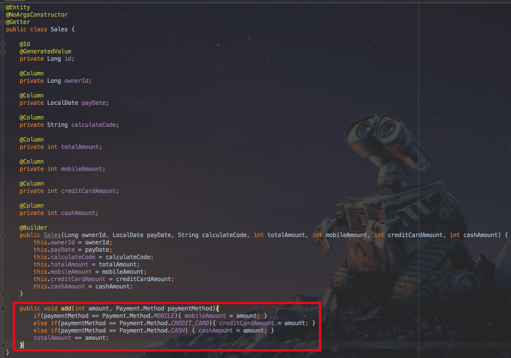

Sales도 Payment와 마찬가지로 lombok을 사용하여 구성을 마쳤는데, 한가지 메소드가 추가되었습니다.  
Sales에 amount와 Payment.Method 값을 입력하면 Method에 맞춰 ```+=```연산이 수행됩니다.  
해당 연산은 **Sales의 핵심 로직**입니다.  
이런 연산은 서비스 계층에서 해결하기보다는 Entity 계층에서 해결하고 이를 서비스 계층에서 호출하는 것이 더 좋습니다.  
**핵심 로직이 흩어지지 않고 Entity에 집중**되기 때문입니다.  
  
기본 배경이 되는 Entity 설계는 끝이났습니다.  
이젠 테스트용 데이터를 생성하여 해당 데이터로 로직을 구현해보겠습니다.  

**ApplicationTest.java**  

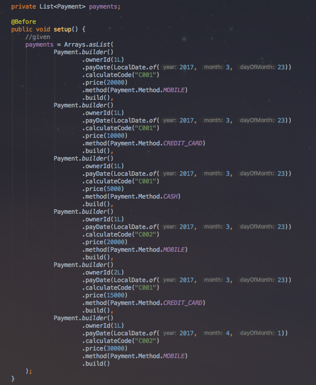

(보시는것처럼 ```@builder```를 통해 별도의 코드 생성없이 Payment의 builder를 사용할 수 있습니다.)  
  
이제 핵심 로직을 작성할 시간입니다.  
한번 고민해보겠습니다.  
Payment의 ownerId, payDate, calculateCode를 기준으로 Payment를 분류한뒤, 이들을 합하여 각각의 Sales를 만들어야 합니다.  

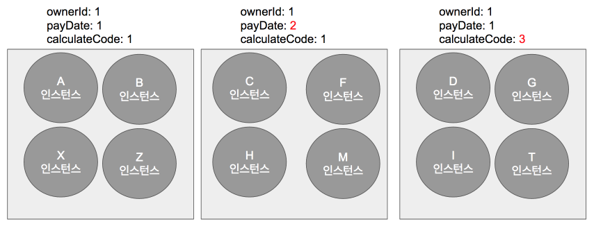

(그림으로 표현한 분류도)  
  
Payment 리스트를 반복문으로 돌리면서 분류한다 하였을때, **기존에 분류된 Payment 리스트에 새로 분류된 Payment는 어떻게 추가**할 수 있을까요?  
분류된 Payment 리스트를 다시 반복문으로 돌리면서 비교한 뒤, 만족하면 리스트에 추가하고, 같은게 없을 경우 새로운 List를 만들어야 할까요?  
분류된 Payment리스트를 다시 반복 비교하지 않고, ownerId, payDate, calculateCode 조합이 이미 분류되었는지 아닌지 어떻게 확인할 수 있을까요?  
좀더 간단하게 생각해볼까요?  
List의 경우 해당 값이 존재하는지 안하는지 파악하기 위해선 반복문을 사용할 수 밖에 없습니다.  
그렇다면 List 외에 자료구조 중, **Key가 되는 특정 값이 있는지 없는지 한번에 확인**할 수 있는 것은 어떤게 있을까요?  
  
Map입니다.  
Map은 ```get(key)```를 통해 해당 key값이 등록되어있는지 아닌지를 바로 확인할 수 있으니 추가로 반복문 수행이 필요없습니다.  
여기서 의문이 드시는게 어떻게 ownerId, payDate, calculateCode 이 3개 값을 한번에 Map의 key로 사용할것인가 이실텐데요.  
이때 사용되는 것이 바로 ```hashCode```입니다.  
  
Map의 구현체인 HashMap이나 LinkedHashMap을 보시면 바로 이 인스턴스의 hashCode 메소드 결과를 통해 key를 비교한다는 것을 확인할 수 있습니다.  

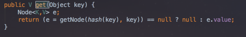

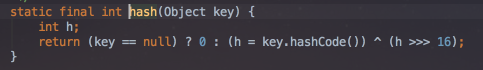

즉, **인스턴스의 hashCode 메소드 결과가 같다면 동일한 key로 간주**하겠다는 것입니다.  
우린 이 점을 이용해서 Payment를 분류하겠습니다.  

> equals도 hashCode와 사용되는 곳은 비슷합니다.
해당 인스턴스들이 갖고 있는 값들이 같을 경우 같은 인스턴스로 봐야하는 경우엔 equals를 오버라이딩하여 사용합니다.  
단, equals와 hashCode는 모두 VO(Value Object)에서만 사용하는 것을 권장합니다.  
값을 나타내는 것 외에 기능을 갖고 있는 인스턴스에서는 문제가 발생할 여지가 많아 웬만해선 사용하지 않는 것을 권장합니다.  
 
equals와 hashCode는 IDE의 generator기능을 사용해도 편리하게 생성할 수 있지만, lombok을 사용하면 코드 생성 없이도 동일한 효과를 얻을 수 있기에 lombok을 사용하겠습니다.  
비교를 위한 클래스로 ```PaymentDto.java```를 생성하겠습니다.  
  
**PaymentDto.java**  

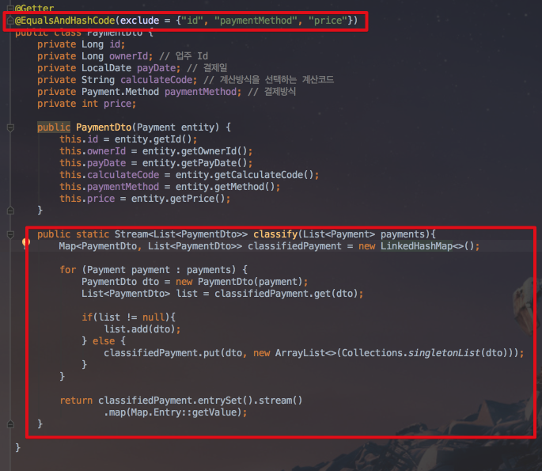

PaymentDto는 ```@EqualsAndHashCode(exclude = {"id", "paymentMethod", "price"})```를 사용하여 id, paymentMethod, price를 제외한 나머지 필드(ownerId, payDate, calculateCode)로 equals와 hashCode를 구현토록 하였습니다.  
내부적으로는 아래와 같은 코드가 생성된 것이라고 생각하시면 됩니다.  

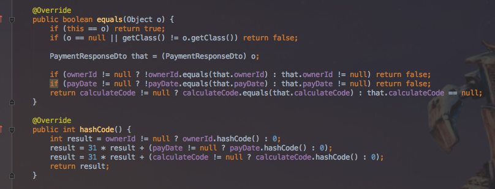

즉, ownerId, payDate, calculateCode가 같다면 같은 값이라고 보겠다고 지정한 것입니다.  
  classify 메소드는 이점을 이용하여 ```PaymentDto```를 key로, ```List<PaymentDto>```를 value로 한 Map을 만들게 됩니다.  

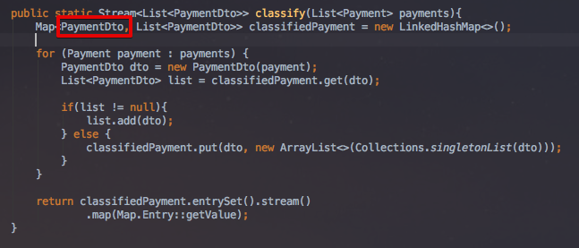

Map에서 PaymentDto로 get하여 나오는 List가 있다면 이미 분류된 것이기에 해당 List에 put하지만, 없다면 분류된 적이 없는 것이기에 새로운 List를 생성하여 Map에 등록하는 것입니다.  
  
> 여기서 Entity와 DTO의 관계를 정의하는데 약간의 기준을 말씀드리자면, Entity는 dto에 대해 전혀 알지 못하고, **dto만이 Entity에 대해 알고 있어야** 합니다.  
이는 **dto는 조회 혹은 출력화면의 변경에 따라 언제든지 변경**될 수 있지만, entity의 경우 실질적으로 변경될 일이 거의 없기 때문입니다.  
자주 변경되는 dto를 기준으로 두면 테이블과 직접 관계를 맺고 있는 entity가 계속해서 변경되어야 하므로, **거의 대부분은** dto가 entity에 의존하도록 구성하는것이 좋습니다.  
  
그럼 잘 분류되는지 확인을 위해 테스트 코드를 작성하여 실행해보겠습니다.  

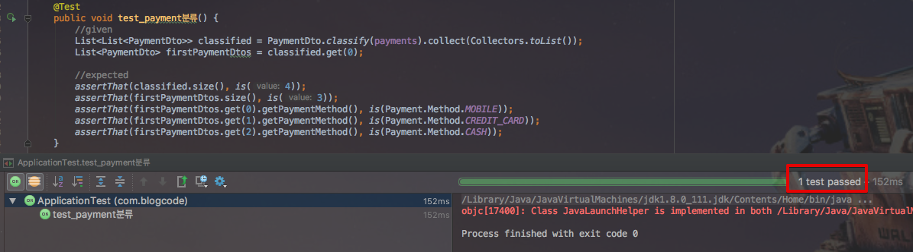

6개의 Payment를 분류하여 4개의 PaymentDto 그룹이 생성되고, 1번째 그룹에 3개의 PaymentDto가 들어간것까지 확인되어 테스트가 통과된 것을 확인하였습니다!  

자 이제 마지막으로 모듈의 완성을 위해 분류된 PaymentDto를 통해 Sales 리스트를 생성하는 코드를 작업하겠습니다.  

**SalesConverter.java**  

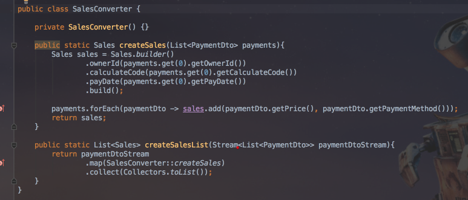  
  
SalesConverter는 **PaymentDto 그룹을 받아 Sales로 Convert 하는 역할**을 합니다.  
SalesConverter는 상태(값)를 갖고 있지 않으며, input이 같을때 output값도 항상 같기에 static 메소드로 구성하였습니다.  
마지막까지 잘 되는 것을 확인하기 위해 테스트코드를 추가해서 실행해보겠습니다.  

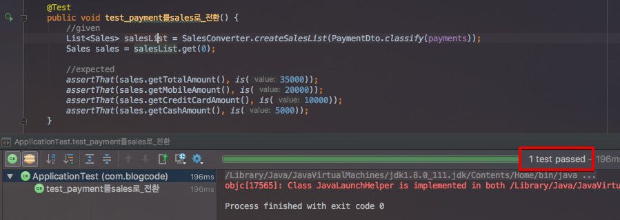  

짠! 분류된 PaymentDto를 통해 Sales 인스턴스들이 성공적으로 생성된 것을 확인하였습니다.  

### 후기
어떠셨나요? equals와 hashCode를 대충 어떤 곳에 써야할지 감이 잡히셨나요?  
상황 설정과 부연설명에 더 내용이 많아 오히려 집중이 안되셨을것 같지만, 최대한 실제 업무에서 사용될 법한 상황을 연출하기 위함이였습니다.  
앞으로도 Java의 중요한 개념들이 실제 업무상에서 필요한 경우를 발견할때면 항상 예제를 통해 소개드리도록 하겠습니다.  
부족한 글 끝까지 읽어주셔서 감사합니다!  
즐거운 주말되세요!

 