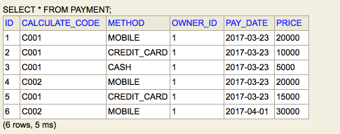
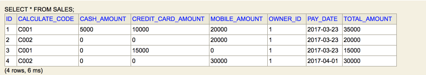
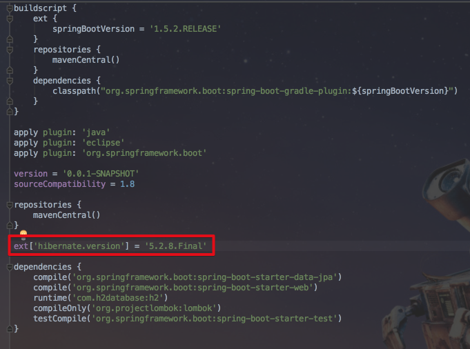
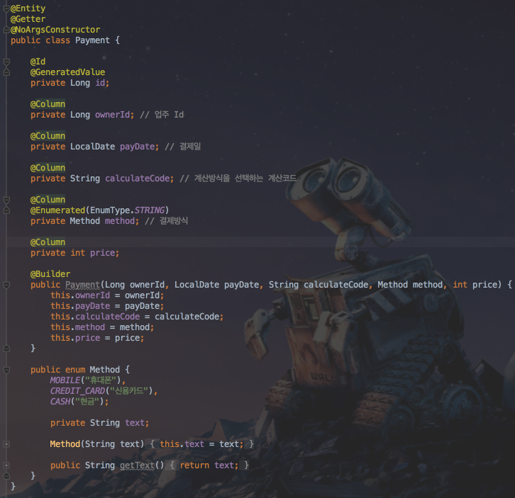

# equasl & hashcode 사용하기 
안녕하세요? 이번 시간엔 **equasl & hashcode**를 어떤 곳에서 사용할 수 있는지를 확인해보려고 합니다. 모든 코드는 [Github](https://github.com/jojoldu/blog-code/tree/master/business-logic)에 있기 때문에 함께 보시면 더 이해하기 쉬우실 것 같습니다.  
(공부한 내용을 정리하는 [Github](https://github.com/jojoldu/blog-code)와 세미나+책 후기를 정리하는 [Github](https://github.com/jojoldu/review), 이 모든 내용을 담고 있는 [블로그](http://jojoldu.tistory.com/)가 있습니다. )<br/>

java를 사용하면서 equals와 hashcode를 언제 override하면 좋을지 혹은 그런것이 있는지 모르시는 분들을 몇번 뵙게 되었습니다.  
피부에 와닿을 수 있는 적절한 예제를 떠올리지 못하다가 마침 업무에서 사용할 기회가 되어서 적용후 포스팅을 시작하게 되었습니다.  
틀린 내용이나 더 좋은 해결책이 있으신 경우엔 언제든지 가감없이 댓글 혹은 pull request 부탁드리겠습니다!  
그럼 이제 시작하겠습니다.  

### 문제 상황
프랜차이즈 매장들의 매출 정산을 해야한다고 가정하겠습니다.  
해당 매장들은 결제가 발생할때마다 아래와 같은 형태로 DB에 데이터를 전송합니다.  



각 컬럼은
* calculate_code : 수수료 계산 방식 fk
* method : 결제수단 (모바일, 카드, 현금)
* owner_id : 매장 fk
* pay_date : 결제일
* price : 결제금액

그리고 위 테이블의 데이터를 가공하여 아래와 같이 매출 테이블에 등록해야합니다.  


  
* calculate_code : 수수료 계산 방식 fk
* cash_amount : 현금 총 결제금액
* credit_card_amount : 카드 총 결제금액
* mobile_amount : 모바일 총 결제금액
* total_amount : 총 결제 금액
* owner_id : 매장 fk
* pay_date : 결제일

두 데이터의 형태가 비슷해보이지만 미묘하게 다른 부분이 보이실것입니다.  
즉, payment의 **calculate_code/owner_id/pay_date**를 기준으로 sales 데이터를 만든 것입니다.  
  
이번 시간에 만들 것은 **payment 테이블의 데이터를 sales 테이블 데이터로 전환**하는 모듈입니다.  
어떻게 보면 크게 어려울것 같지 않은데, 직접 만들어보면서 어떤 문제가 있을지 확인하겠습니다.  

### 문제 해결
먼저 build.gradle을 만들겠습니다.  
  
**build.gradle**  



lombok, jpa, h2등 의존성을 추가하였습니다.  
특이하게 보실수 있을 것은, ```ext['hibernate.version'] = '5.2.8.Final'```입니다.  
> Java8이 들어오며 대부분의 date 타입을 LocalDate와 LocalDateTime을 사용하실텐데요, 해당 타입으로 DB를 생성하면, binary 타입이 생성됩니다.  
이를 방지하기 위해 ```AttributeConverter```을 사용해서 추가 설정을 할수도 있지만, 하이버네이트 최근 버전에서는 이미 해결했기 때문에 spring-data-jpa에서 사용하는 하이버네이트를 강제로 오버라이딩 시킨것입니다. 이렇게 할 경우 추가 설정이 필요 없어집니다.  
  
다음은 Entity 클래스들을 만들겠습니다.  
Entity 클래스 작성시에는 불필요한 코드 작성을 피하기 위해 롬복(lombok)을 적극 사용하겠습니다.  

**Payment.java**  

   

lombok의 ```@builder```를 사용하면 생성자에 인자로 지정된 값들에 한해 Builer를 지원합니다.  
혹시 builder 혹은 빌더패턴을 처음 보신다면 [링크](http://seotory.tistory.com/29)를 참고하세요!  
getter 메소드들과 기본생성자까지 모두 lombok으로 지정하였습니다.  


여기서 둘의 관계를 정의하는데 약간의 기준을 말씀드리자면, entity는 dto에 대해 전혀 알지 못하고, dto만이 entity에 대해 알고 있어야만 합니다.  
이는 dto의 경우 조회 혹은 출력화면의 변경에 따라 언제든지 변경될 수 있지만, entity의 경우 실질적으로 변경될 일이 거의 없습니다.  
자주 변경되는 dto를 기준으로 두면 테이블과 직접 관계를 맺고 있는 entity가 계속해서 변경되어야 하므로, **거의 대부분은** dto가 entity에 의존하도록 구성하는것이 좋습니다.  
 