# CloudFlare Pages로 Next.js 서비스 배포하기

CloudFlare의 정적사이트 플랫폼인 CloudFlare Pages가 출시되었다.  


* [https://pages.cloudflare.com/](https://pages.cloudflare.com/)

이미 [Netlify](https://jojoldu.tistory.com/546) 와 같이 정적 사이트 플랫폼이 많은데 굳이 CloudFlare를 써야하나? 싶었다.  
(저도 그동안은 Netlify을 썼기 때문에)  
  
그럼에도 써봐야하는 이유는 Free Plan의 구성이 말도 안되게 좋기 때문이다.  

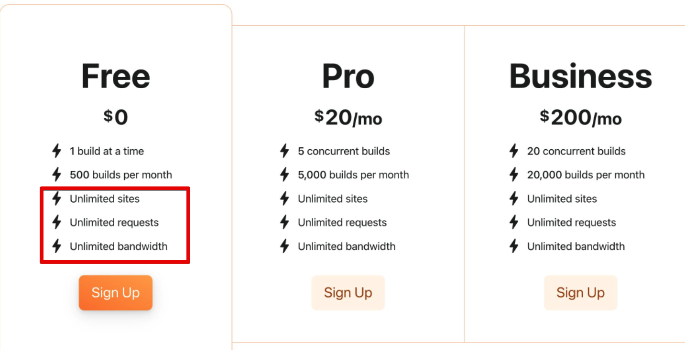

* 무제한 사이트 발행
* 무제한 요청
* 무제한 대역폭

Free Plan 라고는 믿을수 없을만큼의 좋은 혜택을 제공한다.  
대부분의 정적 사이트가 저정도 혜택은 유료 Plan인걸 고려하면 선택하지 않을 이유가 전혀 없다고 생각했다.  
  

## 1. Next.js App 생성

먼저 간단한 Next.js App을 생성한다.

> 여기서 사용된 코드는 모두 [Github](https://github.com/jojoldu/react-in-action) 에 있다.

```bash
npx create-next-app react-in-action --use-npm --example "https://github.com/vercel/next-learn/tree/master/basics/learn-starter"
```

* react-in-action 으로 프로젝트를 생성한다.

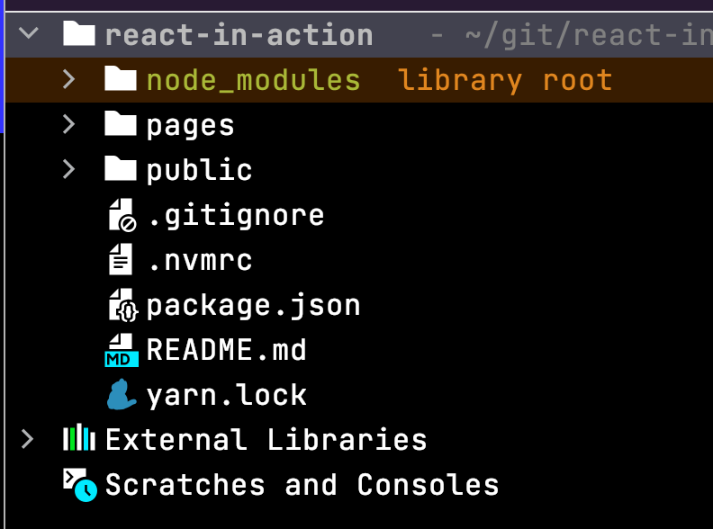

이렇게 생성된 샘플 프로젝트에 아래 2가지 설정을 추가한다.

### 1-1. export 추가

생성된 프로젝트의 `package.json` 을 열어서 아래와 같이 `build` 에 `next export` 를 추가한다

```json
{
  "private": true,
  "scripts": {
    "dev": "next dev",
    "build": "next build && next export",
    "start": "next start"
  },
  "dependencies": {
    "next": "latest",
    "react": "17.0.2",
    "react-dom": "17.0.2"
  }
}
```

* build 한 결과물을 static HTML로 추출하기 위해 `export` 명령어를 추가한다.

추가되었다면 아래 명령어로 잘 작동하는지 확인한다

```bash
yarn build
```

* `npm`을 쓴다면 `npm run build`

```bash
yarn run v1.22.10
$ next build && next export
...
info  - Copying "static build" directory
info  - No "exportPathMap" found in "undefined". Generating map from "./pages"
info  - Launching 11 workers
info  - Copying "public" directory
info  - Exporting (2/2)
Export successful. Files written to /Users/jojoldu/git/react-in-action/out
✨  Done in 4.31s.
```

성공적으로 `build` 와 `export`가 되었다면 아래와 같이 `out` 디렉토리가 생성되야만 한다.

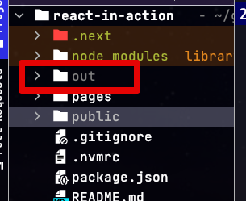


### 1-2. Node 버전 설정

만약 Node 버전을 12.x 이상 사용해야 한다면 `.nvmrc` 를 통해 Cloudflare Node 버전을 정할 수 있다.  
  
여기서는 `16.4.0` 버전을 사용한다.

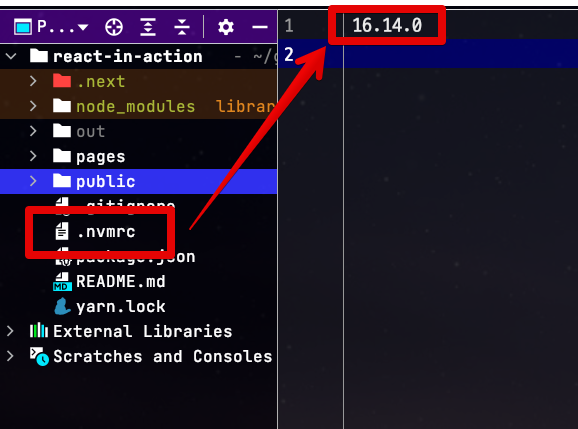

작업이 끝났다면 해당 코드를 Github에 Push 한다.

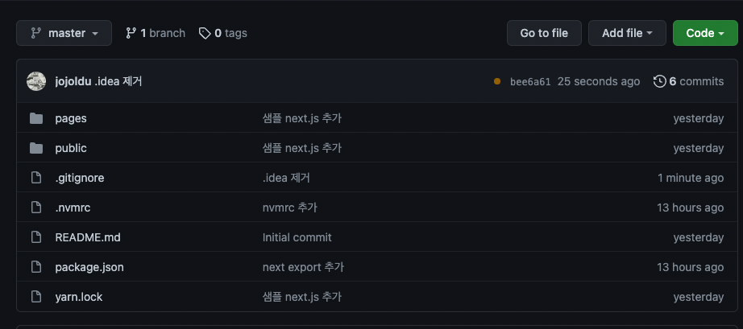

## 2. Cloudflare Pages 설정

Github에 올라간 코드를 배포하기 위해 Cloudflare Pages 에 가입한다

* [https://pages.cloudflare.com/](https://pages.cloudflare.com/)

### 2-1. Github Repository 연결

1에서 올린 Github Repository를 연결한다.

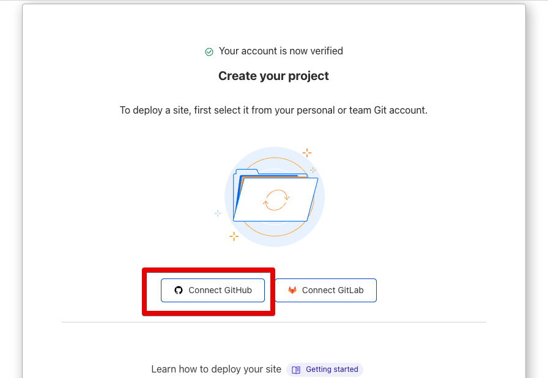

1에서 올린 Github Repository가 있는 계정 혹은 org를 선택한다.

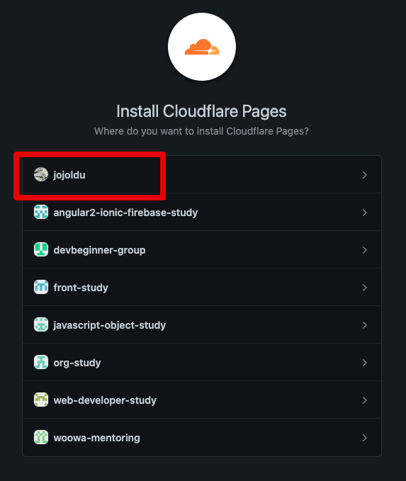

특정 repository를 선택해도 되지만, 이후에도 자주 사용할 예정이기 때문에 전체 repository를 선택한다.

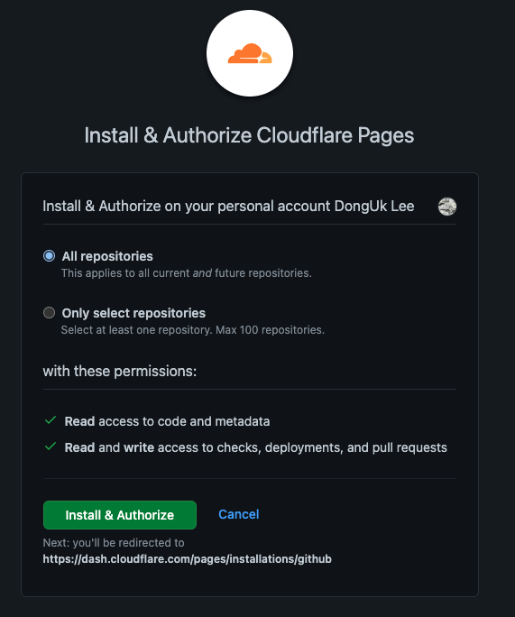

1에서 올린 repository를 선택한다

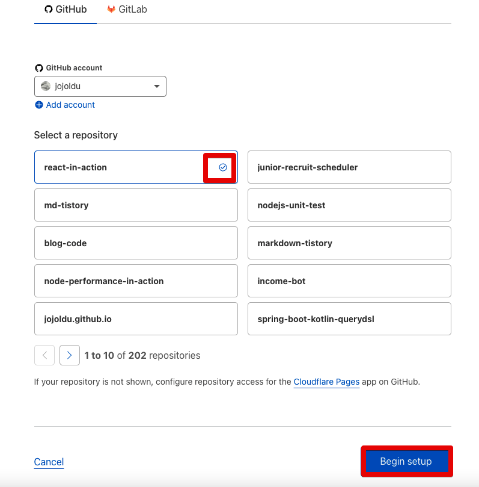

* 아쉽게 repository를 검색하는 기능이 없어서 한 페이지씩 넘어가면서 검색해야한다

### 2-2. 배포 설정

Github Repository를 선택했다면, 배포 설정을 한다.  

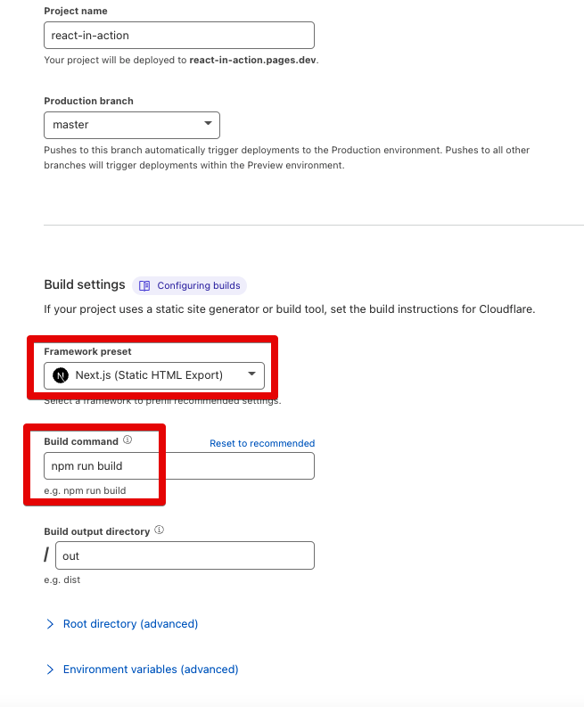

* 서비스가 Next.js로 이루어져있어 Next.js를 선택한다
* 1-1 에서 설정한 `build` 명령어를 빌드 명령어로 등록한다
* `export` 할 경우 기본적으로 `out` 디렉토리에 static HTML이 생성되기 때문에 `out` 디렉토리를 등록한다

정상적으로 설정이 끝나고 빌드를 수행하면 다음과 같이 빌드가 수행된다.

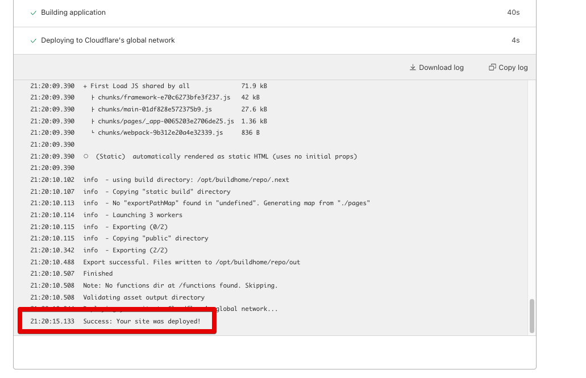

빌드가 성공했다면, cloudflare에서 제공해주는 URL로 접속해본다

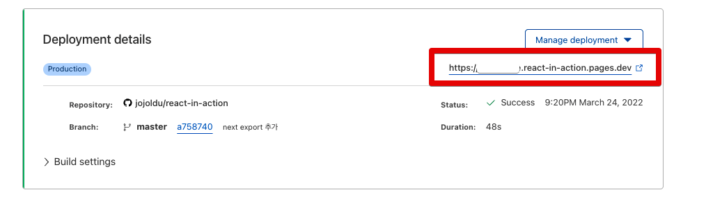

아래와 같이 정상적으로 접속이 된다면 모든 설정이 완료 된 것이다.

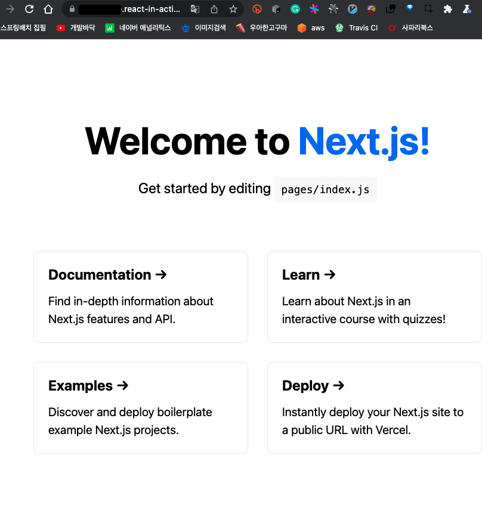

## 마무리

규모가 작지만 방문자는 많은 정적 서비스를 하시는 분들이라면, 혹은 사이드 프로젝트를 진행했다가 생각보다 방문자가 많아진 분이라면 Cloudflare Pages는 충분히 좋은 대안이라고 생각한다.  