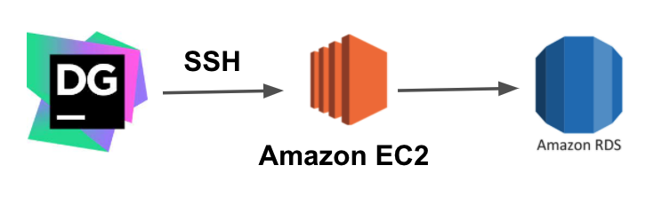
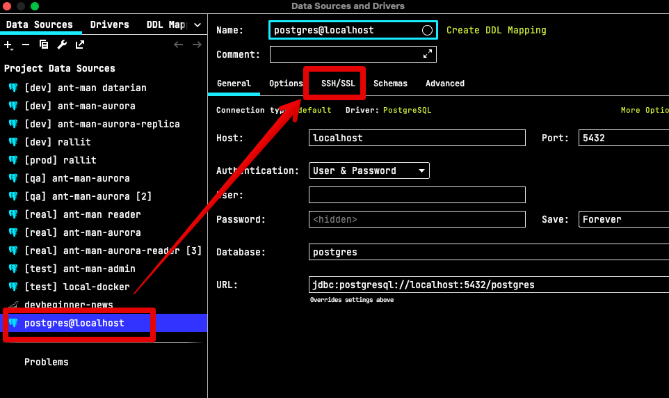
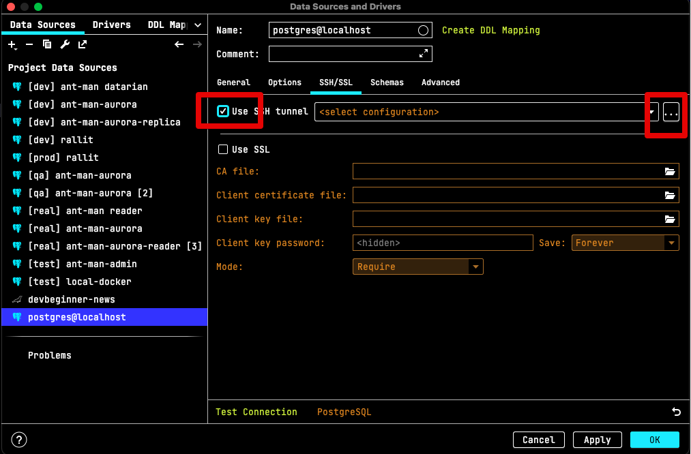
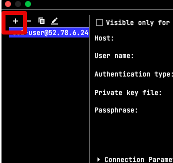
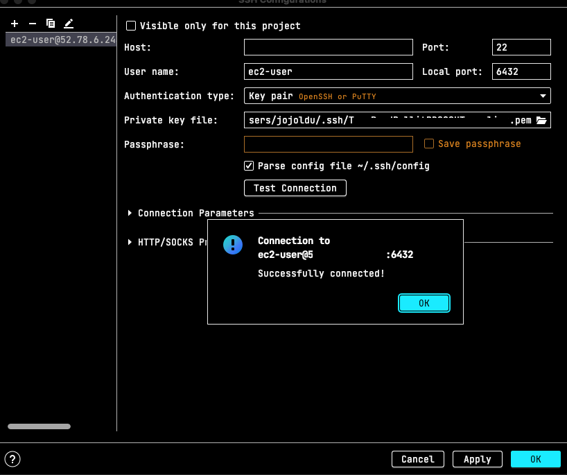
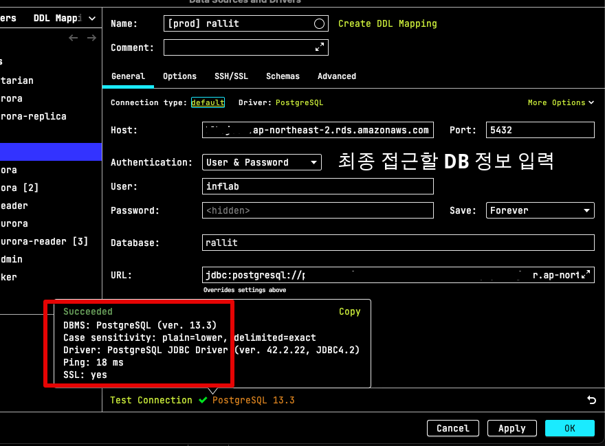

# DataGrip 에서 SSH 터널링으로 DB 접근하기

보안상의 이유로 운영 환경의 데이터베이스에는 직접 접근하는 경우를 거의 차단합니다.  
예외적인 경우 **별도의 EC2 서버를 SSH 터널링을 통해** 접근하는 방식을 사용하게 되는데요.  
  
그럼 아래와 같이 로컬 PC => EC2 서버 (ssh 접근) => Database (RDS) 로 접근해야만 합니다.

DataGrip에서는 이와 같이 특정 서버를 통해 SSH 터널링 접근 기능도 지원합니다.  
이 설정 방법을 알아보겠습니다.

## 1. SSH 설정

먼저 EC2 서버로 접근하기 위한 SSH 정보를 등록하겠습니다.

Use SSh tunnel을 체크하시면 우측의 `...` 가 활성화 되는데 이를 클릭합니다.

그럼 SSH 팝업창이 등장하는데, 이때 `+` 를 클릭해서 새로운 SSH 접속 정보를 차례로 등록합니다.

사내 인프라팀등을 통해 `pem` 키 등 **중간 터널링 서버에 접근 가능한 방식**을 확인 후에 아래 정보들을 등록합니다

* Host
  * EC2 IP를 등록합니다
* Port
  * EC2 SSH 접근할때 사용할 포트를 등록합니다.
  * 일반적으로 SSH 접근은 22 port를 사용하니 22 포트를 등록합니다.
  * 사내 정책에 따라 달라질 수 있으니 사내 인프라/DevOps팀에게 문의를 한번 해보셔야합니다
* User name
  * EC2 에 접근할때 사용할 SSH User를 사용합니다
  * 저는 테스트이기 때문에 EC2 의 기본 사용자인 `ec2-user`를 사용했습니다
  * 보통은 보안 정책 때문에 **사용자별 EC2 계정을 개별 발급**해줍니다.
  * 해당 계정을 사용하시면 됩니다
* Local Port
  * SSH 터널링과 연결할 Local Port를 선택합니다
  * 즉, 여기서 등록된 Local Port로 접근하면 SSH 터널링을 통해 진행된다고 보시면 됩니다.
  * 저는 `6432` 포트를 선택했습니다
* Authentication type
  * SSH 인증 방식을 선택합니다
  * 여기서는 `.pem` 키를 통해 SSH 접근을 할 예정이라 `Key Pair`를 선택합니다.
  * 미리 준비된 `.pem` 키 위치를 `Private key file` 항목에 등록합니다

모든 설정이 끝나셨다면 **Test Connection** 버튼을 클릭해 테스트 연결을 해서 성공적으로 연결되는지 확인합니다.

## 2. DataSource 설정

위 설정이 끝났으면 이후에는 기존처럼 DataSource 연동을 하면 됩니다.

* 최종 목적지인 Database의 Host를 비롯한 각종 정보들을 등록합니다.
* 이 정보를 통해 **EC2 서버에서 Database로 접근**하게 됩니다.

모든 정보가 등록된 뒤 하단의 **Test Connection**을 클릭해 커넥션 연결이 성공하면 모든 설정이 완료되어 이제 SSH 터널링을 통해 데이터베이스에 접근이 가능하게 됩니다.