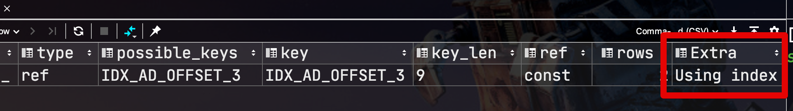

# 커버링 인덱스

일반적으로 인덱스를 설계한다고하면 ```WHERE```절에 대한 인덱스 설계를 이야기하지만 사실 ```WHERE```뿐만 아니라 **쿼리 전체**에 대해 인덱스 설계가 필요합니다.  
  
인덱스는 데이터를 효율적으로 찾는 방법이지만, MySQL의 경우 인덱스안에 포함된 데이터를 사용할 수 있으므로 실제 **데이터까지 접근할 필요가 전혀 없습니다**.  
  
이처럼 쿼리를 충족시키는 데 필요한 모든 데이터를 갖고 있는 인덱스를 **커버링 인덱스** (Covering Index 혹은 Covered Index) 라고합니다.

> 좀 더 쉽게 말씀드리면 SELECT, WHERE, ORDER BY, GROUP BY 등에 사용되는 모든 컬럼이 인덱스의 구성요소인 경우를 얘기합니다.

## 1. 커버링 인덱스 기본 지식

커버링 인덱스의 예제를 보기전에 기본 지식을 먼저 익히고 넘어가겠습니다.

실제 행을 읽은 횟수

```sql
show session status like 'Handler_read' ;
```

### 1-1. Using index

먼저, 커버링 인덱스가 적용되면 아래와 같이 EXPLAIN 결과 (실행 계획) 의 Extra 필드에 "**Using index**" 가 표기됩니다.



여기서 **type이 index** 인것과는 조금 차이가 있습니다.

|       | 표기        | 설명                               |
|-------|-------------|------------------------------------|
| Extra | Using index | 커버링 인덱스, 인덱스 range 스캔  |
| type  | index       | 인덱스 풀 스캔 (range 스캔이 아님) |

인덱스 풀 스캔 발생하는 경우는 아래와 같습니다.

* range, const, ref와 같은 접근 방식으로 인덱스를 사용하지 못하는 경우
  * 위 조건과 더불어 아래 조건 중 하나가 동시 만족될 경우
    * 인덱스에 포함된 컬럼만으로 처리할 수 있는 쿼리인 경우 (즉, 데이터 파일을 안읽어도 되는 경우)
    * 인덱스를 이용해 정렬이나 그룹핑 작업이 가능한 경우 (즉, 별도의 정렬 작업을 피할 수 있는 경우)

### 1-2. 

sakila.inventory 테이블은 (store_id, film_id) 필드를 가진 인덱스가 있다.  
이럴 경우 아래의 쿼리는 **커버링 인덱스** 대상이 된다.

```sql
mysql> EXPLAIN SELECT store_id, film_id FROM sakila.inventory\G
*************************** 1. row ***************************
           id: 1
  select_type: SIMPLE
        table: inventory
         type: index
possible_keys: NULL
          key: idx_store_id_film_id
      key_len: 3
          ref: NULL
         rows: 4673
        Extra: Using index
```

아래는 해결하지 못한다.

```sql
mysql> EXPLAIN SELECT * FROM products WHERE actor='SEAN CARREY' AND title like '%APOLLO%'\G
*************************** 1. row ***************************
           id: 1
  select_type: SIMPLE
        table: products
         type: ref
possible_keys: ACTOR,IX_PROD_ACTOR
          key: ACTOR
      key_len: 52
          ref: const
         rows: 10
        Extra: Using where
```

* 테이블에서 모든 열을 선택하고 인덱스가 모든 열을 덮지 않기 때문에 인덱스는 쿼리를 다루지 않습니다. 그래도 MySQL이 이론적으로 사용할 수있는 지름길은 여전히 ​​있습니다.이 WHERE절은 인덱스가 다루는 열만 언급하므로 MySQL은 인덱스를 사용하여 액터를 찾고 제목이 일치하는지 확인한 다음 전체 행을 읽을 수 있습니다.

* MySQL은 LIKE인덱스 에서 작업을 수행 할 수 없습니다 . 이는 저수준 스토리지 엔진 API의 한계로, MySQL 5.5 및 이전 버전에서는 인덱스 작업에서 동등성, 불평등 및 그 이상과 같은 간단한 비교 만 허용합니다. MySQL은 LIKE 간단한 비교로 변환 할 수 있기 때문에 인덱스에서 접두사 일치 패턴을 수행 할 수 있지만 쿼리에서 선행 와일드 카드를 사용하면 스토리지 엔진이 일치를 평가할 수 없습니다. 따라서 MySQL 서버 자체는 인덱스 값이 아닌 행 값을 가져 와서 일치시켜야합니다.

이를 해결하기 위해서 다음과 같이 해결할 수 있다.

```sql
mysql> EXPLAIN SELECT *
    -> FROM products
    ->    JOIN (
    ->       SELECT id
    ->       FROM products
    ->       WHERE actor='SEAN CARREY' AND title LIKE '%APOLLO%'
    ->    ) AS t1 ON (t1.id=products.id)\G
*************************** 1. row ***************************
           id: 1
  select_type: PRIMARY
        table: <derived2>
               ...omitted...
*************************** 2. row ***************************
           id: 1
  select_type: PRIMARY
        table: products
               ...omitted...
*************************** 3. row ***************************
           id: 2
  select_type: DERIVED
        table: products
         type: ref
possible_keys: ACTOR,ACTOR_2,IX_PROD_ACTOR
          key: ACTOR_2
      key_len: 52
          ref:
         rows: 11
        Extra: Using where; Using index
```

열에 대한 액세스를 지연시키기 때문에 이것을 "지연된 조인"이라고합니다. MySQL은 FROM절의 하위 쿼리에서 일치하는 행을 찾을 때 쿼리의 첫 번째 단계에서 포함 인덱스를 사용합니다 . 인덱스를 사용하여 전체 쿼리를 처리하지는 않지만 아무것도 사용하지 않는 것이 좋습니다.

이 최적화의 효과는 WHERE절이 찾는 행 수에 따라 다릅니다 . products테이블에 백만 개의 행이 있다고 가정하십시오 . 이 두 쿼리가 서로 다른 3 개의 데이터 세트에서 어떻게 수행되는지 봅시다. 각 데이터 세트에는 백만 개의 행이 있습니다.

첫 번째로 30,000 개의 제품에 배우로 Sean Carrey가 있고 그 중 20,000 개에는 제목에 "Apollo"가 포함되어 있습니다.

두 번째로 30,000 개의 제품에 배우로 Sean Carrey가 있고 그 중 40 개에는 제목에 "Apollo"가 포함되어 있습니다.

세 번째로 50 개의 제품에 Sean Carrey가 배우로, 그 중 10 개에는 제목에 "Apollo"가 포함되어 있습니다.

* Dataset Original query Optimized query
* Example 1 5 queries per sec 5 queries per sec
* Example 2 7 queries per sec 35 queries per sec
* Example 3 2400 queries per sec 2000 queries per sec

이 세 가지 데이터 세트를 사용하여 쿼리의 두 가지 변형을 벤치마킹하고 표 5-2에 표시된 결과를 얻었습니다 .

표 5-2. 인덱스가 적용되지 않은 쿼리와 인덱스가 적용되지 않은 쿼리에 대한 벤치 마크 결과

이러한 결과를 해석하는 방법은 다음과 같습니다.

* 예제 1에서 쿼리는 큰 결과 집합을 반환하므로 최적화 효과를 볼 수 없습니다. 대부분의 시간은 데이터를 읽고 보내는 데 소비됩니다.

* 인덱스 필터링 후 두 번째 조건 필터가 작은 결과 집합 만 남기는 예제 2는 제안 된 최적화가 얼마나 효과적인지 보여줍니다. 데이터에서 성능이 5 배 더 우수합니다. 효율성은 첫 번째 쿼리에서와 같이 30,000 개가 아닌 40 개의 전체 행을 읽을 필요가 있기 때문에 발생합니다.

* 예제 3은 부속 조회가 비효율적 인 경우를 보여줍니다. 인덱스 필터링 후 남은 결과 세트는 너무 작아서 서브 쿼리가 테이블에서 모든 데이터를 읽는 것보다 비쌉니다.

대부분의 스토리지 엔진에서 인덱스는 인덱스의 일부인 열에 액세스하는 쿼리 만 처리 할 수 ​​있습니다. 그러나 InnoDB는 실제로이 최적화를 조금 더 진행할 수 있습니다. InnoDB의 2 차 인덱스는 리프 노드에서 기본 키 값을 보유합니다. 이는 InnoDB의 보조 인덱스에 InnoDB가 쿼리를 처리하는 데 사용할 수있는 "추가 열"을 효과적으로 가지고 있음을 의미합니다.

예를 들어, sakila.actor 테이블은 InnoDB를 사용하고 인덱스는 on last_name이므로 인덱스는 actor_id기술적으로 인덱스의 일부가 아니더라도 기본 키 열을 검색하는 쿼리를 처리 할 수 ​​있습니다 .
```sql
mysql> EXPLAIN SELECT actor_id, last_name FROM sakila.actor WHERE last_name = 'HOPPER'\G
*************************** 1. row ***************************
           id: 1
  select_type: SIMPLE
        table: actor
         type: ref
possible_keys: idx_actor_last_name
          key: idx_actor_last_name
      key_len: 137
          ref: const
         rows: 2
        Extra: Using where; Using index
```

### Non Clustered Key와 Clustered Key

* Clustered Key (PK) 의 값은 **모든 Non Clustered Key에 포함**되어 있음
  * Non Clustered Key는 일반적인 **인덱스**
  * Clustered Key는 테이블당 1개만 존재하며, 일반적으로 PK가 지정된다
    * PK가 없을 경우 유니크 키가 Clustered Key로
    * PK와 유니크키 둘다 없을 경우 6 byte의 Hidden Key를 생성 (rowid)
  * Non Clustered Key에는 **데이터 블록의 위치가 없다**.
    * 즉, 인덱스외 다른 필드를 찾을때는 Non Clustered Key에 있는 Clustered Key 값으로 데이터블록을 찾는 과정이 필요하다.


(index-age는 age순으로 정렬되어있고, pk는 id순으로 정렬되어있다.)  
  
* 즉, **인덱스 키 조합에는 Clustered Key가 항상 포함**되어 있다.
* 다만 PK를 사용할 경우 인덱스 탐색 시간이 없어지기 때문에 향상된 데이터 파일 접근이 가능하다

## 커버링 인덱스의 장점

* 인덱스 항목은 일반적으로 전체 행 크기보다 훨씬 작으므로 인덱스 만 읽는 경우 MySQL이 훨씬 적은 데이터에 액세스 할 수 있습니다. 이는 응답 시간의 대부분이 데이터 복사에서 오는 캐시 된 워크로드에 매우 중요합니다. 인덱스는 데이터보다 작고 메모리에 더 적합하기 때문에 I / O 바운드 워크로드에도 유용합니다. (MyISAM의 경우 더욱 그렇습니다. 인덱스를 더 작게 만들기 위해 묶을 수 있습니다.)

* 인덱스는 인덱스 값에 따라 (적어도 페이지 내에서) 정렬되므로 I / O 바운드 범위 액세스는 임의의 디스크 위치에서 각 행을 페치하는 것보다 I / O를 덜 수행해야합니다. 

* 커버링 인덱스는 InnoDB의 클러스터형 인덱스 때문에 InnoDB 테이블에 특히 유용합니다. InnoDB의 2 차 인덱스는 리프 노드에서 행의 1 차 키 값을 보유합니다. 따라서 쿼리를 다루는 보조 인덱스는 기본 키에서 다른 인덱스 조회를 방지합니다.


## 커버링 인덱스 적용 순서

* 커버링 인덱스 적용 순서
  * WHERE 조건에 있는 컬럼 최우선
  * ORDER BY / GROPU BY / HAVING 컬럼 그 다음
  * SELECT 에 있는 컬럼을 마지막

> ```Using temporary;```?  
> [공식 문서](https://dev.mysql.com/doc/refman/8.0/en/internal-temporary-tables.html) 에선 다음과 같은 조건에서 임시 테이블을 만들 수 있다고 합니다.  
> ORDER BY 절과 다른 GROUP BY 절이 있거나 ORDER BY 또는 GROUP BY에 조인 큐의 첫 번째 테이블 이외의 테이블의 열이 포함 된 경우 임시 테이블이 작성됩니다.
> ORDER BY와 결합된 DISTINCT에는 임시 테이블이 필요할 수 있습니다.
