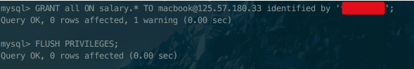

# 외부 서버에 MySQL 설치하기

AWS RDS를 쓰지 않고, 인스턴스에 MySQL 을 설치해서 쓰는 분들이 계실까봐 정리합니다.  
  
Ubuntu 16.04 기준으로 진행됩니다.

* [how-to-install-mysql-on-ubuntu-16-04](https://www.digitalocean.com/community/tutorials/how-to-install-mysql-on-ubuntu-16-04)

* [remote-connections-mysql-ubuntu](https://stackoverflow.com/questions/15663001/remote-connections-mysql-ubuntu)

```bash
bind-address       = 0.0.0.0
```

* [character-set UTF-8](http://bstar36.tistory.com/307)

```/etc/mysql/conf.d/mysql.cnf```

```bash
[client]

[mysqld]
skip-character-set-client-handshake
character-set-server = utf8
collation-server = utf8_general_ci
init-connect = SET NAMES utf8

[mysqldump]
default-character-set = utf8

[mysql]
default-character-set = utf8
```


* 원격유저 권한 주기



```sql

GRANT all ON salary.* TO 계정@125.57.180.33 identified by '비밀번호';

```

> ```identified by '비밀번호'```가 없으면  
```ERROR 1133 (42000): Can't find any matching row in the user table```이 발생합니다.

