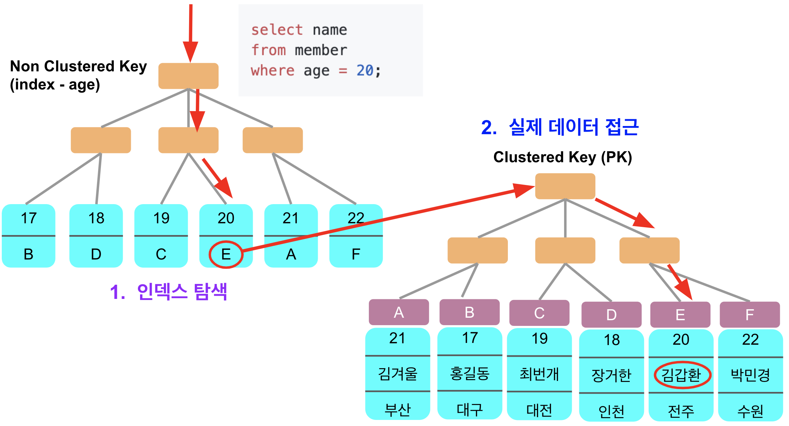
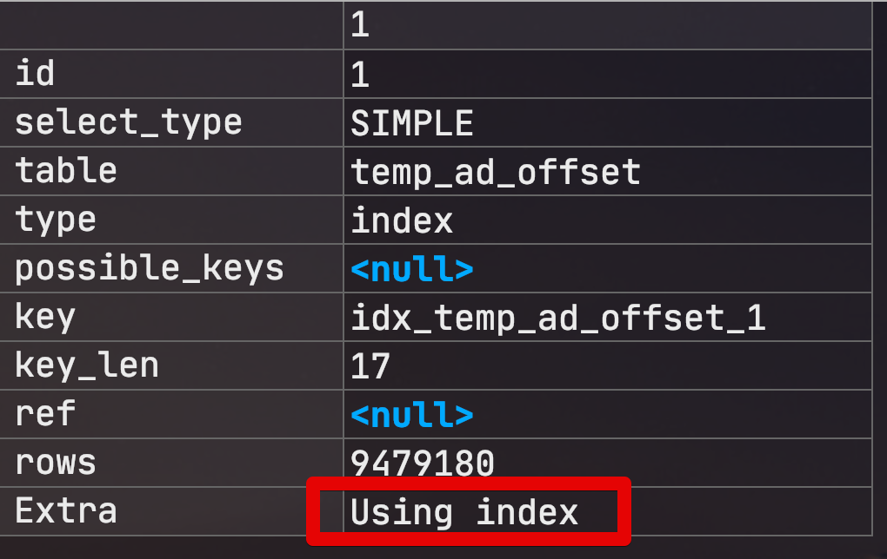
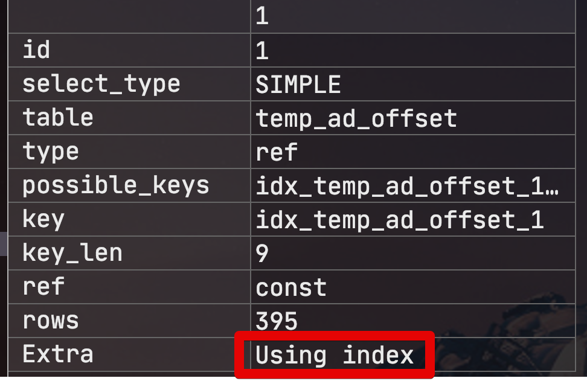
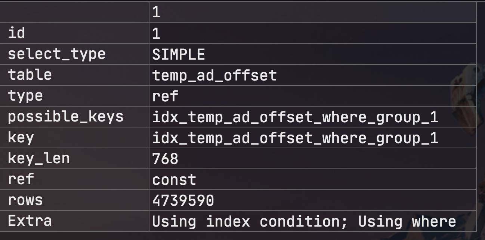
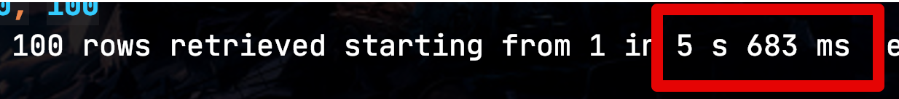
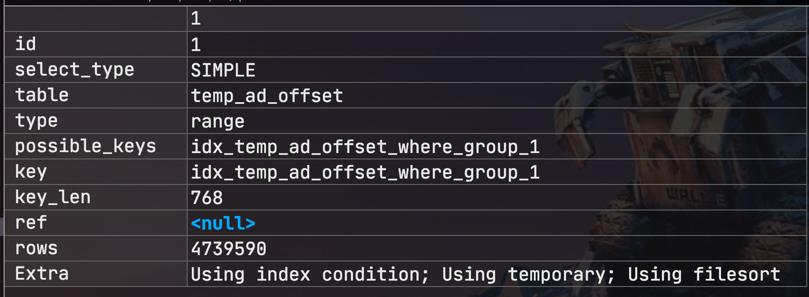
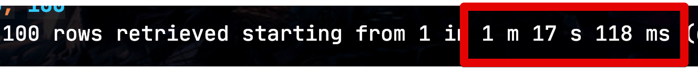
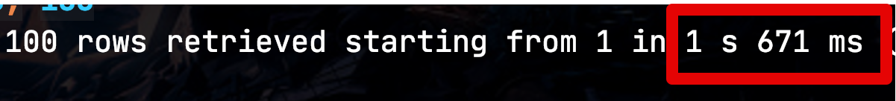

# 1. 커버링 인덱스 (기본 지식 / WHERE / GROUP BY)

일반적으로 인덱스를 설계한다고하면 ```WHERE```절에 대한 인덱스 설계를 이야기하지만 사실 ```WHERE```뿐만 아니라 **쿼리 전체**에 대해 인덱스 설계가 필요합니다.  
  
인덱스는 데이터를 효율적으로 찾는 방법이지만, MySQL의 경우 인덱스안에 포함된 데이터를 사용할 수 있으므로 이를 잘 활용한다면 실제 **데이터까지 접근할 필요가 전혀 없습니다**.  
  
이처럼 쿼리를 충족시키는 데 필요한 모든 데이터를 갖고 있는 인덱스를 **커버링 인덱스** (Covering Index 혹은 Covered Index) 라고합니다.

> 좀 더 쉽게 말씀드리면 SELECT, WHERE, ORDER BY, GROUP BY 등에 사용되는 모든 컬럼이 인덱스의 구성요소인 경우를 얘기합니다.

## 1-1. 커버링 인덱스 기본 지식

커버링 인덱스의 예제를 보기전에 기본 지식을 먼저 익히고 넘어가겠습니다.

### 1-1-1. Using index

먼저, 커버링 인덱스가 적용되면 아래와 같이 EXPLAIN 결과 (실행 계획) 의 Extra 필드에 "**Using index**" 가 표기됩니다.


여기서 index가 표기되는 여러 항목들과 비교하면 다음과 같은 차이점이 있습니다. 

|       | 표기        | 설명                               |
|-------|-------------|------------------------------------|
| Extra | Using index | 커버링 인덱스 (쿼리의 모든 항목이 인덱스 컬럼으로 이루어진 상태) |
| Extra | Using index condition| [인덱스 컨디션 푸시다운 인덱스](https://jojoldu.tistory.com/474)  |
| type  | index       | 인덱스 풀 스캔 (range 스캔이 아님) |


인덱스 풀 스캔이 발생하는 경우는 아래와 같습니다.

* range, const, ref와 같은 접근 방식으로 인덱스를 사용하지 못하는 경우
  * 위 조건과 더불어 아래 조건 중 하나가 동시 만족될 경우
    * 인덱스에 포함된 컬럼만으로 처리할 수 있는 쿼리인 경우 (즉, 데이터 파일을 안읽어도 되는 경우)
    * 인덱스를 이용해 정렬이나 그룹핑 작업이 가능한 경우 (즉, 별도의 정렬 작업을 피할 수 있는 경우)

### 1-1-2. Non Clustered Key와 Clustered Key

|                   | 대상                                                                                             | 제한                     |
|-------------------|--------------------------------------------------------------------------------------------------|--------------------------|
| Clustered Key     | 1) PK <br/> 2) PK가 없을땐 유니크키 <br/> 3) 1~2 둘다 없을 경우 6byte의 Hidden Key를 생성 (rowid) | 테이블당 1개만 존재 가능 |
| Non Clustered Key | 일반적인 인덱스                                                                                  | 여러개 생성 가능         |

Non Clustered Key와 Clustered Key를 통한 탐색은 다음과 같이 진행됩니다.



> index-age는 age순으로 정렬되어있고, pk는 id순으로 정렬되어있습니다.  

위 그림에선 2가지를 보셔야하는데요.

* Non Clustered Key (일반적인 인덱스) 에는 **인덱스 컬럼의 값들**과 **Clustered Key (PK) 의 값**이 포함되어 있음
* Clustered Key 만이 실제 테이블의 row 위치를 알고 있음

MySQL에서는 **Non Clustered Key에 Clustered Key가 항상 포함**되어 있습니다.  
이유는 Non Clustered Key에는 **데이터 블록의 위치가 없기 때문**인데요.  
  
즉, 인덱스 조건에 부합한 ```where``` 조건이 있더라도 ```select```에 **인덱스에 포함된 컬럼 외에 다른 컬럼값**이 필요할때는 Non Clustered Key에 있는 Clustered Key 값으로 데이터 블록을 찾는 과정이 필요합니다.

> 다만 PK를 사용할 경우 인덱스 탐색 시간이 없어지기 때문에 향상된 데이터 파일 접근이 가능하다

커버링 인덱스는 여기서 **"2. 실제 데이터 접근" 의 행위 없이** 인덱스에 있는 컬럼값들로만 쿼리를 완성하는 것을 이야기 합니다.  
  
자 이 내용을 숙지 하신뒤, 다음의 예제를 확인해보겠습니다.

## 1-2. SELECT

테스트용 테이블의 이름은 temp_ad_offset 입니다.  
해당 테이블에 대략 1300만건의 데이터를 넣고 테스트를 진행합니다.

인덱스 (customer_id 컬럼만 존재)가 있을 경우, 아래의 쿼리는 어떻게 작동될까요?

```sql
select *
from temp_ad_offset
where customer_id = 7;
```

실행 계획을 돌려보면 다음과 같습니다.



혹시나 실행 계획을 처음 보신다면 각 항목은 다음과 같습니다.

| 필드          | 값                             | 설명                                                    |
|---------------|--------------------------------|---------------------------------------------------------|
| Selected_type | SIMPLE                         | UNION이나 서브쿼리가 없는 단순 Select                   |
| Type          | ref                            | 조인을 할때 PK 혹은 Unique Key가 아닌 Key로 매핑된 경우. <br> 여기서는 단일 테이블이니 **동등 조건으로 검색할 경우**를 가리킴 |
| key           | idx_temp_ad_offset_customer_id | 쿼리에 사용된 인덱스                                    |
| ref           | const                          | 비교 조건으로 어떤 값이 사용되었는지 나타냄.<br>  여기서는 고정된 값인 7이 사용되어서  const로 표기된다   |
| Extra         |                                | 빈값일 경우 일반적인 쿼리                                    |

실행 계획의 결과는 일반적인 **인덱스가 where절에 사용된 경우**로 출력 됩니다.  
(key 항목에 사용된 인덱스가, Extra 항목에는 빈값)  
이 경우는 **where절에는 인덱스가 사용되었지만, select절의 필드를 완성하기 위해** 데이터 블록 접근이 있었다를 의미합니다.  
  
자 그럼 여기서 쿼리의 select 절을 ```select customer_id```로 해서 다시 해당 쿼리의 실행 계획을 확인해보겠습니다.

```sql
select customer_id
from temp_ad_offset
where customer_id = 7;
```



앞선 결과와 다르게 Extra 항목에 ```Using index``` 가 등장합니다.  
이 쿼리는 인덱스에 포함된 컬럼 (customer_id) 만으로 쿼리가 생성 가능하니 커버링 인덱스가 사용 된 것입니다.  
이렇게 Extra 항목에 ```Using index``` 가 나온다면 이 쿼리는 **커버링 인덱스**가 사용된 것으로 보시면 됩니다.

> Extra 항목에 ```Using index```가 있어야만 인덱스를 사용한 것이 아닙니다.  
> 인덱스 사용 유무는 **key 항목에 선택된 인덱스**가 있냐 없냐의 차이입니다.  
> Extra 항목에 ```Using index```가 있는 경우는 **쿼리 전체가 인덱스 컬럼값으로 다 채워진 경우**에만 발생합니다.

자 이제 다양한 상황을 확인해보겠습니다.

## 1-3. WHERE + GROUP BY

먼저 GROUP BY 에서 인덱스는 아래 조건에서 적용됩니다.

* GROUP BY 절에 명시된 컬럼이 **인덱스 컬럼의 순서와 같아야 한다**.
  * 아래 모든 케이스는 **인덱스가 적용 안된다**. (index: a,b,c)
    * ```group by b```
    * ```group by b, a```
    * ```group by a, c, b```
* 인덱스 컬럼 중 **뒤에 있는 컬럼이 GROUP BY 절에 명시되지 않아도** 인덱스는 사용할 수 있다.
  * 아래 모든 케이스는 **인덱스가 적용된다**. (index: a,b,c)
    * ```group by a```
    * ```group by a, b```
    * ```group by a, b, c```
* 반대로 인덱스 컬럼 중 **앞에 있는 컬럼이 GROUP BY 절에 명시되지 않으면** 인덱스를 사용할 수 없다
  * ex: (index: a,b,c), ```group by b, c``` 는 **인덱스 적용안됨**
* 인덱스에 없는 컬럼이 GROUP BY 절에 포함되어 있으면 인덱스가 적용되지 않는다.
  * ex: (index: a,b,c), ```group by a,b,c,d``` 는 **인덱스 적용안됨**

여기서 ```WHERE``` 조건과 ```GROUP BY```가 함께 사용되면 **WHERE 조건이 동등 비교**일 경우 GROUP BY 절에 해당 컬럼은 없어도 인덱스가 적용 됩니다.  
  
즉, 아래 2개의 쿼리는 모두 정상적으로 **인덱스가 적용** 됩니다.  
(인덱스 - a,b,c)

```sql
WHERE a = 1 
GROUP BY b, c

WHERE a = 1 and b = 'b'
GROUP BY c
```

그렇다면 WHERE의 조건이 **동등 비교가 아닌 경우**엔 어떻게 될까요?  
한번 실험해보겠습니다.  
  
### 1-3-1. WHERE가 동등비 교가 아닌 경우

먼저 동등 비교의 실행 계획을 확인해봅니다.  
(인덱스 - offset_type, customer_id, base_date)  

```sql
select *
from temp_ad_offset
where offset_type = 'GIVE_OFFSET'
group by customer_id, base_date
limit 2000000, 100;
```

해당 쿼리의 실행 계획은 아래와 같습니다.



1-2 에서 소개한 실행 계획과 거의 유사한 결과가 나왔습니다.

* key항목을 보면 WHERE절의 인덱스가 잘 수행된 것을 확인할 수 있습니다.
* Extra 항목에는 ```Using temporary``` 와 ```Using filesort```가 없는데, 이는 아래에서 설명하겠습니다.
  * 다만, 이 둘이 없다는 것은 **GROUP BY가 인덱스를 잘 탔다** 정도로 보시면 됩니다.



전체 수행 시간은 **5.683초**가 소요되었습니다.  
이 시간이 오래 걸린것인지 정확히 알 수 없으니, 바로 다음 실험으로 가보겠습니다.  
  
이번엔 WHERE의 조건만 ```like``` 로 변경해보겠습니다.  
LIKE 조건은 인덱스가 가능하도록 ```%```를 검색어 뒤편에 두겠습니다.

> LIKE 검색에서 %가 검색어 앞에 있을 경우 인덱스를 타지 않습니다.

```sql
select *
from temp_ad_offset
where offset_type like 'GIVE%'
group by customer_id, base_date
limit 2000000, 100;
```

실행 계획은 다음과 같이 나왔습니다.



* key항목을 보면 WHERE절의 인덱스가 잘 수행된 것을 확인할 수 있습니다.
* Extra 항목에는 ```Using temporary``` 와 ```Using filesort```가 추가되었습니다.
  * 인덱스 Key대로 GROUP BY가 되었다면, 인덱스 Key대로 그룹핑만 진행하면 되기 때문에 별도의 임시 테이블 (temporary)를 만들어 그 안에서 정렬 (filesort)를 할 필요가 없습니다.
  * 즉, GROUP BY가 인덱스 순서대로 잘 탔다면, 이 2개 항목이 등장하지 않는다는 점을 명심해주세요.

GROUP BY가 제대로 인덱스를 타지 못한것 같습니다.  
실제로 수행 시간을 확인해볼까요?



**1분 17초**가 수행되었습니다.  
명백하게 성능 차이가 발생하죠?  
자 그럼 여기서 첫번째 쿼리를 커버링 인덱스로 더 성능을 올려보겠습니다.  
(즉, WHERE-GROUP BY가 인덱스를 탄 상황에서 SELECT 절까지 인덱스를 타도록 하는 것입니다.)
  
```sql
select offset_type, customer_id, base_date
from temp_ad_offset
where offset_type = 'GIVE_OFFSET'
group by customer_id, base_date
limit 2000000, 100;
```

실행 계획에서는 커버링 인덱스가 잘 수행된 것을 확인할 수 있습니다.


수행 시간은 **1.6초**로 기존 (**5.683초**) 대비 5배 이상 개선되었습니다.



WHERE 뿐만 아니라, GROUP BY절, SELECT절 역시 인덱스를 타게 되면 얼마나 성능이 개선되는지 알게 되었습니다!

## 1-4. 마무리

이번 포스팅에서는 커버링 인덱스의 기반 지식들과, SELECT, WHERE, GROUP BY 등의 인덱스 방식 등을 배워보았습니다.  
다음 시간에는 WHERE-GROUP BY외에 WHERE-ORDER BY, WHERE-ORDER BY-GROUP BY등이 다 같이 모여있을때는 어떻게 되는지 같이 실험해보겠습니다.  

